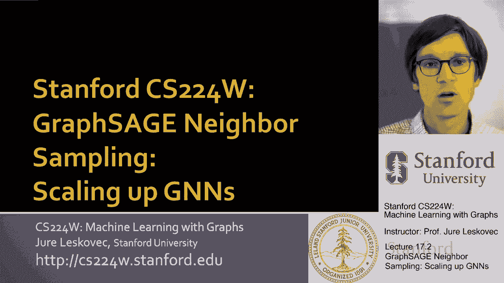
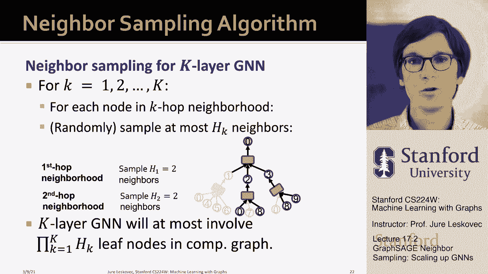

# 54：17.2 - GraphSAGE 邻域采样 🧠


在本节课中，我们将学习图神经网络（GNN）中一个关键的大规模训练技术——**邻域采样**。这是 GraphSAGE 架构的核心思想，它使得 GNN 能够处理包含数十亿节点和边的大规模图数据。



## 概述

在 GraphSAGE 出现之前，图神经网络的实现大多是**全批次**的。这意味着人们只能将整个图（例如几千个节点）一次性加载到 GPU 内存中进行训练，极大地限制了可处理的图规模。GraphSAGE 引入了一种新的视角，通过**小批次**和**邻域采样**的方法，让我们能够高效地训练深层 GNN，并将其扩展到工业级的大图上。

## 核心思想：从计算图到邻域采样

上一节我们介绍了图神经网络的基本工作原理。本节中，我们来看看 GraphSAGE 是如何通过计算图的局部性来实现高效小批次训练的。

### GNN 的计算图视角

图神经网络通过**邻域聚合**来生成节点嵌入。对于一个目标节点，其 K 层嵌入的计算依赖于其 **K 跳邻域** 内的节点特征和图结构。

**公式表示**： 对于一个 K 层 GNN，节点 `v` 在第 `k` 层的嵌入 `h_v^(k)` 可以表示为：
`h_v^(k) = AGGREGATE({ h_u^(k-1) : u ∈ N(v) })`
其中 `N(v)` 是节点 `v` 的邻居集合，`AGGREGATE` 是聚合函数。

这意味着，要计算节点 `v` 的最终嵌入，我们只需要知道以 `v` 为中心、半径为 `K` 的子图（即其 K 跳邻域）。图的其他部分不会影响 `v` 的嵌入结果。这是一个非常重要的洞察。

### 基于计算图的小批次训练

基于上述洞察，我们可以设计一种新的小批次训练策略：

*   **传统方式**： 小批次由一组独立的节点组成。
*   **GraphSAGE 方式**： 小批次由一组**计算图**组成。每个计算图对应一个目标节点及其 K 跳邻域。

以下是具体步骤：
1.  从图中随机采样 `M` 个目标节点。
2.  对于每个目标节点，提取其完整的 K 跳邻域，构建一个计算图。
3.  将这 `M` 个计算图放入 GPU 内存，计算损失并更新模型参数。

这种方法允许我们进行**随机梯度下降**，因为每个小批次都是随机创建的。梯度虽然带有随机性，但更新速度非常快。

### 邻域采样的必要性

然而，直接构建完整的 K 跳计算图仍然面临挑战：
1.  **计算图指数增长**： 即使每个节点平均只有少量邻居，随着层数 `K` 增加，计算图中的节点数也会呈指数级增长。
2.  **现实图中的枢纽节点**： 在社交网络或知识图谱中，存在一些连接数极多（度很高）的“名人”节点或“大国”节点。如果目标节点或其中间邻居是这种枢纽节点，其 K 跳邻域会变得极其庞大，无法放入内存。

因此，我们需要对计算图进行“修剪”，这就是**邻域采样**。

## 邻域采样详解 🎯

邻域采样的核心思想是：在构建计算图时，对于需要进行聚合的每个节点，我们**最多只采样固定数量（H）的邻居**。



**代码描述**：
```python
# 伪代码：为节点v构建K层计算图，每层最多采样H个邻居
def build_computation_graph(v, K, H):
    graph = {0: [v]}  # 第0层：目标节点
    for layer in range(1, K+1):
        current_nodes = graph[layer-1]
        sampled_neighbors = []
        for node in current_nodes:
            # 从node的邻居中随机采样最多H个
            neighbors = sample_neighbors(node, max_count=H)
            sampled_neighbors.extend(neighbors)
        graph[layer] = sampled_neighbors
    return graph
```

通过这种方式，计算图的大小增长被限制在 `O(H^K)` 以内，变得可管理。参数 `H` 控制了采样数量。

### 关于采样策略的权衡与优化

以下是关于邻域采样的一些重要考量：

*   **采样数量 H 的权衡**： `H` 越小，计算图越小，训练效率越高，但梯度估计的**方差越大**，训练过程更不稳定，因为忽略了更多的邻域信息。
*   **层数 K 的影响**： 即使采用采样，增加 GNN 层数仍会使计算成本增加约 `H` 倍。因此，`K` 和 `H` 都需要谨慎选择（例如，`H` 在5-10左右，`K` 在5层左右）。
*   **更智能的采样策略**： 均匀随机采样可能不是最优的。在现实的高度倾斜的度分布图中，随机采到的很可能是大量不活跃、信息量少的低度节点。一种更好的策略是使用**带重启的随机游走**来为邻居节点的重要性打分，然后选择分数最高的 `H` 个邻居。这样构建的计算图更具代表性，包含更多信息丰富的节点，能提升模型性能。

目前，对于不同场景下最优的采样策略，还没有系统性的研究，这将是图机器学习领域一个有价值的方向。

## 总结与要点 📝

本节课中，我们一起学习了 GraphSAGE 的邻域采样方法。

*   **核心动机**： 为了将 GNN 扩展到大规模图，需要采用小批次训练。而计算节点嵌入只需其局部 K 跳邻域信息。
*   **关键方法**： 将**计算图**（即目标节点的 K 跳邻域）作为小批次的基本单元。为了控制计算图大小，提出了**邻域采样**，即为每个待聚合的节点最多采样 `H` 个邻居来构建计算图。
*   **优势**： 这种方法极大地提高了计算和内存效率，并引入随机性，某种程度上起到了类似 Dropout 的正则化效果，增强了模型的鲁棒性。
*   **工业应用**： 邻域采样是当前工业级大规模图神经网络实现（如 Pinterest 使用的系统）的基石技术。


最终，我们需要在**小批次大小**、**采样数量 H** 和**模型深度 K** 之间进行权衡，以在训练效率、梯度可靠性和模型表达能力之间取得平衡。