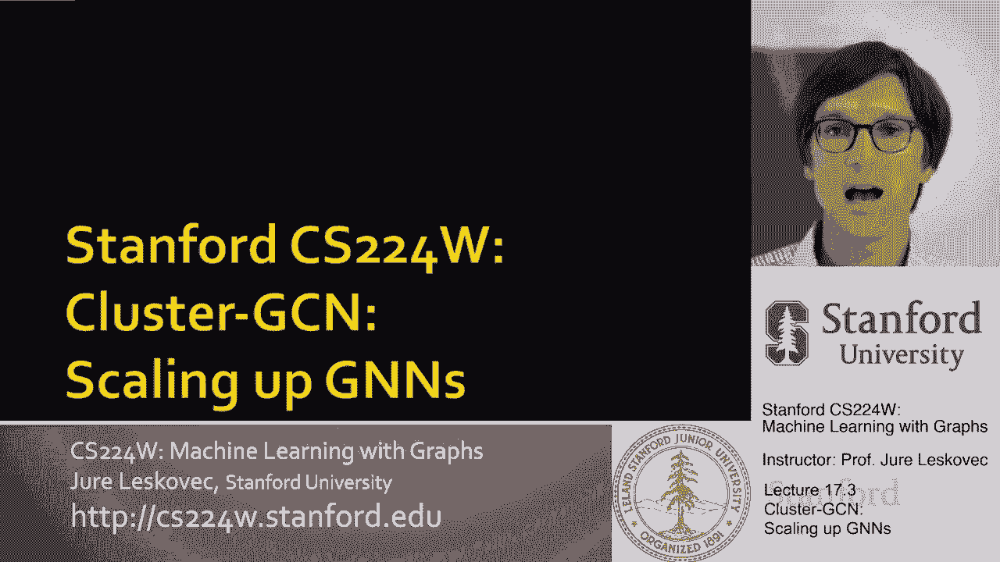
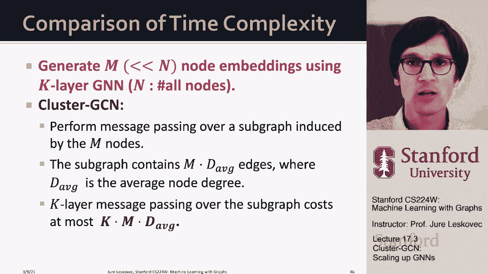

# 55：17.3 - 使用 Cluster GCN 扩展 GNN 🚀

在本节课中，我们将学习一种名为 **Cluster GCN** 的图神经网络扩展方法。该方法旨在解决大规模图数据无法一次性装入GPU内存进行训练的问题。我们将了解其核心思想、工作原理、优势以及如何通过改进来克服其局限性。

---

## 问题背景与动机

上一节我们介绍了邻域采样的方法。本节中，我们来看看另一种基于采样的方法——Cluster GCN。

在图神经网络中，计算图的大小会随着GNN层数的增加呈指数级增长。此外，由于节点之间共享邻居，计算图可能包含大量冗余计算。例如，节点A和B的计算图中，其共同邻居C和D的计算部分是重复的。

目前有两种思路来解决这个问题：
1.  意识到计算是重复的，只计算一次（例如，KDD 2021的“Yaksha”论文提出的分层聚合方法）。
2.  对原始图进行子图采样，然后在子图上进行全批次计算。这就是 **Cluster GCN** 的核心思想。

全批次GNN的实现虽然计算高效（计算量与边数呈线性关系），但无法处理过大的图，因为GPU内存有限。Cluster GCN的洞察在于：我们可以将大图分割成多个小子图，然后在这些子图上执行全批次GNN计算。

---

## Cluster GCN 的核心思想

Cluster GCN 的关键在于如何采样“好”的子图。GNN通过边传递消息，每个节点从其邻居处聚合信息。因此，一个好的子图应尽可能多地保留原始图的边，以模拟在大图上的计算，从而生成接近原始图的节点嵌入。

以下是选择子图的示例：
*   **好的子图**：保留了节点的大部分邻居，能很好地估计其嵌入。
*   **差的子图**：丢弃了节点的大部分邻居，导致其嵌入估计不准确。

现实世界的图通常具有社区（聚类）结构。Cluster GCN 的关键洞察是：**基于社区结构对子图进行采样，可以使每个子图保留大部分内部边，只丢弃少量跨社区的边**。

---

## 基础 Cluster GCN 的工作流程

Cluster GCN 采用两步流程：

1.  **预处理**：使用社区检测算法（如Louvain算法）将原始大图划分为 `C` 个节点组（社区）。
2.  **小批量训练**：
    *   采样一个节点组。
    *   在该节点组上创建一个**诱导子图**（包含组内所有边）。
    *   将这个诱导子图装入GPU内存。
    *   在该子图上执行全批次GNN计算：进行分层节点嵌入更新，计算损失和梯度，并更新模型参数。
    *   重复此过程，采样下一个节点组。

**核心公式/代码描述**：
假设我们将节点集合 `V` 划分为 `C` 个组 `{V1, V2, ..., VC}`。对于每个小批量，我们采样一个组 `Vc`，并在其上构建诱导子图 `G[Vc]`，然后进行GNN计算。

---

## 基础 Cluster GCN 的局限性及改进

基础方法存在一个问题：诱导子图丢弃了组与组之间的边（跨社区边）。这导致消息传递过程中丢失了来自其他社区的信息，可能损害模型性能。

更严重的是，由于社区检测将相似节点聚在一起，采样到的节点组往往只覆盖图中一个集中的小部分。这会导致：
*   模型只在图的局部区域学习，缺乏多样性。
*   不同节点组计算的梯度差异巨大，造成训练不稳定，收敛困难。

**改进方法：高级 Cluster GCN**
为了解决上述问题，高级 Cluster GCN 在每个小批量中**聚合多个节点组**。

其工作流程如下：
1.  将节点划分为比基础方法更小的子组。
2.  在每个小批量中，采样多个这样的节点子组，并将它们合并为一个“超组”。
3.  在这个超组的所有节点上创建诱导子图。**这个子图不仅包含各子组内部的边，也包含不同子组之间的边**。
4.  在此诱导子图上执行全批次GNN计算。

这种方法使得采样子图更具代表性和多样性，从而得到更稳定的梯度估计，实现更快、更稳定的训练收敛。

---

## Cluster GCN 与邻域采样的比较

现在，我们来比较一下 Cluster GCN 和邻域采样两种方法。

**邻域采样**：为每个目标节点采样一个计算图。对于 `M` 个节点和 `K` 层GNN，计算成本与 `M * H^K` 相关，其中 `H` 是采样邻居数。这是关于层数 `K` 的指数成本。

**Cluster GCN**：在包含 `M` 个节点的诱导子图上执行消息传递。计算成本与 `K * M * AvgDegree` 相关，其中 `AvgDegree` 是平均度数。这是关于层数 `K` 的线性成本。

**比较总结**：
*   **计算效率**：当 `H`（邻域采样的邻居数）大于平均度数的一半时，Cluster GCN 通常比邻域采样计算效率更高，尤其是在层数较深时。
*   **实践应用**：邻域采样在实践中使用更广泛。
*   **深度限制**：Cluster GCN 的深度受限于采样子图的直径。即使网络总层数很深，消息也只在子图内部振荡，无法探索原始图的全局深度。而邻域采样可以构建更深的计算图。

---

## 总结

本节课中，我们一起学习了 **Cluster GCN** 这种扩展GNN的方法。

*   其核心思想是将大图划分为社区，然后对社区子图进行全批次训练，以解决内存限制问题。
*   基础 Cluster GCN 存在梯度不稳定、缺乏多样性的问题。
*   高级 Cluster GCN 通过在每个小批量中聚合多个节点组来改进，使训练更稳定。
*   与邻域采样相比，Cluster GCN 在计算上可能更高效（线性 vs 指数），但邻域采样在探索图深度和实际应用上更具灵活性。

理解这两种主流采样方法的权衡，有助于我们在面对大规模图数据时，选择或设计合适的训练策略。