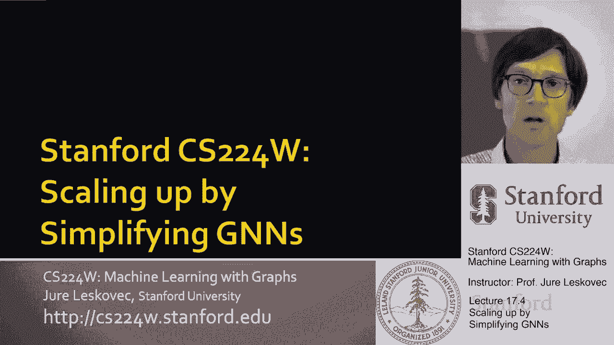
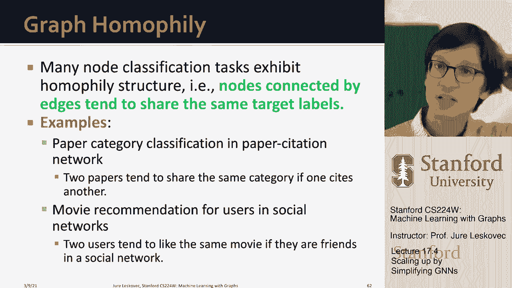

# 56：17.4 - 通过简化GNN实现扩展 📈

在本节课中，我们将学习如何通过简化图神经网络（GNN）的架构来实现模型扩展。这是一种与前两种方法（如采样或分区）正交的策略。我们将从一个具体的例子——图卷积网络（GCN）开始，通过移除其非线性激活函数来简化它，并探讨这种简化带来的效率提升与性能权衡。

## 简化GCN架构的动机 💡

上一节我们讨论了扩展GNN的几种思路。本节中，我们来看看一种不同的方法：通过简化模型架构本身来提高可扩展性。具体来说，我们将以图卷积网络（GCN）为例，展示如何通过移除非线性激活函数来获得一个计算效率极高的模型。

研究表明，在基准测试中，移除非线性后的GCN性能下降并不显著。这意味着我们可以通过牺牲模型的一部分表达能力，来换取训练速度的大幅提升。简化的GCN架构计算速度快，易于训练，并且能够在大规模数据上高效运行。当然，这背后存在一个权衡，我们将在后续详细讨论。

## GCN的矩阵形式回顾 🔄

为了理解简化过程，我们首先需要回顾标准GCN的公式。GCN通过聚合邻居信息来迭代更新节点嵌入。假设我们有一个图，节点特征为 **X**。在每一层 **l**，节点 **v** 的嵌入 **h_v^(l)** 通过聚合其邻居 **N(v)** 在前一层的嵌入并应用非线性变换得到。

我们可以用优雅的矩阵形式重写这个过程。定义邻接矩阵 **A**（包含自环），度矩阵 **D**（对角线元素为节点度数）。那么，邻居聚合操作可以表示为 **D^(-1) A H^(l)**。因此，标准GCN的一层更新可以写成：

**H^(l+1) = σ( D^(-1) A H^(l) W^(l) )**

其中：
*   **H^(l)** 是第 **l** 层的节点嵌入矩阵。
*   **σ** 是非线性激活函数（如ReLU）。
*   **W^(l)** 是可学习的权重矩阵。
*   **Ã = D^(-1) A** 是归一化的邻接矩阵。

通过迭代 **K** 次上述公式，我们可以计算出 **K** 层GCN的最终节点嵌入。

## 移除非线性：简化GCN 🧹

现在，让我们开始简化GCN。核心思想是移除每一层的非线性激活函数 **σ**。这样，更新方程变为一个纯粹的线性变换：

**H^(l+1) = Ã H^(l) W^(l)**

接下来，我们展开这个递归关系。假设输入层 **H^(0) = X**（原始节点特征矩阵）。那么经过 **K** 层后，最终嵌入 **H^(K)** 可以展开为：

**H^(K) = Ã^K X W**

其中 **W = W^(0) W^(1) ... W^(K-1)** 是 **K** 个权重矩阵的乘积，它本身仍然是一个可学习的参数矩阵。

这个推导带来了一个关键的洞见：项 **Ã^K X** 完全独立于任何需要训练的参数 **W**。回忆一下，邻接矩阵的 **K** 次幂 **Ã^K** 编码了图中长度为 **K** 的路径信息。因此，**Ã^K X** 本质上是对每个节点其 **K** 跳邻居的特征进行预聚合。

## 简化GCN的训练流程 ⚙️

基于上述分析，简化GCN的训练可以分解为两个独立的阶段：预处理和参数学习。

以下是具体的步骤：

1.  **预处理阶段**：在训练开始之前，我们在CPU上预先计算矩阵 **X̃ = Ã^K X**。这个计算只涉及稀疏矩阵的幂运算和乘法，效率很高。计算结果 **X̃** 是一个矩阵，其中每一行对应一个节点的预处理特征向量。
2.  **训练阶段**：在每一小批量（mini-batch）训练中：
    *   我们随机采样一小批节点。
    *   对于每个被采样的节点，我们从预计算的矩阵 **X̃** 中取出对应的行（即该节点的预处理特征）。
    *   该节点的最终嵌入通过一个简单的线性变换得到：**z_v = X̃_v W**，其中 **W** 是待学习的参数矩阵。
    *   使用这些嵌入进行预测、计算损失，并通过反向传播更新参数 **W**。

这种方法的巨大优势在于，为小批量中的节点生成嵌入变得极其高效，因为它只是一个矩阵乘法，节点之间没有依赖关系，也不需要构建复杂的计算图。

## 性能权衡与同质性假设 ⚖️

上一节我们介绍了简化GCN的高效训练流程。本节中，我们来看看这种简化付出的代价，并探讨它为何在许多实际场景中依然有效。

与Cluster-GCN等方法相比，简化GCN的节点采样可以完全随机进行，无需复杂的图分区或子图诱导，训练稳定，梯度方差小。然而，代价是模型表达能力的显著下降。由于移除了非线性，简化GCN无法学习复杂的节点表示变换，理论上其区分不同图结构的能力较弱。

但有趣的是，在许多现实世界的图数据集基准测试中，简化GCN的表现往往与原始GCN相差不大。这是为什么呢？答案在于图结构的“同质性”（Homophily）假设。

同质性是一个社会学概念，俗称“物以类聚，人以群分”。在图数据中，它表现为相连的节点往往具有相似的属性或标签。例如：
*   在社交网络中，朋友通常有相似的兴趣。
*   在引文网络中，同一领域的论文倾向于互相引用。
*   在推荐系统中，用户喜欢看的电影通常属于相同类型。

简化GCN的预处理步骤 **Ã^K X** 正是在 **K** 跳邻居内对节点特征进行迭代平均。如果图具有强同质性，那么通过边连接的节点，其预处理后的特征 **X̃** 自然会变得相似。如果这些节点的真实标签也恰好相似（即标签在网络中聚集），那么一个简单的线性分类器（即参数 **W**）就足以根据 **X̃** 做出准确的预测。

因此，简化GCN成功的关键前提是：**图数据必须表现出较强的同质性**。如果节点标签在网络中随机分布或异质性很强，简化GCN的性能可能会大幅下降。

## 总结 📝

本节课中，我们一起学习了通过简化GNN架构来实现扩展的方法。我们以GCN为例，通过移除其非线性激活函数，将其转化为一个高效的线性模型。

核心简化步骤是将GCN的递归更新展开，分离出与参数无关的预处理部分 **Ã^K X**。这使得训练过程分为两步：先在CPU上高效预计算节点特征，然后在训练中仅对可学习参数 **W** 进行快速的随机梯度下降优化。

这种简化牺牲了模型的理论表达能力，但在许多实际同质图数据上表现良好，因为其预处理步骤天然地使相连节点的特征相似化，便于后续线性分类。理解这种方法的有效性和局限性，有助于我们在实际应用中权衡模型复杂度与计算效率。