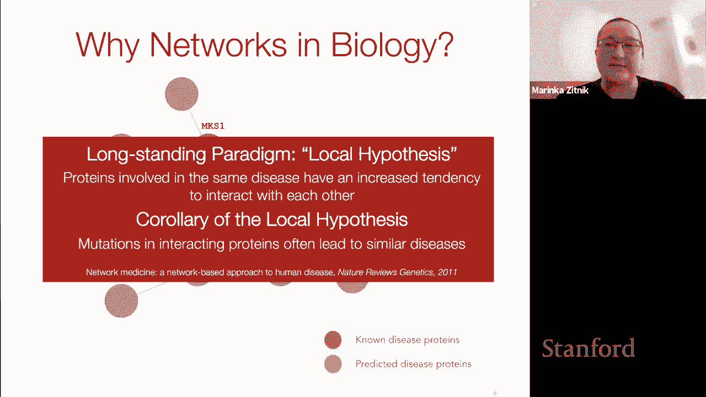
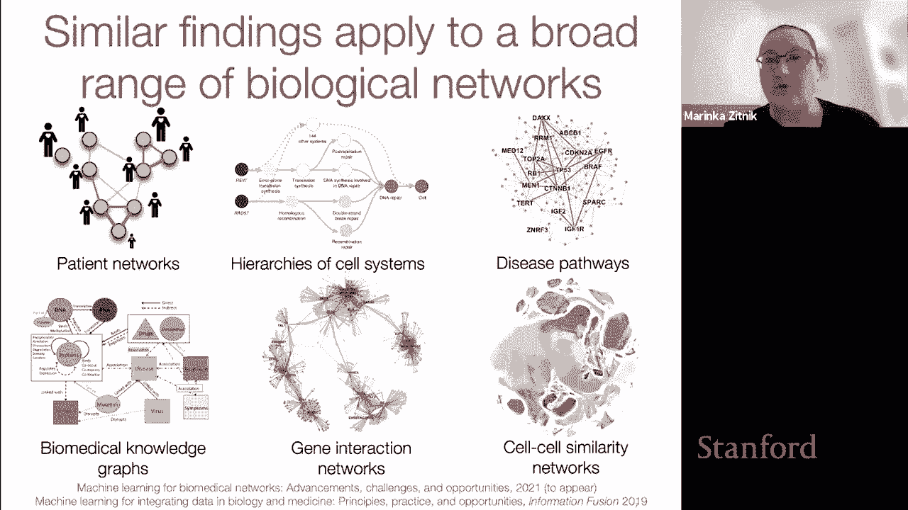
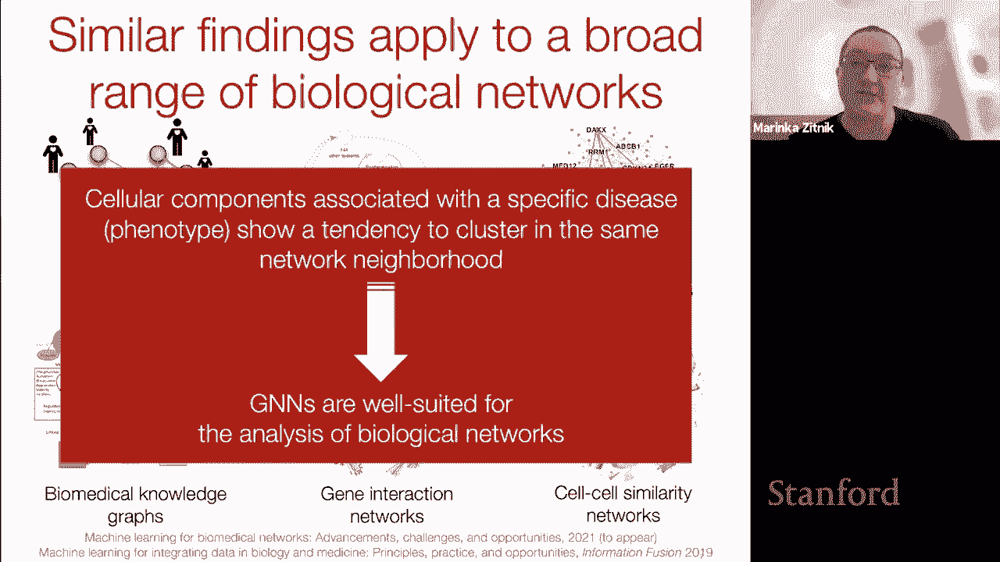
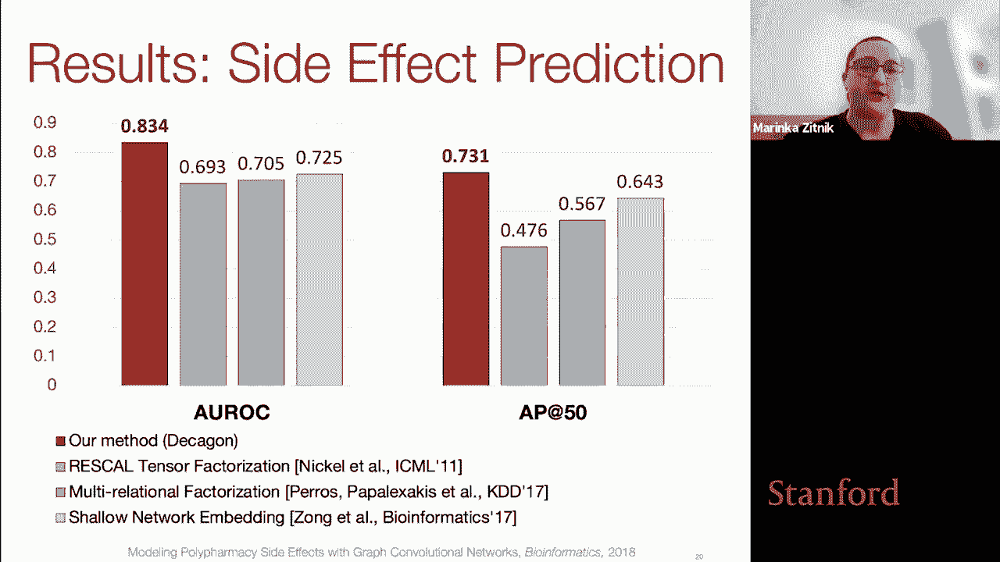
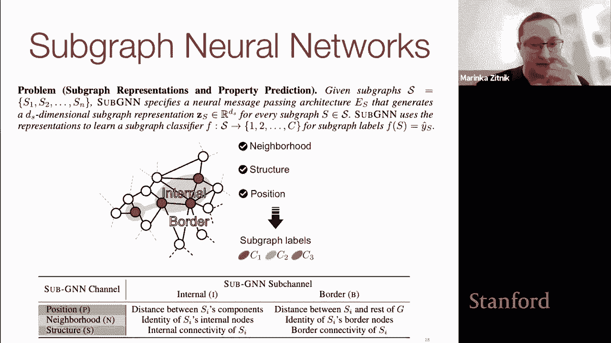
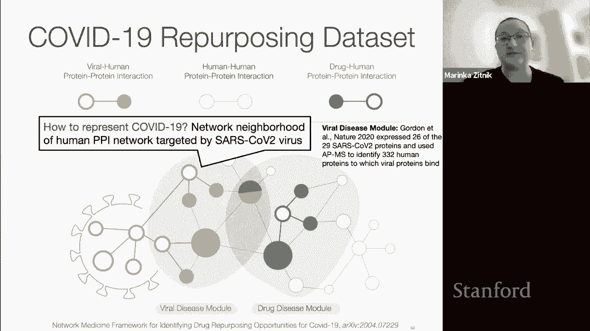
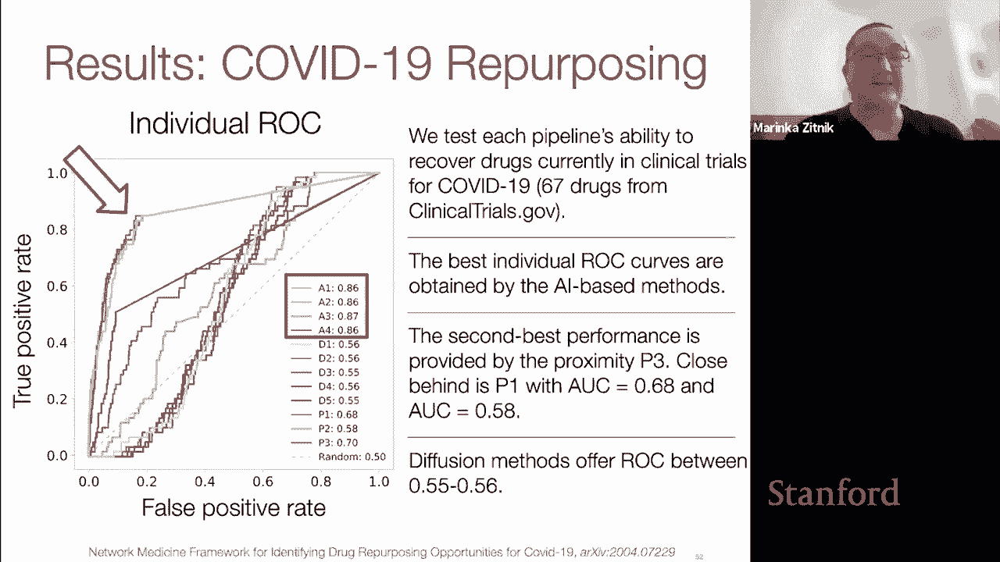
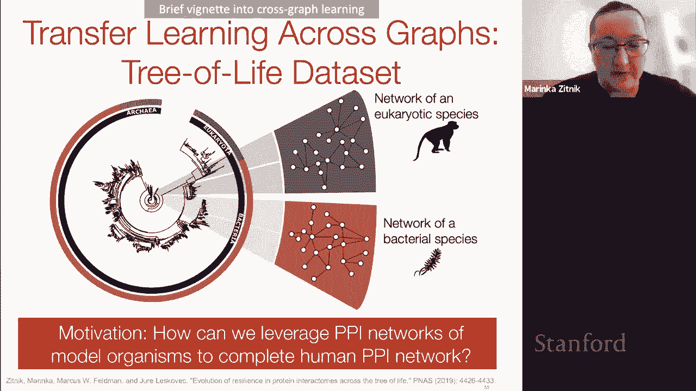
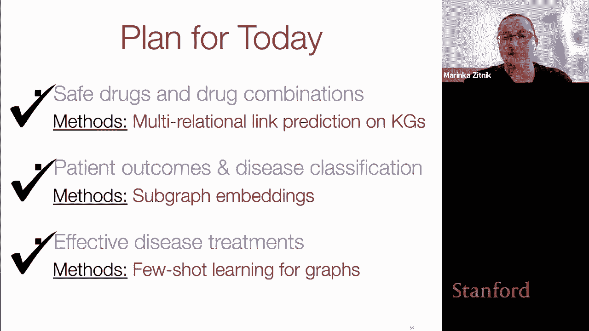

# 57：计算生物学中的图神经网络 🧬

在本节课中，我们将要学习图神经网络在计算生物学领域的应用。我们将探讨为什么图结构非常适合表示生物数据，并了解GNN如何被用于解决药物安全性预测、疾病诊断和药物重定位等关键生物医学问题。

## 概述：为什么图神经网络适用于生物学？

生物学本质上是一个相互关联的系统。从基因组序列、蛋白质相互作用，到人体细胞、整个生态系统，生物实体之间存在着复杂的网络关系。例如，药物的作用方式并非独立，而是通过影响细胞内的蛋白质网络来产生效应。因此，从网络视角研究生物学非常有意义。

一个核心观察是“局部假说”：在生物网络中，具有相似属性（如导致相同疾病）的实体倾向于聚集在网络中的特定区域。例如，在人类蛋白质相互作用网络中，与同一种疾病相关的蛋白质倾向于彼此连接。这种网络特性使得图神经网络成为分析生物网络、学习有意义的生物学表示的强大工具。

然而，生物网络也带来了一些独特的挑战，包括网络异质性、多源数据整合以及数据固有的噪声和不完整性。本课程将介绍如何通过算法创新来应对这些挑战。

---

## 第一部分：建模药物安全性与药物组合 💊

上一节我们介绍了图神经网络在生物学中的通用优势，本节中我们来看看它在预测药物组合安全性方面的具体应用。

多药治疗是指患者同时服用多种药物的情况，这在老年患者中非常普遍。问题在于，多种药物同时服用可能引发意想不到的药物间相互作用，导致严重的不良事件。据估计，约15%的人口受到药物不良事件的困扰。

我们的学习任务是：设计一个模型，能够预测特定的药物组合导致特定副作用的可能性。

### 面临的挑战
以下是建模药物组合安全性时面临的主要挑战：
1.  **组合爆炸**：即使只考虑两种药物的组合，可能性也超过1300万种，在实验室中全面测试是不可行的。
2.  **非线性效应**：药物相互作用本质上是非加性的，即组合效应不等于单个药物效应的简单相加。
3.  **数据稀疏性**：对于许多尚未广泛使用的药物组合，患者报告数据极少，形成“小数据”问题。

### DECAGON方法
为了应对这些挑战，我们介绍一种名为DECAGON的方法，它使用图神经网络在多药理学知识图谱上预测药物组合安全性。

**知识图谱结构**：
*   **节点**：药物（绿色三角形）和蛋白质（橙色圆形）。
*   **边**：
    *   药物-药物边：表示两种药物联合使用时会导致特定类型的不良事件（副作用）。
    *   药物-蛋白质边：表示药物靶向的蛋白质。
    *   蛋白质-蛋白质边：表示蛋白质之间的相互作用（来自蛋白质相互作用网络）。

**模型架构**：
DECAGON包含两个主要组件：
1.  **编码器**：一个多关系图编码器，用于学习图中每种药物和蛋白质节点的嵌入表示。它通过区分不同的边类型来探索每个节点的局部邻域。
2.  **解码器**：一个张量分解风格的解码器，用于预测药物节点之间是否存在表示特定副作用的边。

编码器的工作方式可以概括为以下公式。对于节点 `v` 在第 `k` 层的嵌入 `h_v^k` 更新为：
`h_v^k = σ( W_self^k * h_v^{k-1} + Σ_{r∈R} Σ_{u∈N_r(v)} (c_{vu} * W_r^k * h_u^{k-1}) )`
其中，`R` 是所有边类型的集合，`N_r(v)` 是节点 `v` 在边类型 `r` 下的邻居集合，`W_r^k` 和 `W_self^k` 是可训练的权重矩阵，`c_{vu}` 是归一化常数，`σ` 是非线性激活函数。

### 结果与应用
DECAGON模型在一个包含超过400万条药物-药物边、药物-蛋白边和蛋白-蛋白边的知识图谱上进行了训练。与基线模型（如张量分解、浅层嵌入模型）相比，DECAGON在预测药物相互作用方面表现更优。

更重要的是，当进行时间外推测试时（使用2012年前的数据训练，预测之后的新相互作用），DECAGON做出的前十名预测中，有五个在2012年后的医学文献中找到了直接证据。这证明了其发现新型、潜在有害药物相互作用的能力。

这项工作为开发更个性化的不良事件预测模型奠定了基础，目前已有包含超过1000万份不良事件报告的数据集可供此类研究使用。

---

## 第二部分：预测患者结局与疾病诊断 🩺

在了解了如何利用GNN预测药物安全性后，本节我们将转向另一个重要问题：疾病诊断。

疾病诊断的核心是基于观察到的患者表型信息。表型是可观察的特征，由基因型和环境相互作用产生。医生使用标准化词汇（如人类表型本体HPO）来描述疾病。在机器学习中，我们可以将诊断任务形式化如下：

*   **基础图**：一个以表型为节点、以表型间关系为边的图。
*   **子图**：代表特定疾病的表型集合，或代表患者症状的表型集合。
*   **学习任务**：预测与描述患者的表型子图最一致的疾病标签。

### 子图预测的挑战
一个直观的想法是使用节点级GNN学习表型嵌入，然后通过平均聚合得到子图嵌入。但这种方法可能丢失关键信息，原因如下：
1.  **子图大小不一**：如何有效表示不同大小的子图？
2.  **丰富的连通性**：子图内部及其与外部图的连接结构包含重要信息。
3.  **分布多样性**：子图可能集中在图的某个区域，也可能分散在多个不连通的社区。

### SubGNN方法
为了解决子图级别的预测问题，我们引入了SubGNN模型。它的目标是学习能够捕捉子图拓扑结构的嵌入表示，使得拓扑相似的子图在嵌入空间中也彼此接近。

SubGNN通过分层的消息传递方案工作，该方案专门设计用于捕获子图拓扑的三个关键方面：
1.  **邻域**：子图直接邻域内的连通性。
2.  **位置**：子图在整个基础图中的位置。
3.  **结构**：子图内部的结构模式（如特定模体的出现频率）。

模型在三个独立的通道中分别进行消息传递，每个通道针对上述一个方面进行优化。消息从随机采样的“锚点补丁”传递到目标子图的各个组件，传递的权重由子图组件与锚点补丁的相似性决定。最后，三个通道的输出被聚合，形成最终的子图表示 `z_s`。

### 实验验证
首先，在合成数据集上测试SubGNN。这些数据集的子图标签根据其网络属性（如密度、割集大小）定义。结果表明，SubGNN能够有效捕捉子图拓扑的不同方面，并且性能显著优于简单的节点嵌入平均等基线方法。

随后，在真实世界数据集上进行了测试，特别是基于人类表型本体构建的HPO-Metab和HPO-Neuro数据集。这些数据集模拟了根据患者表型诊断代谢或神经系统疾病的任务。SubGNN在这类诊断任务上的性能，相比基线模型提升了最高达127%，证明了子图级建模的有效性。

---

## 第三部分：识别有效的疾病治疗方法 🎯

在讨论了安全性和诊断之后，本节我们关注药物开发的另一个核心终点：疗效。我们将重点放在为新兴疾病寻找治疗方法，特别是药物重定位。

药物重定位是指发现已上市药物对新的疾病适应症的治疗作用。这是一种比从头开发新药更快、成本更低的策略。例如，在COVID-19大流行初期，快速识别已有药物作为潜在疗法至关重要。

### 问题定义与挑战
我们将药物重定位形式化为一个链接预测问题：在一个二分图中，一侧是药物节点，另一侧是疾病节点，已知的治疗关系作为边。目标是预测新的“药物-疾病”边。

主要挑战在于**样本稀缺**。对于像COVID-19这样的全新疾病，根本没有已知的治疗药物作为正样本。传统的GNN方法依赖丰富的标签信息进行训练，这在面对新疾病时失效。

### 元学习与G-META方法
为了解决少样本学习问题，我们采用元学习策略。元学习的目标是训练一个模型，使其能够在只有极少数标签示例的新任务上快速适应。

我们引入了G-META方法，用于图上的少样本学习。其核心思想是：通过提取包含标记节点的局部子图，并将子图的结构信息作为“签名”，来初始化GNN。这种方法有效的原因在于：
*   **结构相似性**：在标签极度稀缺的情况下，依赖标签传播不可行，而具有相似标签的节点通常在局部邻域内具有相似的结构模式。
*   **生物学依据**：在生物网络中，预测所需的关键信息通常存在于目标节点周围2-3跳的邻域内。

### COVID-19药物重定位应用
我们将G-META应用于COVID-19药物重定位：
1.  **数据构建**：
    *   COVID-19表示：基于病毒蛋白攻击的332种人类蛋白质集合，及其在人类蛋白质相互作用网络中的邻域。
    *   药物表示：每种药物已知靶向的蛋白质集合。
    *   训练任务：基于其他已知的药物-疾病治疗关系进行元训练。
2.  **预测与验证**：
    *   模型学习COVID-19的嵌入，并寻找嵌入空间中与之最接近的药物。
    *   生成的候选药物列表被提交给病毒学家进行实验验证。
    *   在细胞系和小鼠模型测试中，G-META预测的药物显示出比以往基于网络邻近性或随机游走的方法高出一个数量级的“命中率”。
    *   一个关键发现是，绝大多数预测有效的药物并非直接靶向病毒蛋白，而是通过“网络效应”作用于与病毒靶点相互作用的蛋白质，这凸显了图方法在发现新型作用机制方面的优势。

---

## 总结与展望 🚀

本节课中，我们一起学习了图神经网络在计算生物学中的三个重要应用方向：
1.  **药物安全性预测**：利用多关系知识图谱（如DECAGON模型）预测药物组合的不良反应，应对组合爆炸和数据稀疏挑战。
2.  **疾病诊断**：通过子图神经网络（如SubGNN）对患者表型子图进行嵌入和分类，实现更精准的诊断。
3.  **药物重定位**：采用元学习框架（如G-META）解决少样本学习问题，快速为新兴疾病（如COVID-19）识别有潜力的治疗药物。

这些应用展示了GNN如何利用生物数据中固有的网络关系结构，推动生物医学发现。未来的挑战包括提高模型的可解释性、建立临床医生的信任，以及将这些方法更广泛、更常规地整合到临床和药物研发工作流程中。随着更多数据的产生和算法的进步，图神经网络有望在个性化医疗、疾病机理理解和新型疗法开发中发挥越来越重要的作用。