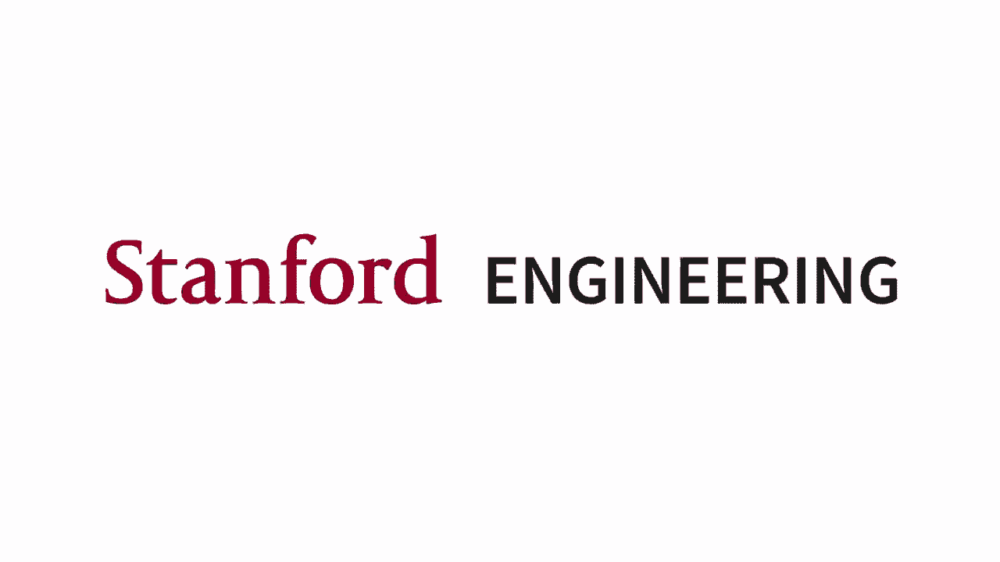
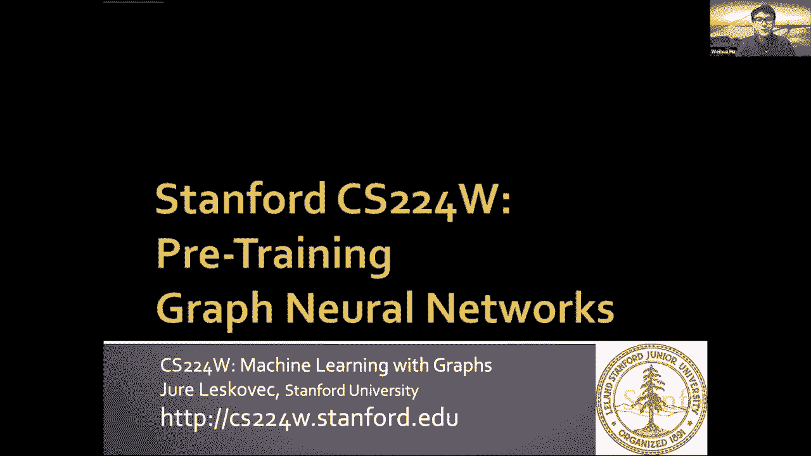
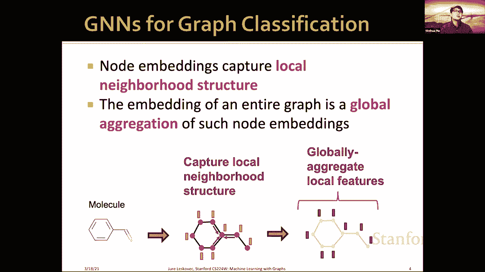
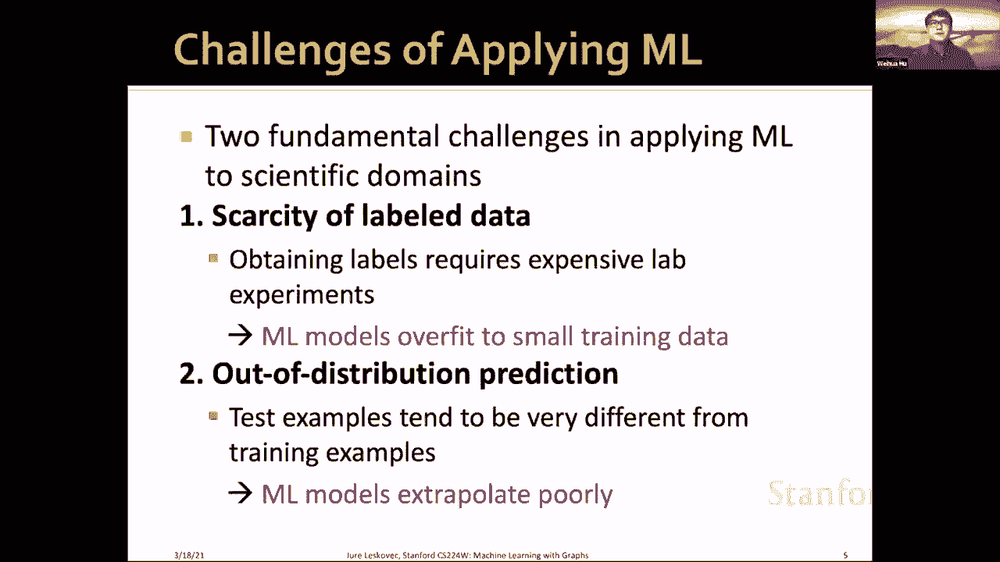
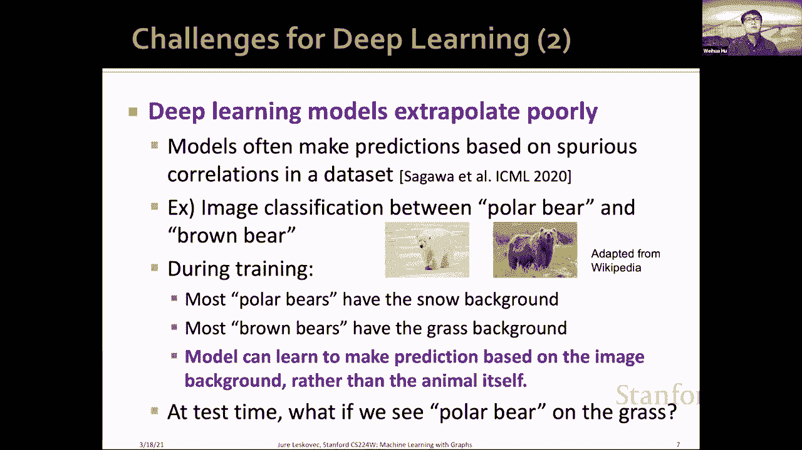
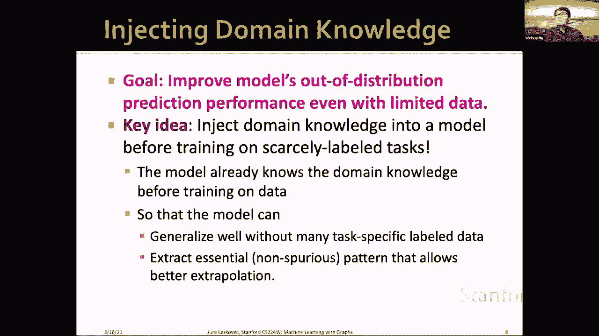
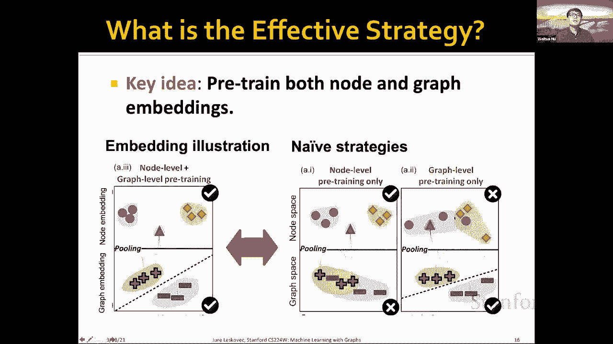
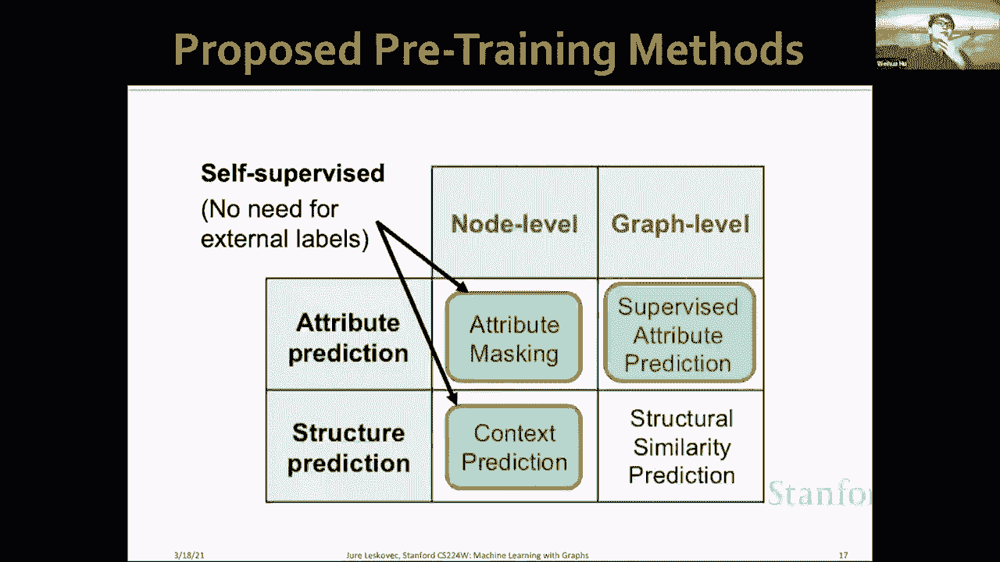
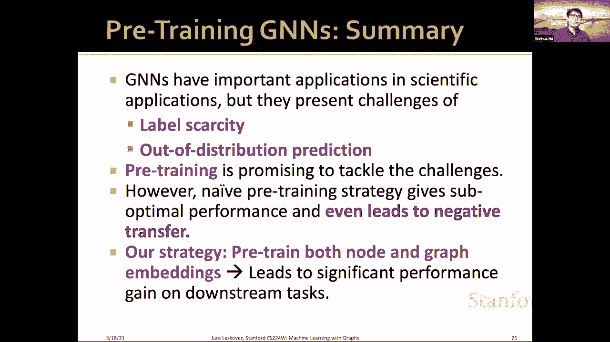

# 58：19.1 - 图神经网络预训练 🧠

在本节课中，我们将学习图神经网络在科学领域的应用，特别是如何通过预训练来解决数据稀缺和外推预测的挑战。我们将探讨几种有效的预训练策略，并理解其背后的原理。

---

## 图神经网络在科学领域的应用 🧪

上一节我们介绍了课程概述，本节中我们来看看图神经网络在科学领域的具体应用场景。

在许多科学领域，图结构问题非常普遍。例如，在化学中，分子可以表示为图，其中每个节点是一个原子，每条边代表一个化学键。我们的目标是预测分子的性质，例如其毒性。在生物学中，蛋白质-蛋白质相互作用网络也是一个图，其中节点是蛋白质，边代表相互作用。我们的目标可能是预测某个中心蛋白质是否具有特定的生物活性。

图神经网络可以用于解决这类图分类问题。其基本流程如下：
1.  给定一个图（如分子图），GNN通过迭代聚合邻居信息来获得每个节点的嵌入表示。
2.  一旦获得所有节点的嵌入，我们可以通过一个池化函数（如求和、平均）来获得整个图的嵌入表示。
3.  最后，在图嵌入上应用一个线性分类器，来预测整个图的属性（如是否有毒）。

在这个过程中，节点嵌入试图捕获每个节点周围的局部邻域结构。如果我们应用K跳GNN，它就能捕获K跳范围内的局部社区信息。整个图的嵌入则聚合了所有这些局部结构信息。

---

## 科学应用中的挑战 🚧

上一节我们介绍了GNN如何应用于科学问题，本节中我们来看看将机器学习应用于这些领域时面临的主要挑战。

将机器学习应用于科学领域主要面临两个基本挑战：
1.  **标签数据的稀缺性**：在科学领域获取标签通常需要昂贵的实验室实验。例如，确定一个分子是否有毒需要进行湿实验室实验，成本高昂。因此，我们无法获得大量的训练数据，导致模型容易在小数据集上过拟合。
2.  **分布外预测**：在科学发现中，我们常常希望预测与训练样本本质上不同的新样本（例如发现新分子）。机器学习模型，尤其是深度学习模型，在这种分布外数据上的推断能力往往不佳。

深度学习模型本身加剧了这些挑战：
*   模型参数众多，需要大量数据训练，在少量标记数据上极易过拟合。
*   深度学习模型的外推能力通常较差，它们可能学习到数据中的虚假相关性而非真正的因果机制。

例如，在一个分类北极熊和棕熊的玩具例子中，如果训练数据里北极熊总在雪地背景中，棕熊总在草地背景中，模型可能学会根据背景而非动物本身进行分类。如果在测试时遇到草地上的北极熊，模型就会预测错误，因为它并未理解任务本质。

---

## 解决方案：预训练 💡

上一节我们讨论了科学应用中的挑战，本节中我们来看看一个潜在的解决方案：预训练。

我们的核心目标是：在数据有限的情况下，提升模型的性能，特别是其分布外预测能力。实现这一目标的关键思想是，在模型应用于下游任务之前，先将领域知识注入模型。

**预训练**是一个非常有效的框架。其步骤是：
1.  在一个与下游任务相关、但数据丰富的**预训练任务**上训练模型。
2.  预训练完成后，模型的参数已经蕴含了一定的领域知识。
3.  将这些**预训练好的参数**迁移到我们关心的、数据稀缺的**下游任务**中。
4.  在下游任务上对模型参数进行**微调**。

预训练在计算机视觉和自然语言处理领域已取得巨大成功，它能显著提高标签利用效率并改善模型泛化能力。因此，预训练有望成为解决科学领域挑战的强大工具。

---

## 设计有效的GNN预训练策略 🔬

上一节我们引入了预训练的概念，本节中我们具体探讨如何为图神经网络设计有效的预训练策略。

我们以分子性质预测为例。一个简单的策略是**多任务监督预训练**：在一个包含大量分子和各种性质标签的化学数据库上，预训练GNN同时预测这些多样的性质，期望模型能捕获化学领域知识，然后迁移到下游任务。

然而，实验发现这种朴素策略效果有限，有时甚至会导致**负迁移**，即预训练模型的性能比随机初始化的模型还要差。

那么，什么才是有效的预训练策略呢？我们的**关键思想**是：需要在**节点级别**和**图级别**同时对GNN进行预训练，使得模型能在局部和全局层面都捕获图的语义知识。

直觉在于：节点嵌入被聚合以生成图嵌入。如果只在图级别预训练，可能无法保证聚合前的节点嵌入质量；如果只在节点级别预训练，生成的图嵌入可能不佳。两者都需要高质量的表示。

---

## 三种自监督预训练方法 🛠️

上一节我们提出了在节点和图级别进行预训练的核心思想，本节中我们来介绍三种实现这一思想的具体自监督预训练方法。

以下是三种无需外部标注的预训练方法：

### 1. 属性掩码
这是一种节点级别的预训练方法。
*   **算法**：给定输入图，随机掩码掉一部分节点（或边）的属性（例如在分子图中掩码掉原子的类型）。然后，使用GNN为被掩码的节点生成嵌入，并基于该嵌入预测被掩码属性的原始身份。
*   **直觉**：通过解决这个“填空”任务，GNN被迫学习关于图中元素及其上下文的领域知识，从而捕获局部语义。

### 2. 上下文预测
这是一种节点/子图级别的预训练方法。
*   **算法**：对于图中的每个节点，提取其K跳邻域作为“子图”，并提取该子图的外围部分作为“上下文图”。使用两个独立的GNN分别编码子图和上下文图得到向量表示。训练目标是最大化真实“子图-上下文图”对之间的相似性，同时最小化与随机采样的错误上下文图之间的相似性。
*   **直觉**：该方法基于自然语言处理中的“分布假说”——出现在相似上下文中的单词具有相似含义。在这里，我们假设被相似上下文包围的子图在语义上也相似，从而学习有意义的节点/子图表示。

### 3. 图级别多任务预训练
这是一种图级别的预训练方法。
*   **算法**：直接利用大量可用的图级别标签（如分子的多种性质），以多任务学习的方式预训练GNN进行监督预测。
*   **直觉**：这是将领域知识注入模型的直接方法，使模型学习与下游任务相关的全局图属性。

---

## 整体策略与效果 📈

上一节我们介绍了三种具体的预训练方法，本节中我们来看看如何将它们组合成整体策略并评估其效果。

我们提出的**整体预训练策略**分为两步：
1.  **节点级预训练**：首先使用自监督方法（如属性掩码、上下文预测）对GNN进行预训练，以获得高质量的节点表示。
2.  **图级预训练**：然后，使用第一步预训练得到的参数作为初始化，在图级别进行（多任务）监督预训练，以获得良好的图表示。

完成这两步预训练后，再将模型参数迁移到下游任务进行微调。

实验表明，这种**先节点、后图**的两阶段预训练策略非常有效：
*   它成功避免了朴素策略中出现的**负迁移**现象。
*   在多个下游数据集上，其性能 consistently 优于随机初始化基线以及朴素的图级多任务预训练基线。

一个有趣的发现是，**表达能力更强的GNN模型**（如能区分不同图结构的模型）从预训练中获益最大。直觉是，这类模型能够从海量预训练数据中捕获更丰富、更本质的领域知识。

---

## 总结 🎯

本节课中我们一起学习了图神经网络预训练的相关知识。

我们了解到，GNN在分子性质预测、蛋白质功能预测等科学领域有重要应用，但这些应用面临**标签稀缺**和**分布外预测**的挑战。**预训练**是解决这些挑战的一个有前景的框架。

然而，简单的、仅在**图级别**进行多任务监督预训练的策略可能效果不佳，甚至导致负迁移。我们提出的有效策略是：对**节点嵌入**和**图嵌入**进行**分阶段预训练**。具体可通过**属性掩码**、**上下文预测**等自监督方法实现节点级预训练，再结合图级监督预训练。这种策略能显著提升下游任务性能，并使模型获得更好的泛化能力。