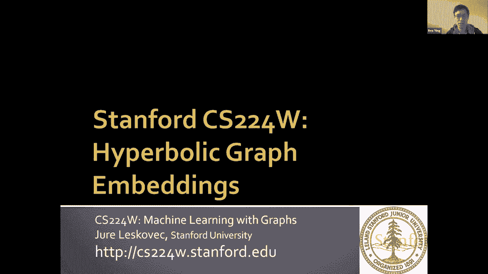
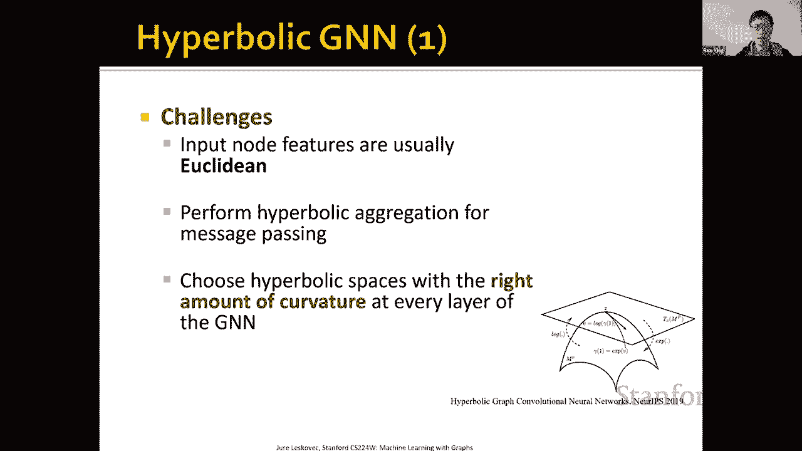
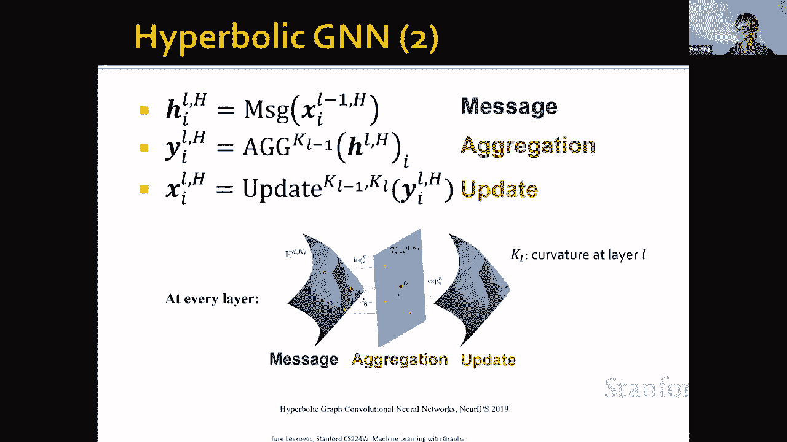
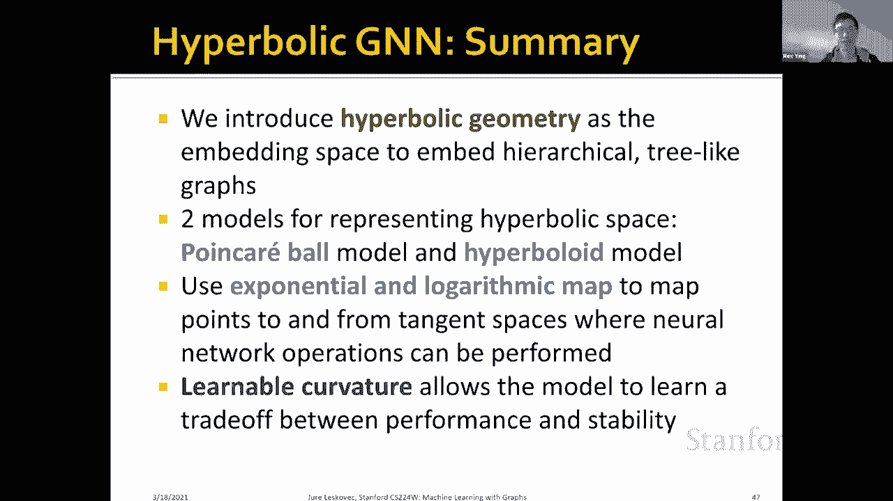

# 59：19.2 - 双曲线图嵌入 🌲

在本节课中，我们将要学习双曲线图嵌入。这是一种用于表示具有层次结构或树状结构的图的方法。我们将了解为什么欧几里得空间不适合表示这类图，并探索双曲几何如何提供更自然的嵌入空间。

## 概述：为什么需要双曲线嵌入？

在上一节课中，我们关注了欧几里得空间中的图表示学习。然而，欧几里得嵌入并不总能捕获复杂的图结构。

例如，考虑一个完整的二叉树结构。第一层有1个节点，第二层有2个节点，第三层有4个节点，节点数量随着树的深度呈指数级增长。这种树状结构很难嵌入到欧几里得空间。在二维平面上，随着深度增加，叶子节点会越来越拥挤，导致嵌入空间无法忠实地表示节点之间的距离。

因此，我们关注具有这种树状结构的图。这类图主要呈树状，但也可以包含少量循环，例如按层次结构组织的知识图谱。我们将看到，双曲几何非常适合嵌入这种结构。

## 双曲几何简介

双曲几何与欧几里得几何不同，它违反了欧几里得几何的第五公理（平行公设）。在欧几里得几何中，过直线外一点有且仅有一条平行线。而在双曲几何中，过直线外一点有无限多条平行线。

由于这一特性，双曲空间无法在欧几里得空间中自然表示。我们通常使用两种等价的几何模型在欧几里得空间中可视化双曲空间。

### 庞加莱圆盘模型 🎯

庞加莱圆盘模型将一个开放的单位圆盘（不包括边界）表示为双曲空间。圆盘的半径与 $\sqrt{K}$ 成正比，其中 $K$ 是曲率的倒数。

该模型的一个重要性质是：圆盘中的所有三角形在双曲度量下面积相等。这解释了为什么该空间适合嵌入层次结构：中心区域可以容纳较少的节点（如树根），而靠近边缘的区域可以指数级地容纳更多节点（如树叶）。

### 双曲面模型（洛伦兹模型） 🌐

双曲面模型，也称为洛伦兹模型，将双曲空间表示为双曲面的上半部分。与庞加莱模型相比，它在数值上更稳定，不需要极高的机器精度来表示靠近边缘的点，并且具有更简单的度量公式。

这两个模型是等价的，可以通过一对一的映射进行转换。

## 任务定义：图表示学习

我们的核心任务与典型的图表示学习相同，主要包括：
*   **链接预测**：预测图中两个节点之间是否存在边。
*   **节点分类**：预测图中节点的标签。

例如，在知识图谱嵌入中，高级抽象实体（如“物理”、“生物”）可能嵌入在庞加莱圆盘中心，而具体实体（如“代谢率”）则嵌入在边缘。通过这种嵌入，我们可以执行上述任务。

## 双曲空间的数学表示

双曲几何在数学上被定义为一个**黎曼流形**。流形是一个可以在局部用欧几里得空间（切空间）来近似的曲面。双曲空间是一个具有**恒定负曲率**的黎曼流形，曲率表示为 $-1/K$（$K > 0$）。

以下是几个核心概念：

**1. 闵可夫斯基内积**
在 $d$ 维双曲空间的双曲面模型中，我们使用 $d+1$ 维坐标，并定义闵可夫斯基内积：
$$\langle \mathbf{x}, \mathbf{y} \rangle_{\mathcal{L}} = -x_0 y_0 + \sum_{i=1}^{d} x_i y_i$$

**2. 双曲距离**
基于上述内积，两点 $\mathbf{x}$ 和 $\mathbf{y}$ 之间的双曲距离为：
$$d_{\mathcal{L}}^K(\mathbf{x}, \mathbf{y}) = \sqrt{K} \cdot \operatorname{arcosh}(-\langle \mathbf{x}, \mathbf{y} \rangle_{\mathcal{L}} / K)$$
其中 $\operatorname{arcosh}$ 是反双曲余弦函数。

**3. 切空间**
在流形上某一点 $\mathbf{x}$ 的**切空间** $T_{\mathbf{x}}\mathcal{M}^K$，是一个与该点相切的欧几里得空间，是所有满足 $\langle \mathbf{x}, \mathbf{v} \rangle_{\mathcal{L}} = 0$ 的向量 $\mathbf{v}$ 的集合。

**4. 指数与对数映射**
这是在**切空间**（欧几里得）和**流形**（双曲）之间转换的关键操作：
*   **指数映射** $\exp_{\mathbf{x}}^K(\cdot)$：将切空间中的点映射到流形上。
*   **对数映射** $\log_{\mathbf{x}}^K(\cdot)$：将流形上的点映射回切空间。

这两个映射是可微的，使我们能够在欧几里得切空间中执行运算（如神经网络操作），然后再映射回双曲空间。

## 双曲线图神经网络 (Hyperbolic GNN) 🧠

将深度学习与双曲空间结合的主要挑战在于：标准神经网络操作是为欧几里得空间设计的。在双曲空间中，我们需要定义特殊的操作。

一个典型的GNN层包含**消息计算**、**聚合**和**更新**三个步骤。在双曲GNN中，这些步骤需要适配双曲几何。

上一节我们介绍了双曲空间的基本数学工具，本节中我们来看看如何构建双曲GNN。其高层思想如下图所示：在每一层，我们将节点嵌入从一个双曲空间（具有曲率 $K^{l-1}$）转换到另一个双曲空间（具有曲率 $K^l$）。

**1. 消息计算**
由于双曲空间中没有直接定义神经网络操作，我们利用**指数映射**和**对数映射**。首先，使用对数映射将双曲空间中的点映射到**原点**的切空间（这是一个欧几里得空间）。然后，在切空间中执行标准的线性变换（如乘以权重矩阵和加偏置）。最后，通过指数映射将结果映射回双曲空间。这种组合操作被称为“莫比乌斯”运算。

**2. 聚合**
聚合操作（如注意力聚合）也遵循类似模式。我们将邻居节点的消息映射到**中心节点**的切空间中进行加权求和，然后再映射回双曲空间。这里需要一个称为“平行移动”的操作，以确保向量在双曲空间中正确移动。

**3. 更新**
更新函数同样在切空间中应用非线性激活函数，然后通过指数映射映射到具有**新曲率** $K^l$ 的双曲空间中。

所有这些操作都是可微的，因此可以使用PyTorch等框架进行自动微分和训练。此外，每一层的曲率 $K$ 也可以作为参数进行学习，以在模型性能和数值稳定性之间取得平衡。

## 效果与总结

使用双曲GNN嵌入树状结构时，几何结构保持得更好。与欧几里得嵌入相比，双曲嵌入能够将根节点和叶子节点清晰地分离到不同的层次中。

我们还发现，双曲GNN的性能与图的“树状”程度密切相关。对于一个称为“双曲性”的度量 $\delta$，$\delta$ 越低表示图越像树。实验表明，双曲GNN在 $\delta$ 较低（即图更接近树状结构）的数据集上表现尤为出色。

本节课中我们一起学习了：
1.  **双曲几何基础**：了解了庞加莱圆盘和双曲面两种模型，以及它们适合表示层次化结构的原因。
2.  **核心数学概念**：包括黎曼流形、负曲率、闵可夫斯基内积、双曲距离以及关键的**指数映射**和**对数映射**。
3.  **双曲图神经网络**：掌握了如何利用指数/对数映射在双曲空间的**切空间**中执行消息传递、聚合和更新操作，从而构建可训练的GNN模型。
4.  **应用与优势**：认识到双曲嵌入特别适用于树状或层次化明显的图结构，并能通过学习曲率参数来优化模型。

通过本课程，你应该对如何利用双曲空间的独特几何性质来增强图表示学习有了基本的理解。