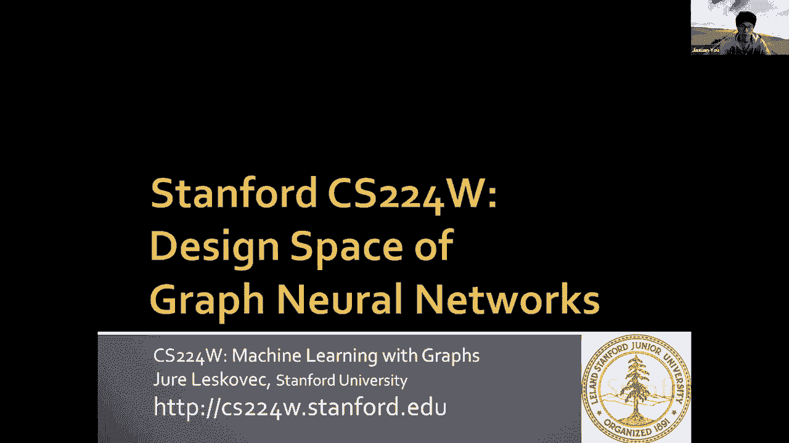
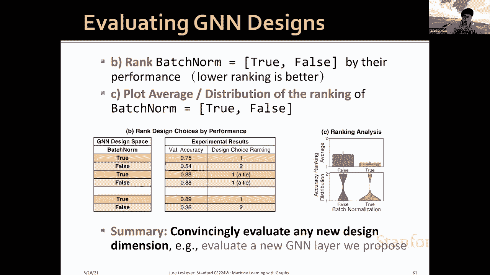
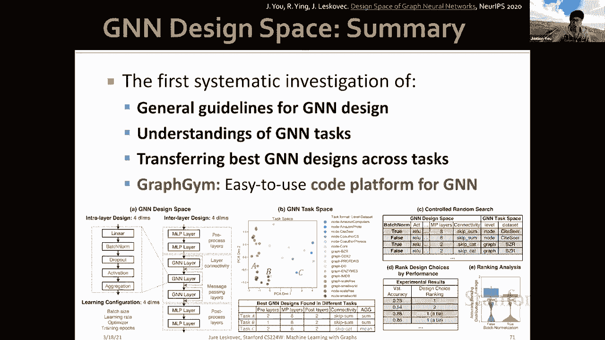

# 60：19.3 - 图神经网络的设计空间 🧠

在本节课中，我们将系统性地探讨图神经网络的设计空间。我们将学习如何为特定任务选择合适的GNN架构，并理解不同任务之间的相似性，从而能够将优秀的设计迁移到新任务上。

---

## 1. 核心概念与术语 📖

在深入设计空间之前，我们首先需要明确几个核心术语。

*   **设计**：指一个具体的模型实例。例如，一个四层的GraphSAGE就是一个特定的设计。
*   **设计维度**：用于描述设计的特征。例如，层数 `L` 是一个设计维度，其取值可以是 `{2, 4, 6, 8}`。
*   **设计选择**：设计维度中的具体取值。例如，层数 `L=4` 就是一个设计选择。
*   **设计空间**：由所有设计维度的笛卡尔积构成，它枚举了所有可能的设计组合。
*   **任务**：我们感兴趣的特定问题。例如，在Quora数据集上进行节点分类。
*   **任务空间**：由我们关心的所有任务构成。

---

## 2. GNN 设计空间 🏗️

上一节我们定义了基本术语，本节中我们来看看GNN设计空间的具体构成。一个完整的GNN设计空间主要包含三个部分：层内设计、层间设计和学习配置。

### 层内设计

GNN层可以理解为两个部分：**转换函数**和**聚合函数**。从这个视角出发，我们定义了四个关键的设计维度：

1.  **是否添加批归一化**：`batch_norm = {True, False}`
2.  **是否添加Dropout**：`dropout = {0.0, 0.5}` (0.0表示不使用)
3.  **激活函数的选择**：`activation = {ReLU, PReLU, ...}`
4.  **聚合函数的选择**：`aggregator = {mean, max, sum, ...}`

### 层间设计

除了核心的GNN层，我们还需要考虑如何组织这些层，以及是否添加额外的处理层。

*   **预处理层**：在输入图数据进入GNN层之前，可能需要对节点特征进行编码。例如，当节点特征来自图像或文本时，可以使用CNN或Transformer进行编码。
*   **后处理层**：在GNN层计算得到节点/图嵌入之后，可能需要进行进一步转换。例如，在图分类任务中，需要一个读出函数来生成图级表示。
*   **跳跃连接**：在GNN层之间添加跳跃连接，这已被证明能有效提升深层GNN的性能。

### 学习配置

学习配置在实践中对模型性能影响巨大，但常被文献忽视。我们主要考虑以下维度：

*   **批量大小**：`batch_size`
*   **学习率**：`learning_rate`
*   **优化器**：`optimizer = {Adam, SGD, ...}`
*   **训练轮数**：`num_epochs`

综合以上所有设计维度，我们构建了一个包含超过 **31.5万种** 可能设计的巨大空间。我们的目标不是穷举所有设计，而是倡导一种思维转变：**研究设计空间比研究单个GNN设计更有效**。

---

## 3. GNN 任务空间 🎯

定义了设计空间后，我们来看看任务空间。传统上，任务被粗略分为节点级、边级和图级预测。但这种分类不够精确。我们的创新在于提出一种**定量的任务相似性度量方法**。

### 如何度量任务相似性？

我们的核心思想是：**在相同一组“锚模型”上表现排名相似的任务，其本质也相似**。

具体步骤如下：
1.  **选择锚模型**：从一个易于处理的小数据集中，从设计空间中随机采样N个模型，根据其性能排序，然后均匀地选择K个模型作为锚模型（覆盖从最差到最好的性能范围）。
2.  **描述任务**：在一个新任务上运行所有K个锚模型，根据它们的性能进行排名。
3.  **计算相似性**：比较两个任务在锚模型上的排名顺序相似度（例如，使用斯皮尔曼等级相关系数）。排名越相似，任务越相似。

这种方法使我们能够超越主观分类，定量地理解不同GNN任务之间的关系，从而为模型迁移奠定基础。

---

## 4. 如何评估设计选择？📊

现在，我们有了设计空间和任务空间，如何科学地评估一个具体的设计选择（例如“批归一化是否有用”）呢？

传统做法是固定一个模型（如5层GCN），比较有/无批归一化的版本。我们的方法更严格、更系统，称为 **“受控随机搜索”**。

以下是评估一个设计维度（如 `batch_norm`）的步骤：
1.  **随机采样**：从整个设计空间和任务空间中，随机采样大量（模型，任务）组合。
2.  **控制变量**：对于每个采样的组合，固定其他所有设计维度，只将待评估的维度（`batch_norm`）分别设置为 `True` 和 `False`，得到两个对比模型。
3.  **性能排名**：在相同任务和训练预算下运行这两个模型。根据验证性能对 `batch_norm=True` 和 `batch_norm=False` 进行排名（排名越低越好）。
4.  **统计分析**：收集所有采样组合下的排名，绘制 `batch_norm=True` 和 `batch_norm=False` 的平均排名分布。如果一方的平均排名显著更低，则说明该选择普遍更优。

这种方法可以令人信服地评估任何新的设计维度或新的GNN层。

---

## 5. 关键研究发现 🔑

基于上述框架，我们得到了以下重要发现：

### 通用设计指南

某些设计选择显示出明显优势：
*   **层内设计**：
    *   `batch_norm=True` 通常更好，有助于GNN的优化。
    *   `dropout=0.0`（不使用）通常更好，因为GNN更多面临欠拟合而非过拟合。
    *   `PReLU` 激活函数显著优于常用的 `ReLU`。
    *   `sum` 聚合器通常表现最佳，因为其表达能力最强。
*   **层间设计**：
    *   最优层数高度依赖于任务，难以预先决定。
    *   跳跃连接能显著提升性能。
*   **学习配置**：
    *   最优批量大小和学习率也高度依赖任务。
    *   使用优化器（如Adam）和训练更多轮次通常更好。

### 任务空间的理解

*   GNN的最佳设计在不同任务间差异显著，证明了研究任务空间的必要性。
*   我们提出的任务相似性度量方法计算成本低（仅需约12个锚模型），且能提供丰富信息。
*   通过分析，我们将任务大致分为两类：
    *   **A组**：依赖特征信息的任务（如节点/图分类，输入特征维度高）。
    *   **B组**：依赖结构信息的任务（节点特征少，预测高度依赖图结构）。
*   相似的任务确实具有相似的最佳模型设计。

### 迁移到新任务：案例研究

我们将方法应用于一个全新的、具有挑战性的OGB分子属性预测任务：
1.  在新任务上运行12个锚模型。
2.  计算新任务与任务空间中现有任务的相似性。
3.  从最相似的现有任务中，推荐其最佳模型设计。
4.  **结果**：从相似任务迁移来的模型，在新任务上取得了接近最优的性能；而从非相似任务迁移的模型则表现不佳。这证明了我们任务相似性度量的有效性。

---

## 总结 📝

本节课我们一起学习了图神经网络设计空间的系统性研究方法。我们提出了一个包含层内、层间设计和学习配置的GNN设计空间，以及一个基于锚模型排名的定量任务相似性度量方法。通过“受控随机搜索”，我们可以科学评估设计选择。研究发现，存在一些通用设计准则，但最佳设计高度依赖于任务性质。最后，我们展示了如何利用任务相似性，将优秀模型设计迁移到新的、未见过的任务上，并发布了易于使用的平台 **GraphGym** 以供实践探索。这项研究标志着从研究单个GNN模型到研究整个GNN生态系统的思维转变。