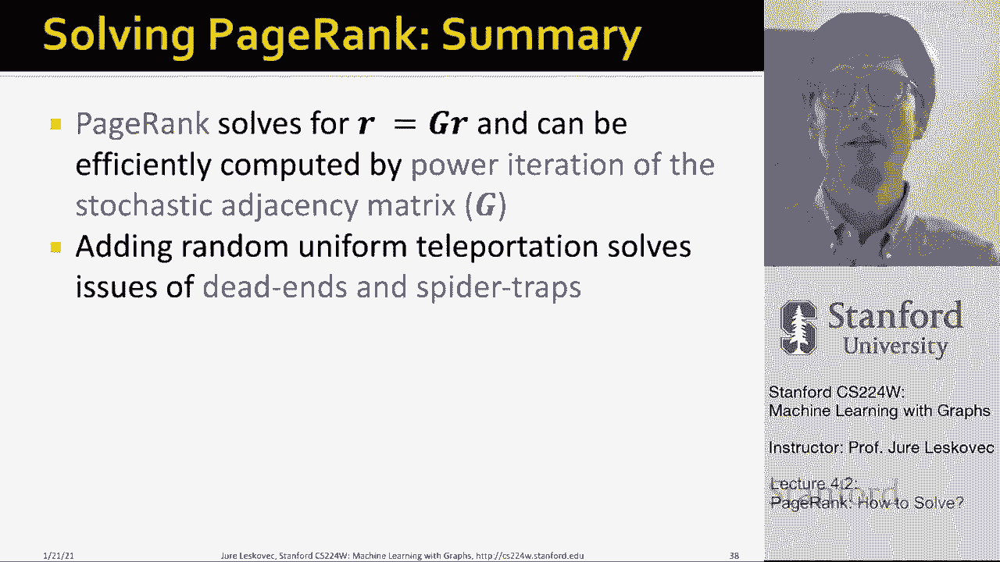

# 【双语字幕】斯坦福CS224W《图机器学习》课程(2021) by Jure Leskovec - P11：4.2 - PageRank- How to Solve？ - 爱可可-爱生活 - BV1RZ4y1c7Co

所以我接下来想说的是，我们如何解PageRank方程，我们实际上如何计算，呃，向量r。

这里的想法是使用叫做幂迭代的方法，他们想做的是我们想做以下正确的事情，给定n个节点上的图，我们想使用迭代，我们将使用一个迭代过程，呃随着时间的推移更新，我们的秩向量r，我们的想法是。

我们通过分配每个节点来开始这个过程，一些初始随机，呃，PageRank评分，然后我们将重复我们的迭代过程，直到，矢量r稳定，我们要测量它是否稳定的方法，会说，这是我们以前的估计。

现在T运行在我们算法的迭代中，我们说，这是我们以前在向量R中的估计，这是我们新的估计向量R，如果坐标，向量中的条目变化不大，它们的变化比Epsilon小，然后我们就完成了，我们要迭代的方程写在这里。

基本节点，我会说我对自己重要性的新估计是简单地对节点的估计，我指着我，呃，从上一步开始，你知道吗，将每个节点除以节点的出度，我把它们总结了一下，这就是我新的重要性，我们要重复这个，嗯，你知道有几次。

它保证会聚到，呃，到这个，呃解决方案，本质上是说，这保证会找到基础矩阵的前导特征向量，这样做的方法，我解释的是所谓的功率迭代，在那里嗯，基本上我们要做的是再写一次，以非常简单的形式，我们初始化向量r。

你知道的，让我们打电话进来，称之为初始化为乘以零，简单地说，呃，你知道吗，每个节点都有，让我们说同样的重要性，或者您可以随机分配重要性，然后我们简单地迭代，你知道吗，r等于m乘以先前r估计值的新估计值。

我们要迭代这个方程，呃足够长的时间，直到呃，以及上一轮和下一轮估计的进入方面的差异，当这些差异之和，呃是呃，小于Epsilon，再一次注意到这个方程正是这个方程，对呀，这只是用两种不同的方式写的。

但这是完全一样的事情，最后要说的是，你可以用所谓的L一范数，所以这里的绝对差之和，你也可以用，假设欧几里得范数，所以一些绝对差的平方，呃，如果你喜欢，嗯，通常需要大约50次迭代，你得计算大约50。

呃五十，你必须计算这个乘积50次才能得到这个固定分布，或者这个呃限制解决方案，所以基本上你可以通过几个呃来计算pagerank，矩阵向量乘法，呃你完蛋了，这很重要，因为你知道。

google每天都在整个网络图上计算这个pagerank，数百亿节点的权利，嗯，我知道数千亿的边缘，对呀，所以这真的真的是可伸缩的，你可以，你可以在捕捉整个Web的图表上计算它，再给你们举个例子。

功率迭代法，你知道，以不同的方式再次书写，我们的矩阵m我们的流动方程组，我要给你看的是，下面是算法的迭代，其中我们将节点重要性设置为开始时的三分之一，现在我们把它和矩阵M相乘，你知道，我们乘一次之后。

以下是新的值，我们把第二次，以下是新的值，你知道第三次，当我们不断地乘以向量r的值，然后会收敛到一个静止的，呃矢量，所以m真的等于，呃R真的等于，n乘以r um，最后的重要性是6除以15。

六个十五岁三个十五岁，所以这意味着Y和A的重要性，呃，6/15和M的重要性较低，呃，三比十五，所以嗯，这就是这就是PageRank要做的，呃，给我们，所以现在我们有了，呃，看到这些方程式。

一切看起来都很美，呃，我们需要问几个问题，所以第一个问题是这是否会聚，第二个问题是它是否会聚到我们想要的地方，第三个问题是结果合理吗，对呀，所以基本上我现在说的是创建图表，表示为这个矩阵M运行这个，呃。

呃，迭代功率迭代过程，大约五十步就会汇聚在一起，你会得到你的矢量R，所以让我们看看这个，呃再多一点，呃小心，所以事实证明，根据我到目前为止解释的，呃，有两个问题，第一个问题是有些页面是所谓的死胡同。

他们没有输出链接，事实证明，对于这样的网页，重要性，我会告诉你我的意思，然后还有第二个问题叫做呃，所有输出链接都在同一个组中的蜘蛛陷阱，蜘蛛陷阱最终吸收了所有的重要性，现在让我给你们举个例子。

你会看到发生了什么，首先是蜘蛛陷阱，呃，在这里，在这种情况下，对，我们有B的链接，然后B有一个自循环，所以如果你运行这个，嗯，在描述这个图的邻接矩阵上的幂迭代，会发生的是，最终A将有重要的零。

B将具有重要性1，如果你想到这个，为什么会发生这种情况是因为随机行者从哪里开始，你知道它会穿过这条边缘进入B，然后它就会永远停留在B中，所以真的，你知道的，再也回不去了，所以这个叫蜘蛛陷阱。

因为随机行者被困住了，最后你知道这可能是，呃，呃，所有的重要性都将是，呃，保存在B中，你可以想象这些你知道的，即使你这里有一个超级大的图表，最终随机行者会穿过这条边缘，然后永远被困在这个呃，自循环。

这就是蜘蛛陷阱的问题，然后这里是死胡同的问题，死胡同的问题是现在节点B没有外链路，这意味着什么，如果您简单地为这个图创建一个邻接矩阵，运行功率迭代，它会收敛到所有的零，直觉上，为什么会发生这种情况。

因为一旦随机行者到达节点B，随机行者无处可去，这样死胡同，这种重要性还没有归结为一个，却漏了出来，图表的呃，所以嗯，这是，呃，这是我们要解决的两个问题，嗯，你知道，解决办法是什么，解决办法是这个概念。

随机跳跃或传送，所以蜘蛛陷阱的解决方案是我们要改变随机行走的过程，有一点，所以基本上每次都说，随机行者不仅会随机选择一个链接，但也可以决定传送自己，所以让我解释一下这意味着什么。

所以我们将有一个参数beta，这将允许随机行者在概率贝塔的情况下做两个选择中的一个，你知道的，随机行者会决定并随机跟随一个链接，就像我们讨论的那样，嗯到目前为止，但概率为1负贝塔。

随机行者将跳转传送到随机页面，常见的β值通常在8。22。9之间，所以这意味着你知道如果一个随机的行者被困在蜘蛛陷阱里，它会在这里停留几步，但最终它会的它会的，它就可以直接传送出去，因为概率较小。

随机行者会说让我随机传送到一个随机页面，所以这意味着在每个网页中，从每一个节点，有一种方法可以让你把自己传送到别的地方，所以基本上随机跳到其他地方，这就是为什么现在蜘蛛陷阱不再是问题，因为你不明白。

呃被困住了，你可以随时呃跳出来，你可以随时传送，你知道苏格兰威士忌和所有你总是有点放弃你，这是一种想法，死胡同怎么样，你做的方式，这也是用传送的，基本上你说的话，如果你走进死胡同，如果你来到节点M。

你无处可去，你说什么，你要做的就是，你只是以概率一的方式传送，对呀，所以呃，你知道，为什么死胡同，问题死胡同就是问题，因为m没有输出链接，所以我们这个专栏，矩阵m列随机邻接，矩阵不是列的随机性被破坏了。

因为节点m的列和不为1，因为m没有输出链接，所以我们要做的是解决这个问题，基本上说，当你到达认识他们的时候，你可以你可以随意传送到任何你想去的地方，可以跳转到任何节点，所以这在某种意义上意味着。

现在M连接到网络中的所有其他节点，你知道吗，随机行者可以以相等的概率选择这些链接中的任何一个，这解决了死胡同的问题，它基本上消除了它们，那么为什么传送能解决这个问题呢，对为什么死胡同和蜘蛛陷阱是个问题。

为什么传送能正确地解决这两个问题，蜘蛛陷阱在某种意义上不是一个数学问题，从某种意义上说，本征，特征向量仍然定义得很好，功率迭代将收敛，从数学上来说，一切都很好。

但问题是PageRank评分不是我们想要的对吧，我们不想说，网上有一个页面很重要，嗯有所有的重要性，其他人都不重要对吧，所以这里的解决方案是添加传送，这意味着随机行者永远不会得到，呃，被困在蜘蛛陷阱里。

它会在有限的步数内将自己传送出去，这意味着Web上的所有节点现在都有一定的重要性，所以这基本上是，呃，解决我们，呃，这个特殊的问题，所以蜘蛛陷阱不是数学问题，但这是一个问题，呃，价值不是变成我们想要的。

死胡同在数学上是个问题，因为我们的矩阵M不再是列随机的，呃，我们最初的假设没有得到满足，所以功率迭代作为一种方法不是不是，呃不管用，呃，并且不收敛，所以这里的解决方案是让列成为矩阵列，通过总是传送。

当无处可去的时候，你总是随机传送，嗯，这意味着基本上相同的传送解决方案，给了我们Pagerank我们想要直观地定义它的方式，还解决了我讨论的所有这些概念的潜在数学问题，嗯定义得很好。

那么这个问题的最终解决方案或谷歌解决方案是什么，解决办法是在每一步随机步行者有两个选择，你知道它抛硬币，和一些概率贝塔，它会跟着一个出口走，随机外链，剩下的概率是跳转到随机页面。

所以现在我们的Pagerank方程是由，嗯，呃，谢尔盖和布林，um或page，把呃带回来，呃在呃，一九九八年，呃是以下内容，我们说节点J的重要性等于贝塔时间，节点i的重要性，呃，指向它，除以外度。

加一减去贝塔，1/n，所以你可以这样想，如果一个随机的，如果a，一个随机行者现在在节点J的可能性有多大，概率贝塔，它决定继续，呃，提纲，这意味着它在节点I，以某种概率r次i，它决定跟随一个外部链接。

以下节点j，你知道吗，从disub中选择正确的链接，i out链接的概率是1/d a b，这就是这里发生的事情，然后我们说，哦，随机行者也可以来到节点，通过传送1减去贝塔现在传送的概率是。

随机行者在节点J着陆的可能性有多大，节点j只是n个节点中的一个，所以它降落在特定节点的概率，j是n的一阶，这本质上是，呃，寻呼机，呃方程和迭代一个可以运行，注意这里的公式假设m没有死胡同，你能做的就是。

你可以预先处理，矩阵M去除所有死角，嗯和或或显式地遵循随机传送，其中一个结束的概率，所以这就是你如何，呃，把这个修好，但你又能看到了，这是非常快和非常简单的，呃迭代，我刚给了你这个方程，基于流动的配方。

在某种意义上，你也可以把它写成矩阵形式，你说我的新矩阵，呃，呃对，所以这应该是g=beta乘以随机矩阵m，加一减去贝塔，呃乘以呃，呃1/n，所以这是一个矩阵的随机隐形传态，这是图边上的转移矩阵。

然后你又得到了这个递推方程r=g乘以r，你可以迭代这个力量力量，迭代仍然有效，嗯，如果你问我在实践中设置的beta值应该是多少，我们假设贝塔值在8点之间，嗯和点九，也就是说你。

随机行走的人平均走五步左右，在它决定跳之前，我想说清楚，随机游走只是直觉，我们永远不会模拟随机行走对吧，在上一次讲座中，我们实际上说过让我们在这里模拟随机行走，我们不模拟随机行走，但在某种意义上。

我们认为它是无限长的，然后我们说我们实际上展示了，我们可以计算这个无限长的随机游动，通过基本上解这个递推方程，通过计算这个图变换矩阵的前导特征向量，呃，我叫，呃这里，所以随机游走只是一种直觉。

因为我们从来没有真正，我们从来没有真正呃，模拟一下，所以向你展示这是如何工作的，这是我在三个节点上的小图，这是矩阵，注意到呃，节点n是a是蜘蛛陷阱，所以我现在要做的是我还添加了这些随机的瞬移，呃链接。

所以我有这个矩阵，1/n，假设我的β值是8，现在我的新的随机转移矩阵g写在这里，点八倍，链路转换矩阵，随机跳跃的UM矩阵的加点，基本上你可以想到这一点，每个专栏都说，如果一个不。

如果随机冲浪者在给定节点，那么这是随机冲浪者要跳的概率分布，如果你把这两个加在一起，你现在得到了一个新的嗯转换矩阵，下面是你如何从转移概率的角度来考虑这一点，从某种意义上说，这些是随机行者的跃迁概率。

随机冲浪者，然后你可以乘法，呃，r与g多次，这里是R零，现在我们一遍又一遍地乘以它，你知道，经过一定次数的迭代，它要会聚了，它收敛到七除以三十三，五除以三三二一除以三。

所以这意味着这个图中的节点m将是最重要的，后面跟着Y后面跟着一个右，M之所以如此重要，是因为它有点像蜘蛛陷阱，但我们现在也可以传送出去，如果直觉上，这是，呃，你知道的，我知道他们收集了太多，重要性。

你可以增加，呃，贝塔值，节点M的重要性将，呃减少，只是为了给你一个想法，这怎么，呃，在一个更有趣的图表中，这是什么样子的，这是一个节点大小与其PageRank权重相对应的图，还有一个数字告诉你。

节点的PageRank得分是多少，你注意到了什么，比如说，为什么PageRank这么酷，很酷因为，比如说，首先注意所有节点的重要性都不是零，所以即使是这里的这些节点，嗯，没有链接的。

它们仍然有一定的重要性，因为随机跳投的人总是可以跳到他们身上，另外要注意的是，例如节点B有很多IN链接，所以这就是为什么它有很高的重要性，对了注意一下，例如，节点E有，你知道它有五个链接，六个链接。

然后呃，节点B也有六个内联，但是因为节点E从这些不重要的页面中获得了大部分的链接，它的重要性在于，你知道8对38岁的B，所以B要重要得多，因为它从这些其他节点获得链接，这些节点比这些节点更重要，呃。

蓝色小节点，嗯，另一件需要注意的事情是，比如说，节点C只有一个链路，而是因为它是从这个超级重要的节点B得到的，它的重要性也非常非常高，对，你看，例如，还有这里的e节点有一些，你知道一些重要的事情。

呃D有更少的，呃F的，它们都有同样的重要性，d和f，因为它们都从节点D得到一个链接，所以请注意这些重要性是如何微妙的，他们考虑了很多不同的因素，这一切都有道理，在某种意义上，我想要很多的链接。

我想在链接从呃，重要节点，即使我有一个链接，但有人和我有很重要的联系，这意味着我很重要，嗯，等等，等等等等，所以呃，这就是为什么Pagerank的概念如此有用，也有很多数学美，嗯嗯在它后面，它的定义。

我们可以有效地计算它，呃非常大的规模，呃图表，所以总结一下，我们讨论了如何解决Pagerank，呃分数，我们把方程r=g乘以r，这可以有效地计算，利用随机矩阵g的幂迭代。

增加统一的隐形传送解决了两个死胡同的问题。

