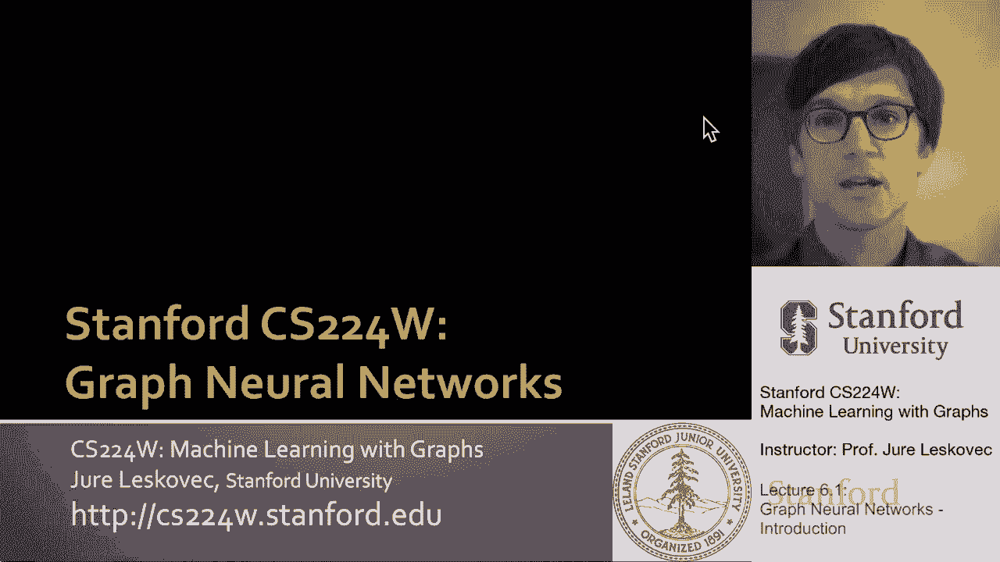
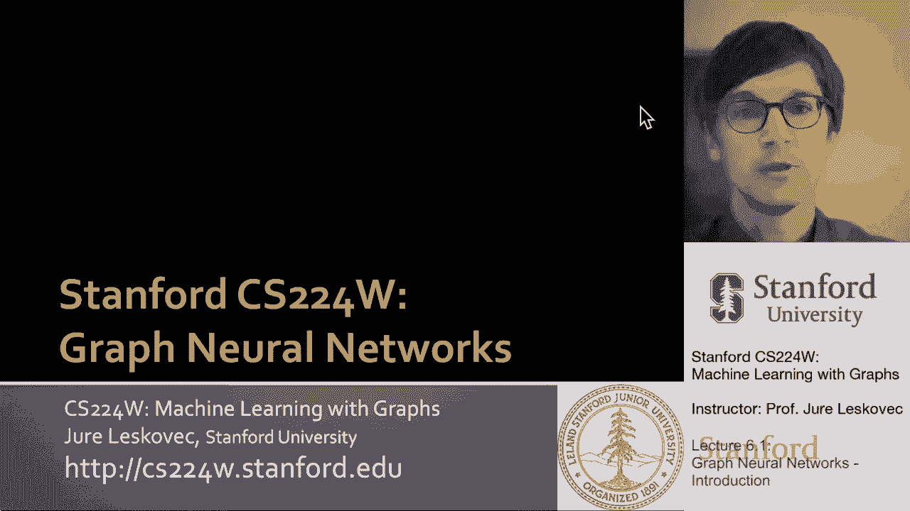
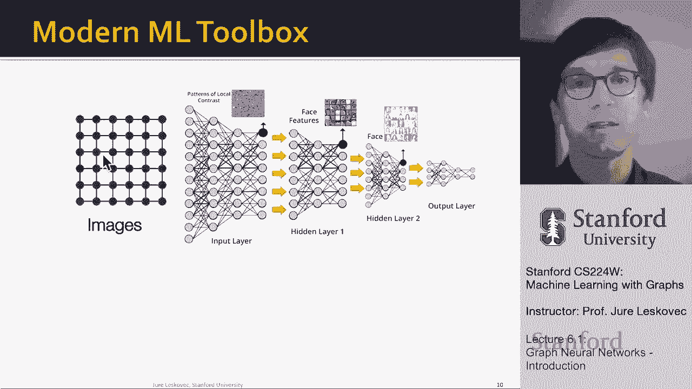

# 【双语字幕】斯坦福CS224W《图机器学习》课程(2021) by Jure Leskovec - P17：6.1 - Graph Neural Networks Introduction - 爱可可-爱生活 - BV1RZ4y1c7Co

伟大，所以呃，欢迎回到课堂，呃，我们开始了一个非常激动人心的，呃，新话题，呃，我们一直在为之建立，呃，从课程开始，所以今天我们要讲的是，呃，图形深度学习，尤其是呃，图神经网络技术。

这将是本课最核心的话题之一，我们将在接下来的两周里，呃，讨论这个然后去。

呃，更深，呃，进入这个激动人心的话题，所以我们对此的看法如下。

到目前为止，我们一直在讨论节点嵌入，我们的直觉是将图的节点映射到D，维嵌入，这样呃，图中相似的节点紧密地嵌入在一起，我们的目标是学习这个，呃，函数f取一个图并给出位置，嵌入，呃，单个节点的。

我们对此的看法，我们在这个编码器解码器框架中考虑过这个吗，我们说我们希望网络中节点的相似性，嗯在这里表示为相似，或者匹配嵌入空间中节点的相似性，在这里，通过相似性，我们可以测量距离，有很多种类型的距离。

你可以，你可以量化我们感兴趣的一种距离，是余弦距离，点积，所以我们说你知道，节点嵌入的点积必须匹配，他们在网络中的相似性概念，所以目标是给定一个输入网络，我想通过计算嵌入来对节点进行编码，这样。

如果网络中的节点相似，它们在嵌入空间上也是相似的，所以它们的相似性，嗯很高，当然，当我们谈到这个的时候，我们在定义，相似意味着什么，这意味着什么，呃，进行编码，正如我提到的。

在这个节点嵌入框架中有两个关键组件，到目前为止，我们在课堂上交谈过，所以我们的目标是将每个节点映射到一个低维向量，然后嗯，我们要对这个向量中节点的嵌入进行编码，呃，z v和呃，这是一个D维嵌入，所以呃。

你知道，d数的向量，然后呃，我们还需要指定相似性函数，它指定向量空间中的关系如何映射，到原始网络中的关系，对呀，所以我们说，嗯，你知道，这是用网络定义的相似性，这是定义的相似性，呃，就UM嵌入空间而言。

嵌入空间中的相似性计算，我们可以称之为点，呃，呃，我们可以称之为解码器，所以我们的目标是对坐标进行编码，这样当我们解码它们的时候，他们解码网络中的相似性，到目前为止，我们讨论了所谓的浅编码。

这是最简单的方法，学习编码器，基本上编码器只是一个嵌入查找，这意味着我们要学习这个矩阵z，其中每个节点都有一列，呃保留在这个矩阵中，我们解码的方式，给定节点的嵌入将简单地，基本上看这个矩阵的适当列。

然后说这是它嵌入这个商店的地方，所以这就是我们所说的浅，因为基本上我们只是记住每个节点的嵌入，或者我们直接直接学习，确定每个节点的嵌入，那么这些方法的局限性是什么，像深步行或节点到我们已经谈到的工作。

呃，到目前为止，应用这个呃，先学习节点嵌入的浅层方法，就所需的参数数量而言，这是极其昂贵的，对呀，模型具有的参数数，它必须学习的变量的数量，与网络中的节点数成正比，它基本上是节点数的d倍，这个。

出现这种情况的原因是对于每个节点，我们必须确定或学习决定其嵌入的d个参数d个值，所以嗯，这意味着呃，对于巨大的图形，参数空间将为，将是巨大的，嗯，节点之间没有参数共享，嗯在某种意义上。

每个节点都必须确定自己唯一的嵌入，所以我们需要做很多计算，然后呢，嗯，这就是所谓的呃，Transdu，嗯，这意味着在交互学习中，我们只能根据我们在训练阶段实际看到的例子做出预测，所以在这种情况下。

这意味着您不能为我们的节点生成嵌入，对于一个在训练中没有看到的节点，我们不能将嵌入从一个图转移到另一个图，因为对于每个节点的每个图，我们必须直接学习，了解嵌入培训中，然后呢，嗯，另一个重要的，呃，呃。

这种浅编码编码器的缺点，正如我所说，像深步走或呃，节点到后是它们没有合并节点特性，对呀，许多图具有附加到网络节点的特征属性，而这些方法并不，自然，呃，利用他们，所以今天我们要谈谈深图编码器。

所以我们将讨论图神经网络，这是一个深度的例子，图编码器，其中的思想是对节点嵌入的A的编码，V是基于图结构的多层非线性变换，所以基本上现在我们要真正考虑深度神经网络。

以及它们是如何通过多层非线性变换来传递信息的，想出最后的嵌入，重要的是要注意，所有这些深度编码器都可以组合在一起，在第三讲也有节点相似函数，所以我们可以说，我想学习一个编码相似函数的深度编码器，比如说。

我们用的随机游动相似度函数，在以前的讲座中，或者在这种情况下，我们实际上可以直接学习编码器，以便能够解码节点标签，这意味着我们可以直接训练这些模型，所以直觉上，我们想做的或将要做的是。

我们将开发深度神经网络，左边的输入将把图形作为一个结构，一起呃，属性，节点特征，呃，和潜在的边缘，我们将通过网络中的多层非线性变换来发送它，所以在输出的最后，我们得到，比如说，节点嵌入。

我们还可以嵌入整个子图，我们可以嵌入节点对，做出各种各样的预测，呃最后，好消息是我们能够以端到端的方式训练它，所以从标签上看，呃，在右边，一直到呃，图结构，呃，在左边，从某种意义上说，这将是一项任务。

呃，不可知论者，或者它将适用于我们能够做的许多不同的任务，呃，节点分类，我们就能做，呃，链路预测，我们将能够进行任何类型的群集社区检测，以及测量相似性，嗯还是嗯，不同图或不同子网络之间的兼容性。

所以这将使我们能够应用于这些，不同的呃，任务，那么为什么这很有趣，或者为什么很难，或者为什么它和，让我们说，古典，呃，机器学习还是经典深度学习，如果你想想经典的深度学习工具箱。

它是为简单的数据类型设计的，本质上，传统或当前的工具箱真正擅长的是什么，我们知道如何处理固定大小的矩阵，对，所以基本上我可以调整每个图像的大小，我把它表示为一个固定大小的矩阵，或者作为固定大小的网格图。

我也可以拿，比如说，正文，言语和表现，把它基本上看作是一个线性序列，作为链图，我们知道如何处理，呃真的真的很好，所以这种索赔，呃，这样做的动机是现代深度学习工具箱是为简单的数据类型设计的，意义序列。

线性序列和固定尺寸网格，当然，问题是我们如何概括，我们如何将深度学习表示学习应用于更复杂的数据类型，这就是图神经网络发挥作用的地方，因为它们允许我们将表示学习应用于更复杂的数据类型，不仅仅是这两种。

非常简单，呃，呃，呃，表示固定大小网格的数据类型，和线性序列，然后呃，为什么这很难，为什么这不是一件微不足道的事情因为网络有很多复杂性，对呀，它们有任意的大小，它们具有复杂的拓扑结构，对呀。

没有空间局部性，像网格一样，这意味着节点上也没有参考点或没有固定的顺序，这意味着在图表中没有左上角或右下角，就像在网格里一样，或者你知道没有左和右，正如您可以在文本中定义的那样，因为它是图中的一个序列。

没有参考点的概念，没有方向的概念，嗯，更有趣的是，这些图通常是动态的，有多个，分配给节点和边缘的多模态特征，所以这变得非常非常有趣因为它真的，呃，我们可以描述数据的方法。

其中我们可以在底层数据中表示底层域，因为不是所有的东西都可以表示为一个固定大小的矩阵，或者作为线性序列，正如我在一开始所展示的那样，对呀，嗯，在第一节课上，有很多域，很多用例，正确的图形表示是，呃。

