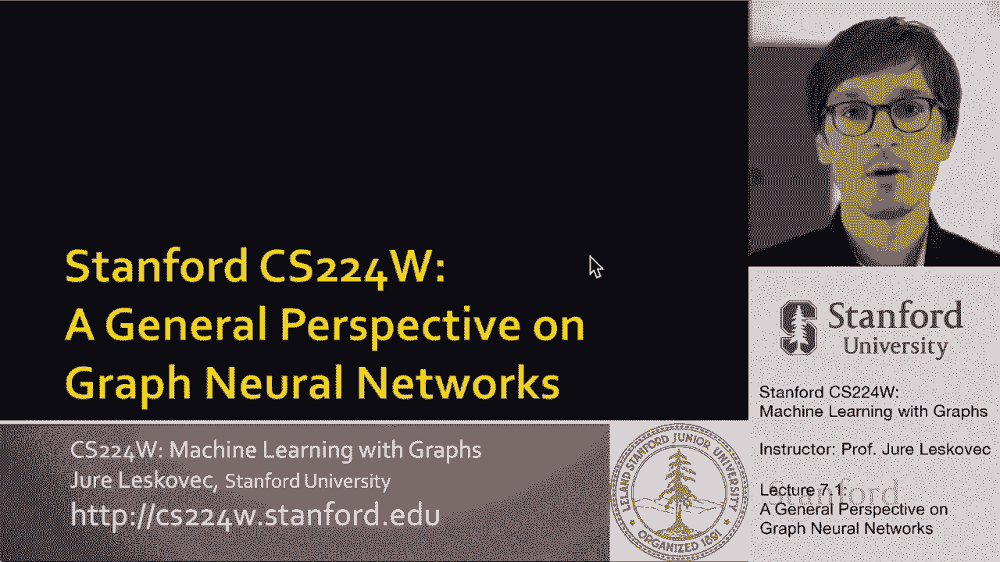
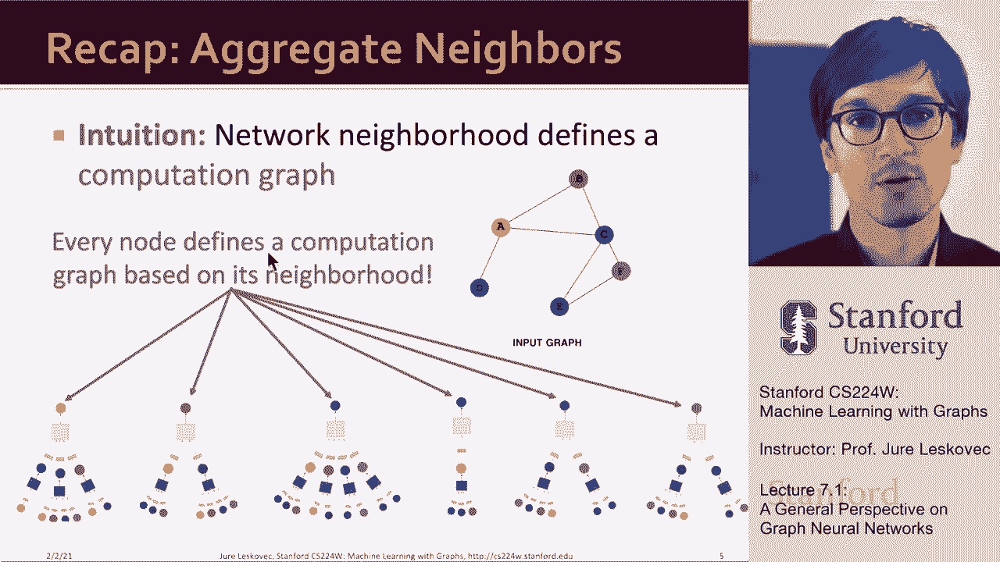
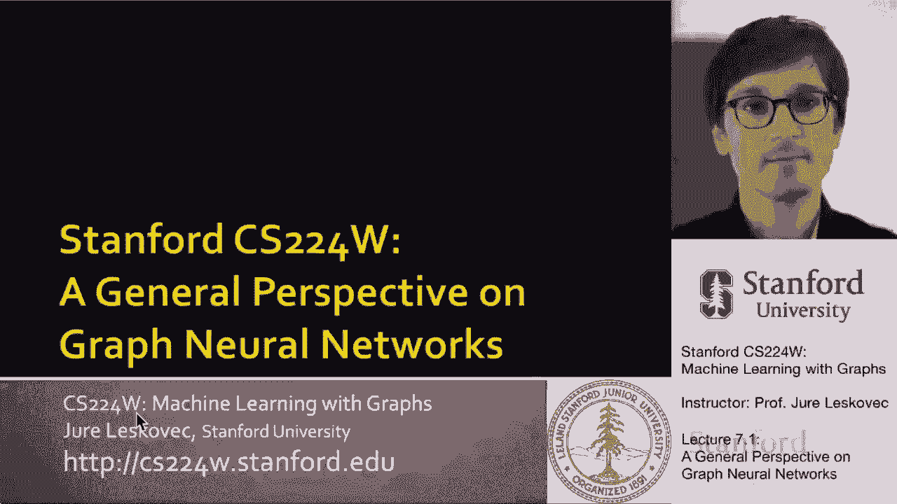
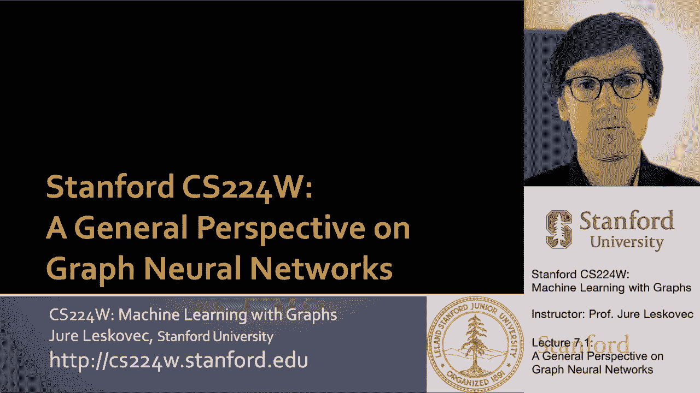
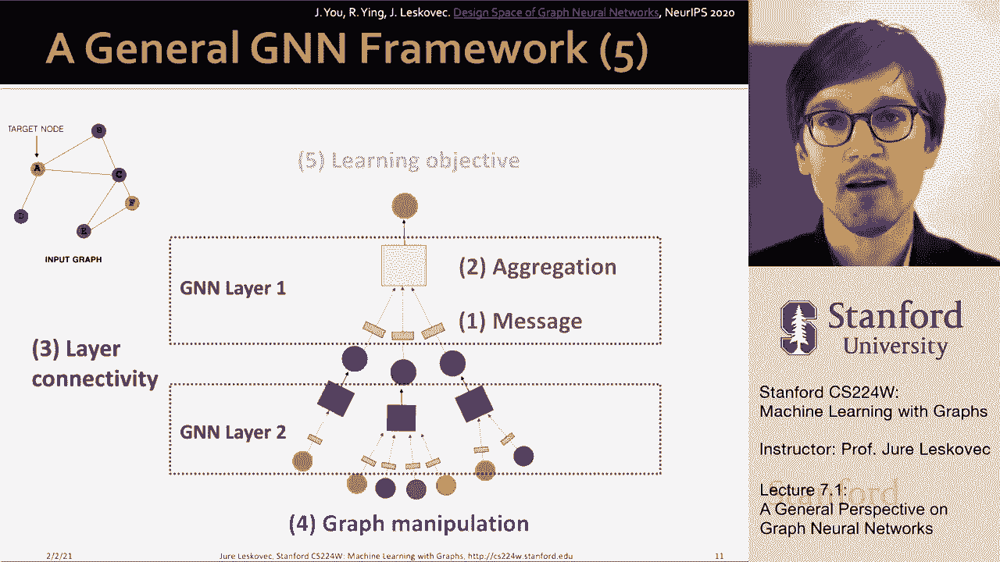

# 【双语字幕】斯坦福CS224W《图机器学习》课程(2021) by Jure Leskovec - P20：7.1 - A General Perspective on GNN - 爱可可-爱生活 - BV1RZ4y1c7Co

我们要概括一下我们所说的，上次，这将是关于概括和数学形式化呃，图神经网络，关于呃的想法。

今天的课讲的是深图编码器，并在数学上形式化它们，并向您展示设计空间，这个想法，我们有什么样的设计选择，当我们在做呃，这些类型的决定，构建这些类型的体系结构，对呀。

所以我们想要的是我们想要建立一个深度图形编码器，以图形作为输入，然后通过一系列非线性变换，这种深度神经网络产生了一组呃，可以在节点级别的预测，可以在子图的级别，节点对，嗯等等，我们上次讲的是。

我们在图上定义卷积神经网络的方法，把底层网络看作计算图，对呀，所以我们讨论的时候，如果我想对给定的呃做一个预测，网络中的节点，比如说这个红色的节点，然后首先我需要决定如何组成一个计算图。

嗯基于这个节点周围的网络邻域，然后我可以想到计算图的um，作为神经网络的图神经的结构，现在消息信息猜测，通过了，并从一个邻居到另一个邻居向中心节点聚合，这样中心节点就可以做出预测。

如何在底层网络的边缘传播和转换信息，做出预测并嵌入呃，在给定节点，所以直觉是节点聚合来自邻居的信息，利用神经网络，所以我们说网络中的每个节点都可以定义自己的多个，层神经网络，呃，结构。

这种神经网络结构依赖于，围绕感兴趣节点的图结构，例如，节点b从另外两个节点获取信息，呃，A和C，因为它们是它的邻居，呃，在网络中，呃，在这个中的转换，呃，在这个将被参数化的神经网络中。

这样我们的方法就会奏效，所以直觉是网络邻域定义了一个计算图，每个节点定义一个计算图，网络邻里，所以图中的每个节点基本上都可以得到自己的神经网络架构。

因为这些现在是不同类型的神经网络，他们有呃，不同的形状。

所以现在有了这个快速的回顾，让我们来谈谈我们通常如何定义图神经网络，它们的成分是什么，我们如何在数学上形式化。

这些组件，所以首先在这个总体框架中，我们有两个，呃，各方面，我们有一个信息的概念，我们有一个聚合的概念，和不同的架构，如GCN，图，等等，他们的不同之处在于他们如何定义聚合的概念。

以及他们如何定义这个概念，呃，消息的，所以这是第一个重要的部分，我们如何定义图神经网络的单层，它基本上是通过把信息，呃，从孩子们改造它们并聚合它们，这就是转换和聚合，是前两个核心，um操作，第二套呃。

操作是关于我们如何在图神经网络中将多层堆叠在一起，对呀，那么我们是按顺序堆叠这些层，我们是否添加跳过连接等等，所以这就是，这是第二部分，呃，方程的一部分是我们如何添加这一层，呃，组合第一层时的连通性。

呃第二层，然后最后一部分，呃，这是一个重要的设计决策就是我们如何创建计算图，对呀，我们是不是说输入图等于计算图，或者我们做任何增强，也许我们想做一些功能增强，或者我们想在这节课中再做一些图形结构操作。

我只是给你们介绍一下，在那里我将提供更多的细节，我们要深入的地方，所以这就是，那是第三个，第四个区域，这变成了，其中重要的设计决策，呃必须做出，你知道吗，什么样的目标函数，我们要用什么样的任务，对呀。

那么我们怎么训练它呢，我们是在一个有监督的无监督的目标中训练它，我们是在节点预测的层面上做的吗，边缘预测，或者整个图，um级，呃，预测任务，所以这些基本上给了你一个部分的概述，呃设计设计空间。

用于神经网络神经网络，呃，体系结构，就像我说的，首先是定义层，然后它定义了层之间的连通性，它是关于层连通性的，它是关于图形操作的，扩增，特征增强，还有呃。

所以这是五个呃。

