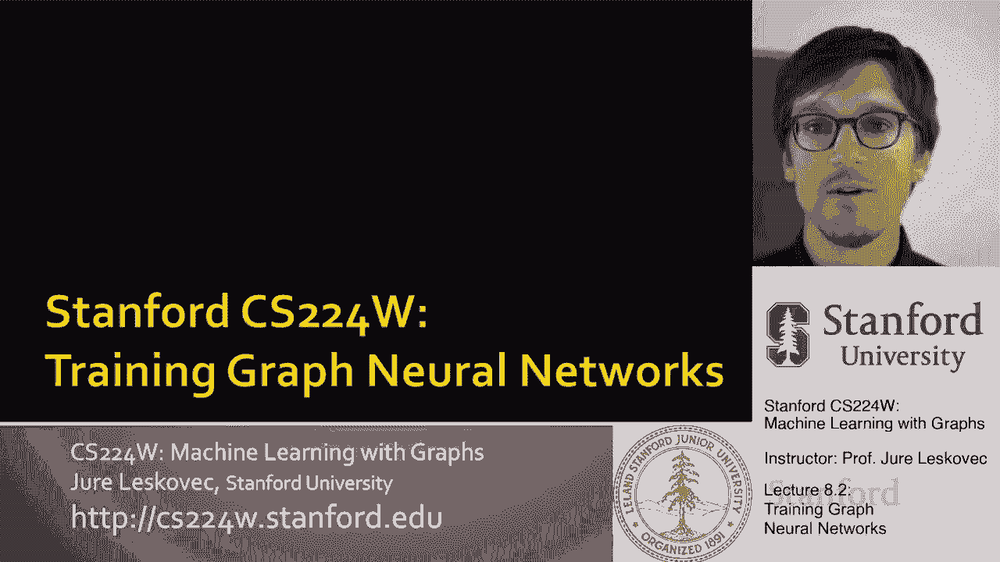
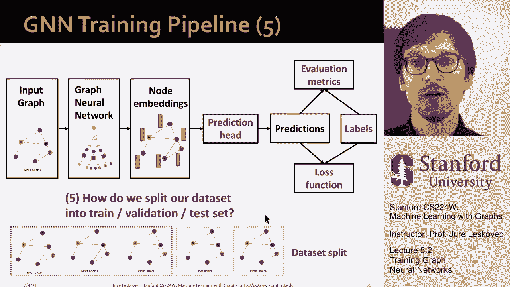

# 【双语字幕】斯坦福CS224W《图机器学习》课程(2021) by Jure Leskovec - P24：8.2 - Training Graph Neural Networks - 爱可可-爱生活 - BV1RZ4y1c7Co

我想谈谈我们如何训练，呃，图神经网络，到目前为止，我们讨论了如何增强节点的特征向量，我们如何增强图形结构，我们讨论了如何增强图形结构，通过添加边来改善消息传递，或者我们如何降低边缘来提高效率。

尤其是在自然图形社交网络中，你有高度的节点，您不想从节点的整个邻域聚合，但你要仔细地再选择，呃，要从，所以说，呃，这就是原因，呃，你为什么要做这些增强，现在我想更多地谈谈，你是怎么训练的，如何处理输出。

你如何定义，呃，损失函数。

测量性能等，所以下一次谈话是，我们如何正确地训练GNN，就像，我们想定义什么样的学习目标，我们要怎么，呃，做，呃，所有这些加在一起，所以GNN培训管道有以下内容，呃，到目前为止，我们讨论了输入图。

我们讨论了如何定义图神经网络，我们讨论了图神经网络如何产生节点嵌入，我们还没谈过的，如何从节点嵌入到实际预测，一旦你有了预测，你如何根据一些基本的真相标签来评估他们，你们怎样计算损失呢？

或者你如何定义损失？预测和真实标签之间的差异，对嗯，到目前为止我们只说，aha gnn生成一组节点嵌入，这意味着这是最后一层节点L的表示，图神经网络的L呃，我能想到这一点，如你所知，一些表示。

一些附着在网络节点上的向量，现在的问题是，你知道吗，这是怎么回事，呃，第二部分定义，我们在预测头评估矩阵方面做什么，标签从何而来，我们要优化的损失函数是什么，所以让我们先谈谈预测头，对，呃，预测头。

这意味着最终模型的g的输出，嗯可以有D，我们可以有不同的预测头，我们可以有节点级预测头，我们可以有链接级边缘级以及整个图级预测头，所以让我先说说这个，所以呃预测头，这个想法是不同的任务需要不同类型的。

呃预测输出，对呀，正如我所说，我们可以有一个完整的图形级别，单个节点级别，或者嗯边缘水平，它是一对节点之间的成对，所以对于节点级预测，我们可以使用节点嵌入直接进行预测，所以基本上经过图神经网络计算。

我们为网络中的每个节点嵌入了一个D维节点，例如，如果，你想做一个K路预测，它基本上是k个不同类别或k个不同类别之间节点的分类，嗯，这将是一种方式，或者你想倒退到十，呃对不起，k个不同的目标，不一样啊。

该节点的特性，这个想法很简单，我们只是说，嗯，你知道的，输出呃，头头，对于给定的节点只是，矩阵时间，该节点最终嵌入的时间，对呀，所以这基本上意味着w将映射节点嵌入，从这个嵌入空间到预测到预测空间到。

在这个标量的情况下，假设英国尺寸输出，因为我们对K维感兴趣，嗯嗯预测，所以K路，呃预测，还有一件事，我将在剩下的讲座中补充，我要用这个符号来表示预测值，与地面真值的关系，所以每当我用头的时候。

这意味着这是模型预测的值，然后我可以去比较Y猫和Y，其中Y是真正的真实标签，Y帽子是预计的标签现在我有了Y帽子，我可以把它和，损失，预测之间的差异，呃和真相，这是针对节点级任务的，对于边缘级任务。

我们必须使用节点嵌入对进行预测，好吧，又来了，假设我们要做一个K路预测，那么我们需要的是一个预测头，它接受一个节点和另一个节点的嵌入，并返回，呃，你现在戴帽子，Y帽子是定义在呃，节点对，例如，这将是。

为了呃，链路预测，所以让我告诉你创建这个的一些选择，嗯嗯边缘水平头，呃用于预测，所以一个选择是我们简单地连接节点的嵌入，u和v，然后再涂一个线性的呃层，线性变换对，我们已经看到了这个想法。

这个想法已经在图中注意了，对，当我们计算节点u和v之间的注意力时，我们只是简单地串联了嵌入，把它们穿过一个线性层，这给了我们，这里一对节点之间注意力得分的预测，我们可以用同样的，同样的想法。

基本上我们可以把U和V的嵌入，把它们串联起来，基本上只是把它们连接在一起然后在上面应用一个线性预测器，所以基本上把这个乘以一个矩阵，也许通过非线性或类似的东西发送，像乙状结肠或软马克斯，如果我们喜欢对。

所以呃，我的想法是，预测只是嗯，你知道它是一个线性函数，然后取嗯，u的h和v的h，把它们串联起来，嗯，向上绘制这个地图，嗯嗯到二维嵌入到一个K的方式，呃预测还是K维，呃输出另一个想法，呃。

而不是串联也是，我们可以呃，点积对，所以我们基本上说，我们在u和v之间的预测只是它们嵌入之间的点积，如果我简单地在嵌入之间做点积，然后我得到一个单量输出，所以这将是一个单向的预测。

像链接分类或链接预测是有链接还是不对，所以基本上只有一个变量，一种二进制，呃现在分类，如果我想有一个K路预测，如果我想，比如说，预测链接的类型，我有多种类型，那我基本上就会有这种，呃。

呃几乎类似于这种多帽子预测，基本上我可以有一个不同的嗯嗯嗯矩阵，那是可以训练的，嗯，我有一个为每个输出类，所以每输出一个类，我会有一个不同的矩阵，基本上你能想到的是，假设向量u。

然后它通过收缩或延伸来改变它，旋转平移，然后乘以紫外线的h，所以它仍然是点积，但是输入向量的变换是正确的每个班级都要学习自己的变换，如何基本上呃旋转，呃，平移并收缩或展开向量，这样点积，呃是是呃。

这样就可以预测，输出值，嗯是很好的嗯是很好的预测，一旦我对每个类都有了预测，我可以简单地把它们连接起来，这是我最后的预测，对呀，所以对于二进制中的k预测，总结一下，我可以定义这个矩阵w每个输出类一个。

然后学习这种呃呃线性，基于点积的呃预测器，然后呃，最后要讨论的是我们该怎么办，呃图形级别，呃预测就在这里，我们希望使用图中的所有节点嵌入来预测，一次又一次，让我们假设我们要做一个K路预测。

所以我们想要的是我们想要这个，预测头在整个图上做一个预测，所以这意味着，我们必须为每个节点进行单独的节点嵌入，并以某种方式聚合它们来找到图的嵌入，这样我们就可以做出正确的预测，所以从这个意义上来说。

uh预测图级别预测类似于GNN层中的聚合函数，对呀，我们需要聚合所有这些节点的嵌入，创建图形级别嵌入，然后做一个图层，呃预测，所以让我告诉你如何定义这个，呃图，呃预测头，有很多选择，呃我们这样做。

所以一个是做全局均值汇集，对呀，所以基本上你把所有节点的嵌入，你把它们平均一下，这是一种可能性，另一种可能性是最大池，你会带去哪里，在所有节点的嵌入中获取坐标最大值，另一个选择是基于求和的池。

您基本上只需汇总所有节点的嵌入，呃在图表中，嗯，这将取决于应用程序，根据您正在使用的图形，呃不同，呃，选项会起作用的，呃，呃好多了，你知道吗，平均池很有趣，因为节点的数量并不真正起作用。

所以如果你想比较有非常不同的图表，呃尺寸，那么也许意味着汇集是最好的选择，但如果你真的想了解图中有多少节点，图的结构是什么，然后一些基于池，呃是个更好的选择，当然还有更先进的，呃图，呃拼车，呃策略。

接下来我要给你一个想法，怎么呃，你如何改进这个，我们可能想改进这个的原因是，就是，问题是在一个大图上的全局池将使用大量信息，我想说明我的意思，这是通过这个简单的玩具例子。

你可以认为我们的节点只有一维嵌入，对呀，所以嵌入只是一个数字，想象我有两张图，在一个案例中，你知道我有这样的值，比如减去一个节点，一个有嵌入，减去一个节点2有嵌入，减去2节点3为零，你知道四有嵌入一。

五有嵌入，嗯两个，也许我有一个不同的图表，嗯，嵌入是非常不同的对吧，就像负10负20 0 10和20，好吧，我可以说看清楚，g 1和g 2有非常不同的节点嵌入，它们的结构可能非常非常不同。

但如果我做任何全球性的，一些基于池，比如说，如果我和，或者如果我取平均值，那么对于这两个，嗯嗯，我会得到同样的值，所以这意味着从图嵌入的角度来看，这两个不，这两个图将具有相同的嵌入值。

所以他们会有相同的代表性，所以我们不能区分，我们不能把他们分开，我们不能把它们分成两类，因为他们有相同的代表性，他们都有，呃，零的表示，所以这是一个问题，有点，呃，呃，一个非常简单的，呃。

一种边缘案例示例为什么要全局池，呃，很多时候会导致不满意的结果，尤其是如果图形是，呃大一点，解决这个问题的方法是进行分层池，和，分层池，这意味着我不会同时把所有的东西都聚集在一起，但我聚集了更小的群体。

然后你知道，我把几个节点聚合在一起，我现在取另一个节点子集聚合它们，我有两个集合，我进一步汇总这些，这样我就可以分层，聚合的东西，节点的子集在一起，所以让我给你一个玩具的例子。

然后我会告诉你如何做到这一点，嗯，所以假设我将使用，作为非作为非线性的整流线性单位，和作为聚合函数的求和，对，想象一下，我决定分层聚合，在某种意义上，我首先聚合前两个节点，然后我聚合了最后三个节点。

然后我聚合聚合，对呀，所以呃为了呃，图1，这会是什么样子，I的第一个加法是负1和负2，嗯，然后通过Relu传递，我得了零分，然后我把最后一个，呃三个节点，嗯，这是集合，我得到的值是三。

现在我把0和3加在一起，我得到了三分，所以这意味着这个图的嵌入，1等于3，因为我们现在研究的是G2的单维嵌入，这是我的，呃，这是我的图表，所以再一次，如果我做我，如果我做前两个节点，值将为零。

如果我做第二个，呃，最后三个节点，此聚合的值输出将为30，如果我现在进一步聚合这个，使用相同的聚合，呃功能，所以我把0和30加起来，嗯，我会得到，呃三十，所以现在这两个图有非常不同的嵌入。

一个有三个的嵌入，三十个中的另一个，所以我们现在可以区分它们，对呀，我们能够区分它们，因为它们有不同的嵌入，它们在嵌入空间中不重叠，所以这是一个想法或插图，如何分层池，呃可能会有帮助所以现在。

当然问题是，呃，我如何决定谁先告诉我聚合什么，以及如何分层聚合，以及让你在图表中很好地做到这一点的洞察力，图表往往具有所谓的社区结构，如果你想到社交网络，社交网络中有紧密联系的社区，所以这个想法是。

如果我能提前发现这些社区，然后我可以聚合里面的节点，社区变成，比如说社区嵌入，然后我可以进一步聚合社区嵌入到Super，社区嵌入等等，分层的，这将是一个策略基本上是应用所谓的社区检测。

或者图形分区算法将图形分成不同的，呃，在这里用这些不同的，呃颜色，然后在每个集群内聚合，每个社区，然后继续为每个社区创建，超级节点，这现在是社区所有成员的聚合嵌入。

然后我可以再次看到社区是如何相互联系的，聚合在此基础上得到另一个超级节点，并继续聚合，直到我得到，呃到预测头右边和呃，我说过要做的一个选择，这将是简单地应用一个图分区，图聚类社区检测。

呃算法来识别图中的簇是什么，这些紧密相连的群体是什么，然后你会知道在原始网络的水平上这样做，然后你会在第一级再次这样做，在第二级执行此操作，直到有一个超级节点，然后您可以将其输入到预测头中，有趣的是。

你可以用一种方式来做到这一点，以便您学习如何正确地划分网络，你不需要下载一些外部软件，并做出这种假设，你知道，社区很重要，你能做什么，这里有一张纸，叫做差异池，因为这是一种差分池运算符。

它允许您学习如何聚合网络中的节点，简单的想法是有两个独立的图神经网络，呃，在每个呃，这里水平，一个图神经网络将计算节点嵌入，这是标准的，我们到目前为止所说的，但聪明的是我们还将有第二个图神经网络。

它将计算节点所属的集群，我的意思是它将决定哪些节点应该属于，呃，簇，哪些节点应该聚合在一起，应该将哪些嵌入聚合在一起以创建此，呃，超级节点，最酷的是你可以训练GNN，A和B在每一级并行，因此。

这意味着您可以监督如何集群网络，以及如何聚合节点的网络，嵌入信息以提出最佳的嵌入方式，呃，底层网络，所以这是最先进的方法，你可以怎么做你可以学会分层池呃，为了让呃，好的忠实嵌入，呃，整个网络的，所以呃。

这就是我想要的，呃，呃，在这个例子中，我们已经讨论了预测头，让我们来谈谈，实际上预测，呃还有标签，所以第二个呃，我想说的是这里的这一部分，这是关于呃，预测和标签，所以嗯，我们可以大致区分有监督和无监督。

呃，在图表上学习监督学习，标签来自一些外部来源，也许，比如说，节点属于不同的类，社交网络中的用户，呃，你知道，呃，对不同的主题感兴趣，如果你有图分子，也许每一个分子，你知道，我们知道它是否有毒。

或者我们知道是怎么回事，很像，这是化学家担心的事情，对呀，这是有监督的，还有图的无监督学习的概念，其中信号，监督来自图形本身，这方面的一个例子是，例如，链路预测任务，对呀。

您要预测这里是否有一对节点连接，我们不需要任何外部信息，我们只需要，连接的节点对和未连接的节点对，嗯，有时监督和无监督的区别是模糊的，因为两者都可以表述为优化任务，在这两个方面，你仍然有监督。

只是在某些情况下监督是外部的有时监督是，内权，所以嗯，你知道吗，呃，比如说，如果你训练一个GNN，uh预测节点聚类系数，你会称之为图上的无监督学习，因为监督不是外部的，基本上是数据表明。

输入数据为您提供对模型的监督，呃，学习任务对吗，在哪里，基本上我们把未标记的数据，但仍然根据数据的结构定义监督预测任务，所以嗯，让我先谈谈监督，呃，图上的标签，所以监督标签来自特定的用例，嗯。

让我给你们举几个例子，对节点标签，你知道你可以说，哦，在引文网络中，也许是论文所属的节点的主题领域，那是我的外标，它为每个节点定义，呃，比如说，在嗯，呃，在呃，成对链路预测，呃，预测任务，比如说。

在事务网络中，嗯，我可以有Y的标签，每笔交易都告诉我这笔交易是否是欺诈性的，是的，我有一些外部实体，告诉我它验证每一笔交易，并说哪些是欺诈性的，哪些不是，所以这就是标签，到底是不是欺诈性的。

你知道对于整个图，比如说，如果我和分子一起工作，正如我所说，相似性，或者呃，呃，毒性将是外部定义的一个例子，呃，我们现在可以预测整个图的标签，对于整个，呃，分子，嗯，你知道，呃。

一个建议是把你的任务减少到节点边缘，或者一个图形，呃，标签任务，因为这些任务是标准的，很容易使用，所以嗯，这意味着有时你的机器学习建模任务会作为一个，不是作为节点分类任务或链接预测任务。

但如果你能把它表述为这三个任务之一，这意味着你可以重用很多现有的研究，你可以重用，很多现有的方法和架构，对呀，所以呃，根据这三个基本的图级任务来铸造预测任务，绝对有帮助，因为这很容易。

因为你可以依靠很多，以前的工作和以前的工作，呃研究，既然我们谈到了监督任务，让我们谈谈图上的无监督信号，嗯，这里的想法是，有时我们只有一个图表，我们没有任何外部标签，呃，学习任务正确。

所以模型还是一样的，他们仍然是损失，只是监督信号会来自输入图本身，那么这方面有什么例子呢，比如说，对于节点级任务，你可以说让我预测统计数据，例如节点聚类系数或Pagerank。

也许还有一个选择如果你研究分子分子图，也许你会说，让我预测什么类型的原子，uh是给定的节点，是氢气吗，是碳吗，嗯是氧气吗，从某种意义上说，你试图预测一些属性，该节点的某些属性，嗯，用于链路预测。

对于边缘级任务，然后说我能预测一对节点是否连接吗，对呀，我能预测是否应该有链接吗，然后再次用于图形级别的任务，我们可以想到不同的图统计，例如，我们可以说是两个同构的图，嗯，你知道什么样的图案图。

让我们呃做两个图，呃有，你可以用这个作为一种方式，呃监督，呃，在图形水平上，注意到在所有这些呃，我现在定义的任务，我们不需要任何外在的事实，呃，标签，我们只需要使用图形结构信息，什么的，um是输入，呃。

数据，所以现在我们说到，呃，呃，预测，呃和标签，现在让我们讨论损失函数，然后嗯，谈论你知道的，我会使用什么样的损失函数，测量预测和标签之间的差异，呃，这样我就可以优化这个损失函数，基本上回来了。

一直向下传播到图神经网络的参数，嗯嗯模型，所以设置如下，我们有N个数据点，每个数据点可以是单个节点，单独的图或单独的边，所以对于节点级别的预测会说啊哈，每个节点，呃有个结，我有标签，呃。

这是边缘水平的预测标签，我们说每一条边，呃有一个，每个潜在的边，有一个标签，我们将预测标签标签可能是，这个边到底有没有，也许是边缘的类型，不管是不是欺诈，等等，同样，最后一个右边，图级，我指的是这个。

作为g，你知道，对于每个图，我们有真正的标签，真实值与预测值的对比，我将用这个符号y hat和y来表示预测，呃对预测，呃，预测值和真实值，我将省略上标，对不起，下标，所以这基本上是指。

我们正在讨论的预测特定预测任务，因为最后y只是一个输出，我现在可以处理这些输出并比较Y帽和Y帽，所以呃，一个重要的区别是，我们在做分类吗，还是我们在做回归，分类意味着标签，y，呃有离散的分类，呃。

价值观正确，嗯，那就是，你知道用户喜欢什么主题，在回归过程中，我们预测的是连续值，你不想预测一个分子的药物相似性，或分子的毒性水平，对呀，二元预测将是，或者分类是，到底有没有毒，回归将预测毒性水平。

gnns可以应用于这两个设置，分类和回归，区别将是分类之间，回归本质上是在损失函数中，评估指标中的，所以让我先告诉你分类损失，最流行的分类损失叫做交叉熵，我们已经在第六课讲过了，基本上的想法是。

如果我对第i个数据点做k路预测，那么呃，真实标签与预测标签之间的交叉熵，Y帽子只是一个总和，嗯，呃，所有这些K个不同的类，第i个数据点在该类上的y值，乘以日志，呃预测呃，类值和Y帽。

你可以解释为一种概率，嗯，它的基本工作方式是说下面的权利，你可以想象我的，呃，为什么是，呃像这样，所以这是一个二进制向量，它告诉我，假设节点属于第三类，所以这是一个热门的标签编码。

然后你知道Y帽现在是一个矢量，呃分配，也许我们可以应用我们应用SoftMax，所以这意味着所有这个条目的和都是1，现在你可以解释为，y，这个想法是，如果你正确地看这个方程，因为预测的概率，概率总和为1。

我们想要的是，只要有，呃，真正的类不是，在这里我们希望有很高的概率，因为零乘以任何东西都是零，所以我们想要，呃它，呃，我们想要呃，概率，呃在这里很低，因为记录近于零的东西会给我一个很高的负值。

但如果我把它乘以零，没关系，所以我想呃，在这里预测低数字，但只要值为1，我想预测一个大概率，因为在这里我会乘以1，但是接近一个的东西的日志是，呃是零，所以交叉熵损失，这种情况下的差异将很小，所以基本上。

这个损失将迫使类的预测值转移到其他类，不属于i的那个数据点的值很低，它属于什么阶级，它会迫使它有很高的价值，就是这个想法，因为如果这是一个，我希望第二学期越小越好，我让它变小的方式。

就是让它尽可能接近一个，好的，记住这些条目必须和为1，这是在单个数据点定义的损失，所以总损失只是所有数据点的总和，然后交叉熵，每个单独数据点的呃损失，所以这是在分类损失方面，呃，最流行的回归损失，嗯。

什么是标准损失叫做均方误差，或，或，呃等价也称为DL二损失，和，本质上我们正在做的，我们在说，嗯哼，如果我有一个K路预测任务，我试图预测给定节点的k个实值，我只是把所有的K加起来，我把真实价值和。

减去预测值，我平方，所以这将永远是积极的，基本上这个想法是对的，损失将取最小的值，当Y和Y帽尽可能对齐时，所以当这些差异尽可能小时，我们喜欢取二次损失的原因是，因为它很光滑，它是连续的，呃。

很容易去掉导数，嗯，总是积极的，嗯，很多很好的，呃属性，所以再一次，这是一个损失，均方误差损失，在一对上在一对上，在一个数据点上，现在结束，如果我有N个训练例子，然后我简单地总结了单个数据点的损失。

这就是现在整个数据集的损失，所以这是在分类和回归损失方面，还有其他的损失，我们喜欢用，比如说，有一些损失叫做最大保证金损失，这是非常有用的，如果你不在乎，嗯，预测二元值或回归，但你关心节点排序。

也许您想根据某个值对节点进行排序，这个想法是，你关心的是节点被正确地排序，你不太关心他们有什么确切的价值，你想知道谁是前k个节点，在这种情况下，你会使用某种基于三重的损失，称为。

因为您希望强制一个节点排名更高，那么呃，然后另一个节点，或者您将使用，嗯，某种最大的利润，呃类型损失，既然我们谈到了损失函数，呃，我们也来谈谈，呃，评价指标，所以对于评估指标，嗯，我们如何评估回归。

我们通常计算所谓的，呃，均方误差，定义的方式又是，它是预测值与真值之差的平方，你你，你取平均值，所以你除以数据点的总数，然后取平方根，所以这有点类似于，呃，到L二，你优化的损失，这就是现在，呃。

如何报告业绩，呃，你的模型，你也可以做意味着绝对误差，现在你只需要把绝对差异除以，按数据点数，嗯，如果你调查，我学习，所以SCIKIT，学习我们所有人在课堂上都将使用的Python包，有很多不同的，呃。

度量，呃已经，呃，在那里和这里实现，我只是给你，呃，两个最常见的，呃，你可以，呃，什么是非常标准的报告方式，就是所谓的分类精度，基本上你只是说我预测的次数，呃变量，呃，预测类与真类匹配。

你说我有多少次正确地预测了班级啊，这是一个很好的度量，如果你的课程是关于平衡的，平衡的意思是我知道一半的数据点是正的，一半是负的，如果你有非常不平衡的班级，想象你只有百分之一，呃，呃积极，呃类，呃。

数据点和99%是负的，那么准确性的问题是，只要预测就很容易获得高精度，呃，一直是负类，对呀，所以如果我，例如，如果我，嗯，如果我有我说是交易的情况，欺诈与否，假设百分之九十九的交易是非欺诈性的。

然后我的我的我可以得到非常高的准确率99%，如果我的分类器总是说，呃，非欺诈性，对呀，所以这就是准确性的问题，如果类是不平衡的，那么琐碎分类器可能有很高的，嗯，所以呃，得到更多，更深入地处理这些问题。

嗯，还有其他指标对这个决定更敏感，我们该怎么办，我们所说的积极，我们称之为消极的是什么，因为模型通常会输出，假设值在零到一之间的概率，我们必须决定阈值，说超过这个阈值的一切都是正的，门槛以下的一切。

呃是阴性的，嗯和嗯嗯，精确召回类型度量，呃呃，是这样做的一个例子，嗯，还有呃岩石AOC，所以接收器工作特性下的区域，我也要，呃讨论和谈论，所以首先，如果你想知道的不仅仅是准确性，那么你可以定义的是。

什么叫混淆矩阵，你基本上说，啊哈，预测值是多少，预测到了吗，正的或负的，与实际情况的对比，真正的价值是正的还是负的，然后你可以数出有多少例子，每个数据点在多少，呃，在这四个细胞中的每一个。

就在你正确预测负面的时候，你你做，这里加一个，当你正确预测，呃积极，你在这里加一个，因为预测了一场真正的比赛，然后你可以做两个，被称为假阳性的错误类型，这些是呃，你预测积极的例子，但它们实际上是负面的。

然后你也有假阴性，哪里呃，你预测负面，但这门课实际上是积极的，所以呃，准确性是真正的积极因素，加真负数除以所有负数之和，所以这个就在这里，是数据点的数量，精确度，它在所有的人中都被称为，嗯，他说。

有多少真正的积极因素，我用真阳性和假阳性来规范这一点，所以精确说在所有积极的预测中，我做了其中的一部分是真的，然后回忆说，嗯，它又说，真正的积极因素，但我除以真阳性和假阴性，对呀。

所以我基本上是说在所有积极的方面，呃，数据集中的示例，我到底预测了多少，对呀，所以回忆说在数据集中的所有积极因素中，我预测了多少积极的，精度超出了预测的积极的，有多少人实际上是积极的。

然后你可以把精度和回忆结合成一个单一的度量，这就是所谓的呃F一分，定义为两倍精度乘以召回除以精度，加召回，这个公式是精度和召回率的调和平均值，这就是为什么，呃，呃，它是这样定义的。

这是精度的调和平均值或调和平均值，回忆一下文本挖掘中的信息检索，人们喜欢用一个分数，呃很多，然后最后一个呃，我想说的评估指标是摇滚Auc，所以基本上是接收机工作特性或接收机工作特性曲线。

这衡量了真实阳性率和，所谓的假阳性率，嗯，真正的阳性率是真正的回忆，和假阳性率除以假阳性，除以假阳性，加真，呃，底片，你通常写的方式是你你你你画真正的积极，假阳性率与真阳性率，这个评估矩阵来自。

你基本上使用的药物，而不是把它想象成谁是谁，我知道，谁病了还是没病，或者你可以把它想象成，当你根据患病风险对人们进行分类时，现在你可以想象，呃，问啊哈，我要前两名，前三名前四名，你问，上衣有多好。

有多好，前K名候选人有多干净，因为这个分类阈值决定了谁什么，什么点是正的，什么点是负的，在某种意义上是武断的，有趣的是，如果你呃，采取积极和消极的例子，并随机排序，然后你会得到这个，呃。

真阳性率与假阳性率，它将是一条直线，所以随机分类会给你一条直线，然后嗯，如果你比随机分类做得更好，那么呃，这个呃，这条线会越来越接近，呃，这个顶角，所以如果这是一个完美的分类，基本上它会立即上升。

然后保持平坦，所以人们喜欢用的指标，表征分类器性能的是ROC曲线下的面积，对呀，所以随机分类器，分类器将具有点五的面积，因为它覆盖了这个正方形的一半，一个完美的分类器会有一个区域，一个的。

所以岩石A U C是这个下面的区域，呃箭头C曲线，这个，呃，这叫做奥洛克曲线，面积越高，分类器越好，呃，在随机分类器上有一个点五的面积，所以点五不好，五点不好，基本上是随机的，一个直觉。

AOC下面的区域做了什么，呃，ROC曲线告诉我，它告诉我如果你选择两个，随机的一个正点和一个负点，正点比负点排名高的概率是多少，所以如果是一个，这意味着你给出了一个完美的分类，所有的正点都排在上面。

所有的底片，如果你随机分类，那么正数高于负数的概率是一半，因为呃，这是随机的，对呀，所以嗯，这是关于A U C的一个直觉，呃，曲线，所以嗯，我们今天已经讨论了训练管道，呃大概呃，我们如何定义预测头。

我们讨论了评估指标，我们讨论了标签是从哪里来的，我们讨论了损失函数，我们接下来要讲的，呃，下周是，我们实际上要谈论的是，你如何设置培训，你是怎么训练的，如何设置数据集，如何在测试评估之间拆分数据。

和训练数据集，能够做到，呃，高效，呃。

训练和得到呃。

