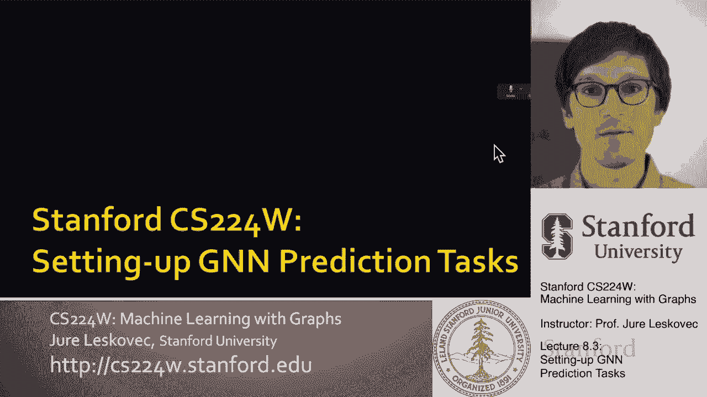
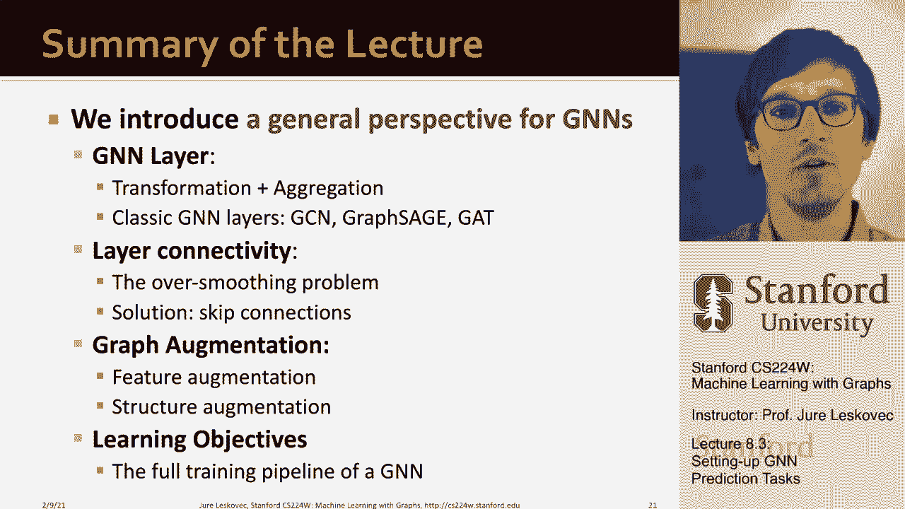

# 【双语字幕】斯坦福CS224W《图机器学习》课程(2021) by Jure Leskovec - P25：8.3 - Setting up GNN Prediction Tasks - 爱可可-爱生活 - BV1RZ4y1c7Co

欢迎大家，呃，回到课堂上，呃，超级兴奋，呃，今天和大家谈谈，嗯，我们要讨论的是，嗯，几个非常有趣的话题，呃首先我们要完成，呃，上一节课没有完成的部分，然后我们要深入研究，图神经网络，所以让我们先谈谈呃。

我们上次结束的地方，上次我们讲到如何设计图神经网络，你会做出什么样的设计选择，然后呃，你如何设置整个，我们称之为训练推理管道，我们讨论了如何设置输入图，如何定义图神经网络架构。

然后如何使用它来创建节点嵌入，然后我们也谈到了，如何从节点嵌入到预测头，我们讨论了基于节点分类链路预测的不同预测头，以及图形分类，我们讨论了如何做出预测，你如何将这些预测与地面真相标签进行比较。

以优化损失函数，并能够进行反向传播，一直到图形，神经网络结构，然后我们还讨论了各种评估指标，你可以用呃来评估，估计数，呃，你的模型的性能，还有一件事，未回答是呃，我们如何设置任务。

我们如何正确地划分为培训验证，呃，和测试集，我想说的是，呃，在演讲的这一部分是解决这个问题，如何拆分数据集，我们的图形数据集转换为列车验证和测试集，所以嗯，我们有两个选择，嗯，当我们拆分数据集时。

我们就可以，呃，一次拆分我们的数据集，并称之为固定拆分，基本上我们想把一个数据集分成三个，我们想要一套训练设备，我们将用来优化GNN模型参数，我们将使用一个验证集，我们可以用它来调整超参数。

以及各种常数和决策选择，嗯，就呃而言，建模体系结构，一旦基本上使用训练集和验证集，我们最终的模型，超参数的最终最终值，不同设计尺寸的最终值，呃，一直被拿出来的，我们只用它来报告最终，呃，性能。

这是一个公平的评估方式，因为我们使用训练和验证来建立模型，然后我们修复模型，并将其应用于此，呃，从来没有碰过，呃，测试集和我们预，呃，我们报告，呃，我们的表演，嗯，图形中有趣的是，呃。

有时我们不能保证测试集真的会被拿出来，意思是不会有信息泄露，从训练和验证集到测试集，这就是为什么这变得有趣，所以这是一个固定的分裂，一旦我们创建了固定的分裂，我们实际上可以使它成为随机的。

这意味着我们可以随机地将我们的数据分成训练，验证和测试集，然后我们可以报告，而不是一个单一的分裂，我们可以报告不同情况下的平均性能，让我们叫他们，呃，随机分裂，所以一个是创造分裂并永远与之合作。

另一个是制造分裂，但这种分裂的一个组成部分是有一些随机性，然后我们可以尝试许多不同的分裂实例化，并报告平均值，呃，提供更多，呃，健壮，呃，结果，所以嗯，你知道的，为什么分裂图，特殊um，想象一下。

如果您有图像数据集或文档数据集，那么在这样的数据集中，你假设呃，呃，彼此，所以这意味着，每个数据点，这里有一个图像和呃，很容易把它们分成训练测试，呃，和审定，呃，集合，没有漏水。

因为每个图像都是一个数据点，呃，靠自己，嗯，分裂一个图是不同的，这个图的问题是节点是相互连接的，例如，在节点分类中，每个数据点现在都是一个节点，节点实际上是，呃，连接的，呃，在一起，意思是你知道。

比如说，在这种情况下，如果我看第五节点，为了预测第五个节点，它会以图形的形式，神经网络还从节点收集信息，呃一和二，所以这意味着呃，节点，嗯一和嗯二，嗯会影响，呃，节点五的预测。

所以如果1和2是训练数据集，五是测试数据集，那么很明显我们有一些，UM信息，呃，渗漏，所以呃，这就是为什么这很有趣，那么问题是，嗯，我们有什么选择，我们能做什么，呃，我们能做什么，嗯。

我们可以做以下操作，第一个解决办法是做什么，我们称之为换向设置，其中可以观察到输入图，或者呃，对于所有数据集拆分，所以基本上我们将使用相同的图结构来进行训练验证，然后呃，测试集，我们只会拆分节点。

节点标签，这意味着我们将保持图形结构原样，但是我们要在训练测试中加入一些节点，然后呃，确认，嗯设置，所以我们只是分开，呃，节点标签，这意味着在训练时我们计算节点的嵌入，让我们说一个和两个。

因为它们是我们的训练集，嗯，使用整个图，但只有一个和两个的标签，在验证时，我们计算整个图的嵌入，只在，呃，呃，节点三和节点四的标签，因为我们有数据，呃对他们来说，所以这将是一个可能的，呃接近呃做这件事。

另一种方法是我们所说的归纳设置，我们把裂口之间的边缘折成，所以现在我们有，在我们的情况下这意味着我们会把这些，呃虚线边缘，所以现在我们有三个不同的图，我们可以称一个为训练图，验证图，嗯和一个测试图，嗯。

所以这意味着当我们现在制作，让我们假设一个预测，呃，在关于节点五的测试集中，我们没有受到影响，呃在，呃预测，呃根据标签，或者来自节点一的信息的结构，所以这意味着在训练的时候，我们只在图上计算嵌入。

嗯而且只有，呃，并使用一和二的标签，在验证时，我们使用图计算嵌入，在第三和第四节点上，呃三和四，当然，这种方法的问题是现在我有，我扔掉了不少边缘，相当多的图形信息，如果我的图很小，这不是，呃首选。

所以这种权衡要么，我有一些结构性信息泄露，培训验证和测试集，或在归纳设置中，我其实得把边缘扔掉，然后跑啊，或者评估，在那些碎片上，所以在解决方案中，在传输中，输入图可以是，呃观察到，呃，为了所有人，呃。

数据集拆分，培训验证和测试，嗯，然后呃，这是呃，这很有趣，因为嗯，它允许我们基本上在这个环境中操作，你也可以认为是半监督设置，其中给出了图，呃，给出了所有节点的边，给出了所有节点的特征，但是标签。

但是节点的标签只是节点标签的子集，呃被观察到，所以呃，在换向设置中总结，我们有培训测试和验证，分裂，呃，都在同一个图上，其中数据由一个连通图组成，整个图形都可以观察到，呃，呃，在所有的数据拆分中。

所以它意味着所有的节点，所有的边缘和所有的节点特征，但我们只把，呃，标签的意思是呃，观察到一些标签，其他标签标签未被观察到，这个uh设置既适用于节点预测，呃，以及边缘类，边缘预测任务，感应设置。

即训练验证和测试集在不同的图表上，我们只观察图形结构，呃，节点功能以及呃，让我们说，节点标签，呃，在分裂中，这让我们可以真正测试，我们如何推广到看不见的图，的，这种方法的缺点是。

我们必须把原始的图表切成许多，呃，不同的，呃，小，呃，碎片，呃，这样我们就扔掉了一些呃，图形信息，这是这里的节点分类，我给你举个例子，在换向分类方面，是简单的分裂呃，节点转化为训练，呃，验证和测试集。

嗯，在感应设置中，呃，我们基本上可以假设我们有多个不同的图，嗯给定，我们可以，嗯，呃，把一些图表放入训练集，验证和测试集中的其他，如果我们没有多个图，我们必须通过去掉边缘来创建多个图形。

或者切掉它们之间的边缘，这样我们就得到了这些呃，不同的呃，连接元件，然后把他们放在训练测试中，呃，和审定，呃，集合，既然我们已经讨论了节点分类，让我们切换，让我们进入下一个分类任务。

也就是图分类中的图分类，呃，在归纳设置中定义良好，我们可以简单地将它们分成训练验证集和测试集，所以基本上我们在训练集中放了一些图表，一些在验证集中，一些在测试集中，很容易把它们分开，没有相声。

没有信息泄露，嗯，而这是可以做到的，也许嗯，所有设置中最棘手的，呃，嗯，链路预测的目标是预测缺失的边缘，设置链接预测需要一点思考，这可能很棘手，因为链路预测是一种无监督的，我们需要创建标签和数据拆分。

呃我们自己，所以这意味着我们需要对GNN隐藏一些边缘，让GNN预测现有的边缘，所以这个想法是，比如说，如果我有原始图表，我得隐藏几个边缘，比如说，这两个红色的边，所以我说这是输入。

我希望我的GNN能够预测这两个，呃输出，呃边缘向右，所以从某种意义上说，我们必须去掉一些边缘，把它们藏起来，试图，呃预测他们，这很有趣，它创造了更多的复杂性，因为嗯，在GNN中，我们有两种类型的边。

我们将有消息传递边缘，GNN可以用来创建嵌入的边缘，然后我们会有这些，我们所说的监督边缘，这些边缘是，我们的训练，呃，数据集，所以对于呃，链路预测，我们需要把边缘分两次，在第一步中。

我们为原始图分配两种类型的边，正如我所说，有些边我们称之为消息传递边，它们是用于GNN操作的边缘，然后我们也称之为监督边缘，这些是我们计算目标函数损失的边，功能，模型的性能等，嗯，在第一步之后。

只有信息边缘会留在图表中监督边缘是，用于监督的边缘，呃，边缘预测，呃由模特做的，并且不会被使用，呃，由GNN，嗯，这是第一步，然后在第二步我们把边缘分成训练测试和验证集，我们有两个选择。

一种是做所谓的归纳链路预测分裂，你知道我们假设我们有一个有三个图表的数据集，每一次分裂都是，所以我们会有一套训练设备，我们将有一个验证集和一个测试集，三个不同的图，每个图都会有一个不同的。

在训练方面有分歧，验证和测试边缘，这就是信息传递的边缘和监督的边缘，在第二个验证图中，你知道我们会有不同的，UM监督边缘和不同消息乘客边缘，然后在测试集中，呃一样，所以这是呃，这样做的一种方法。

另一种方法是在，呃，换向设置，如果我们做换向链路预测分裂，嗯，这通常是默认值，当人们谈论链接预测时假设我们只有一个输入图，我们在这里面要做的，呃，一个输入图，根据定义，的转导，呃，整个图形都可以观察到。

呃，对于所有数据集拆分，但是因为边都是，呃，部分图形结构与监督，我们要坚持住，呃，验证和测试边缘，然后训练训练集，我们要进一步把监督的棱角，呃，在训练集上，所以现在让我向你展示如何做到这一点，所以呃。

用于翻译链接预测，链路预测，我们就拿原图，我们将创建一个训练数据集，在那里我们会有几个训练边缘，嗯，用于消息传递以及监督边缘，在验证时，我们将使用训练边缘和训练信息传递边缘和训练监督边缘。

能够预测验证边缘，然后在测试时我们将使用训练信息边缘，训练监督边缘和验证边缘来预测测试边缘，所以现在你可以看到训练时间是如何，图形更稀疏，但我们必须预测验证边缘，在最后的测试中我们可以看到所有的边缘。

但是测试边缘，我们需要预测测试边缘，所以在这里你可以看到，基本上这些呃，集合彼此嵌套，所以嗯，为什么我们要使用越来越多的边因为考虑到这一点，如果是如果图形随着时间的推移而演变，那么你可以说。

在早期的某个时候，这是图表，然后它通过添加这个边缘来生长，这就是图表，它又增加了一条边，以此类推，等等，所以你可以把它想象成沿着，呃，呃，呃，三三两两，嗯时间，呃，间隔，这也许是定义，呃，链路预测，呃。

在图表上，所以总结一下，翻译链接，预测，分裂有点，嗯嗯，呃，很棘手，因为我们需要把原始图表，基本上有四种类型的边缘训练消息传递边缘，培训监督边缘，验证边，还有呃，测试边缘，嗯，我们有很好的，呃。

即使你知道这可能有点麻烦，分头行动，这让我们可以做，呃做，把事情做好，因为我们有呃，好工具，意思是深度快照和图形健身房让我们做到这一点，呃对我们来说是免费的，所以呃，总结一下，我们。

我们谈到了整个GNN培训管道，从评价指标，损失函数，标签，还有呃，预测，这些是你可以使用的一些工具，让你可以首尾相接地管理这个，呃，时尚，所以总结一下，呃，我们说过，嗯，GNN层，我们如何定义它。

我们讨论了如何将不同的GNN层堆叠在一起，然后我们还谈到了图的增强，从特征增强和图结构增强的角度来看，我说的话，呃，目标，然后呃，我们如何设置不同的。

呃。

