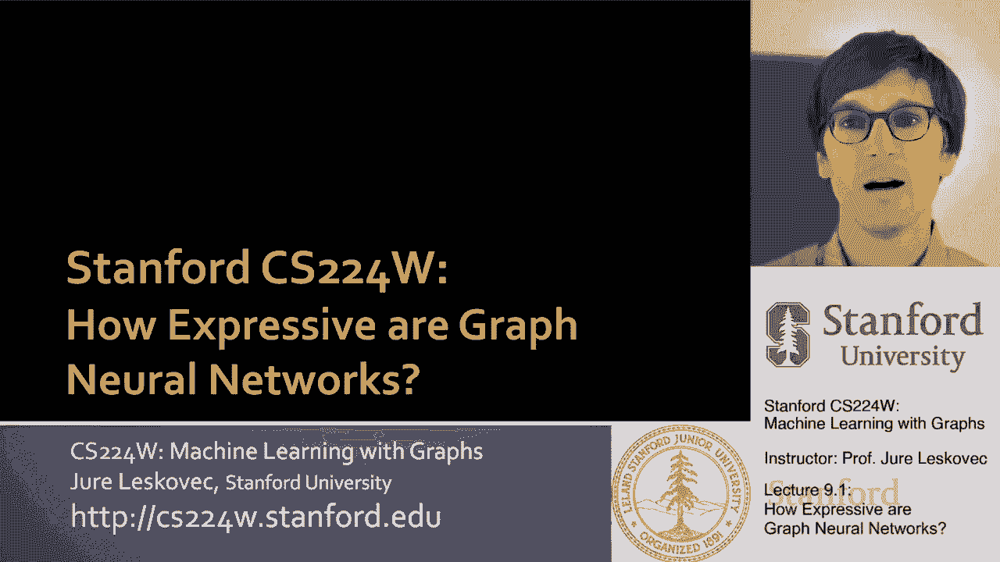
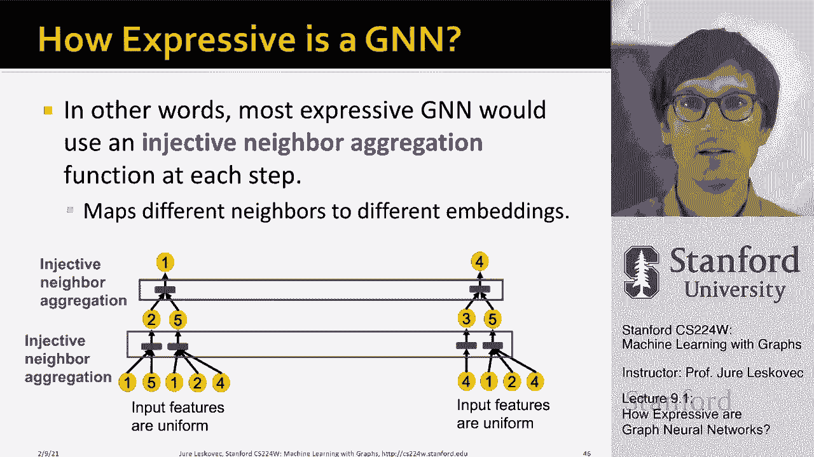

# 【双语字幕】斯坦福CS224W《图机器学习》课程(2021) by Jure Leskovec - P26：9.1 - How Expressive are Graph Neural Networks - 爱可可-爱生活 - BV1RZ4y1c7Co

所以现在我们正在换挡，我们谈论的是图神经网络理论，我们特别要问自己，图神经网络有多有表现力，图神经网络能学习什么，他们不是什么，呃能够学习，呃。

这真的是呃，的问题，呃，讲座的这一部分，所以我们说深度，呃，神经网络应用于图中，通过多层非线性传播，我们正试图提出节点的嵌入，呃，网络嵌入，呃，所以我们可以做各种各样的机器学习，呃预测任务，关键是。

图神经网络有这个想法，聚集当地社区，呃周围，呃，生成嵌入的给定感兴趣节点，呃那个结节，对呀，所以这是我们一直在展示的经典图片，呃，好几次，在我们的讨论中，呃，到目前为止，嗯对。

所以直觉是节点聚合来自邻居的信息，利用神经网络，到目前为止，我们讨论了在决定时你有什么样的设计选择，呃，如何操作，或者如何设计这个，呃，消息转换与聚合，呃操作，所以今天我们要讲的是图神经网络的理论。

特别是我们要问的是图神经网络有多强大，他们有多有表现力他们能学到什么，有什么是他们学不到的呢，这一点尤其重要，因为有许多不同的，呃GNN模型，对呀，我们谈到了GCN图卷积神经网络。

我们谈到了图形注意力网络，我们谈到了图圣人网络，我们讨论了这些类型模型的整个设计空间，嗯，所以问题是他们的表达能力是什么，这基本上意味着他们区分不同节点的能力是什么，不同的图结构。

以及它们在学习不同类型的模式时有多大的表现力，然后什么会超级酷，今天，我们将能够设计出最大表现力的GNN模型，所以从某种意义上说，我们将能够设计出最强大的图神经网络，有嗯，这是呃，超级酷，所以这就是。

计划是这样的，背景是我们有很多图神经网络模型，他们都有不同的，它们的繁殖方式不同，聚合转化，呃，留言嗯嗯，问题是我们能理解他们的表达能力是什么吗，以及这些不同的设计选择实际上是如何，呃导致不同的。

呃类型的，呃，呃模特所以，例如在图形中，呃卷积神经网络，gcn，它使用所谓的均值池，对呀，所以基本上当我们聚合信息时，呃，从邻居那里，我们使用元素平均池，嗯，然后我们用线性变换，正加RL非线性，例如。

什么是GCN，比如说，图形鼠尾草，嗯，使用，呃，多层感知器，加上呃，元素方面，假设最大池，呃，这是呃，这是不同的，问题是什么更好，比平均水平好，或者呃，什么是，这两者有什么区别？在这方面，假设理论性质。

呃，和表现力，嗯，有一个重要的笔记，我想我想做，所以呃，我们以后就不会糊涂了，在图神经网络中，我们有两个方面，我们有节点特征方面，节点属性，我们有图形结构方面，为了这次演讲的目的。

我将用节点的颜色来表示它们的特征向量，我这么说是什么意思，如果两个节点颜色相同，然后它们有相同的特征向量，它们具有相同的特征表示，对呀，例如，在这个图中，数字表示节点ID，所以我可以说我说的是节点一。

我说的是节点二，嗯，但是这些节点的特性都是一样的，所以没有特征信息可以让我区分，节点之间的，好吧，所以我们不意味着颜色，节点的特征向量是什么，所以现在，比如说。

问题是GNN能在多大程度上区分不同的图形结构，因为如果每个节点都有自己独特的特征向量，这样就很容易区分节点了，你只要看看它们的特征向量，但是如果所有的特征向量都是一样的，在本例中，所有节点都是黄色的。

那么问题是，你还能区分节点吗，你能了解到你知道节点五和节点五不同吗，呃四，比如说，在这种情况下，所以在图神经网络中，我们对局部邻域结构的概念特别感兴趣，基本上。

我们感兴趣的是量化每个节点周围的本地网络邻居，呃，在图中，比如说，这里，假设我对节点一和节点五感兴趣，我说我能学会区分1号和5号节点吗，把它们区分开来，相当容易，因为他们有不同的，呃，邻域结构。

即使你看每一个相邻的边的数量，你知道节点1是二级节点5是三级节点，所以嗯，很容易区分它们，如果你能在图神经网络中捕捉节点的度，然后您可以区分节点，呃，一和五，现在让我们看第二个例子，节点怎么样，呃。

他们能区分一和四吗，如果你从单曲来看，嗯，呃，呃，层单跳邻域，那么节点一的度数是二，节点四的度数是二，所以如果我只能捕捉节点本身的程度，我不能区分一个和两个对吧，它们有相同的特征向量，它们有相同的度。

然而，一个和两个仍然是不同的，因为如果我看着，假设是二度邻域，你可以说，啊哈，一号节点，两个两个邻居，一个是二级，一个是三级，而节点四也有两个邻居，但一个是一级的，另一个是三级的。

所以如果我能捕捉到节点四的度数，节点本身的，加上邻居的度数，那么一和四是可以区分的，因为呃，他们的邻居有不同的程度，对呀，所以现在你知道，立即两个两个两个节点看起来一样，但是如果你深入到这里的网络中。

我去找邻居，然后两个节点就可以区分了，这非常有趣，现在让我们继续这个研究，看看另一对节点，让我们看看节点，呃，一二，有趣的是，一和二实际上，嗯在这个图中，这个网络中的神经是无法区分的。

因为它们在图中是对称的，对呀，他们都是二级，他们的邻居，嗯，2。他们有两个邻居，呃，一个是二级的，一个是三级的，嗯，如果你去第二跳社区，这是呃，节点四，呃，二级的，所以基本上那里的网络邻居是相同的。

不管我们探索网络有多深或多远，因为在这两种情况下，你知道他们都有，每个都有一个二级节点，二跳邻域上的一个三度节点，嗯，它们都有一个二级邻居，三跳远，2。他们有一个一级邻居，所以你分不清一个和两个。

除非有人给你一些特征信息，让你区分一个和两个，但是基于图形结构，你无法区分它们，因为它们有点对称，它们的位置是同构的，呃，在右图中，所以这是一个例子，试图建立直觉，这怎么，呃，都会，呃锻炼。

所以我们想要的关键问题是，呃看看，GNN节点嵌入能区分不同的局部邻域结构吗，对呀，给定节点周围的局部意义邻域结构，如果可以，问题是什么时候，如果不能，图神经网络的失败案例有哪些，那么我们接下来要做的。

我们需要了解GNN是如何捕捉局部邻域结构的，我们将通过计算图的这个关键概念来理解这一点，所以现在让我谈谈，呃，什么是计算图，你的想法是每一层，呃，a gnn总量，呃，邻接嵌入，所以在GNN中，呃。

我们通过定义在节点邻域结构上的计算图生成嵌入，例如，如果我说这里是节点一，计算图，让我们说，如果我为节点1做一个两层gnn，在这里创建，对吗，节点一聚合来自节点二和节点五的信息，这里是第五节点。

节点五聚合来自其邻居的信息，呃5号有邻居1号2号和4号，这里的节点二聚合了来自邻居的信息，节点一和节点五，这就是我们所说的计算图，它只是向我们展示了消息是如何从级别聚合的，呃，从0级到1级再到2级。

这是描述两层图神经网络的计算图，呃节点呃节点标识一，这就是这里的想法，有趣的是，现在如果我以，结点我结点，二号，我为自己创建一个计算图，呃就在这里，来自节点一和节点五的两个聚合，又是五个，呃。

1 2和4和节点1从2和5聚合，对呀，你注意到的是，节点一和节点二的计算图实际上是相同的，他们都有两个一级的孩子，你知道一个有两个，一个有一个有三个，呃在水平上，呃，零，这意味着gnn只是在传递信息。

没有任何节点ID，它只使用节点特征向量，这意味着如果你观察这些传播，你就知道，呃树，这些计算图现在是不同的，因为你说，哦，很明显，这里是第一个节点，这是第二个节点，所以很明显这些树是不同的。

但如果你只看颜色，如果只查看节点特性信息，这就是这些树看起来一模一样的样子，而且没有办法区分节点彼此，所以在所有情况下，图神经网络所能做的一切都可以聚合，你知道这些节点的信息，都是黄色的。

在这里它可以聚合黄色，所以它所能做的，就是说，哦，我有三个黄色的孩子，这家伙可以说我有两个黄色的孩子，然后这里我们可以说，啊哈，你知道吗，我有两个孩子，其中一个有两个，另一个有三个，呃，进一步的儿童。

这就是我们如何描述这个计算图，但关键是对于两个不同的节点，一二，计算图相同，所以没有任何特征信息，没有任何节点属性信息，呃，这两个，这两个节点，这两个计算图是一样的，所以说。

这两个节点将被嵌入到嵌入空间中的同一点中，这意味着它们将重叠，所以图神经网络不能，呃，来区分它们，并且不能将节点一划分为与节点二不同的类别，因为它们的嵌入将完全相同，它们会重叠，因为计算图是一样的。

也没有什么可区分的，呃，节点特征信息，因为这是我们的假设，呃进去，所以如果有这堂课的重要幻灯片，这是最重要的幻灯片是，基本上我们通过计算图捕捉局部邻域结构，如果两个节点的计算图相同，然后呢。

两个节点将完全嵌入到同一点，在嵌入空间中，这意味着我们不能把一个归类为一个类别，把另一个变成另一个，因为他们是一样的，它们是重叠的，所以我们无法区分，呃，他们之间，这意味着总结一下，在这个简单的例子中。

gnn将为节点1和节点2生成相同的嵌入，因为两个事实，首先是因为计算图是相同的，它们是一模一样的，第二个重要的部分是节点特征信息在这种情况下是相同的，对吗，所有节点，本讲座的假设是节点特征不有用。

在这种情况下，所以所有节点都有相同的特性，它们都是黄色的，对吧，因为gnn不关心节点ID，它关心的是属性，节点的特征并将其聚合，这意味着这个gnn不能区分节点一和节点二，所以1和2总是有完全相同的嵌入。

所以他们总是被归入同一个班级，否则他们将被分配，呃，同样的标签，哪个嗯，有趣的是，然后呃，现在看来，呃，相当，呃，相当令人生畏，有一点，令人失望，我们这么快就找到了一个角落的案子。

图神经网络的一个失败案例，他们基本上不能，呃，区分节点，我想在这里说的重要一点是，总的来说，不同的局部邻域定义不同的计算图，对所以呃，下面是计算图，呃，对于不同的节点，这些是节点一和节点二的计算图，呃。

节点计算图，呃，三和四，以及计算图，呃，对于节点五，所以现在我们已经知道我们将无法区分一个和两个，因为它们有相同的计算图，那是那是一些，那是生活的事实，我们能做的不多，但问题仍然是三加四还是三加五。

图神经网络能区分这些节点吗，因为很明显他们有不同的计算图，所以也许图神经网络能够记住，或者捕获计算图的结构，这意味着节点3和节点4将得到不同的嵌入，因为他们的计算图不同，对，那是，在某种意义上。

大问题对吧，所以基本上我是什么，重点是，关键是，计算图与每个节点周围的根子树结构相同，对呀，所以我们可以想到这个有根的子树，因为它定义了周围邻域的拓扑结构，呃。

每个节点和两个节点将能够在最好的情况下区分它们，如果它们有不同的根子树结构，如果它们有不同的计算图，当然啦，也许我们的图神经网络太不完美了，它甚至无法区分具有不同计算图的节点。

这意味着这些根树的结构是不同的，我们接下来要看的是在你知道的情况下，2和3能区分吗，在什么情况下两个和三个会被简单地归类为同一个，呃，嵌入，在这个右边继续，gnns节点嵌入捕获根子树结构。

他们基本上想捕捉计算图的图的结构，给定节点周围的网络邻域的，最有可能表达的图形神经网络会映射不同的呃，将子树根植到不同的节点嵌入中，呃这里，比如说，用不同的呃颜色来表示，对呀，所以一二。

因为它们有完全相同的计算图，完全相同的特征将映射到相同的点，以目前图神经网络的定义，我们对此无能为力，嗯，但例如，节点，呃，三个，四和五，它们没有相同的计算图结构，所以它们应该被映射到不同的呃。

右嵌入空间中的点，所以最具表现力的图神经网络基本上能够学习或捕捉，计算图的结构是什么，并基于计算图的结构，为每个计算图分配不同的嵌入，嗯，这是一个前提呃，那个呃，我们在这里做的。

所以我们希望确保如果两个节点有不同的计算图，然后它们被映射到嵌入空间中的不同点，问题是绘制神经网络，呃，有一个重要的数学概念可以让我们，呃，在理解方面取得进一步进展。

图神经网络是否可以将两个不同的计算图带到不同的，um根子树，并将它们映射到嵌入空间中的不同点，有一个概念，呃，或者定义什么是函数，和一个从域x映射的函数，呃，如果它将不同的元素映射到不同的输出中。

那么基本上意味着f保留了输入的信息，对呀，这意味着无论你得到什么输入，你总是把它们映射到不同的点或不同的输出，意思是，比如说，并不是说两个和三个会碰撞，你会给出同样的输出。

所以每个输入都映射到不同的输出，这是函数的定义，我们会，这是一个非常重要的概念，因为我们将使用它，呃，在讲座的其余部分，呃，相当沉重，所以我们想知道图神经网络有多有表现力。

最有表现力的图神经网络应该映射这些子树，这些呃，单射到节点嵌入的计算图，这意味着对于每一个不同的子树，我们应该把它映射到嵌入空间中的另一个点，如果这个映射不是单射的，意味着两个不同的输入。

两个不同的子树映射到同一个点，嗯，这不是呃，那是呃，问题，所以我们想展示这个图表，其中不同的子树被映射到不同的点，呃，在嵌入空间中，所以关键的观察，呃，这将使我们取得进展，相同深度的树可以递归地表征。

呃，从叶节点，呃，到根节点，所以我的意思是，如果我们能够区分树的一个层次，然后我们可以递归地，呃，拿着这些，并将它们聚集在一起，形成对这棵树的独特描述，所以我的意思是，比如说，嗯。

你可以简单地通过子树的数量来描述树的特征，每个节点都有权利，例如，在这里你可以说啊哈，在较低级别，一个节点有三个邻居，三个孩子，另一个节点有两个子节点，嗯，然后你可以说啊哈，然后节点，呃，呃，的。

根部有，呃已经，呃已经，呃，还有两个孩子，所以我可以通过说，啊哈嗯，你知道，呃，我们有两个邻居在零级，我们有三个邻居在零级，然后呃，我们有，呃，两个邻居，呃，职等，呃，在第一级，当，比如说。

对于这个特定的计算图，我在这里有一个孩子，这里有三个三个孩子，然后这里有两个孩子，所以这个描述和那个描述不一样，所以这意味着我可以分开，嗯或者区分这两者，这两个不同的，呃，呃树，重要的是树可以逐级分解。

所以如果我能捕捉到树的一个层次的结构，也许甚至只是这个水平，然后我可以递归地这样做，呃，逐级，所以我的意思是嗯，我们只需要专注于，我们如何描述这个计算图的一个层次，或者围绕给定节点的根子树，呃感兴趣。

所以嗯，让我们继续思考并解决这个问题，所以如果gnn聚合过程的每一步都能完全保留邻域信息，意思是有多少孩子，呃，给定节点的邻居，那么呃，生成的节点嵌入可以区分不同的，呃子树结构，对呀，如果我能说，嗯。

在第一级，在一棵树上，我有两个孩子在另一个，我有三个，如果我能捕捉到这些信息，并一直传播到节点一，在另一棵树上，我可以捕捉到一个，呃，一个节点有一个子节点，另一个节点有，呃，三个孩子，一次又一次。

我可以把这些信息一直保留到顶层，那么很明显，儿童人数，嗯是不同的，所以这两个，呃，这两棵树，呃，我们能够，呃，把他们区分开来，所以重点是，从某种意义上说，我们是否能够从孩子们那里收集信息。

并以某种方式存储这些信息，这样当我们把它传递给树中的父级时，这些信息呃被保留，在这种情况下，2号和3号被保留的信息，一直到树根，那是，呃，这个问题，呃，我们想回答，所以其他的话，我们要做的是，我们想说。

最具表现力的图形，神经网络将对每一步使用单射邻域聚合，对于计算图的每一层或计算图的每一层，所以这意味着它会映射不同的，对呀，所以我们希望能够捕捉第一级儿童的数量，或者一级零级抱歉。

然后聚合这种保留这些信息，因为我们把它推上树，这样树就知道有多少孩子，它的每一个，嗯，它的每一个，呃，呃，内部节点，呃有，所以说，这就是本质上的想法。

所以到目前为止的总结如下，生成节点，嵌入，gnn，使用计算图，它对应于每个节点周围的根子树结构，所以如果我有一个节点，我有一个计算图的概念，这只是一个有根的子树结构，它描述了这个节点周围的局部邻域结构。

然后是不同的根子树，不同的计算图将是可区分的，如果我们使用单射邻域聚合，这意味着我们能够区分不同的子树，GNN可以，正如我们将要看到的，嗯，gnns可以在各个级别上完全区分不同的子树结构，它的邻域聚合。

这意味着它对孩子的聚合是单射的，这意味着没有信息，呃迷路了，这样我们就可以完全描述，计算图和区分一个计算图，呃。

