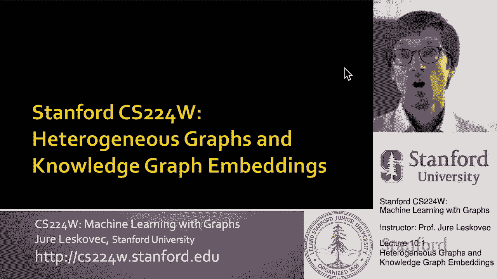
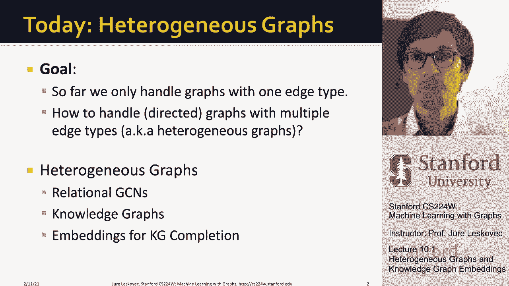
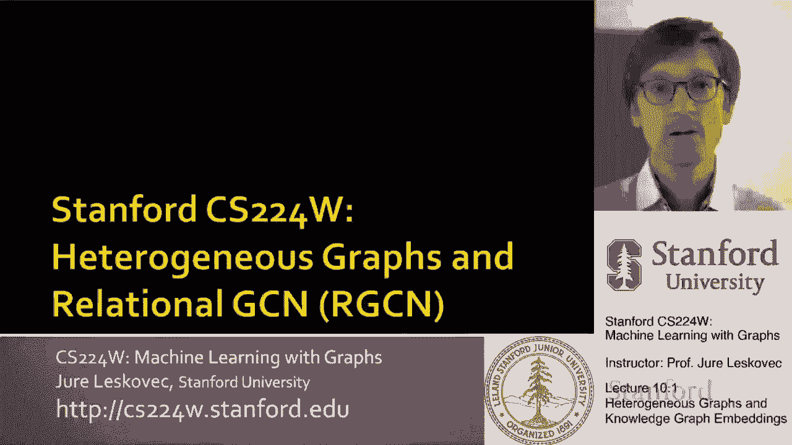
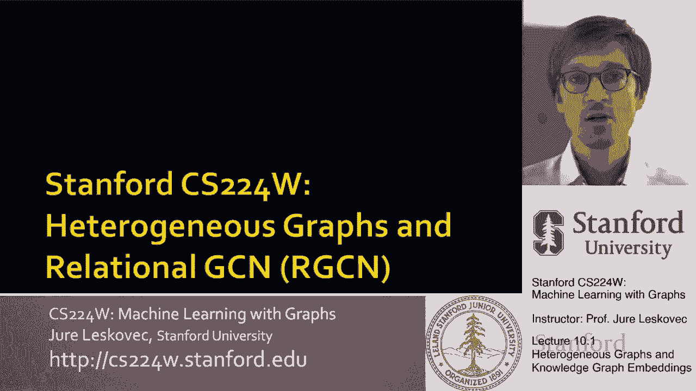
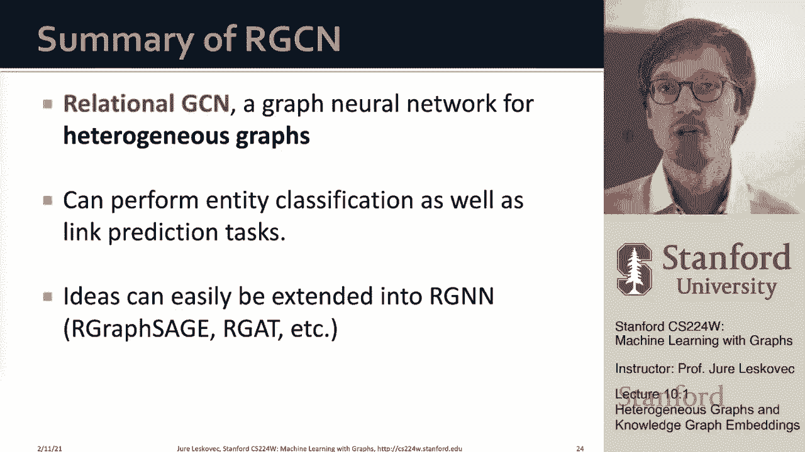

# 【双语字幕】斯坦福CS224W《图机器学习》课程(2021) by Jure Leskovec - P28：10.1-Heterogeneous & Knowledge Graph Embedding - 爱可可-爱生活 - BV1RZ4y1c7Co

所以今天我们要讨论，异构图和呃知识图嵌入，特别是我们将专注于完成知识图的方法。

今天的话题首先是，一个叫做异构图的概念，基本上到目前为止，在我们的课程中，我们一直在处理只有一个边缘类型和一个节点类型的图，我们刚才说有节点和边，你知道节点是用边连接的，所以现在的问题是。

我们如何处理图形，具有多种类型uh连接的有向无向图，多种类型的节点，它们之间的多种类型的链接，这就是异构图的概念，异构，和异质的边缘集，我们今天要讲的是，在第一部分是讨论呃。

关心不同边缘类型的关系gcn，不同关系类型，然后我们会更具体地讨论知识图。

这是一类异构图，嗯，我们如何做知识图嵌入，我们如何做一个非常常见的任务，这就是所谓的知识图完成，所以让我们从呃开始。

异构图和讨论关系gcn，所以关系图卷积。

神经网络，所以异构图是由四重定义的，由一组节点定义，呃，我们叫他们V，呃，节点可以有不同的类型，它是由一组连接呃的边定义的，不同的节点，每条边都有一个不同的，呃，呃关系类型。

所以这意味着Edge现在是三倍，也就是说节点I连接到节点J，呃通过关系呃R，然后每个节点都是不同类型的，我可以通过以下方式获得节点的类型，呃，通过调查这件事，呃功能或设置，所以基本上我有节点和边。

其中每个节点都用类型标记，每个关系都有一个类型，那么异构图的一些例子是什么，一个很常见的例子是在生物医学领域，在那里你基本上可以把不同的生物医学实体，嗯，然后它们之间的关系，并将其表示为一个异构图。

例如，在这种情况下，我会有不同的节点类型，我会有疾病，我会有，我会有蛋白质，我会有不同的边缘类型，这是这些之间不同类型的关系，呃不同类型的实体，然后你知道节点的一个例子，这里可能是疾病，呃偏头痛。

然后我也有一个不同的呃优势，例如，一种特定的药物治疗一种特定的药物，呃疾病，然后嗯，你知道这怎么能，然后我可以在他们之间有不同类型的关系，相似的原因，呃呃等等，等等，这是一个例子。

有不同类型实体的异构图，嗯和不同的嗯类型，呃，他们之间的关系，您还可以将事件图视为异构图的另一个示例，我可以有不同类型的节点，不同类型的实体，例如，节点类型，可能是一次飞行，我可以有不同的边缘类型。

它将是飞行的目的地，然后我可以让你知道，目的地是不同的机场，就像SFO一样，建立不同类型的关系，呃在这些之间，呃不同的实体，这是呃，异构图的另一个示例，所以现在如果我们得到这种类型的图。

我们有不同类型的节点和它们之间不同类型的关系，那么我们希望我们的模型能够处理这种异质性，在某种意义上，利用它，招待呃，治疗疾病的特定药物与特定蛋白质的关系是不同的，与他人互动，呃蛋白质，所以嗯。

我们要怎么做，我们实际上要扩展我们的嗯gcn，图卷积神经网络，能够处理不同类型的关系，我们称之为关系，呃gcn，嗯，我们会到目前为止，我们定义呃，关于一种关系类型和一种节点类型的gcn，在简单的图形上。

现在我们想把它扩展到，呃，更复杂的异构图，嗯，我想解释的方式，这是第一个提醒你关于GCN的，然后就会变得很自然，我们如何扩展它，所以呃，当你思考图表时的第一个问题，神经网络是，你知道，我们怎么。

一个GCN如何，呃操作，以及它如何更新给定的表示形式，呃，目标节点，呃在图表中，我们通过这个概念讨论了这些，呃，对于给定的目标节点，消息传递和计算图，让我们说一个，这里是它对应的，呃，计算图。

其中每个节点从其邻居获得信息，注意，也许在以前的课程中，我们讨论了无向图，这里，现在图形是有向的，所以每个节点，沿着边缘的方向收集信息，所以A从B、C和D获得信息，但例如，呃节点b，即使它嗯。

它有两个相邻的边，它只从C收集信息，因为c指向它，b指向a，所以这就是为什么，比如说，这里的图结构，计算图结构，呃是这样的，所以这就是你现在可以，呃，考虑到，呃，关系，呃，现在的边缘，呃，我们拥有的。

呃提醒我们自己，呃，呃，如何在有向图上展开图神经网络，然后我们讨论了什么定义图神经网络的单层，我们定义了一个消息的概念，其中每个节点都在计算，呃，消息传来，呃，呃，从它的，呃，孩子们和这条信息，呃。

取决于，呃，都在它的上一个级别的消息上，嗯还有邻居，呃，它在以前的水平上，然后这些消息的聚合方式，节点V基本上会接受这些转换后的消息，呃，从每个孩子那里，并以某种方式聚合它。

将其与自己的消息结合并产生消息，呃，或者节点的嵌入，呃，在下一个层次，为了在特征转换方面增加表现力，不是在捕捉图形结构方面，但是在捕捉特征方面，呃，变换，呃，然后我们还可以添加非线性激活函数。

如乙状结肠，呃，Relu，等等，嗯和嗯，这就是我们对，呃，图神经网络现在回到GCN，在gcn的单层中，用以下公式定义，对呀，它基本上是一个节点，越过它的邻居，u取节点的前一层表示，由，呃，父母，呃。

在程度上，总结他们，转换它们并通过非线性发送它们，所以呃，这是什么意思，就是，呃，你能想到的方式，就是我们的gcn的聚合，是一种平均池类型的运算符，因为这里的求和和归一化，然后消息转换很简单，呃，线性。

呃，转化，那么如果我们有多个关系类型会发生什么，对呀，如果我有一个有多种类型关系的图呢，我表示这一点的方式是，我将使用不同颜色的边缘，嗯，你知道在这里我给他们贴上了R一R二R三的标签，它基本上说，啊哈。

a和b按关系r r 1连接，当你知道，呃，b和c，呃是由呃关系联系在一起的，嗯R三，所以那是呃，方式呃，我们现在要考虑输入图，我们现在可以将gcn推广到，这种异构图就是使用不同的网络变换，不同神经网络。

对于不同的关系类型，uh加权不同的神经网络参数，所以这意味着当我们做关系转换时，当我们在进行消息转换时，我们不会对每个进入的边应用相同的矩阵w，但是我们要应用一个不同的矩阵w，取决于是否，嗯。

我们正在考虑的关系是什么样的，所以如果我们有三种不同的关系类型，我们将使用三种不同类型的呃W矩阵，一个给亲戚一个，一个给呃，关系三，现在如果我看看神经网络是如何，呃计算图，节点A看起来像。

现在有什么不同，这些转换消息转换运算符，这些WS现在有了与它们相关联的颜色，所以这意味着来自，让我们说，节点b，从节点D到节点A的消息将使用相同的运算符进行转换，相同的w。

因为消息沿着关系类型r-1传播，而，比如说，来自节点C的消息，uh与节点A连接，带有uh，关系r 2将用不同的变换算子进行变换，红色的那个，红色的是为，r二，所以在这里你可以看到，你看到区别了，例如。

嗯，这意味着现在我们要怎么写，我们有这些变换矩阵w，它们也是索引的，呃按关系类型，对呀，所以在关系gcn中，我们写出消息传播和聚合的方式如下，我们基本上说嗯，计算L加1级节点V的消息。

我们将对每一种关系类型的所有关系类型进行求和，你要看的是，谁是邻居，呃的呃，根据这种关系类型R连接到节点V的节点V，然后我们要把变换矩阵，关系r，接收呃的信息，从邻居那里，都是，呃，邻居。

根据这种关系类型R连接到V的你，我们也要去，然后从上一层嵌入节点V，呃，然后嗯，这里重要的区别是W以前只是不同，一层一层，现在这里发生的是，我们对每一层都有w，对每一个关系，所以呃。

另一件我没有解释的事情是什么是C呃Sub VR，这只是一个规范化节点，在程度上比起那种关系，所以基本上是进来的人数，给定类型R与节点的关系，这是一个图神经网络，它仍然是我可以写出来，基本上。

给定的呃的每个邻居，一个给定节点v变换它的uh，它的前一层根据矩阵W嵌入，但现在每个呃都在变化，基于呃u和v之间的关系类型，你知道我们在这里转换信息，呃，从上一层的节点V，从上一层嵌入到消息中。

呃为了上一层，然后聚合还是，简单的求和，对呀，我们拿着这个，基于邻居的嵌入，从上一层开始，其中转换是特定于关系的，以及节点自己从上一层嵌入，呃，改造过的，我们把所有这些加在一起得到嵌入，呃，在下一层。

所以这叫做呃，关系的，呃，gcn，所以嗯，或者关系图卷积神经网络，其中主要的区别是现在我们有不同的消息转换运算符，基于一对节点之间关系的类型，这是由这个呃表示的，下标，呃r表示呃，关系类型。

所以这就是我们如何定义，呃，rgcn，嗯，关键是现在，我们说过，对于每一个关系，我们都需要l大写l矩阵，意思是嗯，这些变换矩阵对于神经网络的每一层都是不同的，图神经网络的，每一种关系都是不同的。

所以问题就变成了，如果你问这个矩阵的大小是多少，矩阵的大小，um乘以右上层的嵌入尺寸，所以基本上是d l和d l加1，L层的嵌入尺寸是多少，和L层加1的嵌入尺寸，这很快就会有几百个。

你知道这些大概有几百个，可能到呃，多达一千，对呀，所以现在的问题是，我有一个这样的矩阵每一层，每个关系类型我都有一个这样的矩阵，因为异构图，特别是知识图可以有数百个，可以有成千上万种不同的关系类型。

然后你就得到了一个，你可以得到成千上万个不同的，呃，矩阵，每个矩阵罐都很密集，可以有相当大的尺寸，问题就变成了这个模型的参数数，RGCN型号um容易爆炸，因为呃，它随着不同关系类型的数量而增长。

可以有成千上万种不同的关系类型，一个问题是模型变得太大了，嗯训练，另一个问题是模型参数太多，嗯，过度装修很快就会成为一个问题，所以我接下来想讨论的是呃，两种方法，如何减少RGCN样式模型的参数数，嗯。

使用两种技术，其中一个技巧就是，块对角矩阵，所以让我先谈谈，呃，块对角线的使用，呃矩阵，所以关键的见解是我们要使这些WS W矩阵，变换矩阵，我们想让它们稀疏，还有一个让它们稀疏的方法。

是强制拥有这个块对角线结构，所以基本上非零元素只是沿着这个更大的特定块，呃矩阵，呃W，呃，如果你仔细想想，这将减少非零的数量，呃元素，你必须估计的每个W中的参数数，因为你只需要估计块，呃。

这两个绿色的方块，你基本上可以忽略或假设这一点，呃，矩阵的空部分为零，所以如果你假设，比如说，w是由b组成的，低维，呃，呃，矩阵，低维块，那么参数的个数就会减少，呃，系数b，所以如果你说b乘10，呃。

或按十倍估计，当然你失去了什么，你失去的是，如果你把它看作是一个转换矩阵，你失去的是，嵌入彼此相距甚远的维度，它们不能互相交流，对呀，所以这意味着，例如，这里只有嵌入维度一和维度二才能相互影响，但不是。

嗯，让我们说两个和三个，因为他们在不同的街区，所以它可能需要几层传播，块对角矩阵的不同结构，能够嵌入维度，对嵌入维度的三种对话，我也是，嗯，所以说，基本上这意味着只有附近的神经元或同一块中的神经元。

可以互相交谈，互相交流信息，所以也许你的GNN，gcn，GNN可能需要更深入一点，但是你减少了参数的数量，呃，显著，这将导致更快的训练，也许更健壮的模型，嗯等等，所以那是，呃，块对角矩阵技术，呃。

在哪里，基本上，你通过假设一个块对角线结构来降低每个W的维数，第二个想法，如何，呃，使这个呃rgcn更可伸缩，在关键洞察力的基础上，也就是说，我们希望在不同的关系中分享权重，对呀。

但我们希望关系分享重量，呃也分享一些信息，你可以非常优雅地实现这一点的方法，你代表权重矩阵，每个关系的变换矩阵w，作为基变换的线性组合，或截至基矩阵，你把这些基矩阵称为你的字典，所以现在让我。

呃解释这个想法是现在你的呃W，是对矩阵字典的加权求和，V嗯，我有B B，对呀，所以基本上我的想法是我会有一本矩阵词典，然后给出一个节点的变换矩阵，那么基本上我要做的是，有这些体重体重分数，呃重要的重量。

一个给定的矩阵有多重要，呃呃v a潜艇b，呃对于给定的关系，你说得对，关键是这些矩阵v在所有关系中都是共享的，所以我可以把矩阵v看作我的基矩阵，或者作为我的呃字典，然后这个呃重量，这些是很重要的重量。

对于每个矩阵，所以基本上我说给定关系的变换矩阵，r是这些基矩阵的某种线性组合，其中这些线性组合权重是为每一个，每个关系对吧，呃重量嗯，也就是标量的大写V数，而不是大量不同的，变换矩阵。

所以现在基本上每个特定于关系的变换矩阵都是简单的线性组合，呃从这本u矩阵字典里，这是一种优雅的方式，如何减少参数的数量，因为b可以相对较小，假设我知道一百个或十个，但也许你还有，嗯。

上千种不同的关系类型，你基本上说，我将用字典中的线性组合来表示这一千个关系中的每一个，十个权重矩阵，这是一个非常优雅的方法如何减少呃，呃参数的数量，现在我们已经讨论了这个可伸缩性问题。

呃RGCN有两种不同的方法，一个是变换矩阵的块对角结构，这基本上意味着我们假设有一组潜在的，假设十个不同的基矩阵，我们称之为字典，然后每一个呃，呃，关系特定变换矩阵只是呃的线性组合，来自字典的矩阵。

也减少了参数的数量，使方法鲁棒性更强，所以现在我们有了我们的gcn，呃，我们想做的也是简单地谈谈，你如何在图上定义各种预测任务，关于异构图，所以在节点分类或实体分类方面，嗯，它是，呃，它是呃，都是，呃。

就像以前一样，所以呃，rgcn将为每个节点计算表示或嵌入，呃，对于每个节点，嗯，然后根据那个嵌入，然后我们可以创建一个预测头，呃，比如说，如果要将节点分类为k个不同的类，呃，那么在最终的预测中。

头部将只是一个线性变换，这将基本上采取嵌入，将其与权重向量相乘，呃，通过一个非，呃，非线性，就像乙状结肠一样我们可以把它解释为一种概率，呃，在给定的类中，所以基本上我们会有一个K头输出，每个。

然后在上面有一个软麦克斯，所以基本上我们把它解释为，给定节点的数据是这种情况，给呃，类型或情况，呃，头部，这就是我们如何看待链接的节点分类，预测事情变得更加棘手，因为现在链接有了不同，呃类型。

我们不想简单地拆分链接，呃随机，就像我们到目前为止所做的那样，因为有些类型可能非常常见，而其他类型可能非常不常见，对吧，有些关系类型可能很常见，有些关系类型可能非常不常见。

所以我们要做的是对每一种关系类型，我们想把它分成训练信息边缘，呃，培训监督边缘，验证边，和测试边缘，然后我们想对每一种关系类型都这样做，然后为，呃，为了训练，或，呃。

将每个单独关系类型的所有培训监督边缘放入培训监督边缘，验证边和测试边也是如此，对呀，所以重点是我们想，每个关系类型的边，然后把它合并在一起，这些呃分裂，我们想这么做的原因是因为这意味着。

即使对一个非常罕见的，一种非常罕见的关系类型，它的一些例子将在训练中，一些实例将在验证中，有些会在测试集中，因为重点是，如果你只是盲目地把边缘劈开，只是偶然。

它可能会发生一个非常罕见的边缘类型没有出现在你的呃，验证集，因为它太罕见了，碰巧没有，没有一个边缘，呃降落在那里，所以这就是我们想这么做的原因，所谓的分层，每种关系类型的边，然后全部合并，呃一起，嗯。

所以我们有四个不同的边缘桶，训练消息边缘，培训监督边缘，验证边和测试边，我们分别对每个关系类型进行拆分，然后把它合并成四组，然后你知道一切仍然，呃适用于我们所说的，呃链接预测，所以要告诉更多。

或者向您提供有关如何形式化链接预测的更多细节，在异构图中，想象一下你知道我想能够预测，嗯，呃，是否有边缘，或者在节点e和um之间有一条边的概率是多少，那个边缘是，呃，关系类型三，嗯。

所以想象一下这个边是一个训练监督边，好吧，假设所有的边缘，所有其他边都是训练消息边，所以我现在，用rgcn给这些边打分，我会把节点d的最后一层嵌入，我会把节点A的最后一层嵌入。

然后我会有一个特定于关系的评分函数，如果呃，那基本上呃，把这两个嵌入转换成一个真正的，呃变成一个真正的价值，这样做的一个方法是使用这种嗯嗯，线性形式，基本上我把一个嵌入。

我在两者之间有变换矩阵和另一个嵌入，呃，这样在最后，基本上这需要节点的嵌入，D变换它，呃，然后用点积，呃，节点嵌入，我可以解释这个，也许把它送到乙状结肠或类似的地方，我可以把这简单地解释为。

有一个关系型的边，假设节点e和a之间的r，所以这将是一种方法，呃，实际形式化，然后嗯，实例化，呃，这个呃，现在的问题，嗯，我在训练中到底是怎么想的，所以让我们再次假设这是边缘，那是一个监督优势，嗯。

让我们认为，嗯，所有其他，呃，图中的边是训练消息传递中的边，所以我们想利用训练信息传递的边缘来预测，呃，可能性，呃，或者这种训练的存在，呃，呃，监督利益边缘。

我们在链接预测中也要做的是我们必须创造负面的例子，我们必须创造呃，负边，所以我们创造负边缘的方法是通过扰乱监督边缘，例如，那么我们如何做到这一点，所以我们保持头部，我们维护节点E，但我们选择了其他节点。

节点E与类型uh的关系不相连，三，所以在我们的情况下，我们可以，比如说，从e到b创建一条边，或者从呃e到d，所以这可能是我们的负边缘，当你创建负边缘时，什么是重要的。

负面边缘不应属于培训信息边缘或培训监督边缘，例如，到节点的边，呃，c不能是负边，因为节点e已经连接来表示c，关系类型为3，所以这不是负面的，呃，一条负边，因为边缘已经存在，它和这里的类型是一样的。

所以我们不想制造这种矛盾，所以我们在取样时必须非常小心，呃边缘我们有，呃通过搅动尾巴制造了一个负边，所以监督边缘的终点，我们现在可以用，GNN模型，RGCN得分，呃，给正面和负面的边缘打分，然后呃。

你知道吗，您想要优化的损失函数是一个标准，呃，交叉熵损失，基本上我们想让分数最大化，训练监督边缘的得分，我们想最大化这家伙的分数，我们想把负边缘的分数最小化，比如，比如说，e到b或呃e到d。

所以我们就这样写下，呃，惩罚，呃，就像我在这里展示的那样，嗯，然后呃，用呃，优化器，随机梯度下降优化我们的gcn参数，基本上分配大概率，高分到培训监督边缘，和低分，呃到负边。

既然我们现在已经训练好了模型，呃假设我们进入验证时间，我们想验证，呃我们的呃，我们模型的性能，所以让我们假设，现在我感兴趣的验证边缘，节点e和，节点D和我感兴趣的是它是否是类型，呃，三。

那么在这种情况下培训信息边缘和培训监督边缘基本上是指，在我的例子中，使用图的所有现有边，呃呃，用于消息传播，然后在验证时，我基本上是用所有这些实心的边缘来做信息传播，我试着给，呃，这个特殊的。

从节点e开始的呃边，呃到节点，啊，对了，一次又一次，这里的直觉是，这个边的得分应该高于，让我们说，所有其他，呃，呃，边缘是，呃，在某种意义上是消极的，或者从节点D的数据集中还不存在，例如。

这意味着这个节点边的得分，从e到d必须高于从e到b的，在我们的情况下，嗯和和我不能考虑这些其他的边缘，因为它们已经在我的，呃验证，呃rgcn，当我们得分的时候，那么我该如何评价这一点呢。

我会用RGCN来计算边缘ED D的分数，根据关系类型三，然后我会计算所有负边的得分，所以在我的例子中，只有两个可能的R型负边，三个是e到b和e到f，嗯对，呃，我不能做A和C。

因为它们已经按照关系三连接在一起了，所以这有点矛盾，所以我只有两个负边，嗯，目标是，然后基本上是为这三个边获得一个分数，我们对它们进行排名，希望排名，边缘的输出得分，呃呃ED会高于EF和BF的输出得分。

然后我通常如何评估计算，呃呃矩阵，我通常如何评估，嗯，我可以做任何一个，所谓的命中，这将是，正确的正边缘在我预测的边缘中排名前K的频率是多少，或者我可以做一个互惠的排名，比等级高一个，呃，正边的。

排在所有其他的前面，呃负边，然后你可以做的意思是互惠等级，平均倒数等级越高，越高越好，点击率越高，呃得分，越好，所以让我总结一下，我们谈到了关系gcn，它是一种用于异构图的图神经网络。

我们讨论了如何定义它，我们讨论了如何有特定的关系类型，转换函数，我们讨论了，如何进行实体分类和链接预测任务，我们还讨论了，如何讨论如何使关系gcn更具可伸缩性，通过制作呃，矩阵w块对角线。

或者用它作为基变换的线性组合，当然，你可以使用我们的GCN并以任何方式扩展它，你喜欢对，你可以，你可以认为你有，你知道你可以有R基因，你可以有我们的图表，鼠尾草，你可以有R图注意力网络，所以所有这些。

呃，呃，我们已经讨论过的GNN体系结构，把它们延伸到这个呃是很自然的，通过基本上添加关系特定的多关系案例，呃变换，所以你怎么玩这个模型是很自然的，让它更有表现力更丰富。

