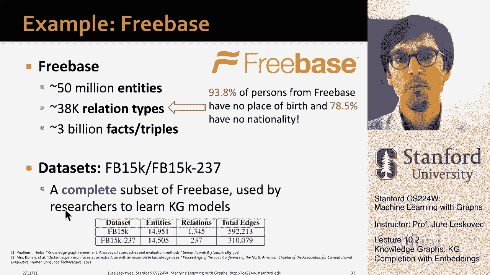

# 【双语字幕】斯坦福CS224W《图机器学习》课程(2021) by Jure Leskovec - P29：10.2 - Knowledge Graphs KG Completion - 爱可可-爱生活 - BV1RZ4y1c7Co

我接下来要讲的是知识图，我特别想谈谈知识图完成任务，呃，使用嵌入，我想给你们介绍一些非常有趣的知识图完成方法。

所以知识图，这个想法是，我们希望以图形形式存储关于给定域的知识，这个想法是我们想捕捉实体类型和不同实体之间的关系，所以我的想法是，现在我将有节点，我将称之为实体，实体将被标记为不同的呃类型。

然后我会有不同类型的关系，呃在实体之间，从这个意义上说，知识图只是异构图的一个例子，但通常我们会把知识图看作是，捕捉关于给定领域的事实知识，例如，你可以用一个书目网络，你可以说我有不同的节点类型。

比如论文标题，作者会议，年数，然后我会有呃不同的呃，关系类型，如发布在哪里完成，是哪一年做的，它有什么标题，谁是它的作者，谁引用了它等等，例如，这是，看这种类型的呃的模式的一种方法。

知识图表将是以下会议文件的正确文件链接，互相引用，论文有标题，有年头了，出版年份，并且有作者，当然有多个作者，多次会议，所有这些相互联系，另一个例子是我已经讨论过的，会在生物医学上，有很多知识图。

我们可以有不同的类型，药物方面的节点类型，疾病，不良事件，蛋白质，呃疾病途径等等，然后我们也可以有不同类型的关系，喜欢有作用，原因是相关的，零食，呃是一种关系，现在我们有了关于生物学的知识，如何呃。

怎么呃，生活作品编码在这个呃，图形形式，然后呃，当然有很多，知识图表实际上是公开的，存储关于呃的知识，其他类型的实体，例如，关于现实世界的实体，你知道的，谷歌正在使用谷歌知识图来使搜索结果更好。

亚马逊正在使用他们的产品图表来了解不同产品的特性，能够更好地搜索和推荐产品，呃Facebook有一个图形API，因为他们想到了自己的社交网络兴趣，人们毕业的学校之间的关系就像一个巨大的图表中的节点一样。

后台的IBM沃森使用，一个巨大的呃和图表，能够回答问题和理由，微软，呃搜索引擎，该公司正在使用微软Satori，这是他们自己专有的知识图，你知道的，LinkedIn的事情，uh称它的知识图。

经济知识图表等等，等等，所以知识图基本上在工业中被大量用于捕捉背景，关于给定领域的知识，捕获给定域中节点之间的关系，例如，单程呃，你可以使用知识图是简单地服务于信息，所以说，比如说。

如果你去必应搜索引擎说你知道最新的电影是什么，嗯，泰坦尼克号的导演，这是一个知识图查询，对呀，你发现泰坦尼克号，你说是谁导演的？你找到那个人，你说还有哪部电影有这个，呃，呃，指示的人，你可以直接，呃。

把这个信息浮出水面，并且没有将这些数据编码为图形形式，回答这种类型的查询，这种类型的问题实际上是不可能的，知识图也是，呃，非常重要的问题，应答和会话代理，这里我展示了系统图，呃为了这个，呃，其中一个。

呃，类型，呃，嗯，呃，呃，其中的系统，基本上你，你进入问题，你想和代理人交谈，代理人会明白什么，问题中包含的实体是什么，以及这些实体之间的关系，这样它就可以带着一个，假设一个聪明的，呃回答，你可以想。

例如维基百科中编码的知识，IMDB等，作为数据源的示例，你可以用，呃为了你的知识图表，所以有很多公开的，呃，知识图，呃，呃，呃，知识图，比如说，自由基，嗯，然后是维基百科或维基数据，有dbpedia。

呃等等等等，这些知识图的一个共同特征是，它们是巨大的，他们有几百万，数千万个节点和边缘，但它们也是出了名的不完整，意思是，很多关系都缺失了，知识图文学中最基本的任务之一是说，给出一个海量的知识图，枚举。

呃还是呃，确定哪些任务，图表中缺少什么关系，所以问题是，我们能预测知识图中看似合理但缺失的环节吗，所以给大家举个例子，所以说，比如说，Freebase是一个知识图，呃，那个呃，被谷歌收购，谷歌使用它。

呃，呃，作为其谷歌知识图的基础，它包含了关于现实世界实体及其关系的知识，所以它有五万个实体，它有三万八千，呃，关系类型和30亿条边，对呀，所以所以你知道，写数字，不同关系数量的基数，三万八千是吧。

所以它很大，现在，如果你在我们的GCN的背景下想到这一点，我们需要学习三十个，GCN的每一层都有八千个不同的变换矩阵，这显然变得难以解决，对呀，但有趣的是，比如说，几乎百分之九十四的人。

Freebase中的人节点没有出生地，你知道七万八千，呃，百分之七十八没有，呃国籍权，所以这些知识图是出了名的不完整，嗯，那么问题是，我们能自动推断什么是给定节点的国籍吗。

或者我们能自动推断给定的节点在哪里，给定的人，呃出生，这就是所谓的呃，知识图。

