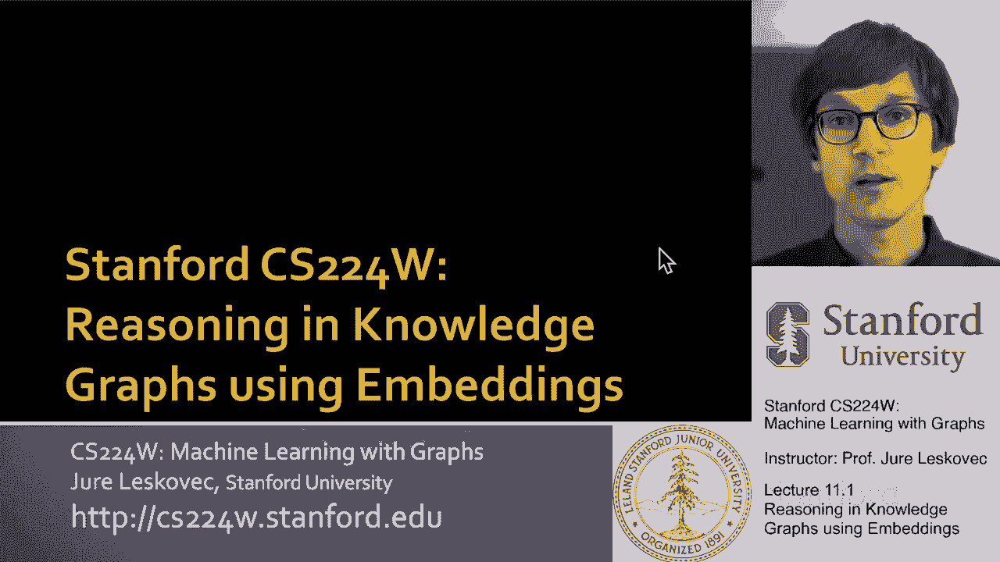
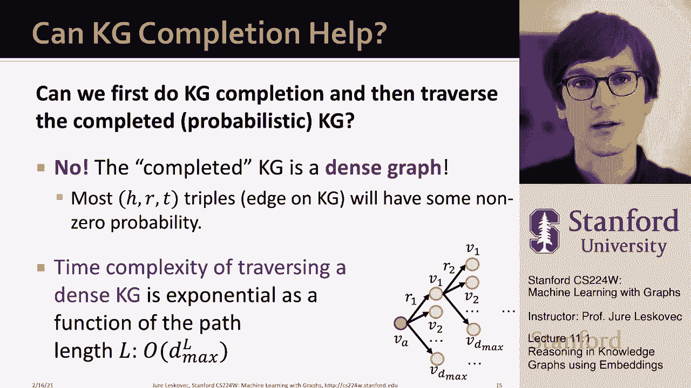

# 【双语字幕】斯坦福CS224W《图机器学习》课程(2021) by Jure Leskovec - P31：11.1 - Reasoning in Knowledge Graphs - 爱可可-爱生活 - BV1RZ4y1c7Co

 So， uh， welcome everyone to the class。

 Uh， today we are going to discuss about， uh， reasoning in knowledge graphs， uh， using embeddings。

 So， um， what we learned， uh， last week was that， uh， we discussed knowledge graphs。

 And in particular， we defined the notion of a knowledge graph as a， uh， a set of， uh。

 nodes and a set of relations between them where， uh， nodes can have， uh， different types， and also。

 uh， relationships， uh， can have different types。 Um， and then we have defined， uh， a task， uh。

 we called， uh， knowledge graph completion task， where basically given， uh， enormous knowledge graph。

 the question is， can we complete it？ Can we， uh， predict infer， uh， missing， uh， relationships， uh。

 in the graph？ So for a given head and a， for a given relation， uh。

 we wanted to predict missing tails， right？ So basically， for example， we would wanna， uh。

 predict the genre that a particular author is writing， uh。

 books about based on the rest of the structure， uh， of the knowledge graph。

 So what we are going to do today is we are going to take this idea of， uh， knowledge graphs， um。

 and knowledge graph completion， but we are going to generalize it and extend it to， uh， more， uh。

 interesting and more， uh， challenging setting， where basically what we will be doing。

 is we are going to perform multi-hop reasoning， um， and logical reasoning in these knowledge graphs。

 uh， using embeddings。 So the goal is to reason in knowledge graphs。 And what。

 by mean by a reason is to be able to answer， uh， multi-hop queries， or in some sense。

 to make complex predictions in these， uh， knowledge graphs for arbitrary predictive queries。 Um。

 and we are going to talk about， uh， two approaches。

 One will be how do we handle what is called path queries， and the other one will be about。

 talking about conjunctive queries and a method called， uh， query to box。 Um， and in all these cases。

 basically， the idea will be how do we embed the knowledge graph？

 How do we embed the relations such that we can reason and navigate and move around， uh， in this， uh。

 in this， in this space？ That's essentially the idea。 So， um， for the rest of the lecture。

 I'm going to use this simple， um， biomedical knowledge graph， that includes， uh， the following， uh。

 four types of entities。 We will have nodes for， uh， different， uh， drugs。

 We are going to have nodes， uh， for different diseases。

 We are going also to have some kind of adverse events or let's say， let's say side effects， uh。

 that these diseases can cause。 And then we'll also have nodes corresponding to proteins， um， and。

 uh， that are， that are in， uh， in our bodies and basically proteins regulate and are part of various kinds of biological processes。

 taking， uh， part in our bodies and in our， uh， cells。

 So now let's say we have this kind of miniature， uh。

 knowledge graph or a small part of the knowledge， graph， uh。

 that basically captures how these different entities are related to each other。

 And then the question will be， can we answer interesting questions， uh， over this knowledge graph？

 So， uh， to give you， uh， an example， for example， the question is。

 how could I answer complex queries？ Or how would I be able to make complex predictions over incomplete and massive。

 uh， knowledge graphs？ And just to give you， uh， a few examples， um， you know， you could say what。

 uh， adverse event is caused， uh， by a drug， uh， full， uh， full restaurant， right？

 And the way you could say this is to say， "Hi， wanna start with the entity full restaurant。

 and I wanna traverse relationship cause， and I wanna predict what is on the other end of the， uh。

 of this， uh， um， full restaurant cause， uh， relation。"， Uh。

 and this is in some sense a one-hop query。 It's basically a knowledge graph completion type task。

 I could then also do， uh， path queries， where， for example， I could say what protein is associated。

 with the adverse event caused by， uh， full restaurant， right？ So in this case， I would say。

 "I wanna start with the entity full restaurant， I need to traverse over causes relation。

 and then I need to cause， uh， traverse over associated relation。"。

 Whatever entity is at the end of this， that is the answer to my， uh， question， to my query。

 And then we can also ask more complex queries， uh， where we can also have， uh， various logical。

 relations between them。 For example， I could ask， "What is the drug that treats breast cancer， uh。

 and， uh， causes headache？"， So I could say， uh， you know， uh， breast cancer。

 I start with an entity breast cancer， I say， uh， treated by。

 so this is now the drug treated by the breast cancer， and I also wanna take my grain and say。

 "What are the drugs that cause， uh， migraine？" And then whatever drug causes both， um， that's the。

 uh， that's the answer to my question。 So， you know。

 you can write these questions in natural language， you can write them in this kind of， um， formula。

 but you can also write them in terms of the graph structure， right？ So in。

 in a sense that one hop query says， "Start with an entity and make a step along a relation。"。

 Path queries say， "Start with， start with an entity。

 make a step along one relation and then make a step along the other relation。

 like causes an associated。"， And what does this say is， it says。

 "Start with breast cancer and move across the treated by and start with migraine and move across。

 uh， the relation caused by。"， And whatever you end up， whatever entity you end up with， uh。

 that's the answer， uh， to your question。 So you can see how we can basically take this， uh。

 let's say， uh， questions queries， write them in natural language， write them in the， uh。

 let's say this kind of logical formula or write them in this type of， uh， graphical structure， uh。

 form。 Uh， of course， today we are not going to address how do you get from natural language to the formula。

 We are only going to kind of discuss once you have the formula。

 once you have this logical structure， this graphical structure， how do you answer， uh， a query？

 And an important point all here will be that this， this。

 we want to be able to answer these queries over incomplete knowledge graphs。

 So it won't be only that we say， "Oh， just traverse a relation。"， It will be like。

 "The relation is missing， you have to predict it。"， And it will。

 it can be chains of relations that are missing or are not in the knowledge graph。

 and we still want to be answer， uh， able to answer these questions。 So， um， you know。

 first let's talk about one-hop queries。 We already know how to， uh。

 answer them because we can formulate graph completion problems as answering one-hop queries， right？

 In a， in a knowledge graph completion， basically what we need to be able to estimate is to say。

 "Is there a link between a head and a tail of relation type R？"。

 So this is essentially the same as saying， "Is there。

 is still an answer to the query start with the head and move along the relation R？"， So for example。

 what side effects are caused by drag full restaurant， right？ In this case。

 I start with drag full restaurant， this is my H， R is the caused by。

 and now I want to basically say， "Is this particular entity the end point of full restaurant and caused by？

"， So that's how basically answering one-hop queries， like a simple link prediction queries。

 is a knowledge graph completion。 Now we can talk about how about answering path queries， right？

 We want to generalize this to basically being able to chain multiple relations， uh。

 one after the other， right？ So we can say that we have an end-hop path query queue that is represented by。

 uh， uh， what is called an anchor node， a starting entity， and then a sequence of relations R1， uh。

 all the way to Rn， right？ So V is a， uh， this obey is an anchor node， this is a fixed entity。

 like a full restaurant as we talked about， and then answers， uh。

 to the query will be denoted in this notation。 So basically， um， I have this kind of double braces。

 so whatever is， uh， whatever elements I've written here。

 these are the answers to the query queue on a knowledge graph G。

 So the way we could write this in a graphical form into this。

 in something we are going to call query plan is basically we start with the entity， uh， visa。

 and then we want to traverse over relationship type 1 and relationship type 2。

 all the way across the end relationships and whatever entities are at the end of this， um。

 we are making a prediction that this is the correct answer。 So that's a notion of a path query。 Um。

 to give you an example， I could ask what proteins are associated with adverse events caused by full restaurant。

 Right， so if I write these， then I say full restaurant is my anchor entity。

 my R1 and R2 are relation causes and associated。 So my query will be start with a full restaurant。

 go across the causes relation and go across associated relation。 Right。

 so if here is my full restaurant， I want to first go over the green， uh， the green links saying， uh。

 uh， you know， what is， uh， what causes this would be the red links， uh， apologies。

 And then from here， I want to then traverse over the second part of the link associated to arrive at a given protein。

 So that would basically be the idea for a path queries， right？ So to answer。

 to give you an example again， so how do I answer， how do I find the answer now？ Basically。

 the way I find the answer is that conceptually， if the knowledge graph is complete。

 I simply need to， uh， traverse it according to this query plan。 So the idea is。

 I start with full restaurant， I traverse over causes relations to get to all the side effects caused by this drug。

 like headaches and you know， brain bleeding and shortness of breath and kidney infection and so on。

 so kind of quite serious side effects。 And now that I have this set of entities。

 now I need to traverse from them according to associated relation。 And you know。

 I traverse the edges and whatever proteins I end up with， those are the answers to my query。 So， uh。

 these are the answers to the， to the query about， you know。

 what are proteins associated with adverse events caused by the drug full restaurant。

 So that's basically the idea of how now I can formulate an answer path based queries directly on the knowledge graph。

 assuming knowledge graph contains all the information。 Of course， in some sense， this seems easy。

 right？ It's just answering queries seems easy， you just traverse the knowledge graph according to this plan。

 But the problem is that knowledge graphs are notoriously incomplete， right？

 Many relations between entities are missing or incomplete。 For example。

 we lack a lot of biomedical knowledge and， you know， kind of enumerating all facts。

 testing all possible side effects， all possible associations in these graphs is too costly and would take far too much time。

 And perhaps we will never be able to obtain the entire knowledge about biomedicine。

 So the question then is， if these graphs are notoriously incomplete， right？

 We cannot simply hope to traverse them to get the answers。 Right？ So the question then is。

 what do we do？ To give you an example， right？ If I'm missing perhaps a relationship causes by because it's not yet known that full restaurant also causes shortness of breath。

 Then， for example， if I'm not able to traverse this edge， then， you know。

 there is no way for me to discover that B。E。R。K。 2， the protein is actually an answer to my query。

 right？ I would be able to say that C。E。R。K。 8 is an answer because I go over brain bleeding to get to it。

 I know that P。E。M。 1 is also an answer because of this path through the kidney infection。

 but there is no way for me to find out that this B。E。R。K。 2 protein is also the answer to my query。

 So that's the problem。 So what you could do is to say， "Uh-huh， I actually， you know。

 listened the previous lecture and I remember we talked about knowledge graph completion。

 So let's just go and apply knowledge graph completion so that now the graph will be complete and then it can simply traverse it。

"， The problem is that if you do this， then you don't know how many edges are really missing in the knowledge graph。

 So you could basically go and apply your knowledge graph completion approach to all possible edges of the graph。

 So it means that you would want to take for every triple in the knowledge graph。

 you'd want to ask your knowledge graph completion engine to assign a probability that that link is true。

 The problem then will be that now your graph just got a whole lot of new。

 this kind of probabilistic links。 And now the graph is getting denser and knowledge graph completion or traversal will get very expensive because if you think about。

 you know， starting at that entity moving along a given relation and then getting to a set of nodes moving to the next relation to a new set of nodes。

 this will explode exponentially with the length of the query。 So with the query length is。

 let's say， capital L， then if at every step you have some non trivial expansions。

 some non trivial number of nodes that allow you to traverse along a given relation。

 then this is going to increase exponentially in the query length。 And having big queries。

 this becomes computationally quite hard to do over a massive knowledge graph。

 especially if you think about that we have just added a lot of new edges with different probabilities。

 and we need to keep track over these probabilistic computing edges as well。

 This becomes a very hard computational task。

 So here is the idea how we are going to do this and formulate it。

 And the way we are going to talk about this is we are going to call it predictive queries。

 And the idea is， right， we need a way to answer path based queries over an incomplete knowledge graph。

 And we want our approach to implicitly impute an account for the incompleteness of the knowledge graph。

 So we don't want to impute the edges and then traverse with just like the method to take care of all this automatically。

 So rather than thinking that all we have to do is just traverse the knowledge graph。

 we really can think of this as making very complex predictions。 Right。

 it's basically saying predict what entities are an answer to a given query。

 So basically we are going to formulate these queries as predictions。

 So this will now be a prediction task。 And this means it will be very interesting because we'll be able to answer any kind of query。

 In so far we talked about path queries， we are able to answer any kind of path query。

 whatever set of relations you put on the path， we should be able to answer it。

 So it doesn't mean at the training time we have to see the query。

 then we train how to answer the query and now we are able to give the answers。

 The idea is that we can get any query at the test time and we should still be able to answer it。

 And then another important thing is that this method needs to be able to impute or implicitly complete the knowledge graph for the missing information and be this way robust to the missing information or to the noise in the knowledge graph。

 And really another way how you can think of this predictive queries task is that it's a generalization of the link prediction task。

 Link prediction is simply starting with a head moving along a relation of type R， what is the tail。

 And now we'd like to generalize this one step prediction task into multi-step prediction task。

 So this is very important， we are really taking reformulating this task of answering queries as traversal over the knowledge graph into predicting what entities are the answer to the query。

 [ Silence ]。

