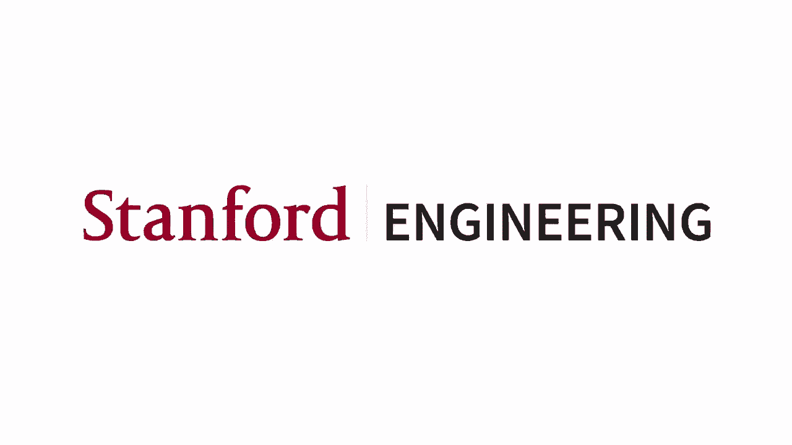
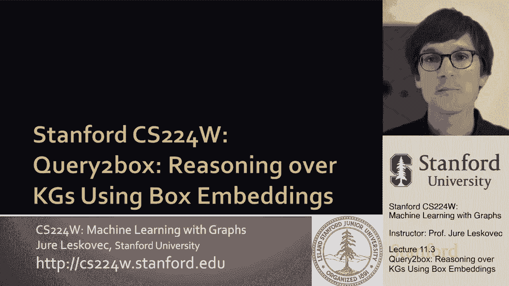
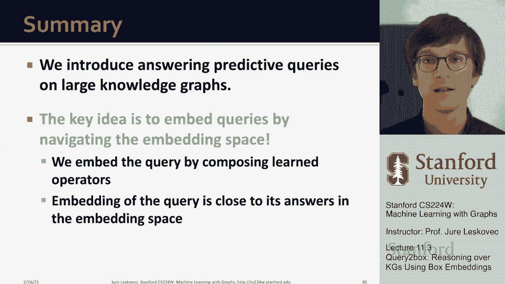
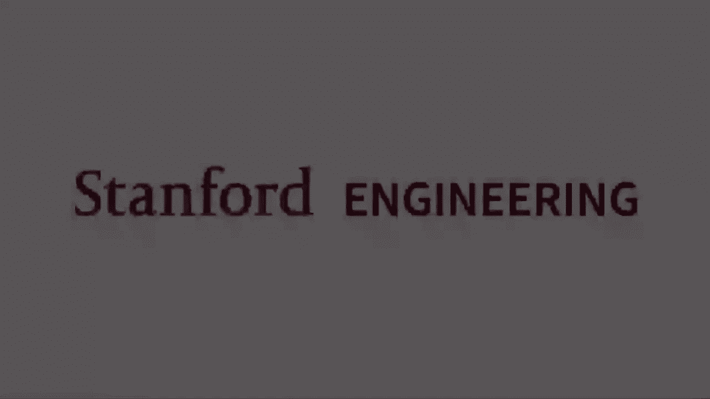

# 【双语字幕】斯坦福CS224W《图机器学习》课程(2021) by Jure Leskovec - P33：11.3 - Query2box Reasoning over KGs - 爱可可-爱生活 - BV1RZ4y1c7Co

所以我接下来想说的是一个解决方案，对这些问题，特别是我们将要讨论的方法叫做查询到框，它允许我们对知识图进行推理，使用所谓的呃，框嵌入。

所以让我先激励设置，然后告诉你这个方法是如何工作的，所以我们说我们想回答更复杂的预测问题，图，假设我们也希望能够包括合取，所以不仅仅是，但也有十字路口，我们希望能够在嵌入空间中取两个集合的交集。

我们现在需要做的是两件事，弄清楚，我们如何表示嵌入空间中的一组实体，然后我们如何定义嵌入空间中的交集算子，好吧，我们如何快速地得到两组实体，并说，在十字路口的实体是什么，呃他们之间。

所以让我们看看怎么做，关键的洞察力，呃，将允许我们做，这就是盒子嵌入的概念，所以这意味着我们要嵌入所有的实体，我们空间中的关系就像盒子一样，多维，呃，矩形，直觉是每个盒子都由两点定义，对呀。

它由中心定义，由角定义，我们打电话给中心，我们称之为角偏移量，所以这基本上告诉我，你知道，中的偏移量是多少，呃，一维，另一个维度的偏移量是多少，这基本上告诉我盒子的大小，直觉上我们想，呃，让我们说。

在我们满员的情况下，我们想把它所有的副作用都放进一个盒子里，这样在，基本上，呃，所有的副作用引起的充分和将被嵌入紧密在一起，它们会被封闭在这个里面，呃，在这个盒子里，所以这就是，就是这个意思。

所以现在让我告诉你，呃，在此基础上再接再厉，所以我们想把东西嵌入盒子的原因是，因为盒子的交集定义得很好，对呀，基本上我的意思是，呃，如果你拿两个盒子，走一个十字路口，两个盒子的交集是一个盒子。

它可以是一个空盒子，尺寸为零的合适尺寸的盒子，但是如果有任何非琐碎的重叠，重叠将是一个盒子，所以这意味着我们现在可以考虑，我们如何定义这些盒子上的几何变换，符合逻辑的，呃，经营者权利。

所以当我们遍历知识图来寻找答案时，每一步基本上，产生一组可到达的实体，查询覆盖的一组实体，呃，到目前为止，嗯和嗯，我们现在要用一个盒子来建模这组实体，把它们都包起来了，所以嗯，这意味着我们可以，呃。

该框提供了一个强大的抽象，因为盒子里装着，实体，然后我们可以定义几何交集算子，呃，结束，呃，假设有两个或多个盒子，当我们把它们相交的时候，十字路口还是一个盒子，所以我们很容易又有了这种成分属性。

我们可以拿箱子的地方，以任意的方式将它们相交，但是呃，我们总是被一个盒子冷落，我们可以进一步操纵、改变和塑造，无论我们喜欢什么，所以这就是为什么这有点酷，嗯和嗯，令人兴奋，所以呃。

能够嵌入盒子意味着什么，以下是我们需要弄清楚的，或者以下是我们需要学习的，我们需要学习哥哥，我们需要学习实体嵌入，所以每个嵌入实体都有一个嵌入，它将是一个盒子，但它将是一个微不足道的盒子。

所以基本上这将是一个点，会是一盒，呃，呃，大小为零或体积为零，然后我们会有关系嵌入，它基本上概括了Trane的概念，我们现在要把它放在哪里，学习如何移动和展开或缩小盒子，所以关系嵌入就像。

载体会带走盒子并移动它们，然后交集算子是新的东西，交集运算符将在输入上接受多个框，并将输出单个框，直觉上，这将是一个盒子的交集，但我们要学这个，呃，交集算子um，所以它会有一些参数，所以我们的方法会更。

呃表现力更强，那么这将如何工作，让我再给你一个卡通片，我们说的是，呃，你知道，什么是导致，呃，呼吸急促和治疗与蛋白质相关的疾病，呃ESR两个嗯，我们做这件事的方式，在查询计划方面。

我们说我们如何从锚实体开始，ESR二，我们想跨越嗯跨越所谓的关联关系，呃和，我们要做的是，我们要定义这个关系，投影算子p，下面是它的定义，我们每个亲戚都有一个，本质上，这将做的是。

它需要一个盒子它会根据给定的关系移动它，把它放大或者缩小，所以基本上我们会有，嗯这个博学的嗯，这个学会了呃，每个关系的算子，它会移动中心，它会改变偏移量，所以基本上它会改变盒子的大小和位置。

所以我可以从呃Q开始，然后我把这个投影r应用到它上得到一个新的盒子，呃q质数，这是投影运算符，那么在我们的情况下，这看起来怎么样，如果我从DSR2开始，我想跨越相关的关系，我会拿着这个微不足道的盒子。

应用我的关联，基本上这将移动它呃并扩大它包括，呃，所有与之相关的疾病，呃，ESR两个现在嗯现在我有了一个新的盒子，我可以再次简单地遵循查询计划，现在我想再经过一次治疗，我会拿这个盒子，适用。

由投影算子处理，向盒子的转变，你会进一步知道吗，移动它你知道扩张或收缩这取决于我们学习的模型，这个想法是无论这条路的答案是什么，预测查询，这些是实体，在盒子里这就是现在的想法。

我也可以试着回答问题的第二部分，这是呃，由…引起的呼吸急促，所以我从呼吸急促实体开始，应用由盒子转换引起的这个来获得另一个盒子，现在呃，是什么实体，呃在两个盒子的交汇处，这些基本上就是我问题的答案。

在我们的，在我们的情况下，呃，这就是这个，呃，这两个实体完全垂直，呃和另一种药物对吧，所以这就是本质上的想法，我只有一个盒子，我有另一个盒子，我对…感兴趣，什么是交集，他们中的，所以那是嗯。

关于我如何用盒子嵌入的想法，现在，让我来谈谈，这个交集运算符是如何的，呃，真正定义的一种方法是简单地将其定义为一种核心，或者只是数学上的盒子的交集，就像在维恩图中一样，我们想要更灵活一点，我们想做，呃。

呃，学习几何交集算子，我们就叫它J，想法在哪里，我们希望将多个框作为输入，并生成交集，呃，这些盒子里，我们就叫它交集盒，我们将要使用的直觉是说，新框的中心应靠近输入框的中心，对呀，这是三个输入框和中心。

嗯，所以我们想直观地把它们之间的交集，所以我们希望新的中心是这三个中心的功能，我们希望十字路口离他们很近，然后是偏移量，这样盒子的大小就会缩小，自从呃，相交的大小小于，呃，任何输入集或任何输入框。

如此正式，我们会有这个十字路口操作员，它将取一组任意的盒子并产生一个新的盒子，现在我们定义这个运算符的方式是，我们需要说出呃发生了什么，中心和交点的偏移量发生了什么，我们要找到十字路口中心的方法是。

我们要通过一个学过的歌剧操作来做到这一点，我们所学的操作将采取以下步骤，它会把盒子的中心，呃，在输入端，然后我们要呃，学习此功能，如果那需要呃，盒子的中心，嗯，嗯，把它变成。

然后我们将把SoftMax应用于这个函数，这将允许我们做什么，呃，基本上是，直觉是，十字路口的中心会在这个绿色区域的某个地方，由输入框的中心定义，我们将中心定义为输入框中心的加权和，W在哪里，呃，呃。

在方框的交点上加权给定方框的重要性，所以W在某种意义上代表了自我注意力得分，呃，在中间，每个输入框的中心对中心的影响有多大，十字路口的盒子，这个有趣的操作符叫做哈达玛产品，这基本上是元素方面的产品权利。

只有你，你取细胞的乘积，呃，那对应，呃对彼此，所以这就是中心，呃的，呃是定义的，当然f是我们将要学习的函数，同样地，现在我们还必须定义偏移量，我们定义交点偏移量的方法是，我们将采取平均。

所有输入框中最小的，所以我们取最小的偏移量，然后我们也要学这个，呃，偏移量函数f偏移量，它将聚合和转换偏移量，所以这里，直觉是，我们首先取输入框的最小偏移量，然后通过引入这个新功能来使模型更具表现力。

用于提取输入框的表示形式，有乙状结肠功能，保证收缩，呃的，抵销额，同样，这个f-off将有一些可训练的参数，呃，这将会，呃，我们将在训练过程中学到的，整个模型的，所以呃，你知道吗，直觉上，这个想法是。

一旦我在输入上有两个框，我想，我想产生两个盒子的交集，在我们的例子中，两个盒子的交集，例如，就是这样，呃阴影，呃，这里和那个区域，以及任何封闭或靠近这个盒子的实体，呃，这些就是答案，呃到我们的，呃查询。

所以现在我们需要做的是到目前为止，我说，哦嗯，框中包含的答案实体，它们必须在盒子里，对在现实中这可能呃更难，因为呃，数据有噪声，嗯，呃，可能会有不一致的地方，知识图中的矛盾。

所以我们需要定义盒子和点之间的距离，这个想法是，呃，我们将把这个距离定义为两个部分，我们要定义从中心到点的距离，如果点在盒子里，如果它在盒子外面，然后我们取中心与角和角之间的距离，重点是。

这里的重点是我们希望能够，呃，以不同的方式解释距离对吧，我们要测量一个距离，呃，呃，从中心，如果呃，当，当点在盒子里的时候，在某些单位中，然后我们要等待，标量α，那就会，呃，呃不到一个。

所以基本上我们要惩罚，到盒子中心的距离，呃更多，如果重点在里面，如果是的话，呃，盒子外面，呃，直觉是，如果点没有包围盒子，盒子应该是，呃，应该非常接近，呃到盒子的中心，这样我们就得到了更多，呃。

从我们的方法到我们的方法的健壮性，对呀，我们不想让一个点靠近边境，或者盒子的边缘，我们希望它朝着，呃，呃，盒子的中心，这就是我们现在如何定义实体和盒子之间的距离，所以现在当我们最终嵌入查询时。

我们要做的就是把这个距离，嗯然后说，根据这个距离，谁是最近的点，呃，向中心，呃，盒子的，现在我们已经讨论了两件事--我们讨论了如何嵌入所有东西，呃所有的实体作为盒子，我们如何学习盒子转换操作。

每个关系为一个的投影操作，然后我们讨论了如何学习这个交集，将uh作为输入的合取运算符，一组框并产生交集框，当然，接下来一个自然的问题是我能不能，呃，有这些预测性的查询，即使有联合运算符，例如。

能够回答像呃之类的问题，接下来我们要看的是，你如何能够回答我们称之为结束或查询的问题，或者技术上称为存在正一阶查询，所以基本上这些都是带有连接和分离的查询，呃接线员对，所以问题是，我们怎么能，这个。

我们能设计一个析取算子吗，并在低维向量空间中嵌入uh和或查询，并能够回答预测性的问题，和或查询在呃空间以及，所以问题是我们能否在低维空间中嵌入和和或查询，答案其实是否定的，原因，也就是说。

允许在任意集合上的并集需要高维嵌入，所以让我快速给你一个感觉，为什么我们需要很多维度，想象一下我有三个问题，他们每个人都有一个答案，呃，你知道的，q 1有v 1作为一个实体，答案是V一。

答案是q 2 v 2和q q 3 v 3实体，所以现在想象一下我允许一个实体操作对吧，那个，基本上意味着我可以接受任意一对查询，并在它们之间执行一个或，因此答案集将是第一个查询联合的答案集，答案集。

第二个查询的呃，考虑到我们有两个查询，对不起，鉴于我们有三个查询，问题是当我们嵌入它们时是否能模拟工会的运作，假设在二维平面上，嗯，是的，你可以对，基本上你说，呃，对于每个单独的查询。

我可以简单地在实体周围放一个盒子，这意味着，嗯，对于给定的查询，我希望答案就在盒子里，那就是，呃，你知道的，容易实现的权利，我们可以把这些实体分开，在每个实体周围放一个盒子，然后说，啊哈。

框是查询的嵌入，查询的答案嵌入到框中，你知道一切都好，工会怎么样，在这种情况下，我可以很容易地把工会做好，例如，这是，一箱工会一号，呃，查询一，联合查询二如下所示，呃，q 1或q 2，这就是呃，q二。

呃或者Q3看起来像，这就是Q 1，呃还是Q三，呃看起来像，所以说，似乎所有的工作都适用于二维的三个查询，如果我们有四点，所以想象一下现在我有四个问题，我有四个问题，每一个都有一个实体作为答案。

我现在可以用一个二维空间来嵌入它们吗，嗯，并能够做任意的结合，在任意查询之间，嗯，事实证明，我不能设计一个盒子嵌入这样，比如说，在这种情况下你将代表q q 2的结合，呃还是Q4。

因为总会有其他类型的盒子或其他实体，嗯嗯在他们之间，对呀，如果我把这个实体移开，也许在这里，然后呢，我将无法模拟v1和v4之间的结合，所以基本上，嗯，总会有一些问题，结论是什么，或者如果你嗯。

如果你做了，呃数学仔细，结果是，如果你有嗯嗯查询或M实体，嗯，答案不重叠，那么你需要秩序的维度，m处理任意或查询，对呀，所以在我们的情况下，我们说，如果我有三个问题，我需要两个维度，如果我有四个问题。

我需要三维等等，以此类推，因为现实世界，呃，知识图有很多实体，比如说，你知道3个基数15k有15000个实体，它被认为是一个小知识图，这意味着如果我们想建立一个模型，任意的或在，呃，任意实体集。

这意味着我们需要一个15000的嵌入维度，然后呃，那很远，呃，对我们来说太多了，所以嗯，好像没希望了，对呀，因为我们不能在低维空间中嵌入uh n或查询，我们还能对付他们吗，实际上答案是肯定的。

答案是肯定的，因为我们可以将查询重写为um in，呃，进入一个不同的论坛，以便查询在逻辑上是等价的，但工会的行动都发生在最后，对呀，所以这个想法是，如果我有原始的查询计划，在那里我你知道，做两个投影。

拿工会，再拍一个投影，然后走一个路口，我可以把它重写到一个不同的查询计划中，给我相同的答案，它在逻辑上是等价的，但结合只发生在最后，那么为什么这是有益的呢，因为我已经知道如何回答这个部分来得到一个盒子。

我知道怎么回答这个问题，从这里到这里拿一个盒子，所以现在，呃，呃，我的问题的答案很简单，呃，列入第一个方框的实体和列入第二个方框的实体，所以这很容易做到，因为结合发生了，呃呃，总是作为最后一步，嗯。

所以重要的是，和或查询可以转换为等价的，所谓的析取范式，它是合取查询的析取，嗯，这意味着如果我有一个查询，现在在这个连词的交界处，我可以先简单地回答这些连词，然后取末尾的OR或并集，所以它的意思是。

我们可以聚合这些工会，呃，在最后一步，有一个警告，当你把它转换成析取范式时，所以从原始查询到析取范式，查询的大小可以呈指数级增长，嗯，但在我们的情况下，这不是问题所在，因为回答查询，嗯是如此是如此之快。

只是有点，呃，导航嵌入空间，所以这听起来不像是一个太大的，呃一个问题，所以现在我们已经定义了呃，析取范式，我们重写了呃，查询作为一组连接查询，然后在末尾应用OR操作。

那么我们所需要做的就是改变查询之间距离的概念，呃，查询的嵌入，嗯和实体，我们用数学写出这个的方法是非常直观的，我们说，嗯，析取范式中的查询，合取查询q 1或q 2或q 3。

我们可以简单地定义此查询的嵌入与实体之间的距离，是盒子之间的最小距离，单个合取查询与该实体之间的距离，所以基本上我们说实体是一个答案，呃对查询，如果它至少在单个连接查询框中的一个中，对呀。

这样它就至少关闭了一个呃，合取查询Q，这就是为什么我们在这里有最小的，所以只要v是一个连词查询q的答案，那么该查询与V之间的距离将为，呃，非常小，我们通过使用这个最小值来实现这一点，呃基地，呃，距离。

所以现在我们基本上可以回答，武断的或者呃，预测查询，所以我们要做的是，如果一开始给了我们一个查询队列，我们会把它重写成析取范式，所以合取查询的析取，Q一到QM，我们会把这个Q1嵌入QM，使用这组框操作。

意思是投影和交叉点，然后我们会简单地计算每个气之间的盒子距离，从析取范式和实体，取最小的距离，然后一个实体的最终得分只是距离，整个查询之间的最小基本距离是多少，呃还有，以及给定实体的嵌入。

我们有兴趣评估，那个实体有多大可能，答案，呃到我们的，嗯，对我们的询问，所以现在我们已经讨论了这个方法是如何工作的，呃，从嵌入一旦存在的角度来看，一旦盒子操作员在那里，呃。

我们如何应用它来回答任意的预测查询，问题是，呃，我们用什么样的培训程序来学习这些，这意味着我们基本上需要一个类似的，呃，类似于知识图完成任务的设置，这样我们就可以了解所有这些参数，对嗯，当我说参数时。

我是说，我们需要学习实体嵌入，我们需要学习这些关系嵌入，这些盒子变换，我们需要学习，我们学习这个的方法基本上是，我们将选择呃或示例或创建一组查询，对于每个查询，我们将有一组积极的实体，这将是一组答案。

我们将有一组负的实体，这将不是答案，然后呃，我们的目标将是学习所有这些，呃参数以这样的方式，答案包括在最后一个框中，没有答案就在盒子外面，所以让我呃，呃总结一下这个，所以我们要先随机抽样查询。

从训练知识图中排队并标识作为答案的实体，对那个问题，然后我们也要识别一些消极的实体，我们就叫它V素数吧，例如，我可以说我从一个，让我们回到我们的呃，巴拉克，奥巴马国籍美国人，所以呃。

我会说我会尝试一个查询，嗯嗯国籍，这是一种简单的知识图完成查询，甚至不是多跳多跳，我从奥巴马开始，沿着国籍，我发现美国人，所以这是一个积极的实体，然后也许我说一个消极的实体可能是其他随机的。

呃实体在呃在图表中，嗯，也许是巴黎，或者如果我想变得更聪明，我说我有类型的真实实体，呃美国人，所以美国，所以我想选择另一个国家，也许德国是一个负面的例子，作为对此查询的非答复。

现在我现在我已经取样了查询和答案，而不是答案，我使用转换嵌入查询，然后我计算实体V的分数函数f，它是答案实体，和实体V素数，哪个是不回答，呃实体，然后目标是现在我可以计算梯度，这个损失函数。

目标是最大化，实体的得分，所以基本上，就是把负距离最大化，这意味着最小化距离，同时尽量减少呃，不回答的距离，所以我们写损失的方式是，我们说，呃，呃，u sigma是一个乙状结肠函数，呃，有价值的。

你知道在零到一之间，所以基本上我是说我想呃最大化，呃f代表呃，答案，我想把不回答的F最小化，现在我可以对这个损失函数求梯度或导数，然后能够更新实体嵌入和投影，交集算子参数，为了能够学会这个，呃好吧。

当然，我们不仅要尝试一个单跳查询，我们还将示例两个跳跃查询，三跳查询，交集类型查询，呃，各种不同的查询结构，那将是我们的训练设备，然后给出这个查询，给出一个回答实体和非回答实体，我们要优化这个可能性。

这意味着我们要找到模型的参数，它是实体的嵌入，加上这些呃操作员，这样所有这些都会，呃优化，呃，损失函数，那么我们怎么，呃，如何实例化查询，呃，在知识图中，我们将假设我们得到了一个查询模板。

然后我们实例化查询，简单来说就是向后走，我说的是什么意思，那就是，我们是，呃基本上从最初的答案实体开始，然后我们会向后走向锚实体，对呀，所以嗯，在我们的情况下，比如说，我们可以说。

让我们把全餐厅作为我们的呃回答实体，所以现在我们要去，现在我们从知识图中随机选择了这个实体，我们将沿着知识图向后移动，然后获取查询计划查询结构，对呀，所以我们正全力以赴，然后我们嗯，呃移动，我们说。

我们是，我们需要取两个关系的交集，关系一和关系二，所以让我们从，呃，向后移动，然后现在我们在这里，我们搬了过去，现在接受了治疗，我们可以再移动一步，呃，沿着投影算子向后，嗯，对于第二种关系。

比如呃相关的，现在这将成为我的锚实体，现在呃，我对这里由第二个关系引起的第二个关系做同样的事情，并找到第二个关系，呃锚实体，所以现在我刚刚采样了一个查询，来自SR 2，和呼吸急促通过相关的治疗。

以及由呼吸急促引起的，而它们的交集是最饱满的力量，所以这是我现在的取样，查询的呃，然后我能做的就是，呃，查找未回答此查询的某个实体，并将其用作，呃不，呃回答正确，呃，我们取样时一定要小心。

因为查询必须有答案，呃在公斤嗯，然后呃，我们将把其中一个答案作为实例化，呃，呃，我们的答案，呃，正面榜样，然后我们将随机抽取一些阴性样本，呃例子没有答案，基本上是其他实体，在知识图上。

但我们必须小心我们不是，呃，偶然，取样其他实体，那也是，呃，回答问题，所以那是呃，本质上是这个想法，令人印象深刻的是，我们实际上可以让这个，呃所有的工作，现在我们可以任意回答，呃，知识图中的预测查询。

呃尽管他们可能是出了名的，呃不完整，或者呃可能没有一个所有的边缘，在结束这节课之前，我想做的是给你们一个快速的例子，这看起来怎么样，比如说，在这里我们要拿自由基，一万五千，呃，知识图。

这是一个关于现实世界实体的知识图，呃人们，呃，诸如此类的事情，想象一下我们想要一个查询，呃，你知道，他们都是男性器乐演奏家，他们演奏弦乐器，对呀，呃，我们要去，呃，使用我们的系统学习，呃，所有的节点。

呃，所有实体学习投影算子，学习合取算子，然后我们要把这个，高维嵌入，我们将把它投射到二维，这样我们就可以把它想象成正确的，所以嗯，这是可视化的权利，所以这里是呃，一万五千，呃不同的点，一个对应于嵌入。

呃，每个实体，这些是具有真实嵌入的真实实体，这是我们的查询计划，我们呃，我们想回答，呃知道，他们是演奏弦乐器的男性器乐演奏家，所以我们将从弦乐器作为锚实体开始，过去，um关系实例查找弦乐器的所有实例。

然后我们要过去，来识别所有演奏这些弦乐器的人，他们中的任何一个对吗，然后我们从男节点到实例关闭，找到所有男性的例子，我们数据集中的男性，现在我们需要走十字路口，找到所有也在玩弦的雄性，呃乐器。

所以让我告诉你这个，实际上是在这个二维投影中工作的，所以呃，弦乐器锚点，如果你愿意，嗯，定位它实际上是在这里，蓝色的那个，现在我将应用一个盒子变换，会说，呃，字符串的实例是什么，呃乐器对。

所有单独的弦乐器都是什么，嗯，如果我这样做，嗯其实现在注意到了，这些点会有不同的颜色，真阳性意味着这是盒子里的弦乐器，um假阴性意味着，这是盒子外面的弦乐器，呃假阳性就是，嗯。

不是弦乐器但在盒子里的其他实体，而真正的实体是盒子外面的非弦乐器，你在这里看到的是，基本上我们可以把所有的弦乐器完美地封装在盒子里，在我们的数据集中有十个弦乐器的实例，所以我们刚刚确定了，呃。

嵌入空间中的所有弦乐器，现在我们要拿这个，嗯，所有的弦乐器，并将其转换为覆盖，呃那些人，呃，女性和男性，对呀，演奏这些乐器的人，如果我们这样做，这里是，呃，这些又是盒子里的实体，因为这是一个二维投影。

你知道这不是盒子，呃，但在高维城市中我们再次看到我们能够覆盖，基本上嗯九十八，呃所有的百分比，呃，所有弦乐器的演奏家，我们有一些假阳性，基本上是其他几个实体，嗯，不是弦乐器演奏家的人，但还在盒子里。

对呀，所以有一点错误，两位音乐家，女性和男性，他们演奏像吉他这样的弦乐器，所以现在呃，用这个，让我们进入第二部分，我们把雄性，男结点男结点，呃在这里，现在我们想说，呃。

做盒子转换的例子来覆盖这个中的所有男性，呃知识图，如果你这样做，这是邮箱里的实体，这是呃，三千，呃，五百个，所以我们基本上从一个实体变成了一个巨大的盒子，呃，三千五百，呃，在此数据集中表示的男性。

现在我们有了这两个盒子，我们要把这个交点，呃，算子，呃，你拿着两个盒子，拿着它们之间的交点，如果你这样做，十字路口，嗯有呃，将近四百个不同的实体，这些是被预测为，呃，弦乐男演奏家，呃，文书，有趣的是。

你看基本上我们能够几乎完美地回答，这个查询，尽管我们在做所有这些手术，呃，直接，呃，在嵌入空间中，这只是一个例子，我们如何基本上回答，呃，任意预测查询，呃，在这些上面，呃，不完全知识图的类型，所以嗯。

总结一下今天的讲座，呃，我们介绍了呃，呃，呃的问题，基于嵌入的知识图中的逻辑推理，我们特别谈到了，我们是如何将回答查询作为一项预测性机器学习任务来制定的，所以我们基本上不是遍历知识图。

我们用二元预测任务来定义这个任务，它说，预测给定查询的答案是什么实体，我们方法的好处是，非常可伸缩的含义，回答查询非常简单，因为它只需要，改造箱，然后检查盒子里有什么实体，嗯，它也很健壮。

因为我们不依赖于知识图的单个链接，但我们真的依赖于嵌入，以及嵌入空间中的关系，嗯，今天演讲的主要思想是，我们希望通过导航嵌入空间来嵌入查询，对呀，我们有这个，我们利用了这个构图特性，特灵。

然后我们将Trane扩展到盒子嵌入的概念，这样我们就可以定义盒子的交集，嗯，我们学会了如何根据给定的关系转换盒子，我们称之为投影算子，然后我们还展示了，如何也可以进行工会业务。

通过将查询重写为析取范式来执行，然后嗯。

应用联合运算符，呃，一路，呃。

