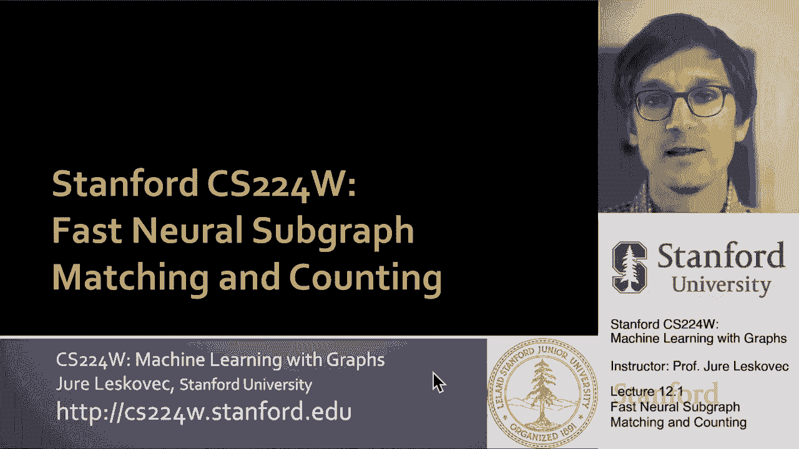
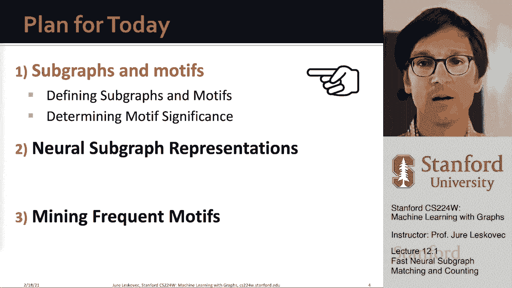
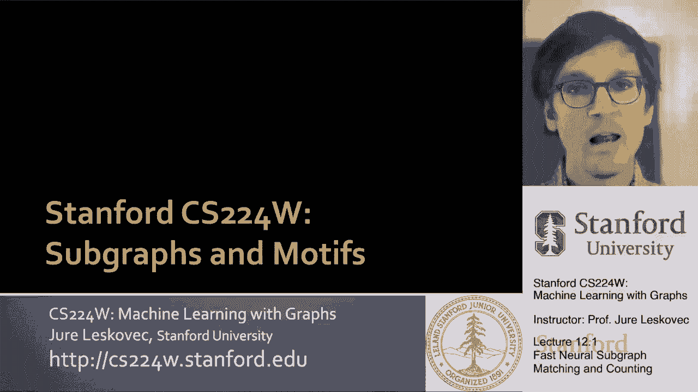
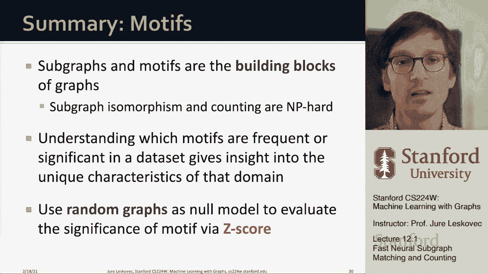

# 【双语字幕】斯坦福CS224W《图机器学习》课程(2021) by Jure Leskovec - P34：12.1 -Fast Neural Subgraph - 爱可可-爱生活 - BV1RZ4y1c7Co

今天我们要谈谈新的，非常有趣和令人兴奋的问题，称为子图匹配和子图计数，或者呃，频繁子图计数和频繁子图匹配，令人兴奋的是我们会，呃，谈谈如何用神经网络做到这一点，所以基本上你怎么能把一个非常，呃古典。

呃呃问题，呃，一种经典的组合问题，并将其转化为机器学习问题，呃，这将是令人兴奋的部分，我们将使用嵌入和图神经网络，让这一切运转起来，我们将能够扩大规模，使其准确，有点像侧边踏步。

基于复杂离散的匹配与计数。

所以嗯，今天的想法是这样的，对呀，我们得到了一个大图，我们想确定在这个图中哪些子图是常见的，就像我们可以把图看作，作为一个由一组积木组成的存在，意思是小子图，我们可以想出一个大图。

几乎是由这些小碎片组成的，就像我们说的那样，你知道吗一旦你用乐高做了一些东西，我知道怎么做的那个物体，所以你建造了，它是由小碎片组成的，这些小碎片将所有这些结合在一起，创造了一个房子，对呀。

所以在某种意义上，我们想确定的是，最常见的乐高积木是什么，呃，那个呃，把图形组合在一起，所以嗯，这里的力量就是，我们能够根据这些构建块来描述和区分不同的网络，今天的任务是，我们如何识别和定义这些构建块。

呃用于图表，所以给大家举个例子，你可以拿一组分子，我在这里给你看，你可以把它们表示为图表，现在你可以问，常见的模式是什么，什么是常见的子结构，呃在这个，呃，在这些图中，然后呃，这样我就能理解了。

假设这些分子的结构，在这种情况下，什么是重要的子结构，例如，你可以识别出这种特殊的um亚结构在所有的分子中是共同的，事实证明，这实际上是一个非常重要的群体，它会告诉你这个分子是酸性的还是不酸性的。

所以在许多领域中，你有这些反复出现的结构组件，这些组件决定了功能或行为，图表的呃，就像这个例子中的分子，当然，问题是我们如何，我们将从三个不同的角度来解决这个问题，嗯，有点像一套三个步骤。

首先我们要讨论子图和母题，在那里我们将定义什么是子图，什么是母题，然后我们还将讨论如何识别重要的主题，然后我们就完成了第一步，我们将讨论如何使用图形，表示子图的神经网络和嵌入，我们如何快速识别公共子图。

只使用嵌入空间，不需要做，嗯。

非常昂贵，呃离散型，呃匹配，所以让我先去定义嗯。

子图和母题，所以有两种方法来形式化这个想法，网络的构建块，对呀，所以我们得到了一个网络，我们得到了一个带有一组节点和一组边的图，我们将使用的第一个定义叫做节点诱导子图，在哪里，基本上。

这个想法是你取节点的子集，所有连接这些节点的边缘，所以诱导意味着它是由节点集决定的，所以我们的想法是，让我们假设这个g素数在一组，呃，节点，v素数和一组边，e素数是节点诱导子图，如果节点集是节点的子集。

然后边缘，边集只是存在于较大的，在更大的图中，其中两个端点都是我的子图的一部分，对呀，所以这意味着g素数是一个子图，由顶点集诱导，呃，V素右，所以基本上诱导的意思是它需要它是它。

意思是把所有的边都取下来，而不是你确定的顶点，所以我们只能选择顶点，边缘，呃，边是由顶点集决定的，呃，我们选择了，嗯，这就是人们所说的节点诱导子图，或者一般我们称之为诱导子图。

它基本上是由一组节点定义的子图，我们把所有的边缘，呃，在那一套之间，嗯，那么第二个不太常见的定义是谈论边诱导子图，这里我们取一个边的子集和所有相应的节点，所以g素数是边诱导子图，嗯，呃。

简单定义为边的子集，E素数，它是边的子集，E在整个网络中，然后在这种情况下，v素数，呃，节点集是简单定义的，嗯，通过我们选择的边缘，嗯，所以在我们将要使用的术语中，通常我们说这是一个非诱导子图。

或者只是一个子图，因为它是由边的集合而不是由节点的集合决定的，所以当我们说诱导子图时，我们的意思是选择一组节点并确定边缘，当我们说非诱导的时候，这意味着只需选择节点，边缘，然后节点自动得到，呃，确定了。

形式化网络构建块的两种方法，嗯，这真的取决于，呃，在我们感兴趣的域上，人们通常喜欢使用诱导子图，因为否则，如果你做边缘，呃诱导子图，呃的数量，可能性，呃，然后爆炸，尤其是在自然科学领域，如化学等。

我们担心功能组，我们将在其他领域使用节点诱导子图，比如说，知识图，它实际上经常是边诱导子图，比如说，如果你考虑聚焦代表，所以现在我们已经定义了这两个，没有子图的概念，那么嗯，你知道前面关于子图的定义。

我基本上说v素数是v的子集，E素数是E的子集，这基本上意味着节点和边取自原始图，呃现在嗯，你也可以说好，如果v素数和e素数来自完全不同的图，比如说，你能以某种方式定义，你知道你有两个不同的图表，一加二。

你能说G1包含在G2中吗，g 1是由三个节点组成的三角形，我们可以看到，在g 2中，这个三角形包含在子图x中，呃y，uh和z，那么我们怎么说一个图，g一个包含在另一个中，假设更大的图，呃两个。

我们这样做的方法是我们需要定义呃问题，或者图同构的任务，其中图同构问题是以下问题，你想检查一下，基本上说是，否，两个图是否相同，所以这个想法是我在一些节点和边上有一个图G，我又打开了第二张图，一些节点。

呃和边缘，我说g 1和g 2是同构的，如果存在双射，基本上，这意味着在一个图的节点之间存在一对一的映射，到节点，另一张图的呃，这样所有的边缘，呃被保存了下来，意思是如果U和V在图1中以um连接。

然后节点的映射，呃，和节点v的映射也是相连的，呃在图2中，所以这个a和b实际上应该是，呃u和v，所以我们需要，我们会解决的，所以这个映射f叫做图同构，所以给大家举个例子，如果我这里有两个图，你知道吗。

有一个是这样的，另一个是这样的，它们是同构的，因为如果我有一张地图，呃，这个节点，呃一个到，就像我在这里展示的那样，一个对另一个，然后基本上边缘，比如说，这两个节点在这里连接，它们也连接在那里。

这里有一个连接，在这里，以此类推，所以很明显这两个图是同构的，我可以将节点从一个映射到另一个，我可以保存，呃，这里面所有的边缘，在类似的意义上，这两个图不是同构的，因为我没有办法映射左图的这四个节点。

到右图的节点，这样，如果左边连接两个节点，我知道他们在右边也是相连的，所以这就是图同构的问题，两个图是否相同，和，这里的问题是，我们不知道节点是如何相互映射的，好吧，这又回到了这个想法，订货，或者呃。

没有节点的想法是任意的，所以对他们来说真的没有特别的命令，所以我们真的需要在某种意义上检查一下，所有可能的命令以确定，如果一个图相同，呃然后另一张图，嗯，如果你问，好的，那么这个图的同构步骤有多难。

嗯问题是，实际上不知道图形同构是否是空硬的，我们不知道任何求解图同构的多项式算法，所以看起来这是一个超级有趣的问题，我们不能同时证明它是空的，我们不知道，呃，任何算法，或者没有人能确定算法。

这将在多项式时间内解决这个问题，所以它介于两者之间，没人知道还是一个大的，呃，未解决的问题，这就是图同构的概念，所以现在我们可以定义子图同构的概念，我们说呃，g，g 2子图同构于g 1。

如果对于g 2的某个子图，这个子图同构于g 1，所以我们通常所说的，也就是g 1是g 2的子图，对，在这种情况下，我们可以使用节点或边缘诱导子图定义，这个问题是众所周知的，很难给你一个例子，对呀。

这是一号，这是图G二，我说呃，g 1同构于g 2的子图，或者G1在是G2的子图，因为如果我使用这个特定的节点映射，对呀，A到X的映射，在映射到y和c映射到z中。

那么G1中三个节点之间的连接在G2中保留了下来，也是，请注意，我们不关心额外的连接，所以这并不重要，因为这个节点这个结构不是g 1的一部分，另一件同样重要的事情是要注意的，这个映射不需要是唯一的。

呃子呃图到另一个图的节点，以一对一映射的独特方式，所以两个节点不能映射到同一个节点，所以在这种情况下，嗯，我们现在有，能够从数学上定义并确定g 1是一个子图，g 2的h，因为存在双射映射所以一对一映射。

所以呃有任何，从g 1映射到g 2的节点，如果G中的两个节点相连，然后他们的地图，呃，他们的呃，转换也与，呃，G二，反过来，对，所以这就是，这才是最重要的，呃这里的一部分，所以现在嗯，到目前为止。

我们学到了什么，我们定义了子图的概念，我们定义了图同构问题的概念，然后我们还定义了子图同构问题的概念，对呀，基本上说的是现在大图中包含的小图是什么，当然当我们谈到子图的时候。

通常我们对给定大小的所有子图都感兴趣，呃尺寸，表示节点数，如果我们谈论，呃，呃不同嗯，呃，子图，给定大小的uh，所以呃显示，呃，实际上有很多给定大小的不同子图，这个数字增加了，呃非常非常快，例如。

如果呃，这里，我给你看，大小为4的所有非同构连通无向图的一个例子，对呀，这些都是四个节点上可能的图，其中节点数固定，边数可以变化，另一个限制是这些图是连通的，所以有四种不同的，四个节点上的um图。

呃现在没有方向了，例如，如果你说什么是非同构连通的，呃，大小为3的图形，如果你看看那个，已经有十三个了，只有三个节点，但是因为边缘是有方向的，我可以在不同的方向上有边缘，这给了我13种不同的，呃图表。

那么为什么，为什么这很重要，因为如果我有一个有向图，我说三号的积木是什么，然后我需要确定频率，这个特定子图的次数，第一名包括在大图中，然后我需要确定这家伙多久，嗯，呃包括，等等，所以重点是，嗯。

这些构建块的数量，呃不同的子图，呃增长超指数，所以总的来说，人们通常只数4号的积木，五个，因为即使在五级，有成千上万的人，有很多东西要跟踪，它变成了一个非常困难的计算问题。

既然我们已经定义了子图包含的概念，我向你展示了有许多不同的可能子图，呃，非同构的，呃，具有给定数量的节点，现在我们定义下一个对今天的讨论很重要的概念，这就是网络主题的概念，而网络母题被定义为一个循环的。

图形中互连的显著模式，所以现在让我们打开这个，像这样确定，使其精确，首先我们把网络主题定义为一种模式，这意味着一个小节点诱导子图，然后我们需要说，我们是什么意思，复现权，反复出现意味着它必须出现，呃。

多次右，它必须有很高的频率，它必须包含在感兴趣的底层图中很多次，然后还有一个有趣的嗯，我们说重要的和重要的，意味着它比我们预期的更频繁，当然，如果你说的比我们预期的更频繁，那你需要有某种方式说，好的。

但我能指望什么，这意味着您需要有一个空模型，你需要有一个随机的图，空模型，所以你说，嗯哼，我在模型中的期望，我在现实中看到的，有很大的差异吗，如果有很大的差异，这个，那么这个子图模式。

这个主题一定很重要，所以让我们告诉你，把它磨出来，呃科学家给你一个想法，想象一下，我对有向图中三个节点上的这个特殊主题感兴趣，那么嗯，当我谈到主题时，这些图案需要诱导，例如。

这不是感兴趣的主题的一个例子，因为实际上这是一个由三个节点组成的三角形，它不是，呃，所以没有边缘，呃，在我的主题这里，但有，比如说，所以真正的例子在这里，因为这个有趣的子图，这个主题出现在这里。

有一对一的映射，所以我说，啊哈，我在这里发现了这件事的例子，当然啦，呃，你知道，还有很多其他地方，这个呃，相同的主题，呃发生，所以嗯，问题是，为什么我们需要这种母题和母题的概念，帮助我们了解如何，呃。

图形工作，网络如何工作，他们帮助我们，呃，它们帮助我们做出预测，基于存在或不存在，数据集中的母题，所以说，比如说，呃，前馈，呃，循环，这被定义为前馈循环母题被发现很重要，嗯为了，呃，呃，神经元网络。

所以基本上是大脑网络，因为他们，呃中和所谓的生物噪音，呃，平行环在食物网中很重要，因为它说，嗯，给定的掠夺性喷洒，呃，呃，在两个不同的，呃，有共同食物来源的物种，你知道在，比如说。

你有很多这种类型的单曲，所谓的单输入模块，哪里嗯，这个基因调节，呃，很多其他的基因，所以这些是一些例子，呃，图案的意义，对于给定的底层网络的功能，现在，呃，让我们去定义我们讨论过的两件事。

首先我们需要定义频率，第二，我们需要定义意义，所以让我们先定义频率，对呀，假设g子q是一个小的，感兴趣的子图和GT是大目标图，然后我们说我们将定义一个图，uh级子图频率，嗯，根据以下定义。

我们说这个图的频率g，大图中的GQ，GT是节点的唯一子集数，嗯在呃，每个的大图，子图，呃，呃的呃，由其节点诱导的大图是同构于此的，我们就叫它GCubed吧，所以查询图所以给你给你一个例子，对呀。

这是一口，但直觉其实很简单，这里我有查询图，这里，我有目标图，此查询图在目标图中出现两次，你知道有两个三角形，一个在这里，另一个在这里，所以频率是二，这里有一个不同的例子，想象一下我有这个星子图，嗯。

我想问它，它在这个图中出现的频率是多少，嗯，嗯感兴趣实际上在这里，呃也许呃直觉上是相反的，频率会超大，因为您知道中心节点将映射到中心节点，但是这个叶子节点的卫星数量，嗯是巨大的。

因为我可以从一百个中选择任何六个，我选择它是一个不同的映射，所以我基本上数，我有多少种不同的方法来获取这个图并将其映射到目标图，所以在本例中，不同映射的数量，映射将是一百，选六个。

因为在这里的一百个节点中，我想选择六个不同的子集，因为星图有，呃六个节点，所以这里，这个呃的频率会是，嗯，将是巨大的，所以嗯，这是呃，图形级别，子图频率，呃定义，还有一个更精确的呃频率定义叫做节点级。

呃子图频率定义，这里的想法是呃，查询附带一个，呃附带了一个图表和一个锚，当我们做映射的时候，我们说这个锚可以映射多少个不同的节点，所以这个子图，包含uh q，呃在目标图中，对呀，所以我们在这里说。

我想能够绘制地图，呃，图的边，呃Q到图，呃T，我想数数这个锚可以有多少个不同的节点，呃节点，呃被映射，所以在我们的情况下，比如说，如果我有上一个案例中的星图，呃作为主播。

那么这个图在我的目标图中的频率将是，呃一个，所以只有一种方法来映射这个锚，呃到我的目标图，比如说，如果我选择锚作为卫星之一，那么子图的频率就是一百，因为有整整一百种方法来绘制锚，到这一百个节点中的一个。

使整个子图映射，呃到呃到目标图，这是节点级子图的定义，我们有这种锚，我们在问我们多久能把锚和相应的，呃子图，好的，所以现在我们已经定义了，呃，子图频率，图级和节点级，最后要说的是，你知道的，有问题吗。

如果图形断开，如果我有多个小连通图，断开图解很简单，我可以简单地处理所有这些小的，把子图分成一个巨大的图，有多个相连的部分，所以没问题，只是为了解决这个问题，所以现在我们已经定义了频率。

我们需要定义意义，我们将定义主题意义，嗯，以一种我们比较的方式，我们将出现的次数与某个空模型进行比较，用某种比较点，这个想法是，如果给定的子图发生，嗯，在真实的图中比在随机的网络中更频繁。

那么这就有了功能意义，所以现在让我来定义呃，快点，我们如何生成随机图，定义随机图的第一种方法是，鄂尔多斯雨天随机图模型，这个随机图模型是一个有两个参数的随机图模型，它有n和p，n是节点数，p是边的概率。

那么如何从这个模型生成一个图，您只需创建n个隔离节点，然后对于每对节点，你抛一个有偏见的硬币，偏置p，如果尾巴，掷硬币说创造一个边缘，然后你就会创造出一个边缘，写出生成的图是随机过程的结果，因此。

您可以生成的多个图形越多，它们会有所不同，因为掷硬币会出现，呃不同，即使你在这里设置了相同的参数，你知道我有五个节点，所以和是五，边缘的概率是点六，你知道这就像，假设从这个生成的随机图的三个实例。

呃G NP模型，所以嗯，现在下一个问题是，我们能有一个更精确的，呃，像呃这样的模特，因为在这个模型中，我可以指定，是节点数和边的概率，所以实际上有一个更精确的模型，呃，这就是所谓的配置模型。

这里的目标是生成一个具有给定度序列的随机图，那么这意味着什么呢，如果我有我的真实图表，呃gt，我想生成它的随机版本，有一个随机版本的方法，只是说，你知道我的GT有N个节点，所以让我生成。

我输入有n个节点的下雨随机图，我将设置参数p的值，这样，在预期中，这个随机误差，神龛图的边数将与我的，呃gt，所以我在节点数和边数方面匹配，在配置模型中，我们将匹配节点的数量，边数，也是节点的度数。

所以基本上我们会说我想生成一个随机图，具有给定度序列的，意思是我有一个到n的节点，每个节点都有一个给定的度，但我没有指定节点如何相互连接，嗯，我这样做的方式，它其实很简单很优雅，我创建n个节点。

对于每个节点，我创建呃呃K潜艇，呃我呃，对辐条，所以说，比如说，节点b有四次，所以它有四个辐条，节点C的度数为2，所以它有两个辐条，我现在能做的就是，我将每个辐条表示为一个节点，好吧，我拿着这个辐条。

我创建呃辐条作为节点，每个超级节点都有辐条，呃属于一个特定的盒子，我现在要做的是，我随机配对，呃，辐条是对的，我基本上是随机地把这些节点配对，然后我确定一对节点之间的边，如果至少有一个从一个分区说话。

链接到另一个分区中的辐条，例如这里a和b在这里相连，因为里面有一个节点，链接到节点的，b um，当然这里的问题是，有时我会有，呃多重，呃辐条相互连接，这只会导致一个单一的边缘，所以我会忽略这一点。

当然也可能发生，例如，这两个节点将相互连接，所以这将对应于一个自循环，我也会忽略这一点，我可以忽略这一切的原因是，在实践中，来自同一节点的辐条之间存在多条边的概率，或者嗯。

作为一个产生自我循环的细胞是如此之小，以至于我可以，呃，为了实际的目的，忽略它，从数学上来说，呃，你可以忽略它，因为它是如此罕见，所以基本上这意味着现在我有了一个非常有用的网络零模型。

因为我可以把真实的网络和随机的版本进行比较，具有相同度序列的网络的，右节点使节点具有与，呃g，呃真的，现在这给了我另一个不同的空模型，基本上我在那里创建辐条，然后我通过随机连接辐条来创建一个GPS。

然后把这些说话的节点连接起来，呃这些小节点回去，呃结果的呃图，所以现在我们已经定义了，两个随机模型，配置模型和雨天模型，一般来说，我们更喜欢使用配置模型，现在我们需要确定和定义什么是主题意义。

我们的直觉是母题在网络中被过度表示，当我们把它和这个随机空图进行比较时，所以这个想法是这样的，我要选一个感兴趣的子图，我要在真实的图表中计算它的频率，然后我会生成很多随机图，在一些统计数据上。

这与真实的图表相匹配，比如节点数，边数，呃还有度序列，我要计算相同主题的频率，嗯嗯，随机图也是，然后我要定义下一个，一个统计指标会告诉我，呃，有点怎么，怎么，真实图形中母题的频率差异有多大。

与随机版本相比，我要定义的统计数据要量化，这叫做Z分数，所以让我解释一下呃，Z分数是多少，所以这个分数，嗯嗯，一个给定的呃，给定母题的子图，I IS捕捉到了它的统计显著性，我们要做的方法是简单地说。

这个主题I在真实图形中出现的次数是多少，这个相同主题的平均次数是多少，我出现在真实图形的随机版本中，因为我们有多个实例化，我可以计算出平均值，当然我也可以计算，在这些不同的随机实例中，这个母题的频率。

对应于呃的随机图，真实图形和Z得分现在，基本上会告诉我这个主题有多大的代表性或代表性不足，好的我们在做两件事我们计算，我们计算比较实图和随机图中的频率，然后除以标准差。

通过随机图的多个实例中该计数的方差，对呀，那么基本上这意味着什么，我们根据自然的变异性来归一化计数，那个主题的计数，所以现在这给了我一个给定主题的Z分数，然后人们计算和定义的是所谓的网络意义配置文件。

基本上我们做的是，使Z分数的平方和等于1，所以基本上我们把这个显著性剖面规范化，在显著性剖面的i分量处，我们取呃的z分，子图i除以平方和的平方根，这门课的，呃，注意这个分数，呃，这个分数是这样的。

如果它是零，这意味着呃，母题在实图中的出现频率与在随机图中的出现频率一样高，然后嗯，如果你知道Z分数大于正数，呃或者呃减去两个，那么我们会说一个给定的母题在统计上是显著的。

出现的频率在统计上显著增加或减少，然后嗯我们发生了什么，呃，在随机图中，所以嗯，这使得我们现在可以比较不同规模的网络，因为行数可能会有很大的不同，但Z分数是呃大小，呃，不变量，如此重要的意义剖面是。

基本上对于每个子图，我们必须计算它在真实图形中出现的频率，它在随机图中出现的频率，我们需要在多个随机实例化上这样做，这样我们就可以计算，Z得分，我们需要对每一个可能的子图都这样做。

呃一个给定的呃大小然后，比如说，我们可以采取不同的网络，像基因调控网络，神经元间突触连接的神经网络，我们可以通过网络把世界的网络，我们可以利用社交网络，甚至像基于文本定义的网络，基于单词邻接。

并比较频率和显著性分布，他们之间有趣的是，例如，这里是这十三个，大小的子图，有向图的尺寸为3，所以这些现在是，呃，我的图案和y轴，这是Z分数，这里是网络中同一类型A的不同实例，例如，这里有三个例子，呃。

网络图表和社交网络的三个实例，你可以看到它们基本上有相同的意义，你看，比如说，这个三角形，嗯，相互联系被严重高估，你注意到这个特殊的主题是如何，例如，这里的代表性非常不足，和，例如，在社交网络中。

这是有意义的，因为这上面写着你知道，想象一下这是你自己或者我自己，这意味着我有两个朋友，我有很强的关系，但这两个朋友彼此不是朋友，事实上，社会科学理论说，在这种情况下会发生什么，这两个人要么成为朋友。

你最终得到了这个主题，十三个或者其中一个边缘会断裂，因为对你来说和两个不同的人维持两个不同的关系太难了，嗯，而不是你知道，把他们聚集在一起，这几乎就像说你每周都要去喝两杯咖啡。

而不是你们三个去喝杯咖啡玩得很开心，对呀，像这样就硬多了，呃，来维持，呃，在实践中，你可以看到，呃，社交网络，这个主题的代表性严重不足，嗯，但例如，你可以看到在其他类型的网络中，就像信号，它其实是，呃。

这里的前馈类型循环是，所以基本上你可以洞察嗯，网络的函数，呃主题，呃简介，所以让我总结一下，我们决定的是，如何检测网络主题，你在真正的网络中首先计算子图，然后你在真实网络的随机版本中计算相同的子图i。

这里，表示为g r，是一个空模型，具有相同数量的节点，相同的边数和相同的度分布，或者与真实网络相同的度序列，然后为每个子图分配或计算Z分数，我在那里你只是说，这个呃，子图出现在实图中，减。

它在随机图中出现的频率有多高，除以计数的标准差，它在随机图中的um，然后呃，你知道，高绝对话语母题，这意味着他们要么代表性过高，要么代表性过高，呃，在我的图表中代表性不足，我们就是这么说的，呃重要。

所以嗯，你知道，最后要说的话，在这种情况下，这个主题概念有许多变体，你知道有向图和无向图都有扩展，有彩色的扩展，呃，节点，所以意思是不同类型的节点，也有扩展到，呃，颞部，颞部，时间图也是。

所以和时间主题，在如何定义频率方面也有很多变化，你如何定义统计显著性，呃，你如何定义代表性不足，你能数数吗，呃，也是反母题，所以基本上没有边缘是很重要的，还有呃，如何做不同的空模型。

所以在这个概念上有大量非常丰富的文献和非常活跃的研究领域，呃，图案，因此，总结一下，主题和子图是网络的组成部分，子图同构和子图计数是呃，空心问题，了解哪些主题是常见的，或者呃，在数据集中很重要。

使我们能够洞察域的独特特征。

我们用随机图，呃，空模型基本上作为参考点，通过计算来评估给定母题的显著性，呃。

