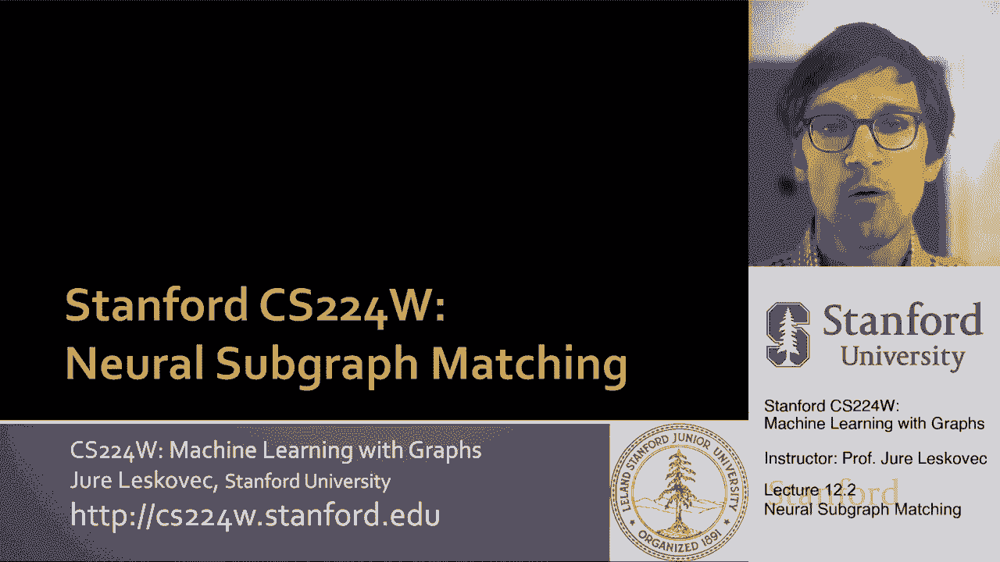
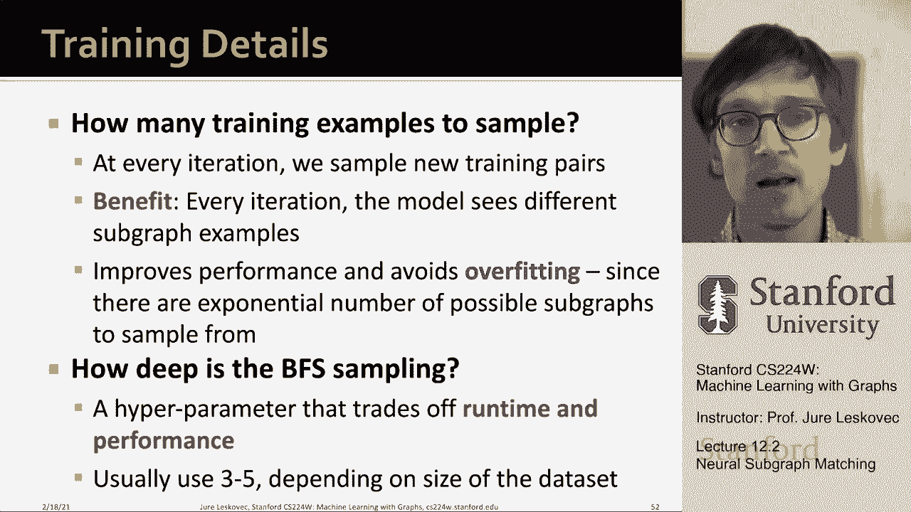

# 【双语字幕】斯坦福CS224W《图机器学习》课程(2021) by Jure Leskovec - P35：12.2 -  Neural Subgraph Matching - 爱可可-爱生活 - BV1RZ4y1c7Co

所以现在我们已经定义了网络母题的概念，和子网子图的概念，我真的在用这两个术语，呃互换，现在我们需要，嗯，然后我们还定义了给定母题的频率，或者给定图中给定子图的频率，现在我们想基本上开发一种神经网络方法。

这将使我们能够快速确定给定的。

呃图是一个更大的图中的子图，所以给你，接下来我们将讨论神经子图，呃陈述，那么有什么问题呢，这个问题叫做子图匹配，我得到了一个大的目标图，我得到了一个小的呃查询图，我必须决定一个查询是否是一个子图。

在目标图中，对，例如，这是我的问题，这是我的目标图，在这种情况下，答案应该是肯定的，因为这组特殊的四个节点，映射到这个特定的四个节点集，边缘保留在这里，我用不同的颜色来表示。

您知道这个节点可以映射到那个节点，你知道这个节点映射到这个节点，以此类推，因此查询Q包含在目标中，呃，图嗯，这就是，这是第一次，呃，这就是我们要做的问题，我们只想答应，没有权利，这不是关于，数字还没有。

我们只想说包括查询，是目标图的子图吗，我们要怎么做，而不是作为一种组合匹配来做，试着一条一条地检查，如果呃，查询包含在目标中，我们将开发一种机器学习的方法，所以基本上我们要把它作为一个预测任务来制定。

我们的直觉会是，我们要利用嵌入空间的几何形状，捕捉子图关系，所以让我，呃，呃，现在有点，呃，呃，呃，打开包装，我是什么意思，呃，因为那个，所以任务是我想做一个二进制预测来返回true。

如果查询同构于目标图的子图，否则我返回假的，所以再一次，在这种情况下，我给你查询，目标和虚线，呃，边表示线条，表示节点对应，所以在这种情况下，只需注意，我们不会对真正找到通信感兴趣。

因为这是另一个具有挑战性的问题，什么，我们不打算谈论它，我们想要的只是真假对，给定查询给定目标，返回true，如果查询显示为目标的子图，否则返回假，我们只是对二进制任务中的决策问题感兴趣。

那么我们将如何处理这个问题，呃，下文，这是对该方法的高级概述，我们取一个大的输入图，目标图，我们将把它分解为一组，在一些街区，这些街区将是，我们说相对较小，所以我们要把它分解成一组街区。

然后我们要用图神经网络来嵌入，呃，每个街区，我们将基本上应用图嵌入，为每个邻居创建嵌入，然后在查询的时候我们也会接受查询，我们将嵌入查询，然后我们要做的是我们要建立一个预测器，会说。

给定查询的嵌入和邻域的嵌入，你知道呃预测是或否对，是的意味着给定给定，呃呃，包含的给定查询是一个子图，给定的um，呃呃，呃，邻居和呃呃，给定查询不是给定邻域的子图，例如，对于这个查询和这个邻域。

我们应该预测呃没有这个呃邻居和查询，我们预测是的，这里我们也预测是的，因为它是一个三角形和一条边，三角形和边，你知道我们的查询是三角形和边，对呀，所以基本上基于嵌入，我们想做这些预测，这可能是超级快的。

因为当我给出一个查询时，我只是在这些街区跑来跑去做预测，是的不是，是呀，否，是呀，否，这就是本质上的想法，那么我们要怎么做呢，让我们给出更多的细节，我们将使用节点锚定定义，对呀。

这意味着我们将有一个锚的概念，我们试图预测一个给定的节点，锚定节点，查询，um又是a的子图，进入目标的给定锚，呃图，所以我们正在与，呃锚定，呃，定义，其中我们，这意味着一个锚必须映射到另一个锚。

然后所有的边和所有其他节点，呃必须绘制地图，呃也是，所以这是最重要的一点，我们有一个锚的概念，嗯第二个，嗯，重要的重要的，呃，概念，我们要把目标图分解为一组邻域，所以在这些街区将是节点锚定的。

这意味着什么，基本上，我们会选择一个节点，然后我们绕着它走一圈，但让我们假设一跳二跳，嗯，然后这将创建一个社区，我们要把这个街区嵌入，所以我们取目标图，我们将创建许多社区，呃，并将它们嵌入。

然后对于给定的查询，任务将得到查询，uh和邻域预测查询是否是邻域的子图，所以整个方法如下，正如我所说，我们创建一个查询，选择一个锚节点，嗯，呃和呃，把它嵌入，我们取目标图，把它分解成许多，呃，街区，嗯。

并嵌入这些社区，现在给出了查询的嵌入和邻域的嵌入，我们想预测回报，真假，这个查询呃是一个呃，邻域的节点锚定子图并返回false，如果嗯，此节点锚定查询不是该节点的子图，呃锚定呃，邻居，所以那是呃。

怎么呃，我们要做这个，嗯所以现在，当然问题是，我们如何使用嵌入来进行预测，就…而言，呃，创建邻域的嵌入，我们就会，我们可以用一个标准的图神经网络，所以有点不太多，嗯嗯，呃，那里的重要性。

我就略过这个细节了，有一些有趣的建筑细节，但只是一个用于嵌入图的标准图神经网络，呃已经很好了，所以现在我们需要决定，我想谈谈，为什么我们选择锚定的社区，为什么不认识他们，非锚定，嗯，你知道的，回想一下。

节点级频率定义说你知道呃的数量，节点，U in g t，对于它，gt的某个子图同构于查询，和同构映射节点u，呃在G T到节点V在que右边，所以基本上主播必须绘制，加上所有的边缘，嗯。

剩下的节点也可以映射，重点是我们要创建这个锚嵌入，因为我们可以创建一个图形神经网络，嗯对嗯，在每个节点周围，和每个节点v，这样基本上就创建了街区的嵌入，所以这就是为什么，所以说。

我们将使用这些嵌入来决定，如果u的邻域同构于v的邻域的子图，我们不仅预测是否存在映射，但在某些情况下，我们也可以通过Corres来识别相应的节点，因为我们知道u对应于v，所以我们也会找到，锚。

那么我们如何将G T分解为街区，基本上对于目标图中的每个节点，我们要在锚周围获得一个K跳邻居，我们可以简单地用，呃，使用早餐搜索，通常你知道我们的参数k会在附近，你知道也许三个，也许四个。

所以基本上我们出去三跳，我们往外跳四跳，嗯，我们可以，这样我们就可以分解，呃分，目标图进入许多不同的街区，而现在，嗯，因为我们已经创造了邻居，我们简单地应用一个图神经网络，呃，锚节点的嵌入，呃。

将锚节点映射到嵌入空间，然后我们也可以这样做，呃，程序，呃，到查询以获得邻域，呃，在查询图中，嗯，然后我们要嵌入这些街区，正如我所说，通过计算使用GNN，简单地说，每个锚的节点嵌入，嗯在它的，呃，对应。

呃，邻居现在最酷的部分是什么，实际上这堂课最重要的部分，这个序嵌入空间的概念，所以你知道我们到目前为止谈的有点清楚，你也许听说过这件事，但你没有听说过这个话题，这现在超级酷，所以顺序嵌入空间，呃。

让我解释一下我们的意思，对呀，所以我们绘制图表，比如说六十四维嵌入，嗯，我们将假设嵌入空间是非负的，所以所有的坐标不是零就是正，然后我们要做的是，我们要捕捉偏序，嵌入空间中的传递性，对呀。

然后我们要用这个符号，呃说你知道呃，左边的节点，嗯是是，uh小于右节点，嗯，如果蓝色节点的所有坐标，呃，左节点的所有坐标小于或等于右节点的所有坐标，例如，你知道在这种情况下，这意味着，我们有这个传递性。

呃关系，因为直觉上，当我说所有的坐标都要少，这真的意味着，嗯，一个给定点必须在另一个点的左下角，对呀，所以如果这个点在左下角，那个点那个点在另一个点的左下方，那么第一个点也是在左下角，呃的呃，第三点右。

所以在这里你知道，嗯嗯，这个特殊的点在左下角，呃的呃，那个特定的点对，所以基本上我们想要的，你是想，嗯，有这些关系存在于较低的，呃到左下角，这意味着在这个空间的任何地方。

基本上所有的坐标都必须小于或等于，这意味着你必须嵌入到其他东西的左下角，所以这叫做顺序嵌入，因为这个偏序，这种传递性，呃被这种关系捕捉到了，你是不是嵌入了其他东西的左下角，所以你知道为什么。

你为什么要关心，就像，为什么是左下角，如此酷，如此重要，关键是呃，左下角是如此重要，是因为它捕获了子图，呃关系对吧，想象一下呃，比如说，呃，这里的情况是我有呃目标图，我有邻居，我有不同的，呃。

不同的查询对吗，那么在我的情况下，想象这是呃，锚定的节点，呃，我嵌入这里的邻居，我有两个锚定查询，查询一和查询二，现在因为基本上重点是，因为查询1是邻域的子图，查询1应该嵌入到邻域的左下角。

而查询二不是子图，所以它不应该嵌入到左下角，所以这里保留了子图关系的概念，因为查询1嵌入到呃的左下角，查询二，简单地通过比较这些嵌入的位置，锚节点，我们可以确定你知道，呃，查询一是呃的子图，锚点T。

当呃，查询二不是锚节点的子图，呃d，这就是我们可以很快从嵌入中读出的酷的部分，一个是否是另一个的子图，嗯，你知道的，为什么这个能起作用，我们为什么要关心这个，呃，传递的，呃，偏序，呃，在嵌入空间是因为。

um可以很好地编码在这个顺序嵌入空间中，其中顺序由这个关系定义，你是别人的左下角吗，原因是因为顺序顺序关系，所以左下角的关系是传递的，子图同构也是传递的，它有这种不对称的性质，它也是按照顺序编码的。

嵌入，如果G1是G2的子图，G2是G1的子图，那么g 1和g 2是同构的，他们是一样的，所以如果一个点在一个的左下角，另一个是第一个的左下角，那么点在同一位置，所以这两个图是同构的。

传递意味着如果g 1是g 2的子图，2等于3，那么G1也是G3的子图，它又是由呃编码的，你知道子图的关系，最后一个是更近的跑步者交叉口的概念，一个节点的平凡图是任意节点的子图，在我们的例子中。

它将是在坐标原点零的嵌入，零是每一个其他嵌入的子图，它在任何其他嵌入的左下角，所以基本上这个顺序嵌入空间由这个关系定义，是另一个点的左下角的一点，具有子图关系的所有这些性质，嗯。

现在我们感兴趣的原因正如我所说的，在这里我展示，呃，更正式的是，你知道顺序嵌入空间捕获了传递性，从某种意义上说，如果第一个点是第二个点的子图，第二个是第三个的，那么第一个也是第三个的子图，呃。

我们有反对称性的概念，如果一个在另一个的左下角，另一个在第一个的左下角，那他们就是，它们是等价的，它们基本上是重叠的，嗯，最后一个是这个，呃，关闭，呃，在交叉口下，呃，这里说明了，呃，在右边在右边。

所以基本上顺序嵌入空间，由这个左下角关系定义的捕获与子图相同类型的模式属性，呃关系有，这是订单嵌入空间的重要部分，也是很酷的部分，所以现在我们要学习这些，锚定社区，使子图关系保持正确。

所以我们将使用GNN，学习街区的嵌入，基本上是学习锚节点的嵌入，为了保持这种顺序嵌入结构，保留子图结构，所以问题是我们应该使用什么样的损失函数，所以博学的呃，嵌入算子反映子图关系，嗯。

我们将设计一个基于订单约束的损失函数，Order约束指定嵌入的理想顺序，反映呃的左下角属性，子图关系，所以我们指定这个，我们所说的顺序约束，确保子图属性保留在嵌入空间中。

所以基本上这里的意思是它是用数学写的，但基本上它说，如果一个查询是目标的子图，那么每个坐标，查询的每个嵌入坐标都应该小于呃，嵌入，呃，目标的每个嵌入坐标，对呀，所以如果q是t的子图，然后锚节点的嵌入。

呃在T应该是嗯，大于等于大于嵌入呃，查询Q，所以关系是这样的对吗，这是查询，那是目标，所以锚节点，呃，从查询中，应该嵌入到目标的锚节点的左下角，因为呃，我们，呃，这个，这是一个锚定子图，目标的。

所以那是，基本上我们是什么意思，按顺序约束是你必须在左下角，gnn嵌入是使用uh学习的，通过最小化所谓的最大保证金损失，所以基本上我们要做的是定义损失的概念，我们在说，好的，那么这个限制违反了多少。

所以基本上我们在这里说，这是零的最大值和坐标的差异，所以如果坐标z t总是大于q的坐标，那么这个差值就是负的，所以负的最大值和零是零，所以违约率为零，但是如果子图关系没有保持。

这意味着沿着给定的坐标q在z的右边或顶部，这意味着z q大于z t，那么这种差异将是正的，然后最大值为零，正数就是正数，所以这个E是边距，基本上会嗯，给定查询和给定查询之间违反Order约束的数量。

呃目标对，所以这里没有违规，而在这种情况下，存在违规行为，因为q是t的子图，但是Q没有嵌入到左下角，那个那个那个，根据呃，沿着第一维度，这种差异将是正的，所以整个最大值将是正的，呃也是。

所以我们现在就是这样写的，重要的是这次的损失，这个呃处罚，呃e是可微的，这样我们就可以，将这个惩罚反向传播到图神经网络中，呃建筑，所以嵌入是通过呃学习的，最小化最大保证金损失，所以我们有这个E决定了。

给定图之间的顺序约束违反量，呃和一个目标，我们称之为惩罚，这种侵犯，边距，所以我们想学习正确的顺序嵌入，所以呃，当GQ是呃的子图时，惩罚为零，gt，惩罚大于零，当GQ不是GT右的子图时。

所以我们想要零的惩罚，当呃，一个是子图，所以它必须嵌入到左下角，然后惩罚就是零，如果不是子图，那么我们希望这个点球很高，因为g，q不应嵌入到，呃，gt，所以要学会这个，嗯嗯，这个呃，嵌入函数。

我们需要构建训练示例，GQ和GT的权利，哪里呃，你知道，有一半的时间g q是子图，另外一半的时间不会，然后向右，当我们要进行嵌入神经网络的训练时，我们要让它成为积极的例子，我们想把惩罚降到最低。

对于消极的例子，我们希望最大限度地惩罚，下面是你如何把这一切都写出来，呃被另一种，嗯，呃，铰链铰链损失，呃类型表达式，在那里我们再次说，如果呃，如果呃，如果会是，嗯嗯，正面例子，我希望这是零，所以嗯。

你知道，我会，我会，我去拿α和阴性的，呃例子，呃，呃我，这将大于零，所以这是这个，呃，这个表达式会更小，所以我想能够，呃，呃，最小化这一点，呃最大值，那么，嗯。

现在我如何生成训练示例是通过简单地选择一个锚节点，然后先做一个宽度，一种概率宽度，首先在它周围搜索，这意味着我将拥有，我将生成查询，这将是给定邻域的给定的子图，然后生成一个负面的例子，我能你知道。

通过以下方式破坏查询，你知道的，也许移除一个节点，加一条边，去除边缘，呃诸如此类的事情对吧，所以呃，这样它就不再是，嗯一个子图，所以你知道我选择了多少这样的训练例子，这样我就可以训练我的嵌入神经网络。

这个想法是当我训练这个的时候，我想，呃，在每个迭代样本中，新的训练对，好处是在每次迭代中，模型，呃会看到不同的，呃子图示例，它会提高性能，它会避免，呃，过装配，我想让我的呼吸有多深第一次搜索训练例子。

对邻域抽样。

嗯，这是运行时间和性能之间的一种权衡，我越陷越深，运行时间越长，但通常，我得到的嵌入越多，越好，所以通常我们会用，深度在3到5之间，也有点依赖，呃在数据集上，所以嗯，你知道我现在如何应用这个。

当新查询到达时，当新查询到达时，i查询有一个锚，我只是把锚嵌入，嗯，然后，嗯，程序是基本上对每一个其他，呃目标呃锚，目标图的邻域，我嗯，我比较了嗯锚邻居的嵌入和我的，uh锚定查询嵌入，如果。

如果查询嵌入到那个邻居的左下角，然后我说呃查询是邻域的子图，否则我会说这是，呃不是子图，对呀，所以基本上，嗯，我可以快速检查这个，简单的问是一个嵌入到左下角，另一个嵌入，让我总结一下这部分，所以嗯。

我们讨论了神经子图匹配，这是一种将子图匹配表述为机器学习的方法，呃问题，该方法避开了子图同构的NP难题，基本上给出一个查询和一个制表符目标图，我们嵌入了查询，我们嵌入目标图的节点锚定邻域。

我们训练我们的神经网络嵌入功能，这样，它将子图嵌入到，呃，以这样一种方式，它们位于彼此的左下角，如果q是t的子图，则右，然后q嵌入到左下角，嗯，所以这是，在这个嵌入神经网络的训练时。

我们强制它服从这个子图关系，这意味着，然后，我们可以非常容易地快速地找出查询是否是，给定，呃目标，呃邻居T，所以基本上用这个顺序嵌入属性嵌入图，或订单嵌入空间，允许我们非常非常快地测试子图同构。

通过简单地比较坐标，基本上说是嵌入到左下角的查询，目标的，给定子图同构的性质，呃操作员或关系，我们看到我们可以完美地将其编码到顺序嵌入空间中，这意味着实际上这一切都是可能的，嗯，我们可以，呃。

我们可以做到，然后它，呃。

