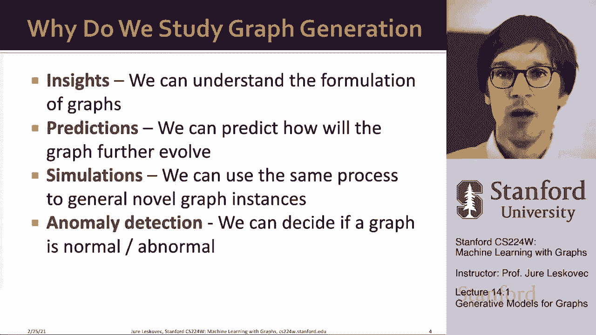
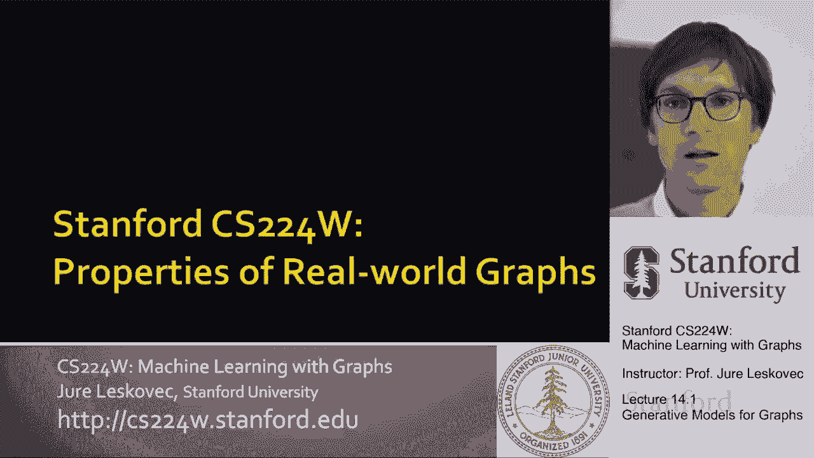
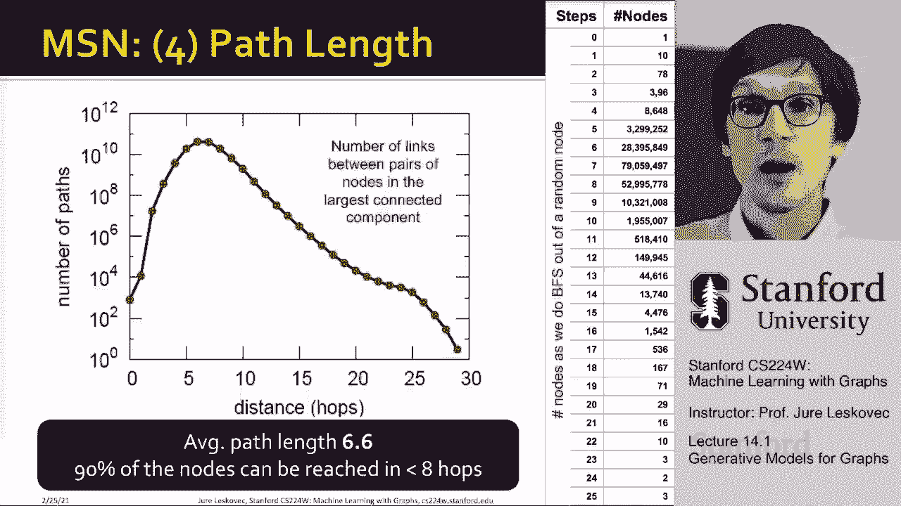
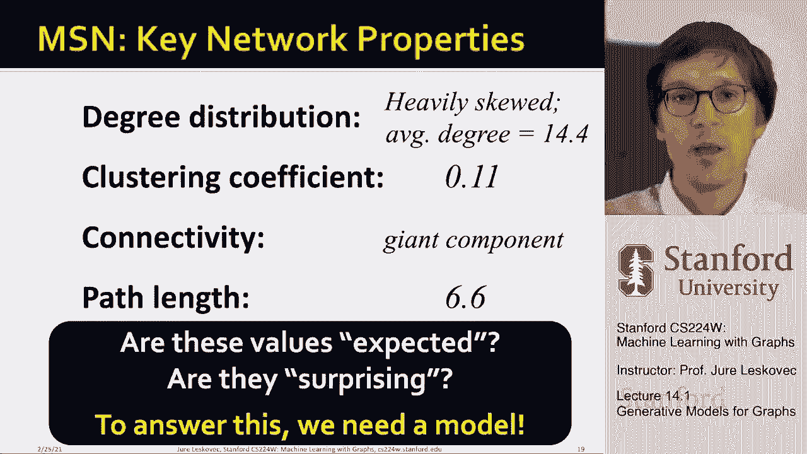

# 【双语字幕】斯坦福CS224W《图机器学习》课程(2021) by Jure Leskovec - P41：14.1 - Generative Models for Graphs - 爱可可-爱生活 - BV1RZ4y1c7Co

嗯，所以今天的课，我们要讨论的是，图的生成模型，到目前为止我们，在假设下工作，或者我们讨论了给出的方法，我们说图表是给出的，我们想做一些建模，上面的社区检测，我们要做的。

呃，看看呃，接下来的两节课是一个不同的问题，这是一个关于我们如何嗯的问题，生成图形，对呀，我们如何生成一个合成的社交网络，我们将如何生成一个合成的经济网络，我们如何生成一个合成通信网络，对呀，怎么样。

有哪些过程可以让我们生成这些类型的图，对嗯和嗯，我们可以的方式，呃，我们可以做到的是，我们希望使用生成模型生成逼真的图形，对呀，所以我们的想法是给我们一个呃，呃，图生成模型，我们希望能够。

生成一个类似于，或者呃，匹配呃，真实的图形，所以呃，这就是我们会做的，呃喜欢这样做，我们为什么要做图形生成，我们为什么要关心，首先，我们想了解实图是如何形成的。

所以这些生成模型可以为我们提供关于什么样的过程发生的洞察力，让我们说，在社会科学中，在人类中，当我们生成，当我们创建自己的社交网络和社交联系时，它允许我们在某种意义上做出预测，你知道。

我们期望这个图如何演变，呃在未来，嗯，合成图也很有用，因为它们让我们明白，嗯，各种工艺，呃，这导致了一代新的图表，然后我们可以用它们作为理解角落案例的数据集，并了解各种呃图方法的性能，嗯。

最后一个是关于异常检测，在某种意义上，我们很多时候需要一个空模型，一个模型会说，嗯哼，这就是我所期望的，这是网络，我希望，现在让我把它和现实世界的网络进行比较看看有什么区别是对的。

所以我们希望这种类型的空模型，然后能够有一个预期的参考点。

然后我们所掌握的任何真实数据，我们可以把它比作，到零模型的期望参考点，所以呃，图表生成和今天讲座的路线图是以下第一个，我实际上要和你们谈谈真实世界图的性质，因为当我生成一个图形时，我想适合一些属性。

我想匹配真实网络的一些属性，问题是哪些属性是有趣的，我们应该尝试匹配哪些属性，然后我要谈谈，呃，关于传统的讲座的第二部分，呃，图形生成模型，基本上每一个都有一套不同的假设，这些模型相对简单。

但他们提出了很多见解，它们真的让我们了解了网络的形成，然后呃，下周二我要谈谈，深图生成模型，呃，这就是我们下节课要讲的，它将更多地是关于传统的图形生成和许多很酷的见解，下节课我们将讨论图的生成，呃。

当然，两者都有价值，制定事物是有价值的，你说我想预测图表，嗯，也有价值，通过这些传统模型生成图形，因为这就产生了很多理论，很多见解和更多的归纳偏见，嗯到下面。

呃，这些网络中可能发生的过程，所以呃，计划是先问，网络的一些重要特性是什么，呃假设这些发电机，或者我们可以比较生成的网络和真实的网络，特别是，我们要刻画图，我们要根据这四个来测量图表，呃，不同性质。

首先我们称学位分布，连接件，然后呃，最短路径长度，然后呃，我们是，我们已经引入了一些概念，呃，在上课开始的时候，所以让我们做一个快速的，呃，重述一下，一级分布，度分布简单地说。

随机选择的节点具有给定度的概率是多少，嗯，简单地说，这只是一个规范化的计数，对呀，你说，嗯，从某种意义上说，这是一个规范化的直方图，你说，如何为每一个学位，我想问有多少节点有这个度。

我可以简单地画出度与节点分数的关系，我可以把这看作是归一化直方图，或者如果我忽略了这一点，呃，因素n，那么它只是计数与度的直方图，对呀，有多少节点有不同的，呃，有一定的学位，这就是所谓的度分布。

我们已经谈到的第二件事是聚类系数，这一切都是为了试图理解，给定节点的邻居是如何连接的，嗯，特别是我们说，节点i的聚类系数简单定义两次，它的邻居之间的边数，除以节点次数的度，节点的度数减去一。

所以聚类系数的值在零到一之间，之所以是这样，基本上是说我有K个邻居，所以k乘以k减去1除以2，是k选2，它是您可以选择的可能邻居对的数量，所以这是呃，一对节点之间可能的边的总数，给定节点的一对邻居。

具有k次i级和e次i级，实际上是出现在右边的实际边数，所以如果我在邻居之间没有优势，聚类系数为零，如果我有三个，在六个可能的选项中，那么聚类系数是二分之一，如果我有所有的六个，呃。

可能的四个邻居之间的边，那么我的聚类系数是1，现在定义了，呃，给定节点的聚类系数，如果要计算整个网络的聚类系数，人们通常做的是，他们简单地计算所有节点的平均聚类系数，或者他们定义，呃。

或者它们实际上绘制了聚类系数的分布，呃价值嗯，所以那些是呃，如何描述有多少三角形的概念的两种方法，朋友的朋友多少次也是朋友，对呀，你可以说基本上，我有多大可能在节点对之间看到这种边缘，有一个共同的朋友。

在社交网络中，特别是，聚类系数往往很高，因为我们在上次关于社区检测的讲座中讨论过的这种三元封闭，嗯，所以这些是前两次分布聚类系数，我们要看的第三个是连通性，在第一节课中，我们决定定义这个概念。

图中的连通分量，我们说过，让我们如何简单地描述连通性，就是问，最大的连接组件尺寸是多少，对呀，什么部分的节点属于最大的连接组件，所以如果我有一些图，它可能没有连接。

我在问最大的连接组件中节点的比例是多少，其中连接的组件只是一组可以相互到达的节点的对，假设在非定向网络上，嗯，我找到连接组件的方法很简单，呃，广度优先搜索，我想说你知道巨大的成分是存在的，如果呃。

如果这个最大的分量是最大的，我知道一半以上的节点，呃属于这个最大的，呃，连接元件，然后最后一件事，我们要描述网络的方法是通过所谓的最短路径长度，或者直径的概念，所以从数学上来说。

我们将网络的直径定义为最大值，图中任意对节点之间的最短路径距离，所以你用本质来计算它，它就会，这意味着取任意一对节点，找到它们之间的最短路径，嗯，这个最大值的问题是你可能会在某个地方有一长串边。

这会严重增加你的呃，图的直径，所以对于真实的网络，你想用这个更稳健的直径测量，比如说，平均最短路径长度，你说，让我看一下所有连接的节点对i和j，让我，呃，让我计算一下平均值，之间的最短路径长度。

任意对节点，嗯和嗯，你知道很多次，如果图形断开，那么位于不同组件中的两个节点之间的最短路径长度是无限的，因此，您只能在最大的连接组件上执行此操作，否则，您将忽略彼此无法访问的节点对。

但这个想法是你想知道它需要多少跳，从一个节点到另一个节点，平均，呃，在这个，呃，网络，这是现在四种不同的方式，我们如何从数学上，经验表征给定网络的性质，只是为了，呃，这种情况，在讲座的其余部分。

我要用一个现实的，我们将要描述的大规模网络，然后我们会说，我们能不能想出一个生成模型来生成这个网络，例如，我们要用到的是，这个叫微软即时通讯软件的聊天软件。

所以这就像是一个WhatsApp松弛类型的应用程序，在所有这些之前，所有这些其他服务都存在，你知道，呃，它已经，呃，它已经，当时它有，呃，每月活跃用户约2。5亿，大约1。8亿次真正引人入胜的对话。

一个月内有超过300亿次对话，所以每天大约有10亿次对话，你知道数千亿条交换的信息，那么我们可以用这个做什么，现在我们可以把这个交流，um数据，我们可以把它表示为一个图。

所以我们要把它表示为一个图的方法，我们要把，我们有人，如果人们至少更改了一条信息，我们就会与他们联系，呃，这里实际上是这里的点，代表地理位置，这个微软即时通讯工具的用户。

基本上你看到的是他们来自世界各地，对呀，但在其他地方都有一些这个东西的用户，嗯，所以我们现在总共有一个1。8亿人的网络，30亿条无向边，呃他们之间，所以现在让我们开始描述这个网络，让我们开始测量它。

然后说，这个通信网络是如何，你知道，世界各地的人们交换，呃，短信看起来像，所以我们能做的第一件事就是，我们可以表征度分布，所以我在这里画的只是节点的度，这是不同的人的数量，给定节点，嗯。

在给定的月份与之交换消息，在y轴上是，呃，这样度数的节点，所以我画了计数，所以是概率乘以，节点总数，所以这有点不正常，呃直方图，对嗯，你看到了什么，你看这个超级，呃，有趣奇怪，呃，不管你怎么称呼它。

有趣的嗯直方图右，似乎基本上有这个巨大的数字，注意这些节点的点，它们的度数非常接近于零，所以基本上我们有很多人只和，我知道一个到几个不同的节点，然后似乎这里有所有这些其他节点，它们的度数非常大。

但你知道他们中很少有人是对的，比如说，你知道你可能只有一个人能和两千个其他人说话，和人或机器人，或者不管这东西是什么，呃，和最多的人交谈的人大约是6000人，对吗，有一个节点的最大度数只有六千对，在1。

8亿可能与这些博交谈的人中，只和呃说话，六千，所以很有趣的是，这个直方图是轴对齐的，似乎很多人或很多节点都有超小的度，你知道只有一个节点，每度数一个，那就是你知道的比只是，你知道这个，呃超级小数字，嗯。

所以这似乎不是那种，这个情节没有透露太多，但你能做的是你把同样的数据，但你只是用不同的方式来规划它，我们现在重新绘制这些数据的方式，在对数轴上，所以我们现在所做的，这是完全相同的数据。

相同的计数相同的度，但现在这个轴是对数的，对呀，这里有十个，这里有一百个，这里有一千个，现在你突然看到这个非常漂亮的形状，对了，你看，基本上我有大多数节点，这是七分之十，所以那是，你知道一千万。

五千万个节点有一二三级，所以大多数节点的度数都小于十，然后你会看到在最后我们有很少的节点，你知道也许一个两个节点，每度以上，呃几百个，你知道这里最大的学位是6000，所以现在你看到这个美丽的图案出现了。

以前一点也不明显，只是直方图，只是x对齐了，我甚至不知道如何在相同的数据上解释这一点，只是X不一样，我基本上是在绘制对数度和对数计数，我看到这个很好，呃形状嗯，这种所谓的遗产或幂律，呃分配，呃人们喜欢。

呃把这些类型的形状，那么第二件事是聚类系数呢，如果我们用这个网络计算聚类系数，我们发现这个网络的聚类系数是第十一点，这意味着你认识11%的邻居，嗯是相互联系的，嗯，这可能看起来有点，但实际上很多。

这是一个很大的原因是因为你有这些超大度的节点，是的朋友之间有很多可能的联系，嗯嗯，实际上11点，呃是相当多的现在，好像，哦，你知道聚类系数在零到一之间，你知道11点更接近零而不是1。

所以看起来这个MSN网络的群集度很低，因为我们会有空模型，我们实际上能够确定聚类实际上相当高，所以现在让我告诉你为什么11点很高，你知道为什么不低吗，尽管这似乎是一个很小的数字，所以这就是我们要做的。

呃，弄清楚，所以现在这是群集，第三个指标是连通性，对呀，最大的连接组件有多大，我在这里画的是连接组件的大小，有多少节点属于给定的组件，相对于这样大小的组件的数量，你看到的是。

最大的连接组件大约有200多个，呃，对呀，这是十分之八，呃，一亿，嗯，所以这是你知道的，差不多有两亿，所以大约99。9%的节点属于，最大的连接部件，所以网络是连接的，当然，我们有。

你知道一些非常小的组件，你知道二三十个节点一直到，呃，假设其中一百万个节点是孤立的，大小为1的连接组件，所以这意味着我们的图与一个有很少数量的，呃，小，非常小的孤岛，但巨大的成分肯定在那里，99。

9%的节点属于，然后我想提到的最后一件事是最短的路径长度，所以这是呃的分布，不同跨节点对之间的最短路径长度，所以我问这里有多少对节点，呃在最短路径距离5，你知道有多少人在最短的路径上，距离十以此类推。

这里y轴是对数的，请注意，大多数节点对都是可访问的，呃，彼此在周围，呃，呃，五六，呃，呃，七跳，所以实际上意味着，这个巨大网络的平均最短路径长度，呃只有6点6分，事实证明。

你可以到达这个网络90%的节点，平均不到八跳，所以你需要八个朋友才能到达，呃，90%的节点，只是为了给你另一种方式，你怎么能想到，这是说，让我们在给定的节点上开始广度优先搜索，对呀，所以在零步。

它是一个节点，现在这个节点是十度，所以在第一步，还有另外十个节点，我能摸到右边，这十个节点又进一步连接到其他节点，所以在第二步，我是75个节点的A，注意到呃，这个数字，可到达节点数如何增加，然后这里。

例如在步骤中，呃六七和八，我，我，我可以达到你知道的两千八百万，五百两百万，然后你又看到了这是多么快，呃腐烂下来，在那里你知道跳远2-5，我仍然可以到达，呃，还有三个节点，所以再次注意。

基本上这里的这种形状是由这个单一的节点展示的，呃呃呃举个例子，所以这是，嗯，我想展示的是最短的路径长度。

对呀，即使我们的网络很大，的数量，最短的路径长度往往非常非常非常小，这就是所谓的，呃，小世界现象对吧，基本上即使网络很大，直径，在这些网络中，最短路径长度实际上相当小，我们目前看到的是。

此信使网络的关键属性，对呀，度分布严重偏斜，平均度数是十四度，聚类系数为第十一点，嗯，连接性有一个巨大的组件，有99个点，9%的节点，平均最短路径长度为6。6，当我给你这些数字的时候，你应该问问自己。

这些值是预期的吗，他们令人惊讶吗，你知道我应该对此大惊小怪吗。

或者你知道我们就忘了它，就像，有趣吗，这教会了我们什么，为了让我们确定这是否有趣，我们需要，我们需要一个空模型，所以基本上我们接下来要看的是不同的，我们可以在其上进行相同测量的空模型，然后能够说，啊哈。

你知道，信使网络具有较高的聚类系数，信使网络有，我不知道，嗯，低低低，呃，平均路径长度之类的，因为我们有这个参考点，那么我们接下来要讲的，就是谈谈这些参考点，呃，这些呃。

