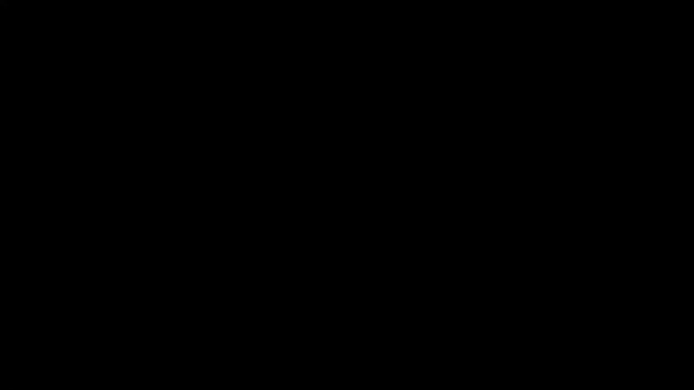
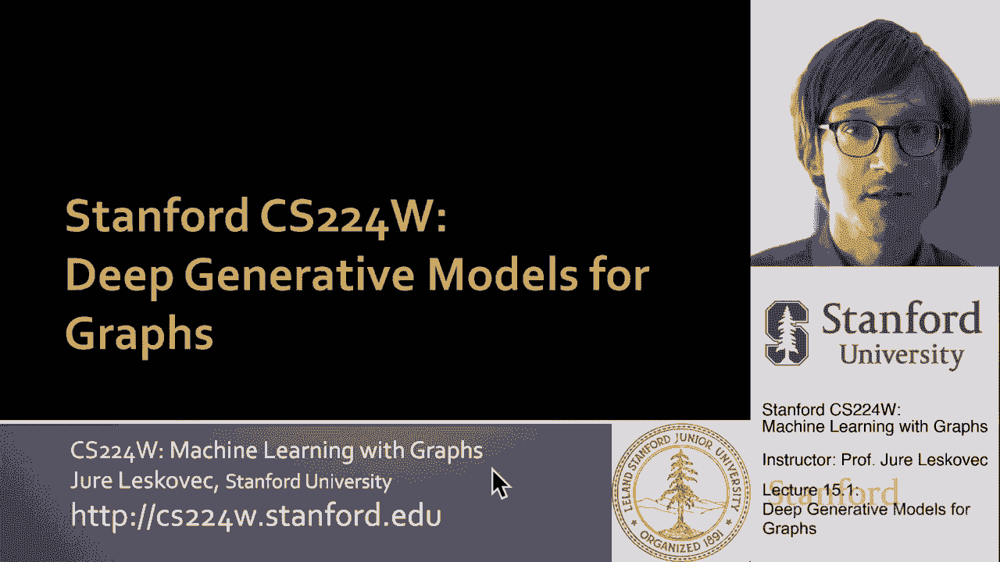
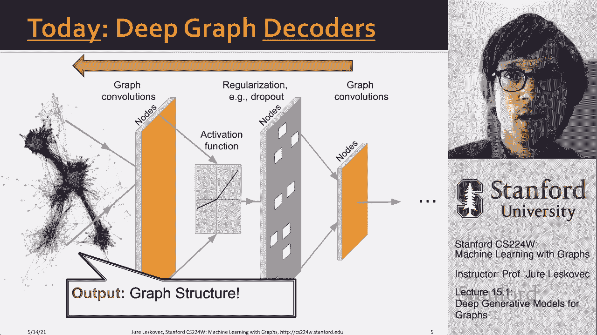
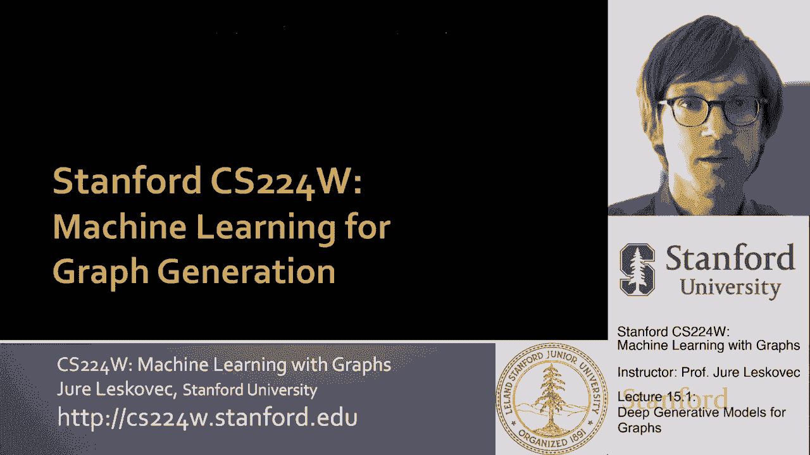
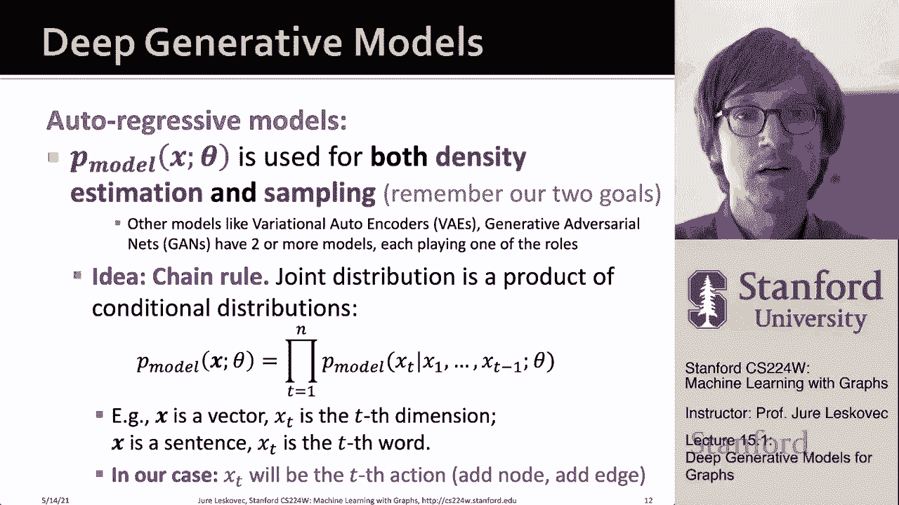

# 【双语字幕】斯坦福CS224W《图机器学习》课程(2021) by Jure Leskovec - P45：15.1 - Deep Generative Models for Graphs - 爱可可-爱生活 - BV1RZ4y1c7Co

欢迎来到今天的课程，我们将讨论图的深度生成模型。

所以让我更详细地解释一下，到目前为止，我们讨论了如何对节点和边进行分类，也许是整个图表，但现在我们要讨论一个新的任务，这是生成图形的任务，我们的想法是我们想要一个生成模型，呃。

生成一个与真实世界图相似的合成图，嗯，这种图形生成的应用，呃，发生在许多不同的地方，你可以想象你可以把分子表示为，呃，原子，然后在这种情况下，您希望生成新奇的，基于这种生成模型，或，比如说。

在材料设计中，你可能想生成呃，最佳材料结构，这就是你在社交网络建模中可以做的，你可能想生成合成的社交网络，这样您就可以使用它们来完成各种下游任务，甚至在其他一些应用中，比如说。

如果你考虑生成现实的道路布局，如果你想考虑生成现实的城市布局，所有这些类型的事情你可以，你可以建模为一个图形，呃，生成过程，甚至，比如说，一些组合问题，如可满足性问题，布尔可满足性问题，嗯。

您可以生成该问题的人工实例，呃，通过将可满足性实例表示为图，然后学习如何生成呃，那些图表，所以在，呃，所有这些案件，基本上，我们的目标是学习如何生成，嗯，与底层相似的图，呃，真实世界图，然后呃。

图形生成领域有着丰富的传统，他们开始的方式是从研究复杂网络的性质开始的，就像现实世界的网络，嗯，并确定这些现实世界网络的基本特性是什么，就像力量，无标度分布，呃，嗯，呃，也喜欢小世界的属性等等，等等。

基于复杂网络的这些基本性质，然后有很多图的生成模型的发展，通常会一分为二，呃，难民营，一个营地非常机械，呃，像优先附着模型这样的生成模型，嗯，这基本上允许我们解释某些属性是如何，就像网络的无标度特性。

产生于这种微观的优先附着型模型，嗯，另一个，呃，一套模型，呃，生成图表的方法主要来自统计数据和社交网络文学，基本上的想法是也许有一些，可能有一些潜在的社会群体，并基于那些潜在的社会群体，嗯。

社交网络的边缘被创建，然后问题是你怎么能把这个模型，使其与数据相适应，也许会发现，小组，然而今天在这节课中我们将使用，深度学习和表示学习学习如何生成图形，所以与以前的工作相比，在某种意义上。

要么假设了某种机械生成过程，或者假设一些统计上的，呃模型的动机是，让我们说，社会科学在这里我们想成为不可知论者，呃，呃，呃，在这方面，目标就是，我们基本上可以给出一个图或几个图。

我们能学习如何生成这些图的性质吗，我们如何生成更多这些类型的图的实例，所以我们会完全概括，在这种表示学习中，我们将从数据中学习，呃框架，所以嗯，这是我们调查此事的一种方式。

我们如何调查这件事的另一种方式，到目前为止在这门课上，我们一直在讨论深图编码器，基本上的想法是我们有一个复杂的网络，复图，输入上的复杂关系结构，你想把它穿过几层，嗯，呃，这种表示学习深度学习，呃。

在末端产生的网络，让我们说，节点嵌入，呃，边缘嵌入，全图嵌入，对呀，这就是我们所说的深图编码器，因为它以图形为输入，并将其编码成某种表示形式，图形生成的任务实际上是在另一个方向上进行的，它一个。

它想从右手边开始，然后通过一系列复杂的非线性变换，想要正确地输出整个图，所以我们的输入可能是一个小的噪声参数或类似的东西，我们想要扩展它，直到我们有了整个图，呃在输出上，所以我们将解码而不是编码正确。

我们将获取一小段信息，并将其扩展到整个图形中，而不是采取复杂的结构，把它压缩成，呃或者进入它的，呃代表，所以我们说的是深图解码器。

因为在输出上，我们希望生成一个完整的网络，所以为了让我们做到这一点，我想先告诉你，我们要怎么解决这个问题，就它的设置而言，就其数理统计基础而言，然后我要谈谈什么方法允许我们，实现图形生成的目标。

利用表征学习。

所以让我们来谈谈呃，图形生成，一般来说，我们有两个任务要讨论，呃，在这次讲座中，首先是我们所说的现实图生成，其中我们希望生成类似于给定图集的图，我将更严格地定义这一点，呃在一秒钟，然后第二个任务。

我也要谈谈，就是我们所说的目标有向图生成，基本上你想生成一个图，优化给定约束或给定目标的，所以如果你在产生一个分子，你可以说我想产生具有给定性质的分子，可能性质是溶解性，也许特性是这些分子是无毒的。

你说我想产生无毒的分子，那么我如何生成最无毒的分子，我如何生成最多的，呃，最可溶性的分子，看起来仍然像药物，嗯，想象另一个案例，我之前在举例子，如果我想生成一条路，一个城市现实的路网。

这是一个图形生成问题，我可以说我想创造一个城市的最佳道路网络，对呀，无论最优，呃，最优性约束为，这有点，我们假设我们是它给我们的权利，这就是我们所说的目标定向图生成。

或者您希望生成一个具有给定目标的给定图，优化给定的黑匣子，目标函数，所以那是呃，这两部分，今天的讲座，但首先让我们谈谈，我们如何将这个图形生成任务设置为机器学习任务，所以我们将按照以下方式进行，我们是。

我们将假设图表是从这个呃，P数据分布，所以基本上本质上是从p数据中取样，并给我们图表，我们的目标是学习一个分布P模型，嗯和嗯，然后能够学习如何从这个P模型中取样，所以基本上给定输入数据，我们要创造。

图上的P模型，然后我们要从那个呃中取样新的图表，概率分布与权利，我们的目标是，我们希望这个p模型分布尽可能接近这个未知的p数据分布，我们无法接触到唯一的自然，呃有权利，数据集创建者可以访问此P数据。

我们想用p模型近似p数据，然后呃，因为我们用p模型近似p数据，我们想画更多的实例，我们想生成额外的图形，我们希望从P模型生成额外的样本，这些将是我们想要的图表，呃，生成这样，如果我们想这么做，呃。

然后这是一个我们称之为生成模型的例子，对呀，我们假设我们想从一组，呃，输入图，呃，这里，正如我之前说过的，P数据是我们不知道的数据分布，我们无法接触到这一切，我们可以接触到它的样本，呃。

从这个未知的p数据中采样的x，我们还将有另一族概率分布，让我们称它们为由θ定义的p模型，θ是我们模型的参数，我们希望使用这个p模型分布来近似p数据，然后我们的目标是什么，我们有两步目标。

第一个目标是找到参数θ，这被称为密度估计任务，然后我们还希望能够从P模型中取样，基本上意味着我们希望能够生成新的图，从现在p模型分布，我们有权获得，我们想生成新的样本，从中获得新的图形。

所以让我给你更多的细节，我们将要使用的关键原理，这里是最大似然估计的原理，这是建模分布的基本方法，基本上你可以这样想，我们想求参数p，呃，我们的P模型分布的θ星，使数据的对数似然，呃。

从这个p数据分布中采样的图x的数据点x，它们的对数似然在我们的模型下，基本上由θ定义或参数化的p模型尽可能大，所以我们的目标是找到参数θ星，使观测到的数据点x，所以基本上，观察到的图形，嗯。

在所有可能的选择中，有最高的对数可能性，西塔右，当然还有这里，重要的是P模型需要足够灵活，它能够对P数据进行建模，然后问题是我们如何，我们如何搜索概率分布的所有实例，被这个P模型捕获。

实际上是由这些参数θ捕获的，这样我们观察到的数据的可能性就尽可能高，对了，在，换句话说，目标是找到最有可能产生观测数据的模型，x右，找到最有可能产生观测数据x的p模型，这是第一部分，也就是密度估计。

第二部分也很重要，因为一旦我们有了密度，那就不够了，我们需要能够从中提取样本，对呀，我们想从这个复杂的分布中创建样本，和共同办法，你怎么能，呃，生成呃，样本，呃，从A从复杂分布，首先。

你从一个简单的噪声分布开始，就像一个简单简单的，让我们说，我知道的正态分布标量值，零，平均单位方差，然后你想有一个复杂的函数f，它将这个小噪声核，它会扩展它，直到你有样本x，所以在我们的情况下。

你知道我们将从一个随机的种子开始，我们要把它扩展成一个完整的图，呃X在哪里，当然现在的希望是这个x将遵循呃p模型的分布，那么在我们的例子中，我们如何设计这个函数f，我们将使用深度神经网络并训练它们。

这样他们就可以从一个小内核开始，生成我，呃图表，所以那是呃，我们进展如何，呃这样做，所以现在，在深度生成模型方面，我们的模型将是一个自动回归模型的实例，其中该P模型将用于密度估计和采样。

因为我们有这两个目标，嗯，而且不是一般的，你不必使用相同的神经网络，既要进行密度估计，又要进行采样，在这里还有其他方法可以选择，像变体自动编码器或生成对抗网络，呃等等，但在我们的情况下，我们将使用呃。

自回归模型，我们的想法是，我们要模拟这个复杂的分布，作为更简单分布的乘积，我们能这么做的原因是，链式法则的，概率贝叶斯网络，它基本上告诉我们，一组变量上的任何联合分布。

um可以精确地建模或表示为条件上的乘积，嗯嗯，条件分布右，所以基本上，我是说这个P模型，呃，这是一个复杂的分布在我的，呃，在我的X上，它可能是一组随机变量，我可以把它写成所有这些随机变量的乘积。

从第一个到最后一个，在那里嗯，呃，我现在所要做的，呃，表示是随机变量的概率，T给出值，以前所有的实例，呃，随机变量右，所以在我们的情况下，比如说，如果x是向量，那么x subt是牙齿。

那个向量的um坐标，嗯对，如果x是一个句子，那么呃，x subt是正确的词，所以我基本上是说，而不是生成一个完整的句子，或者写出给定的概率，让我们说句子，我要去，我可以把它作为一个产品来建模。

在那里我说，到目前为止，有多大可能，或者下一个词的概率有多大，如果我把这个乘以，嗯，我有整个句子的概率，我们可以做到这一点而不损失，一般性损失，或任何近似，如果我们真的在每一个条件下，前面所有的话。

之前所有的，呃元素，就在我们的例子中，这意味着我们将其应用于图的方式，我们要表示一个图，作为A作为A作为序列，作为一组动作，我们要说，下一个动作的概率是以所有先前的动作为条件的，呃行动，现在你知道了。

会有什么动作，是，它将添加一个节点，呃。

加一条边，对呀。

