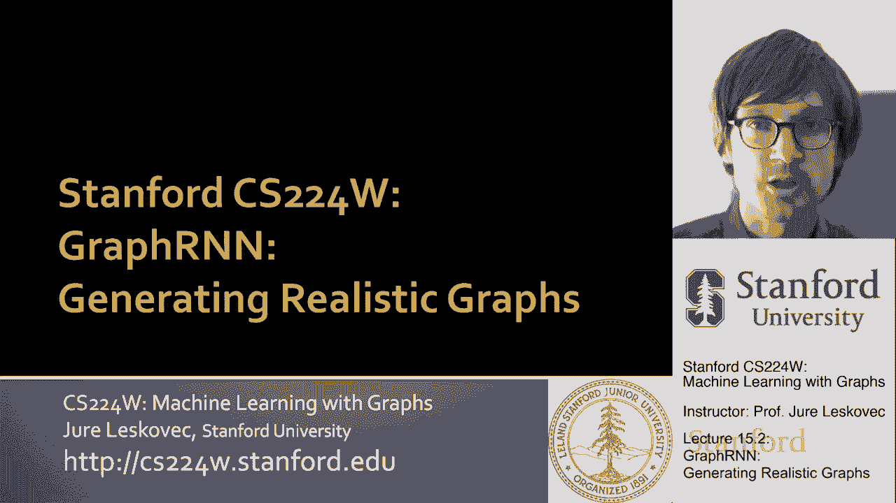
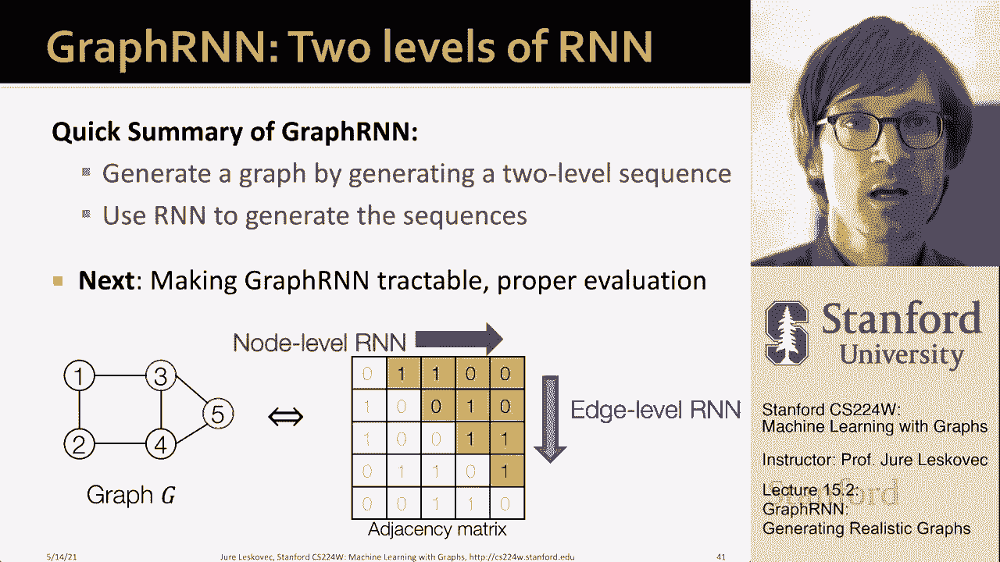

# 【双语字幕】斯坦福CS224W《图机器学习》课程(2021) by Jure Leskovec - P46：15.2 - Graph RNN Generating Realistic Graphs - 爱可可-爱生活 - BV1RZ4y1c7Co

所以现在我们准备看看我们的，呃，图的生成模型，这个生成模型被称为图RNN，它将允许我们生成逼真的图形而不需要，做出任何类型的归纳偏差，呃假设，模型将是，我们将看到，极其笼统，呃和可伸缩。

并且能够产生一个巨大的，不同的多样性，呃，不同大小、形状和结构的图形类型。

等等，所以关键的想法，呃，呃，这就是我们要利用的，这里，我们希望通过顺序添加节点和边来生成图形，你知道，我们为什么要这样做，我们想这样做，准确地说，呃，我在上一节结束时解释的，也就是说。

基本上我们想模拟一个复杂的分布，它捕捉图形上的分布，建模复杂的分布，我们不知道该怎么做，我们将把复杂的分布分解成许多小部分，以及我们打破图形创建的方式，我们要把它分成很多小部分，变成很多小动作。

我们要做的就是建立一个模型转换概率，基本上是说，给定图形，鉴于我们到目前为止所采取的行动，以此为条件，我们下一步要采取什么行动，这样把这个相乘，我们能够模拟整个分布，所有的依赖关系对吧。

所以在我们的例子中，这个想法是，想象我有这个图表，我想用我描述生成过程的方式来生成它，我将从第一个节点开始，然后我将添加第二个节点，第二个节点将链接到第一个节点，现在我已经建立了，你知道一点图表。

添加第三个节点并链接到第一个节点，然后添加第四个节点，并链接到第二个和第三个，然后加上第五个节点，它链接到四个，呃三和四，对呀，这基本上是我想建模的生成过程，我想捕捉，在讲座的这一部分，我要去，嗯，呃。

呃，呃，给大家解释一下，叫做图RNN的模型，这是指向论文的链接，呃，所以如果你想要更多的细节，你可以，呃，阅读我在这里引用的论文，所以嗯，让我们考虑一下将图形建模或将图形生成为序列，对呀。

节点顺序为pi的图，可以唯一地映射到节点序列中，并添加边缘添加，我这么说是什么意思，右像图是一组节点和一组对象，先验图没有顺序，所以我们需要这个节点排序，这个排列PI决定节点的顺序，呃出现。

给定节点出现的顺序，然后唯一定义生成图的序列，因为首先我添加了第二个节点，对不起，首先我有第一个节点，然后我有了第二个节点，我添加了第三个节点，然后在添加边缘方面，我总是可以说，我去，你知道，我问。

我应该链接到节点一吗，是的不是，我应该链接到节点二吗，是的不是，直到所有已经存在的节点，呃，在右图中，所以这就是，呃，基本上关键，关键的思想是我们需要一些节点排序，给定节点排序。

那么生成图只是一个序列问题，另一个对图形生成很重要的观察是这个序列实际上是一个两级序列，有一个添加节点的序列，在节点级序列上有一个添加边的序列，在每一步我们添加一个新节点，嗯，然后我们还有第二层，嗯。

添加节点后，需要为给定的节点添加边，所以这意味着我们有一个两级序列，在那里我们将首先有我们有高级节点级序列，然后低层次的，边缘水平序列，对呀，节点级一步，我们做一个节点级的步骤。

然后我们做了很多边缘水平的步骤，然后我们做一个节点级的步骤，我们做了很多边缘水平的步骤，每一个边缘水平步骤都只是一个新的边缘的添加，对呀，所以你可以想到，嗯，节点级步骤正在添加节点一，添加节点二。

添加节点三，而呃，这个序列，呃，边缘级别中的元素是，我应该添加这个节点吗，我添加的这个新节点，我应该把它连接到节点一吗，我应该把它连接到2号节点吗，我应该把它连接到3号节点吗？

你可以把这看作是生成一个二进制序列，不要连接，连接连接右，所以这就是，就是这个意思，对我们到目前为止所学到的知识的总结，一个图加上一个节点排序给了我们一个唯一的序列，生成给定的图形，现在的节点排序。

让我们假设是随机选择的，或者它以某种方式给了我们，我们以后再讨论这个问题，你能想到的方式是对的，如果基本上是说，哦，如果我有一个部分构建的图形，我想添加一个新节点，那你就知道。

将这个节点添加到图中只是意味着我必须打印出，呃，邻接矩阵的这一列，基本上说节点四不连接到节点一，节点四连接到节点二，和节点四链接到节点三，对了，这是第一个节点，第二节点第三节点，我们刚刚生成了。

节点邻接矩阵的列，呃四号，所以节点级序列将添加一个，邻接矩阵的一个新列，边缘水平序列将打印出来，呃，这些行，此列的条目，其中零表示边不存在，一个意味着边缘存在，所以嗯，到目前为止。

我们已经把图形生成问题转化为序列生成问题，现在我们需要对这两个过程进行建模，添加新节点的过程，基本上我们想为一个新节点生成一个状态，然后我们想根据新节点的状态为它生成边，这将是边缘水平序列，所以重点是。

呃，我们将要使用的一种方法，就是，我们将使用所谓的递归神经网络来建模，二级序列，我们将使用一个嵌套的递归神经网络，正如我将要解释的那样，所以这个想法是下面的对吧，什么是呃，递归神经网络。

针对序列数据设计了递归神经网络，和一个递归神经网络，按顺序获取一个输入序列来更新它的隐藏状态，并基于隐藏状态，嗯，这个想法是，这个隐藏状态汇总了到目前为止输入到RNN的所有信息，然后更新是通过所谓的。

rnn细胞，对每一个时间步，我有一个新的RNN细胞，所以你可以这样想，我用一些隐藏状态初始化RNN，我给它输入，RNN将更新它的隐藏状态并将其放在这里，它还将创建一个输出，现在在第二步。

这个隐藏状态下一个单元格将作为输入，它将作为输入，来自环境的输入，它将更新它的隐藏状态，在这里表示为S2，它也会给我产生一个输出，对呀，所以基本上这个想法是这个隐藏的状态，它保留了RNN的记忆。

到目前为止，RNN看到了什么样的输入，所以要呃，告诉你更多，给你更多，数学，s sub t是rnn在at步的状态，t sub t是当时对rnn的输入，y子t是当时RNN的输出，RNN是有几个参数的。

这些参数称为W，u和v，这些是可训练的参数，这可能是可训练的向量，可训练矩阵，更新方程的方式是以下隐藏状态得到更新，基本上是说，上一个时间步中的隐藏状态是什么，让我们让我们改造它。

当前时间的新输入是什么，让我们把它改造一下，把它通过非线性，这就是我更新的隐藏状态，然后输出输出y只是隐藏状态的转换，这就是嗯，呃，我们要输出的，在我们的情况下，x和t是标量。

所以基本上我们要输出一个标量，呃，那就会，呃，这将告诉我们是否有优势，呃还是不，当然你可以有更多像GRU这样的表达细胞，lstm等等，但这里我说的是一种RNN，基本上就是，其中最基本的，呃，序列，呃。

基于模型，到目前为止，我们知道了什么是呃RNN，现在我们想谈谈，我们如何使用RNN来建模节点级和边缘级，呃序列，两个RNN之间的关系是，下文，节点级RNN为边缘级RNN生成初始状态。

然后Leedge级别的RNN将产生，那个新节点的边序列，然后它将把它的状态传递回节点级RNN，谁要去这里生成一个新的节点，更新状态并将其下推到边缘级别，呃RNN，所以这就是，这会成功的。

所以给大家一个想法，我们将用一个序列的开始初始化节点级RNN，你知道我们会的，呃，节点级RNN将创建一个节点，现在边缘水平RNN，嗯，给定此节点被创建，节点级RNN将添加一个新节点。

然后边缘级别RNN为它生成边缘，所以节点一现在已经在那里了，节点级RNN决定再添加一个节点，二号节点，现在边缘级别的RNN必须这样说才能链接到一个，你知道第一个，呃呃，这里会说，嗯，一个链接到两个。

现在是新的图形，现在节点RNN说OK，让我们添加一个新节点，呃呃，第三名，现在我们要求边缘级别RNN生成边缘，呃为了，呃，节点3和节点3会说你知道它链接到第一个节点，但不链接到第二个节点。

所以现在我们的新图形是这样的，节点级RNN再次决定，让我们再增加一个节点，让我们加上第四个节点，边缘级RNN打印出一系列0和1，这将意味着四个链接到节点一，它是否连接到节点2，还是链接到节点三。

你知道四个链接到两个和三个，所以现在是当前的图表，然后你知道节点级别的RNN说OK，让我们再添加一个节点节点，五个边缘电平RNN输出，呃，前一个节点的，它告诉我们五个是否应该链接到它，嗯和嗯。

这就是我们如何得到图表，这一代人将停止，节点级别的RNN何时会说I'm done，我不会创建任何新节点，所以这就是我的想法对吧，其中边缘电平RNN顺序预测，如果一个新节点将连接到以前的每个节点，嗯现在。

我们怎么，我们怎么做，嗯和rnns，所以让我给你，呃，呃，更多想法，所以嗯，就我们如何使用RNN生成序列而言，我们基本上要把前一个细胞的输出，并将其作为下一个右键的输入，所以不管之前是什么，呃决定。

呃输出是，比如说，之前的边缘是什么，这将是下一次下一个单元格的输入，台阶嗯，我们如何初始化输入序列，我们将其初始化为具有一个特殊的令牌，我们基本上训练神经网络，那个，当它得到这个特殊的令牌。

我们将这个令牌称为sos，所以序列的开始作为初始输入，网络开始产生输出，通常你知道SOS，当我说一个特殊的信物，它可能是一个所有零的向量，也可能是所有的向量，例如，只是你保留的东西，然后你知道。

我们什么时候开始阻止这一代，当序列结束标记正确产生时，我们停止生成，如果序列结束为零，然后RNN将继续生成，如果序列结束是1，RNN，呃会阻止这一代，所以现在给你一个想法，对呀，像这样怎么做。

这怎么组合在一起，呃将以某种方式初始化隐藏状态，将输入序列令牌的开始，RNN将生成一些输出，然后我们要，呃，将此输出作为输入连接到下一步，当然隐藏状态会得到更新，现在给出隐藏状态，给出前一个状态的输出。

这又要在这里结合起来了，将产生另一个输出，另一个隐藏状态将被更新，好吧，嗯，这一切都很好，但是模型的问题，就像我现在写的那样，这一切都是确定性的，对呀，这都是一组确定性方程。

以确定性的方式产生这些边和节点，所以我们想要的是一个随机模型，我们想要一个有随机性的模型，如此正确，我们的目标是使用rnn执行to to，呃，建模这个p模型，rnn实际上是我们用它来建模这个，呃。

条件分布的乘积，对所以嗯，这些边际分布，x t的p，其他的都是对的，让我们写y subt是给定的x subt的p模型，呃，考虑到所有的X，呃以前是，呃生成然后对，呃T加上Y T的一个。

所以本质上我们想从这里得到样本，呃，P模型，呃，从这个单维，呃分配，这意味着RNN的每一步，现在它将输出单个边缘的概率，所以在边缘水平的每一步，RNN将输出单个边的概率，然后根据这个概率，我们要抛硬币。

嗯，我们要从伯努利取样，由概率定义，然后我们得到的是零还是一，这实际上将是下一步的输入，所以与其说RNN产生了边缘，RNN生成概率，然后我们有一个随机事件，有这种偏见的掷硬币，然后借出零或一的头或尾。

我们把它作为下一步的输入，所以这本质上是，呃，基本上是，呃，所以在一代人的时候，在测试时间，让我们假设我们已经训练了模型，好吧，这将如何工作，我们的y次T将是一个概率，将是一个标量，基本上是伯努利分布。

让我们用这个，呃，平方um，意味着这是一种概率，你知道的，这个平方取概率为p的值1，它取值为零，概率为1减去p，对呀，所以我们的想法是我们将开始，我们将开始我们的RNN，它会输出一个概率。

现在我们要用这种偏见抛硬币来创造，来决定是否有优势，这枚硬币的产量是多少，我们将使用此作为，到下一个状态，到下一个单元格，我们又会得到另一个概率，抛硬币，得到实现，谁会给我另一个概率对吧。

所以这就是我们要生成的，或者我们将如何展开，呃，这个RNN，现在的问题是，我们如何使用训练数据，我们如何使用这个轴给我们的训练图，为了训练模型，嗯，我们假设我们在观察给我们的图表。

所以这意味着我们观察到一系列的边缘，我们基本上假设我们观察到给定的图是如何生成的，所以我们观察0和1，是否呃，对应于，是不是边缘，呃存在或边缘不存在，我们将使用教师强迫的概念，特征的这种技术。

强迫用实数序列替换输入和输出的位置，所以重点是下面的权利，我们要启动模型，你知道这个模型会输出一些边缘的概率，但是在训练的时候，我们现在不是抛硬币，并将其用作下一个单元格的输入，我们实际上要说，好的。

那里的真正价值是什么，哦，真正的价值是，没有边缘，所以我们要强行，呃，为了武力，强制将此作为下一步的输入，如此正确，老师在强迫学生正确，学生下一步做什么，老师纠正学生，学生从右边开始。

我们为下一步做了正确的输入，对呀，所以关键是输入将是正确的顺序，不是由模型生成的序列，这叫老师强迫，当然啦，我们需要定义损失，它测量模型输出之间的差异，学生的输出与地面真相，呃，序列。

我们试着教模型生成，我们将使用二元交叉熵，嗯嗯，损失函数，您可以写出以下内容，你可以像星星一样，嗯，呃，y是一个二元变量，零一一表示边缘存在，零表示不不存在，然后呃，为什么没有星星是边缘右的概率。

基本上，这个想法是，因为y星要么是零，要么是一，如果这两个术语中唯一的一个能幸存下来，当我们真正实现它的时候，因为当，呃，Y星进来了，基本上的想法是如果Y星是一个，那么我们的损失真的可以归结为负对数。

所以基本上是为了让我们把损失降到最低，我们希望y的对数尽可能接近于零，嗯嗯嗯，呃，尽可能，这意味着我们想让y尽可能接近1，然后你知道，呃，如果我们现在想，另一方面，呃，如果边缘不存在。

然后我们要最小化1的负对数，减去右一这里我们要把右一降低，所以整个表达式也是接近于1的对数，这将是，呃，接近于零，所以这样你就适合于数据样本，Y星，好吧，再来一次，只是想提醒你。

为什么一个或这个y是由RNN计算的，损失将调整RNN参数，那些矩阵w u和v，使用反向传播试图将损失降至最低，最小化真实序列与生成概率之间的差异，基本上，重点是损失会说哪里有零，产生接近于零的概率。

只要有一个，就会产生接近一个的概率，好的，所以有了这一切，让我们把事情放在一起，所以我们的计划是这样的，我们想要，呃，有两个rnn，首先，我们希望有一个RNN，呃，在每一步添加一个节点。

我们将使用输出呃，将其初始化为j以初始化边缘级别rnn，然后边缘级别的RNN将预测其他节点，现有节点做什么，连接到的新节点，嗯，然后你知道，然后我们要添加另一个节点。

我们将使用边缘级别RNN的最后一个隐藏状态，为另一个步骤初始化节点级RNN，那么这是怎么回事我们要如何阻止这一代人，如果边缘级别RNN将在步骤一输出序列的结尾，我们知道没有边连接到新节点。

我们要阻止这一代人，所以这实际上是我们决定的边缘水平RNN，将决定我们是否停止生成图形，所以现在让我给你，呃一个例子，这样你就能看到这一切是如何结合在一起的，所以这就是训练时将要发生的事情，嗯。

你知道为了，让我们说一个给定的呃，训练观察训练图，我们是，我们从序列的开始和一个隐藏的状态开始，呃呃，我们添加节点级别的RNN将添加节点，然后边缘级别的RNN将被要求，刚才这个节点，呃补充道。

它是否连接到以前的节点，是或否，它会更新概率，然后我们要，呃，抛硬币决定这个给定的偏差，这将决定是否添加边缘，然后，然后我们会采取呃，我们将把它作为输入，作为初始化，返回节点级RNN。

谁现在要添加第二个节点，这将是第三个节点，然后边缘水平RNN会告诉我们，将节点3链接到节点1，将节点3连接到节点2，它又一次输出概率，我们在抛硬币，不管那个硬币的输出是什么。

都是下一个级别的输入rnn对，所以在这里你知道，概率是第六点，也许你很幸运，输出是一个，所以这是，为了下一个，呃为了下一个边缘，对然后你知道，在我们把它遍历了所有以前的，我们要去，呃。

在所有以前的节点上，我们将再次要求节点RNN生成一个新节点，以此类推，等等，嗯，这将持续到最后一个节点，最后一个节点被添加，然后节点RNN将再添加一个节点，但是边缘水平RNN会说。

我不愿意把它和其他人联系起来，所以这是序列的结束，我们停止，所以基本上就像当我们添加一个孤立的节点，我们知道那是，那是我们要停止的信号，所以这就是，就是这个意思，嗯然后嗯，你知道这里的每一个预测。

我们将得到地面的监督，从地面真理权利，所以重点是我们将做老师强迫，对，所以即使例如，当这是第六点的时候，我们掷硬币，也许我们运气不好，我们得到了一个零，我们要输出，呃真正的，呃真正的边缘。

就像我们说的老师，老师强迫，然后我们神经网络的结构，当我们做反向传播时，基本上是在做反向传播，穿越时间对吧，我们基本上要支持道具，从所有这些事件中，一直到时间的开始，到第一个到第一个节点，呃在图表中。

呃对呃，更新RNN的参数，然后你知道在测试的时候怎么样，在世代的时候，我们基本上要根据预测的分布对连接性进行采样，预测概率，我们将在每一步替换输入，通过RN自己的预测或自己的输出，就在这里，嗯嗯。

我们要去，呃，抛硬币，硬币我们说它会说什么，它将作为下一个的输入，我想你知道我们要做硬币，无论输出是什么，这里应该是下一步的输入，所以你知道这里应该是零，这是个错误，好的，所以呃，那是，就是这个意思。

所以总结是，我们把图的生成问题看作是序列的生成问题，实际上是两级序列生成的问题，节点级序列和边缘级序列。

我们用呃，递归神经网络生成序列，嗯，我接下来想讨论的是，我们如何使RNN易于处理。

