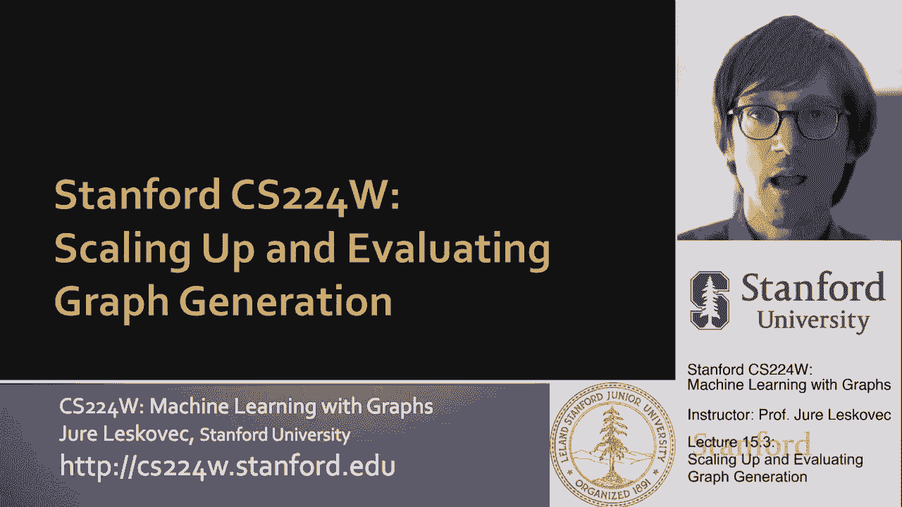
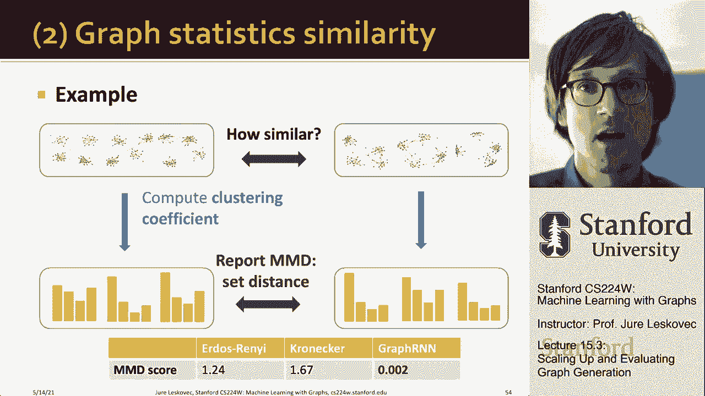

# 【双语字幕】斯坦福CS224W《图机器学习》课程(2021) by Jure Leskovec - P47：15.3 - Scaling Up & Evaluating Graph Gen - 爱可可-爱生活 - BV1RZ4y1c7Co

接下来我想讨论的是如何使rnn易于处理，我们如何评价它。

所以我们首先要讨论可追溯性，我们如何使我们的模型更具可伸缩性，问题是在图表中，原则上，任何节点都可以连接到任何先前的节点，所以嗯，这意味着可能有很多步骤，呃，呃，呃，用于边缘生成。

就在节点一千连接的时候，我们现在可能需要生成一千个可能的边，对呀，它是否链接到节点，九百九十九，然后九百九十八，一直到节点，让我们说第一，对呀，所以这个需要。

这意味着原则上我们需要生成一个完整的邻接矩阵，嗯，这很复杂，嗯，就像嗯，并导致非常长的边缘依赖，因为你要记住，模型需要记住以前添加的节点，哪些以前的节点执行新节点，想要，呃，连接到右边。

所以如果你有一个节点排序，就像我在这里给你看的那样，然后呢，比如说，生成这个图的方法是添加节点一，添加节点二，添加节点三，现在才开始创造边缘，这感觉不自然，好像是这样，当我添加第三个节点时。

我现在需要记住一和二已经加了，和和所有这些权利，重点是一个新的节点需要链接到，原则上链接到以前的任何节点对，即使是5号节点也可以连接到1号节点，问题是我们如何限制这种复杂性。

我们如何限制这些长期依赖关系，对呀，因为这意味着节点五的隐藏状态，不知何故，必须记住节点1是在开始时添加的，五个应该链接到一个，这是一个很大的，让我们的模型这样做，如果我们能用任何方式帮助它，那就会。

呃，绝对有帮助，所以说，洞察力是我们可以采取一个，因为我们可以想出节点顺序，这使得我们的模型更加容易处理，因此，我们的见解是，与其有一个随机的节点排序，有模型要担心，呃，远距离依赖关系。

我们将使用节点排序来帮助模型更好地学习，我们提出的节点排序称为广度优先搜索节点排序，基本上，我们将从图中的某个随机节点开始，我们要把它标记为一号节点，我们要给它的节点贴上标签，就像我们说的二和三。

然后你知道他们的邻居我们四个和五个，对呀，嗯，这就导致了一个更自然的方法来生成图形，我们说的是在，添加节点二连接，在三点处连接二到一，把它和四个的一个连接起来，与二和三相连，这是一种更好的间隔。

你知道这些东西是，如果你说你会怎么画这个图，你可能会这样画，而不是你先把所有节点放下然后把它们连接起来的其他方式，所以BFS的订购，它给我们买了什么，它给我们买了以下内容。

因为4号节点没有连接到1号节点，我们知道没有其他节点会连接到一个，呃从现在开始对，因为它是广度优先搜索排序，例如，如果，五号节点连接到一号节点，然后它的ID，呃不会是五个，那就是，呃，五岁以下。

所有的权利，所以我们知道节点一的所有邻居都已经被遍历过了，当给定节点，呃没有链接到它，所以第五节点和下面所有的节点，正如我所说，永远不会连接到节点一，为什么这很重要，因为这意味着当第五个节点来的时候。

我不需要担心节点一，呃不再，右节点一，我可以忘记，我需要少得多的记忆力，对呀，就像那种，我不需要记忆，我只需要两个步骤的记忆，而不是回忆的记忆，我所做的，呃，一开始就一路，所以BFS的订购。

关键的洞察力是第五节点永远不会连接到第一节点，这意味着我们只需要两个步骤的记忆，而不是n减去一步的记忆，其中n是，呃，网络中的节点数，这也意味着它减少了可能的订单数量，我们没有考虑所有可能的顺序。

这是它们的n阶乘，我们嗯我们，只需要考虑一下，呃，不同的BFF BBFS顺序的数量，它还减少了边缘生成的步骤数，因为我们知道五个人不会联系到一个人，这很重要，因为到目前为止我已经向你解释过了。

我说边缘水平RNN，uh生成邻接矩阵的列，但是如果你把这个基于BFS的排序，那么边缘级别的RNN实际上不需要生成整个A列，它可以，它只需要生成列的一小部分，因为我们知道剩下的是零，对呀，因此。

与其生成与所有以前节点的连接，还必须记住所有这些，嗯，具有正确的节点排序，我们保证我们所需要做的就是生成，呃，只是一个小乐队，这个邻接矩阵的，同样，这并不妨碍我们产生，呃，嗯，任何类似的图形。

这仍然是完全普遍的，它只是在利用，嗯，呃，或者我们可以对节点重新编号的能力，我们可以把节点排序在，呃，我们想要什么订单，因为真实的图是稀疏的，有利的订货给我们带来很多好处。

因为只生成这个蓝色的部分要容易得多，比学会生成整个上层，呃，邻接矩阵的三角形，所以这是对，我们如何扩大规模，呃，我们的模型，这是我们可以提出的洞察力，或者我们可以决定节点的顺序，如果你对此很聪明。

它真的能帮助我们，它可以帮助模型学习，我想说的第二件事是，我们如何评价图的生成，有两种方法可以做到这一点，一个是我们直观地观察它们，看看它们是否相似，得到一些直觉是很好的。

但我们也想定义图相似性的统计概念，当然你可以试着说我会用两张图，我会以某种方式把它们一个接一个地对齐，但那很贵，对于大图，你不能这样做，所以我们必须定义某种图相似性的统计度量，两个图的相似性。

首先让我给你们看一些可视化的例子，呃，什么呃，图RNN能够做到这一点，我展示的是什么，下面是三个输入训练图，这些是图RNN的输出图，这里是一些输出，呃，从三种传统的生成模型。

这是Kronecker图生成模型，这是混合隶属随机块模型，这是对巴拉巴西·阿尔伯特的优先依恋，呃，模型，你知道你注意到的是图RNN，如果你给它网格，它会生成你的网格，你会看到一些错误，因为模型是随机的。

所以它可能会犯一些小错误，没关系，但你会看到其他模型完全失败，他们无法生成网格，这并不奇怪，因为这些模型都不是为了生成网格而开发的，它们是为了生成，你知道，嗯，具有不同类型属性的网络，所以没关系。

右像图RNN可以生成网格，其他人不能做有趣的事，即使你，比如说，给出图RNN，呃，具有这种社区结构的两个集群的图的示例，RNN上的graph能够了解这些图启用了该结构，生成具有这样结构的图，同时。

比如说，克罗内克图或巴拉巴西，阿尔伯特他们不能，他们不是为了生成具有社区结构的图表而做的，所以他们不能那样做，建立了群落结构的混合隶属度随机块体模型，所以它确实做得很好，我在这里想说的是，对呀。

图RNN是超一般的对吗，它基本上能够获取这些输入图并了解它们的结构，然后生成结构相似的新图，对呀，你不必说出来，嘿嘿，我有社区，嘿，这是一个网格，你只要给它一个图表，它会自己想出来的。

一个给定的图是一个网格，它需要生成一个网格，或者它是一个社区结构图或其他任何东西，所以这是相当了不起的，呃，你知道的，这种图形的多样性，同样的型号可以，呃可以覆盖，你甚至不必告诉它输入的图是什么。

所以现在，不如多做一点，呃，严谨，呃，统计相似性比较，对呀，我们怎么做，对呀，我们就像我说的，我们不能直接比较两个图，尝试进行图形对齐，因为图同构测试，正如我们所看到的，是一个NP，呃是一个很难的问题。

让我们说，嗯，所以解决方案是比较图统计，我们已经讨论过的典型的图统计量就像度分布，聚类系数，或轨道计数，来自的统计数据，呃，我讨论过的图形，我想在第二课，所以重点是给定一个图。

我们将用一组统计数据来描述它，然后我们要说两个图更相似，如果它们相应的统计数据更相似，在我们的例子中，这些统计数据中的每一个，我们将把它看作是概率分布，我要解释，呃，为什么这很重要，给定两个统计数据。

呃也许你知道绘制属性图，可能是二级序列，度分布，到轨道计数分布，我们想在训练图上进行比较，以及在，呃，合成图，你想说一组训练图有多相似，到合成生成的图集，我们想测量两者之间的相似性，我们要做两步法。

在第一步中，我们将执行以下操作，我们将把这些图表中的每一个，我们将用一组，呃，统计数据，如，我们会说这是度分布，这是一个聚类系数分布，现在我们将采取，我们将对所有输入图这样做，训练图以及所有生成的图。

现在我们要采取，比如说合成图的度分布和实图的度分布，我们想说这个分布有多大的不同，然后呃，量化，计量，我们将使用我们称之为地球移动距离的东西，现在我们已经比较了统计数据，个人统计数据。

现在我们需要聚合n测量你如何知道，一旦我们有了度分布相似性的度量，我们有一个聚类系数相似性的度量，现在我们需要把相似之处，并进一步聚合它们，以获得整体，呃，呃，总人数，呃，相似度，对于第二级聚合。

我们将使用所谓的最大均值差异，这将基于地球移动器的距离，所以让我告诉你，呃，让我先定义地球移动距离，然后这个，试图测量两个分布之间的相似性，或者两个直方图之间的相似性，你可以的方式，直觉是。

最小的努力量是多少，我是说最小的地球量，最低额，从一堆移动到另一堆的概率质量，这样一堆就变成了另一堆，对呀，所以我说我有一个分布，我有两个分布，多少多少质量，这个黄色要多少。

泥土黄色的泥土我必须在这些不同的柱子之间移动吗，所以我会把它变成这种类型的分布，所以如果我有非常不同的分布，那么地球移动距离就会很高，如果它们有点相似，地球的移动距离会很低。

um和土动量距离可作为最优流量求解，并且是用线性规划找到的，呃优化，呃呃，问题，基本上说，你知道我要做的工作是，呃，你知道是，我怎么取F和嗯，呃，转化呃，把它改造一下，呃呃，我要搬多少土，所以呃。

它将总成本降至最低，成本，概率分布x之间的i j，呃和y，所以那是呃，地球后移距离背后的直觉，呃公制，然后第二部分就是，我们将使用最大均值差异或MD，最大差异的概念是表示分布之间的距离。

作为它们特征的平均嵌入之间的距离，好吧，在这里，我给你呃，它的配方，但基本上，嗯之间的医学博士，两个分布p和q，你可以想到的是，这是，嗯，呃，这是呃，如果我用一些，呃呃内核k，这是呃，的X类，呃呃。

期待，对此的期待，元素x和y，从分配中提取的，p，呃和Q嗯，并将期望置于分布之上，呃，p和q，当然我们需要这个内核，k，在我们的情况下，呃，内核会是呃，一二二三的距离，所以嗯现在，呃，让我呃，摘要。

我们怎么把这一切放在一起，我们得到两组图，我们想说他们有多相似，我们要做的方式，这是对我们计算的每一个图，我们要计算它的，呃统计，我们就用，测量地球移动器距离，呃，这两个统计数字之间的差异。

在两个分布之间，然后我们要应用呃应用平均值，呃，要测量的最大均值差异，这些统计数据之间的相似性，其中集合元素之间的相似性，这意味着个人，呃，计算统计信息中的单个分布，带着呃，推土机。

嗯距离嗯这意味着例如，嗯，这样我们就可以严格评估，训练图上的一组特定统计数据之间的对应关系。

