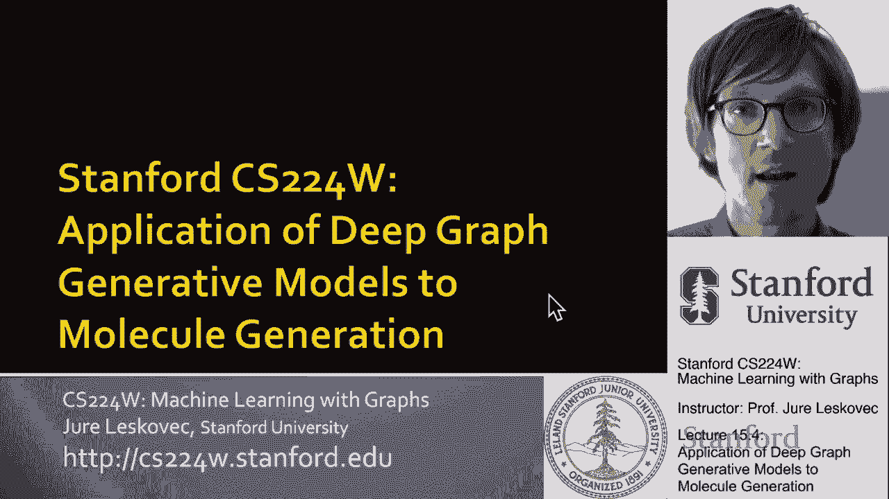
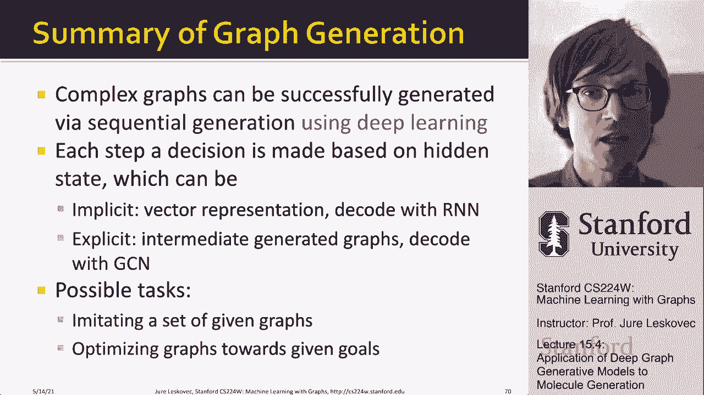
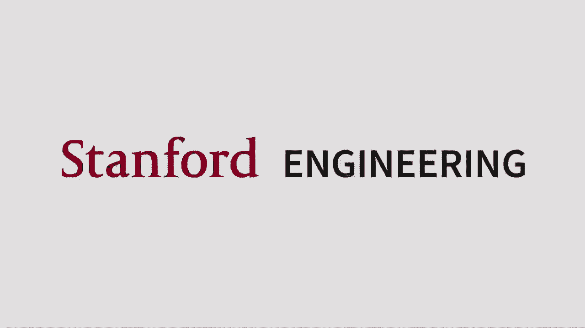

# 【双语字幕】斯坦福CS224W《图机器学习》课程(2021) by Jure Leskovec - P48：15.4 - Application of Deep Graph Generative - 爱可可-爱生活 - BV1RZ4y1c7Co

在这节课的最后一部分，我实际上要谈谈深图生成模型的应用，到分子生成，所以基本上如果你想产生药物分子。

你可以使用呃图形生成模型，所以让我告诉你，呃关于那个，所以我们要做的方法是，我们要做的是，问题是，一些财产，对呀，所以你可以这样想，我们想要一个模型，模型将输出给定的分子，这个分子必须是有效的。

基本上它必须遵守化学规则，它也必须是现实的，对呀，你不能产生一些科学怪人类型的分子，它必须是现实的，它必须看起来像一种药物，我们希望它能优化给定的性质，例如，我们希望我们希望它能优化药物的相似性。

我们想优化它的溶解度和问题，我要去解决问题，我要讲的报纸，或者将这种方法称为目标有向分子图的图卷积策略网络，嗯一代，它在这里联系在一起，你可以读它，如果你想要更多的细节，所以呃，以下是本文的高级概述。

以及最佳分子生成的新问题，对呀，这里的目标是生成优化给定目标的图，就像遵循潜在规则的药物相似性，这意味着图表像化学一样有效，呃有效性规则，比如，呃债券，债券之类的东西，是从例子中学到的。

意思是它们看起来很逼真，对他们模仿分子图，我们用来训练的，好吧，我们只是谈了一点，你知道，我们怎么，我们如何模拟给定的图的分布，这里的区别是，我们不想只模仿，我们想要，呃，生成有效的图。

我们想生成实际优化给定的图，呃标准，给定的黑匣子，这里重要的一点是，标准实际上是一个黑匣子，对呀，就是这个黑匣子，图形生成会得到一些正确的反馈，像药物相似性这样的目标，嗯是由物理控制的，呃，法律。

对我们来说，这将是一种假设，他们是未知的，我这么说是什么意思，我们不需要把它们写下来，我们要做的就是有一个黑匣子，如果我们给它一个分子，黑匣子告诉我们那个分子有多好，但我们不必往盒子里看，这才是重点。

那么我们要怎么做呢，我们把它形式化的方式，采取行动与环境相互作用，然后接受积极或消极的奖励，这是一个黑匣子，呃对探员来说是的，所以我们认为有环境，代理正在采取行动，它与环境相互作用。

环境正在反馈一些反馈，一些奖励，呃对探员说，奖励有两种类型，有瞬间的奖励，然后是长期的回报，就在我们的情况下，瞬间奖励会是我刚刚，呃，我不知道，在分子上加一个原子，我是根据呃，化学规则。

然后长期的回报将是，在我们完成分子的生成之后，那个分子有多好，这是长期的，呃奖励，好的，所以这个目标的解决方案指向，呃，分子生成，我们称之为图卷积策略网络，和关键部件呃。

我们将使用图神经网络来捕捉图的结构信息，呃，在给定的，呃，在给定数据集上，在给定的训练数据集上，我们希望我们的分子看起来，呃，现实的，首先，你知道什么是共性吗，它们的共同点是都是图的图生成模型。

他们试图模仿，呃，或者它们可以通过给定，给定一个数据集，呃，主要的区别是什么，就是，预测下一个动作的产生，嗯和嗯，当，图RNN使用RNN的隐藏状态来决定下一节，和，图神经网络比递归神经网络更具表现力。

但是消极的一面，GNN比RNN需要更长的计算时间，所以分子一般都很小，所以我们可以负担得起这个更复杂的，呃，表现力更大的算法，它将能够学到更多，所以说，朝着我们的目标朝着我们的黑匣子。

所以给大家一个想法，这两个都是，呃，呃，方法，但是在图RNN中，我们基于RNN隐藏状态右预测动作，因此节点将隐藏状态提供给边缘级别的RNN，然后隐藏的状态被传递，边缘被生成。

然后隐藏状态回到节点级别rnn右，所以基本上所有的信息，所有的历史都被捕捉到了这隐藏的一步，隐藏的隐藏状态，如果您生成了，我知道一万个节点，这意味着这个隐藏的状态已经被改造了一万次，然后对于每一个边缘。

它也被转化为，所以你需要它很像，这个隐藏的状态需要捕捉很多，我们不会有隐藏状态的概念，但我们要用呃，gnn基本上给我节点的嵌入，所以我要说这里是一个部分生成的图，这里有一个新的节点，我要做什么。

我将把每个节点嵌入到部分生成的图中，然后我还将为新节点进行一些嵌入，呃呃四号，然后基于这些嵌入，我现在要预测第四个节点应该，呃呃链接到右边，所以这意味着基本上现在我不使用rnn来做这个。

但我用图神经网络来生成状态，然后我只是做链接预测，所以我在用节点嵌入来预测潜在的链接，而不是根据隐藏状态直接生成它们，这就是区别，这将是更多，呃可伸缩，更对不起，更有表现力，更健壮，但可扩展性较差。

因为我们现在必须评估，计算这些嵌入，然后评估每个边缘的链接预测，首先我们要插入节点，然后我们将使用GNN来预测，哪些节点要相互连接，那我们呃，要去，呃，采取行动，我们要检查化学物质，呃有效性，嗯。

然后如果动作是正确的，我们说好，你创造了一个很好的优势，你没有创造一个很好的优势，然后模型做完之后，生成图形，我们要计算，最后的奖励，我们要问黑匣子，你知道，嗯，你觉得我们产生的分子怎么样，嗯。

所以一些一些呃，关于奖励的问题，我们会有两个奖项，呃，两个奖励，一个是每一步的奖励，这将是呃，基本上到，模型是否学会了采取有效的动作，基本上每一步，一个小小的正面奖励将是，呃，因采取有效行动而获奖。

所以基本上通过尊重化学规则，最终的奖励将与，目标是优化分子的期望性质，所以最后我们会得到巨大的奖励，如果分子是好的，低奖励或没有奖励，如果分子不好，对，总奖励将是最终奖励，再加上这些，呃，逐步，呃。

奖励，然后在训练模型方面，有两部分，首先是监督培训，我们将通过模仿动作来训练策略，用梯度给出实测图，如何生成逼真的，呃分子，不用担心，呃呃，优化它们的结构，然后在训练的第二部分。

我们实际上要训练一个政策，优化奖励，这里我们要用一个标准，呃呃，策略梯度算法，你知道呃呃，这有点经典，呃，但重点是我们要进行两步训练，现在如果我想给你看这个，我们将有部分生成的图形，呃。

如何一次一个节点地增长它，以及如何创建连接，嗯，我们会得到小小的正面奖励，和基于的梯度，基于我们已经正确地生成了图形，你知道这会循环，直到我们决定分子产生，现在分子产生了，我们要让我们的黑匣子告诉我们。

嗯，这个分子有多好，然后你知道这个，最后的奖励也会回来传播对吧，然后这个末端到末端的延迟奖励将在，嗯，这种呃呃，呃框架嗯，这种方法的好处是，我们实际上可以采取，我们可以生成试图优化给定性质的分子。

所以在这里，我向你们展示了优化锁p的不同分子，这是一种特殊的化学性质，或者这里的Q，我们正在优化QED，也就是量子能，药物化学家，呃担心，你可以看到我们生成的图形看起来像真实的分子，另一件事。

这允许你这样做，允许你取一个部分构建的分子并完成它，例如，您可以从一些起始结构开始，嗯这里哪里，嗯锁，p，我想是溶解度，对呀，所以基本上你从一些非常糟糕的溶解度值开始。

然后你说我如何完成这个结构来提高溶解度，你可以看到它是如何从零下8到，你知道的，负七分，从零下5到零下2，呃，完成分子，对呀，所以这就是重点，我们基本上可以把一个部分建成的结构或完成它，或者呃。

创造一个全新的，呃，结构，让我总结一下这堂课，呃，图形生成，对呀，因此可以通过顺序生成复杂的图，呃，每一个都是一个决定，呃，我们是基于隐藏的状态而制造的，这个决定是一个可以的。

此隐藏状态在RNN中可以是隐式的，也可以是显式的，这个关于保持状态的向量表示是隐式的，因为它都是，呃，在这种隐藏的状态下，状态是显式的，因为它是直接在中间图上计算的。

我还向您展示了Graph RNN的可能任务，我们讨论了模拟一组给定的图，我们讨论将图优化到给定的目标，我说了呃，在分子生成中的应用，试图产生具有最佳性质的分子，但您可以将其应用于任何类型的图形生成任务。

呃，对任何种类的财产，比如说，你知道吗，生成逼真的地图，生成现实的城市，呃，公路网。

呃，材料um。

