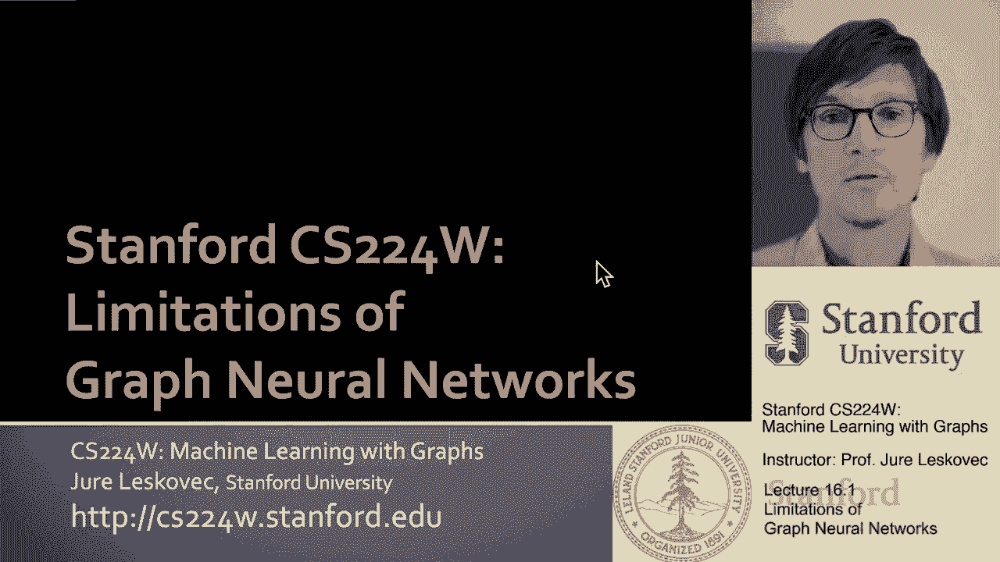
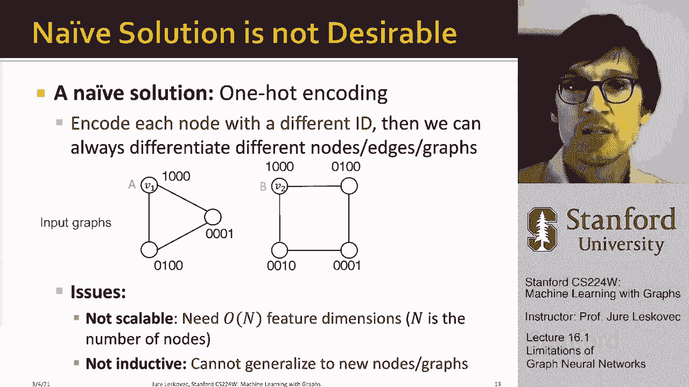

# 【双语字幕】斯坦福CS224W《图机器学习》课程(2021) by Jure Leskovec - P49：16.1 - Limitations of Graph Neural Networks - 爱可可-爱生活 - BV1RZ4y1c7Co

欢迎大家来上课，我们今天要讨论的是一些高级话题，特别是我们首先要讨论的是，呃，图神经网络，然后我们也在讨论如何提高他们的表达能力，那么我们如何，呃，呃，学习，呃，图神经网络对UM对抗攻击的鲁棒性。

所以今天讲座的想法是这样的。

嗯，完美的GNN模型会做什么，如果我们想说图神经网络的一些局限性，尤其是当我们看到他们的表现力时，就嗯而言，灰姑娘，呃，核右，如果我们做一个思想实验，那么我们可以说一个完美的图神经网络会做什么。

K层图神经网络嵌入基于K跳的节点，呃，围绕该节点的邻域结构，对和呃，这幅图试图说明，基本上，如果我想在这里嵌入这个特定的节点，我可以把这个节点周围的图形结构，然后通过消息传递，我想计算那个节点的嵌入。

一个完美的GNN是这样的，节点嗯和它产生的嵌入如此本质，我们想做什么，是一个完美的GNN将采取每一个不同的节点邻域结构，嗯，并嵌入到一个不同的位置，呃，在嵌入空间中，有两个重要的，呃。

基于这种直觉的观察，首先，一个完美的gnn将正确地执行以下操作，如果两个节点周围有相同的邻域结构，然后他们会在这里再次进行相同的嵌入，我们假设没有歧视，呃，给我们的特征信息，所以v1和v2，呃。

在这张图中，假设两个连接的组件将嵌入完全相同的点，因为它们的邻域结构，呃，它们周围是一模一样的，当然，如果我们有两个具有不同邻域结构的节点，那么嗯，我们希望它们嵌入空间的不同点，因为这个网。

这两个节点的邻域结构是不同的，一个是三角形，另一个在正方形里，所以它们应该嵌入到不同的点上，所以这就是我们想做的，这就是我们想要的完美，呃GNN要做什么，嗯，然而，这些观察一和二可能并不总是，呃真的。

比如说，观察可能会有以下问题，即使两个节点周围可能有相同的邻域结构，我们可能希望为它们分配不同的嵌入，这是因为呃，你知道的，节点可能出现在图中的不同位置或不同位置，而我们，呃。

我们将把这个图中位置的概念称为，这些需要我们理解位置的任务，我们称之为位置感知任务，我要更多地定义这一点，从头到尾，呃，讲座对，所以基本上即使是一个完美的GNN。

邻域结构和嵌入之间的单射函数将在这些地方失败，呃任务，例如这里，如果我有一个简单的网格图，我有节点v1和v2，我希望它们被嵌入到空间的不同点，因为它们在底层的两端，呃，实际上。

一个图神经网络将把它们嵌入，呃进入同样的位置，因为它们周围的邻里结构是相同的，他们两个都在角落里，网格的，所以这是一个问题，图神经网络，正如我们到目前为止所定义的那样，呃做不到，第二个重要的。

观察二的含义是，我们目前介绍的GNN有点不完美对吧，他们的表现力，嗯是不够的对吧，呃，特别是在第九讲，我们讨论了图神经网络的表达能力，这种具有判别特征的消息传递图神经网络，呃。

它的表现力是魏斯菲勒雷曼的上限，呃，图同构检验，所以呃，比如说，嗯，如果我在一个长度循环上有节点v-1，长度为4的循环上的3和节点v 2，如果我看看他们计算图的结构，嗯，两个计算图的结构将是相同的。

所以没有任何判别节点特征，或者假设所有节点特征都是相同的图，神经网络将无法区分，嗯，否则它将无法分配不同的嵌入，两个节点1和2，所以基本上节点V，1和v 2总是嵌入到同一个空间中。

假设没有有用的节点特征，因为他们的计算图，嗯是相同的，即使一个位于三角形，另一个位于正方形，所以今天讲座的计划是我们想解决这两个问题，通过建立或设计更具表现力的图神经网络，我们解决这些问题的方法如下。

嗯，呃一个，我们将根据节点在图中的位置创建节点嵌入，我们的想法是在图中创建参考点，然后根据这些参考点量化节点的位置，以及允许我们做的模型类别，这被称为位置感知图神经网络，然后解决第二个问题。

我们我们要建造，比WL更好表达的消息传递GNN，嗯和信息，这种方法的一个例子，消息方法称为身份感知图神经网络，所以这就是我们的计划，呃，讲座的第一部分，在最后一部分，我将讨论对抗性攻击，所以呃。

这是我们的方法，这就是我们想怎么想的，所以嗯，我们将使用以下思路，嗯，给定两个不同的呃输入，比如说，节点，呃，图形边，嗯嗯，让我们假设它们的标签不同，我们要说你知道，模型失败的种类，嗯，如果它，如果它。

如果它总是将相同的嵌入分配给这些不同的输入，或者这些不同的物体，一个成功的模型将为这些分配不同的嵌入，呃，不同类型的物体，嗯，所以如果我们专注于，比方说在节点级嵌入上，那你就知道。

gnn中的嵌入由底层计算图确定，对，在我的情况下，再想象一下，我有一个有两个相连组件的图，我有两个顶点，v1和v2，想象一下V1和V2被贴上了不同的标签，V一个标有，v 2标有b。

目标将是建立一个图神经网络，这将为节点V一分配不同的嵌入，然后再到节点v 2，假设节点特征相同或不区分，呃，v1和v2，也许你看起来是什么，呃，你可以说引人注目或有趣，我们有的模型，呃发展到目前为止。

呃实际上没能区分v 1和v 2就像，尽管我们已经制造了这么多超级酷的机器，在实践中工作得非常好，呃和经验，嗯，在这种拐角的情况下，我们仍然无法区分v 1和v 2，呃例子。

所以我们要做的是了解如何解决这个问题，我们如何建立一个网络，神经网络将能够基本上区分，呃，v1和v2意味着给它们分配不同的嵌入，这样我们就可以给V一个标签，我们可以给V 2分配另一个标签。

因为我们不能给他们分配不同的标签，如果它们都映射到同一个点，所以一个天真的解决方案是行不通的，将使用一个保持和一个热编码，所以我们想说，好的，我们没有任何功能，但是让我们给每个节点分配一个不同的ID。

然后我们总是可以区分不同的节点，在一个图形中或者不同的边甚至不同的图形中，所以如果我有，你知道这里有两张图，就像我们以前一样，我可以简单地为每个节点分配一个热编码，当然还有现在，因为节点现在有了功能。

计算图将是可区分的，因为你知道V一号会有呃，两个孩子一个是零一个是零另一个是零，邻居，因为他们是他们是一个热门的编码，呃会不一样，即使这两者在第一层是一样的，他们在第二层就不一样了。

所以基本上计算图是不同的，所以我们的GNN将能够，呃，区分它们，嗯，这有什么问题，有两个非常重要的问题，首先，这种方法是不可伸缩的，意思是，我们需要一个订单n个特征尺寸，其中n是能够编码的节点数，对呀。

基本上，我们需要为每个单独的节点提供一个单独的特性，如果你知道我们有一万个或十万个或一百万个节点网络，那么每个节点现在都有一百万个特性，基本上是它ID的一个热编码，然后第二个问题是这是在，这不是归纳的。

意思是，它不会推广到新的新节点或新的图，因为这个热编码有点武断，节点排序是任意的，所以网络，你基本上根据节点的顺序学习网络，然后如果我们试着把它转移到一个新的图形上，或者如果网络中出现新节点。

这样不行这样不行，如果出现新节点，将不得不扩大，扩展特征维度，因为我们想编码，对该节点也使用一个热编码，我们必须重新训练，或者如果我们想转移到一个新的图形，我们没有保证，因为u是一个热编码。

节点ID是任意的，所以它不会，呃，它不会一概而论，所以这就是为什么你知道这是个坏主意，但是呃，这种想法是为了丰富节点，这样我们就可以区分不同的计算图是个好主意。

只有一个热编码。

