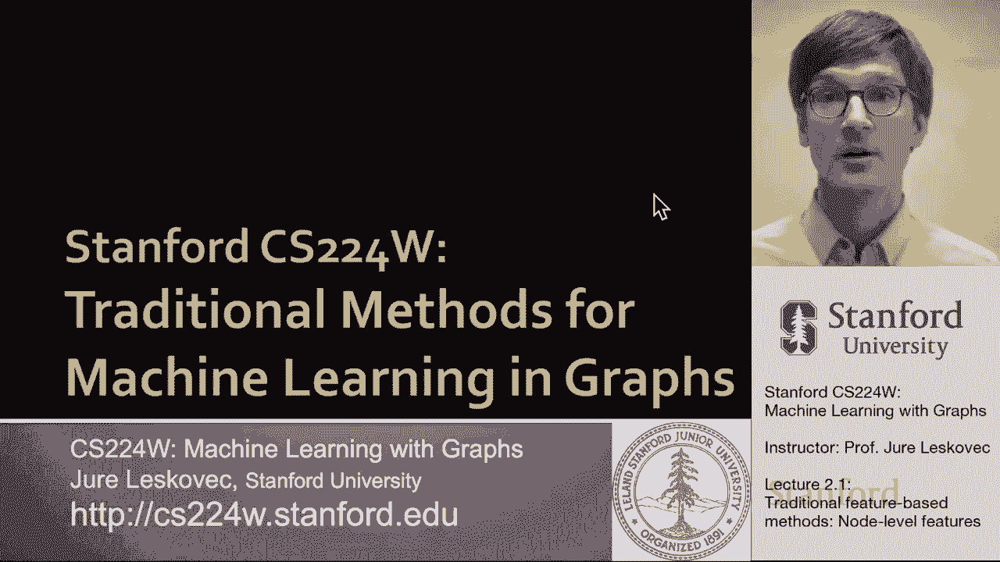
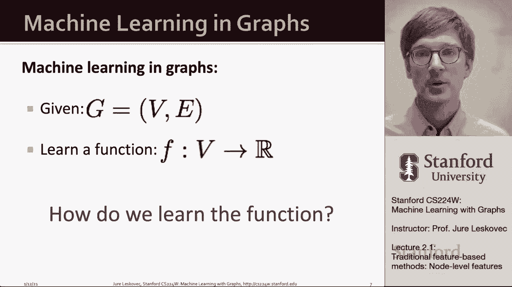
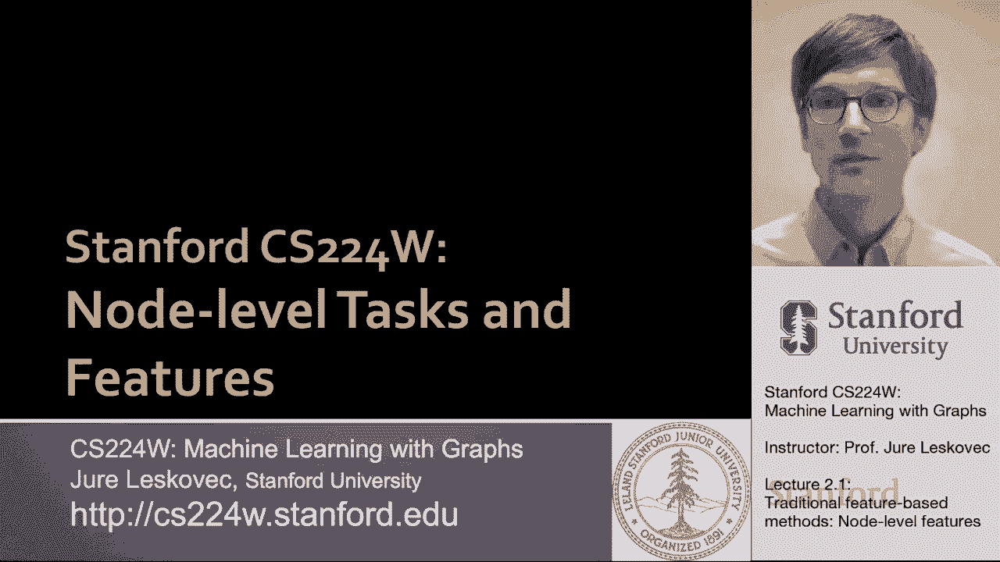
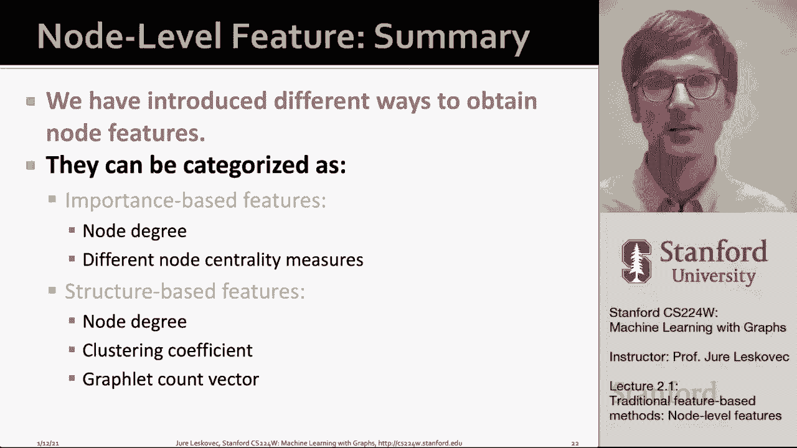

# 【双语字幕】斯坦福CS224W《图机器学习》课程(2021) by Jure Leskovec - P4：2.1 - Traditional Feature-based Methods- Node - 爱可可-爱生活 - BV1RZ4y1c7Co

欢迎来到今天的课堂，我们要谈谈传统的方法。

图中的机器学习，特别是我们要调查的是，我们在图中可以有的不同级别的任务，特别是，我们可以考虑节点级预测任务，我们可以考虑链路级或边缘级预测任务，这些任务考虑节点对，并试图预测这对是否相连。

我们可以考虑图级预测，我们想对整个图做出预测，例如，对于整个分子，或者是一整段代码，传统的机器学习管道，嗯嗯，就是设计合适的，呃，特征，这里我们要考虑两种类型的特征，我们将假设节点。

已经有与它们相关联的某些类型的属性，所以这意味着，比如说，如果这是一个蛋白质-蛋白质相互作用网络，呃，蛋白质有不同的化学结构，具有不同的化学性质，我们可以把它看作是附加到节点的属性，呃，同时在网络上。

我们也想做的是，我们希望能够创建额外的功能来描述，这个特定的节点是，呃，定位在网络的其余部分，它的本地网络结构是什么，以及这些描述图的网络拓扑的附加特征，将使我们能够做出更准确的预测。

所以这意味着我们将一直考虑两种类型的功能，结构特征，以及描述属性和属性的特性，呃，节点的，所以目标在，呃，我们今天要做的是特别关注结构特征，这些特征将描述，嗯，在更广泛的网络环境中链路的结构。

它将描述围绕给定感兴趣节点的网络邻域的结构，以及描述整个图表结构的特征，这样我们就可以把这些特征输入机器学习模型，呃，做出预测，嗯，在传统的机器学习管道中，我们有两个步骤，第一步，我们将把我们的数据点。

节点，链接和整个图形，嗯代表他们，嗯，具有特征向量，最重要的是我们要去，然后训练一个经典的机器学习分类器或模型，比如说，随机的森林，也许是支持向量机，一种前馈神经网络，那种东西。

这样在未来我们就可以应用这个模型，一个新的节点，链接或图形，呃看来我们可以得到它的特征，做一个预测，所以这是我们通常要去的环境，今天手术，所以在这节课中，我们将专注于，就像我在功能设计上说的。

在那里我们将使用有效的功能，呃，在图表上，这将是获得良好预测性能的关键，因为你想捕捉结构，网络的关系结构，UM和传统的机器学习管道使用手工设计的手工功能，今天的课程将是关于这些手工制作的功能。

我们将把讲座分成三个部分，首先，我们将讨论描述单个节点的特性，我们可以用它们来进行节点级预测，然后我们将讨论可以描述一对节点的特征，您可以将此视为链接级别预测的特性。

然后我们还将讨论描述拓扑的特性和方法，全图的结构，以便比较不同的图形，嗯和嗯，机密和呃，为了简单起见，我们今天要关注的是，呃，无向图，所以目标是，我们如何预测一组感兴趣的对象，设计选择将在哪里。

我们的特征向量将是一个D维向量，我们感兴趣的对象将是节点，边，节点集，呃，铣削全图，嗯和嗯，我们要考虑的目标函数是什么标签，我们试图预测，所以我们可以这样想，我们得到了一个图，作为一组顶点，作为一组边。

我们想学一个函数，例如，对于每个节点都将给出，会给我们一个真正有价值的预测，嗯，例如，这将是有用的，如果我们试图预测，年龄，我们社交网络中的每个节点，问题是我们如何学习这个函数，如果这将使，呃。

这些呃预言。

所以首先我们将讨论节点级的任务和描述单个节点的特性。

我们对此的看法，我们在半监督的情况下思考这个问题，呃案子，在那里我们得到了一个网络，我们得到了几个用不同颜色标记的节点，例如，在这种情况下，目标是预测联合国的颜色，呃，未着色，呃，节点。

如果你看看这里的例子，所以给定红色和绿色节点，我们要给灰色节点上色，你知道，如果你盯着这个看一点，这里的规则是绿色节点应该至少有两个A边相邻，而红色节点至少有一条边，刚好有一条边和它们相连。

所以如果我们现在能够描述每个节点的节点度，嗯作为一个结构特征，呃，在这个图中，那么我们将能够学习在这个简单的情况下正确着色的模型，呃，节点，图表的呃，所以我们需要描述这个特殊拓扑的特征，呃图案，因此。

目标是表征给定节点周围网络的结构，从某种意义上说，节点在更广泛的网络上下文中的位置，我们将讨论四种不同的呃，允许我们首先做到这一点的方法，我们总是可以用节点的度作为嗯的表征，围绕节点的网络结构。

然后我们可以思考，通过节点中心性度量的概念来确定节点的位置，我们要回顾几个，然后我们将讨论本地网络结构的特征，嗯不仅有多少，呃边缘，给定节点具有，还有它周围节点的结构是什么，首先我们要讨论聚类系数。

然后我们将把它推广到已知的概念，呃，石墨，所以首先让我们谈谈节点度，我们已经介绍过了，没有什么特别的，但它是一个非常有用的特性，很多时候这很重要，在哪里，基本上我们会说，我们捕捉，节点的结构，um v。

在网络中，这个节点的边数，嗯和嗯，你知道吗，这样做的缺点是它对待，呃，所有的邻居都是平等的，但在这个意义上，比如说，度数相同的节点无法区分，即使他们可能在，呃，网络的不同部分，例如。

你知道节点C和节点E有相同的度，所以我们的分类器无法区分它们，或者节点A，呃，a e f和g也都是一次，所以它们都有相同的特征值，所以我们简单的呃，机器学习模型，它只使用节点度作为特性。

我们只有我们才能预测相同的值，呃，或者被迫预测所有这些的相同价值，呃，不同的节点，因为他们有相同的学位，所以嗯，概括一下，有点，这个非常简单的概念，然后我们可以开始思考，嗯，你知道。

节点度只计算节点的邻居，没有捕捉，让我们说他们的重要性，或者他们到底是谁，因此节点中心性测量，试着呃，捕获描述了图中节点有多重要的概念，我们有很多不同的方法来捕捉或模拟这种重要性的概念，我很快就会介绍。

嗯，特征向量中心性，嗯，我们将进一步，呃，研究并扩展到开创性的PageRank算法，呃，稍后呃，在，在课程中，我将要讨论的中心性将告诉我们，给定节点的连接器有多重要，以及我们将试图捕捉的亲密中心性。

离网络中心有多近，一个给定的节点是嗯，当然还有许多其他的嗯度量，中心性或重要性，所以首先让我们定义什么是特征向量中心性，我们说节点V和，如果它被重要的相邻节点包围，你这样的想法。

那么我们说给定节点v的重要性是简单的um归一化的，除以1除以lambda和除以它的邻居的重要性，呃呃，在网络中，所以我的想法是我的朋友越重要，我自己的重要性就越高，呃是，如果你看看这个，嗯。

你已经写下来了，你可以用一个简单的矩阵方程来写这个，基本上λ是这个正常数，像一个正常化因素，c是我们中心性度量的向量，A现在是图邻接矩阵，c又是中心向量，如果你在这种论坛上写这个。

然后你会看到这是一个简单的um特征向量特征值，呃等式，所以这意味着解决这个呃呃，问题，呃，这里到这个方程这里，嗯是嗯嗯，这是由，呃，呃，由给定的特征值和相关的特征向量，人们认为不。

节点中心性的度量是与最大的，um特征值，所以在这种情况下，如果本征最大本征值为最大值，嗯，呃，通过贯通定理，呃，因为我们认为图是无向的，它总是积极的，呃和独特的，那么呃，相关的前导特征向量。

C max通常用作网络中节点的中心性得分，一次又一次，直觉是节点的重要性是和，它链接到的节点的重要性的归一化和，所以这不是你有多少联系，但它是如何嗯，这些联系指向谁，有多重要，呃那些人。

这就是由特征向量捕获的节点中心性的概念，呃，中心性，一种不同类型的中心性，具有非常不同的直觉，捕捉到了呃的一个不同方面，节点在网络中的位置是所谓的中心性，在中心性之间，如果节点位于许多最短路径上。

则该节点很重要，嗯之间嗯，其他节点对，所以这个想法是，如果一个节点是一个重要的连接器，一座重要的桥梁，一种重要的交通枢纽，那么它就有很高的重要性，我们计算的方式，在中心性之间。

是说在给定节点的中心性之间，V是节点对上的求和，呃，S和T，我们计数，S和T之间有多少条最短路径，呃穿过节点，呃，v，我们将其归一化为相同长度的最短路径总数，在S和T之间，所以本质上。

给定节点的最短路径，呃出现在，呃，就越重要，所以这意味着这种措施，连接器有多好或者运输有多好，呃，一个给定的节点是这样的，如果我们看这个例子，我们在这里，比如说，在这些的中心性之间，是，呃，在呃，呃。

在网络的边缘像一个，b和e等于零，但是节点的中心性，呃，呃，c等于三，因为从a到b的最短路径经过c，从呃A到D的最短路径，呃通过c，A和E之间的最短路径又经过C，所以这是通过节点C的三条最短路径。

所以它的中心度等于3，通过类似的论点，节点D的中心性之间将是相同的，等于三，下面是实际通过的不同节点对之间相应的最短路径，呃，这个节点d，既然我们谈到了交通枢纽有多重要，节点由中心性之间捕获。

第三种中心性再次捕捉到，节点位置的不同方面，叫做，这种中心重要性的概念说，如果一个节点有小的，添加网络中所有其他节点的最短路径路径长度，所以本质上你越中心，通往其他人的路就越短，呃，呃，你就越重要。

方式，我们嗯，呃，实施，这是说给定节点的接近中心性，v是最短路径长度之和的1，在感兴趣的节点三和任何其他节点之间，呃，你呃，在网络中，所以呃，举一个例子，对呀，呃，这里的想法是这个越小，你越在中心。

求和越小，所以一个比一个小数字，会是一个很大的数字，如果有人在，让我们说很远在网络的边缘，需要很长的路径才能到达网络中的其他节点，那么它的中心性就会很低，因为最短路径长度之和，呃，会很高，在这种情况下。

比如说，你知道吗，那个呃，节点A的接近中心性等于1 8，因为嗯，它已经，呃，至节点b，它有长度为2的最短路径，到节点C，它有一条长度为1的最短路径，到D是两个，到e是三，所以是一八，当，比如说。

在网络中心多一点的节点D，具有到节点A的长度到最短路径和长度为1的路径，到网络中所有其他节点的最短路径，所以如果这是一比五，呃对不起，它在发光，节点中心性闭合度和中心性，呃更高，现在我要换档了。

我说的是中心点在多重要的方面，呃，节点在网络中的位置是什么，现在我们要开始谈话了，我们要回去考虑节点度和节点周围的局部结构，当我说局部结构时，这实际上意味着对于给定的节点，我们只看它的近邻然后决定。

并表征了它周围网络的性质，对此的一个经典度量称为聚类系数，聚类系数测量一个人的邻居的连接程度，那么节点V的朋友之间的联系有多紧密，我们的定义是，节点聚类系数，呃，v是v的相邻节点之间的边数，除以V的度。

呃选择，所以这是号码，这是K选择两个度量，有多少对，呃你能从，呃，不同的物体，所以这是说，有多少，您的邻居中有多少节点对，那么在你附近的网络中有多少潜在的边缘，嗯，这表明有多少边实际上发生。

所以这个度量自然在零到一之间，零意味着你的朋友中没有一个不在你的关系中没有一个认识对方，然后呃，一个意味着你所有的朋友也是彼此的朋友，所以呃，这里有一个例子，想象这个简单的图在五个节点上。

我们有我们的呃，红色节点，呃，V是呃，感兴趣的节点，例如，在这种情况下，节点V具有聚类系数，一个的um，因为所有的，四个朋友也呃，连接的，呃，在一起，所以这里，嗯，聚类是一个在这个特殊的情况下，比如说。

聚类是呃，呃，五点，原因是嗯，六分之一，呃，呃之间可能的联系，节点V的四个相邻节点，只有呃，其中三个是相连的，而在最后一个例子中，聚类为零，因为嗯，出呃，四个都是，呃，呃的邻居，节点V，它们都没有联系。

呃，在一起，有趣的观察引导我们概括，呃，这个概念到聚类系数的概念，到图形的概念，观察到聚类系数基本上很重要，节点的自我网络中三角形的个数，所以让我解释一下我所说的给定节点的第一个自我网络是什么意思。

只是一个由无节点本身及其邻居诱导的网络，所以它基本上是围绕给定节点的一级邻域网络，然后我所说的计数三角形是什么意思，我的意思是，现在如果我有一个节点的自我网络，我可以数出有多少个三元组的节点连接在一起。

在这个特殊的呃，用例中，嗯嗯，呃，这些节点的聚类系数是点五，意思是我在网络中找到了三个三角形，我感兴趣的节点的自我网络中的邻居，所以这意味着聚类系数实际上是在计算这些三角形，这在社交网络中是非常重要的。

因为在社交网络中，我朋友的朋友也是我的朋友，所以社交网络自然地通过三角闭合进化，基本上直觉是，如果某人有两个共同的朋友，然后或多或少，迟早这两个朋友会被这个节点介绍，V并且会有一个链接，呃，在这里形成。

所以社交网络往往有很多三角形，然后呃，聚类系数是一个非常重要的度量指标，所以现在的问题是，我们能把三角形的概念推广开来吗，数到更多有趣的结构，给定节点附近预定义的图数，这正是图的概念，让呃，捕获。

所以最后一种表征结构的方法，呃，围绕给定节点的网络将通过图形的概念，而不仅仅是计算三角形也计算其他类型的结构，呃，在节点周围，所以让我来定义一下，所以Graphlet是一个根连接的，非同构的，um子图。

我这么说是什么意思，比如说，以下是所有可能的图形，嗯，有，嗯嗯，不同数量的节点，我们从一个图表开始，让呃，两个节点，所以它基本上是由边缘连接的节点，有呃，三个节点上的三个可能的图形，还有呃。

然后这里是四个节点的图形，这些是上面的图形，呃，五个节点，所以现在让我解释一下我们正在看的，所以说，比如说，如果你看三个节点上的图，它要么呃，三个节点上的链，或者是一个三角形，三个节点都是相连的。

这些都是三个节点上可能的连通图，为什么我说有呃，呃，三个石墨而不是两个，原因是感兴趣节点的位置也很重要，所以这里，比如说，你可以在这个位置，然后问题是你参与了多少这样的图表，或者你可以在另一个。

这里的位置，二号位置，它基本上是说你有多少对朋友，然后这个在三角形的情况下，所有这些位置都是同构的，它们是等价的，所以他们中只有一个，所以这是你可以，你现在可以，同样，如果你现在看，在呃，四个节点图。

还有很多对吧，嗯嗯嗯，他们他们看起来如下，你又在四个节点上有一个链，你在链条上有两个位置，你要么在边缘，或者你离边缘只有一个，如果你从另一端走，它在第二部分是对称的，这种星图你可以是，嗯。

恒星边缘的卫星，或者你可以是正方形中星星的中心，所有的位置都是同构的，所以你可以只是广场的一部分，这里有另一个有趣的例子，哪里呃，它有三个不同的位置，你可以，你可以在这里，你可以在这里。

或者你可以在十号位，它同构于，在这种正方形的对角线上，你有，呃，两个不同的位置，在最后一个四个节点上的完全连通图中，所有节点都是等价的，所以所有的位置都是等价的，所以只有一个，所以这表明嗯。

如果你说五个节点上有多少个图形，呃，有呃，他们中的73个是对的，从一个标记，呃，一直到七十三，因为它是不同的图表，这些图中的位置，所以现在我们知道了图形是什么，我们可以定义所谓的图形度向量。

它基本上是一个基于图形让基础的特性，呃，对于节点，图表让度计数，给定图形出现的次数，呃，根于给定节点，所以你可以认为这是学位计算，节点接触的边数，聚类系数计数，节点接触或参与的三角形数，然后呃。

图度数向量计数，图的数量让一个节点，呃参加，所以给大家举个例子，嗯，一张图表，让度向量为度向量，然后简单地给出根植于给定节点的图形的计数向量，所以给你们举个例子，考虑这个特殊的图，我们对节点v感兴趣。

然后这里是一组在两个和三个节点上的图形，这是我们的石墨宇宙，我们只看图表，让所有的方式到三个节点的大小，而不是更大，嗯然后嗯，你知道，什么是，现在的Graphlet实例是什么，比如说，A型的图形。

这个节点v参与了其中的两个对吧，一个在这里，另一个在那里，对吧，所以这意味着这个和那个，那么b型节点v的图形就参与了其中一个对吧，这是嗯，这是这里的图表，对呀，然后你说有多少个d型的图形，呃结点嗯。

对不起，C型做节点，呃，参加，它不参与任何，因为它在这里，但这两个节点也是相连的，所以嗯，因为石墨是诱导的，这个边也出现在这里，所以对于D，我们得到零分，为C道歉，我们得到零分。

对于d d是两个节点上的路径，如果你看它，d有两个实例，呃，这里是一个，这里是另一个，如图所示，所以石墨，呃，节点v的度向量是2，1，0，2，所以二一零二，这现在表征了给定感兴趣节点周围的局部邻域结构。

根据这些图形的频率，节点V，呃，参加，所以嗯，如果我们考虑从呃，两到五岁，无节点，我们现在可以用一个有73个维度的向量来描述网络中的每个节点，或者七十三个坐标，呃，这本质上是一个节点的签名。

它描述了节点的拓扑，呃，邻居，呃，它捕捉了它的相互联系，嗯，一直到四个的距离，向右四跳，因为，嗯，四边链有五个节点，所以如果你在链条的边缘，这意味着你要计算有多少条路径的长度，四，呃，从那个节点引出。

所以它描述了远处的网络，呃，四个和一个图形，让度向量提供NO的局部网络拓扑的度量，现在比较两个节点的向量，呃，提供了局部拓扑相似性的更详细的度量，然后呢，比如说，只看节点度或聚类系数。

所以这给了我一个非常精细的方法来比较社区，呃，小区结构，呃，两个不同节点的，呃，也许在两个不同的地方，呃，网络，因此，到目前为止，为了总结U，我们介绍了获得节点特征的不同方法，呃。

它们可以根据重要性特征进行分类，像节点度和不同的中心性度量，以及基于结构的特性，又在哪里，节点度就像最简单的，然后计算边缘，聚类，计数三角形，和图形，让度向量是一个重要的推广，呃。

给定感兴趣节点的其他类型的结构，呃参加。

所以总结一下基于重要性的特征，捕获图中节点的重要性，我们谈到了度中心性，嗯和嗯，我们谈到了呃的不同概念，中心性，我们之间的亲密，还有特征向量，呃，中心性，这些类型的特征用于预测，比如说。

图中的节点有多重要或有多大影响，所以说，比如说，识别社交网络中的名人用户将是一个，呃，这样啊，例子，嗯，我们谈到的另一种节点级特性是结构，基于结构的特征，捕捉节点周围局部邻域的拓扑性质。

我们谈到了节点度，聚类系数与图，让度向量，这些类型的特性非常有用，呃，用于预测网络中特定节点的作用，所以说，比如说，如果你考虑预测蛋白质功能，那么嗯，这种类型的图形让呃，特性非常有用，因为它们描述了。

呃，网络结构，呃，围绕给定的，呃。

