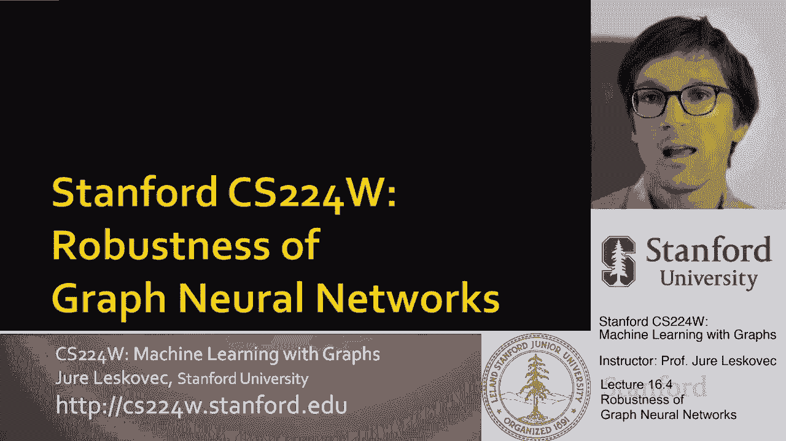
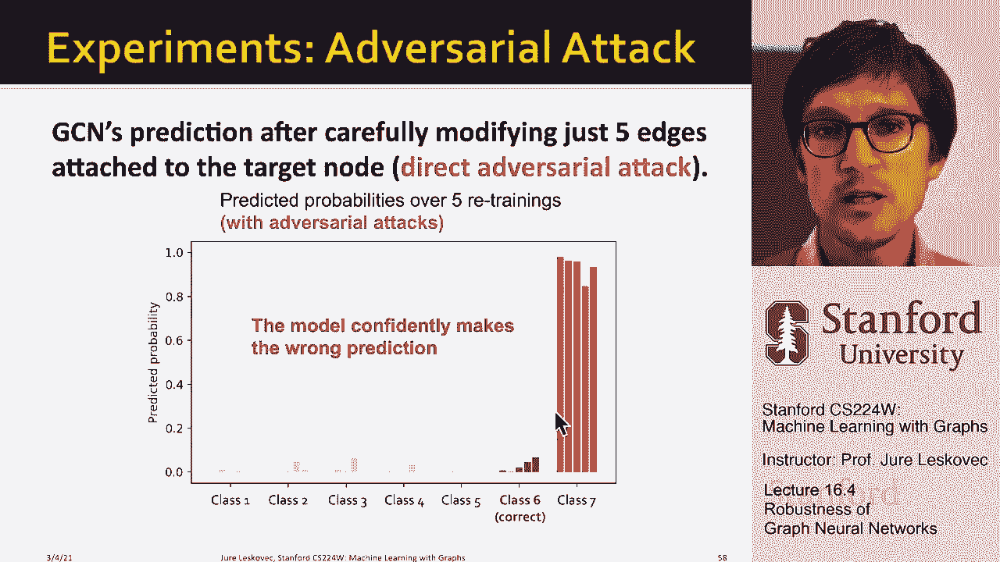

# 【双语字幕】斯坦福CS224W《图机器学习》课程(2021) by Jure Leskovec - P52：16.4 - Robustness of Graph Neural Networks - 爱可可-爱生活 - BV1RZ4y1c7Co

第二个话题呃，我想讨论的是图神经网络的鲁棒性，所以问题是，这些模型对。

让我们说对抗性或呃，任何其他类型的攻击，所以呃，这是由更广泛的深度学习领域驱动的，在哪里，近年来我们有，我们已经看到深度学习模型在各种应用中令人印象深刻的表现，嗯，尤其是在计算机视觉方面，自然语言等。

但是已经证明的是如果这些模型应用于，到现实世界，在现实世界中我们有不同类型的演员，那么问题就变成了这些模型对，呃，各种攻击，一个例子是对抗性攻击的概念，其中，比如说，你可以取原始输入图像并询问神经网络。

你以为这是什么，神经网络会说，哦，这是一个，这是一个，呃，它是一只熊猫，但你能做的是非常轻微的干扰，呃，像素的值，嗯，你知道，只有你，你增加了一点噪音，现在神经网络会完全混淆，它会说，哦，这是一个。

它是，是长臂猿，对呀，是一只猴子，所以重点是对人类来说当我们看到这个，他们看起来都像，呃，给我们的熊猫形象，但是通过非常小心和系统，非常对抗性，你可以改变神经网络的预测。

这些类型的对抗性示例也被报告用于自然语言处理，模型音频处理，关键是对手可以很快，嗯，只需稍微操纵输入就能改变我们模型的预测，所以嗯，对抗性例子的存在，阻止了深度学习模型在现实世界中的可靠部署。

因为对手可能会试图积极破解深度学习模型，呃，避开它，嗯，然后呃，这样的模型性能可能比我们预期的要差得多，对呀，嗯，人们发现深度学习模型通常并不健壮，嗯，这是迷宫研究的一个非常活跃的领域，让呃。

这些模型对对抗性攻击或对抗性示例具有鲁棒性，让我们看看这节课的这一部分，你如何将对抗性示例的概念形式化为图形神经网络，并且图神经网络对对抗性示例鲁棒，前提是，图神经网络的常见应用，呃，你知道的，呃。

涉及，比如说公众可以访问的平台，或者背后有一些金融货币利益，那么这些类型的攻击，呃，可能会发生，所以说，比如说，在推荐系统中，社交网络，所以，呃，和搜索引擎，总有一些类型的演员，可能想操纵系统的攻击者。

所以对手有动机操纵输入图，基本上试图改变，或者推翻或破解图神经网络的预测，那么我们要如何开始设置，嗯，图神经网络鲁棒性研究框架，嗯，图神经网络的鲁棒性研究，我们要去，呃，具体考虑以下设置。

我们将研究半监督节点分类，我们将使用图卷积神经网络模型，嗯，作为一个例子，这个想法是对的，我们有一个部分标记的图，下面是一个例子，我们有一个图表，然后呃，我们正在考虑节点分类，节点具有特性。

有些节点已经有了呃标签，我们想预测标签，呃，对于其他节点，因为我，呃，正如我所展示的，呃在这里所以呃，那么嗯，问题如下，好吧我们要做的是，就是，我们首先要描述几个，对手可能进行的攻击类型。

那我们就来谈谈，呃，你知道图神经网络是如何，呃或者一个gcn，嗯，怎么怎么会，那怎么会，呃，我们如何尝试黑它，嗯，这意味着嗯，对手，对手需要知道我们使用的底层模型是什么。

然后我们将从数学上形式化攻击问题，作为一个优化问题，然后我将展示一些经验结果，显示GCNS对对抗性攻击的脆弱性，所以让我们首先谈谈对图形的攻击会是什么，呃，看起来像呃，我们要谈谈。

特别是我们要思考的方式是，假设有一个目标节点，t，呃，我们想要谁的标签预测，假设网络中有其他一些节点，嗯嗯，我们叫他们弥撒吧，攻击者可以修改，所以这些是攻击者控制的节点，现在什么能，你知道的。

攻击者能做什么，呃，攻击者能这样做什么，假设在直接攻击中有直接攻击，意味着攻击者是目标节点，对呀，因此攻击者拥有目标节点，所以攻击者可以，那就做吧，攻击者可以修改目标节点的特征，比如说。

他们可以改变改变他们的社交网络档案，他们可以改变网站内容，他们还可以添加连接，嗯，从目标到网络中的其他节点，比如，你知道吗，他们可以买到生命，他们可以购买追随者，他们可以建立友谊，呃，诸如此类的事情。

他们也可以，当然决定移除一些连接，你知道他们可以取消跟踪用户，他们可以放弃友谊，如果这能让他们翻转，分类标签，他们拥有的目标节点，所以这就是我们所说的直接攻击，因为攻击者拥有节点，攻击者想要翻转的节点。

就是就是攻击者，所以说，比如说，如果你考虑某种垃圾邮件检测，攻击者可能想说，嗯哼，你知道的，社交网络把我归类为垃圾邮件发送者，我需要改变什么，这样社交网络就不会再把我归类为垃圾邮件发送者了，嗯。

他们可能会改变他们的属性，他们可能会改变他们追随的人，或者他们可能，他们可能会删除网络中的一些链接，嗯，还有第二种攻击，我们称之为间接攻击中的间接攻击，目标节点不是攻击者节点，所以这意味着攻击者不考虑。

不控制目标，但是攻击者可以，呃，攻击者可以改变，假设这些节点的特征，因此攻击者可以更改这些节点的连接，攻击者基本上也可以添加它们，或者他们可以，呃，移除那些连接，你知道什么是现实的例子，为了这个案子。

就是那个，比如说，攻击者想伤害别人，让我们说，网络中的无辜节点，所以攻击者会改变，嗯，呃，的，它控制到的节点的属性，也许更改他们不控制的目标节点的标签，所以也许目标节点不是垃圾邮件发送者。

但是攻击者希望某人被排除在网络之外，所以他们希望他们被贴上垃圾邮件发送者的标签，所以他们现在要改变网络结构，到目标节点的连接，这样神经网络就会，呃，对目标节点进行不同的分类，即使目标节点不知道，呃。

他们正在呃，受到攻击，那么我们如何正式确定对抗性攻击，目标是我们想在一些约束下最大化一些东西，我们的想法是，我们希望最大化目标节点的变化，标签，因此，我们希望将目标节点标签的主题更改为非常小，呃。

图操作权，我们希望尽可能少地操纵底层图形，这样目标节点的类概率就会改变，基本上，这个想法是，如果图形操作太大，就很容易被发现，嗯，呃，由，呃，由，被这个代理，通过社交网络，它会说嘿，有攻击正在进行。

但如果一个成功的，如果攻击成功，那么我们应该可以改变少量的边缘，也许这里和那里的一些功能，这将是一种不明显的小操作，这将推翻预测，的，假设目标节点的类标签，呃明显，所以这个方法。

我们想用什么方式来看待这个问题，我们会说，也许有一个类或一个标签，目标节点得到，呃，现在分类，所以我们要做的是，我们想降低正确类的概率，我们想增加一些，呃，其他选定类别，让我们说，三等，呃。

在我们的情况下，那么我们如何从数学上把它形式化呢，我们会说我们有原始图的邻接矩阵，我们有了原始图节点的特征信息，然后我们还会有呃，要操纵的素数和x素数图，这些是袭击后的图表，在我们操纵了他们之后。

我们会有邻接矩阵，我们就有了特征矩阵，我们的目标或假设是，这两个操纵是小的，对我们的目标是操纵，邻接矩阵的变化，节点特征的变化是嗯，不起眼的小，所以基本上我们想保留基本的图统计，比如度分布，呃。

节点特征统计等，正如我提到的，图形操作可以直接改变节点和特性，以及目标节点的特征和连接，也可以是间接的，也就是说我们是，我们可能想改变，嗯，网络中其他节点的连接和特征，希望改变目标节点的呃标签，嗯。

既然我们说了我们想要的，我们想做什么，让我们把它正式化，所以我们会得到一个目标节点，v um，让我们，系统要做的，呃，你知道，呃，假设社交网络要学习原版，原始图上的分类器，对呀，所以它会说，哦。

让我们告诉你，在训练数据上定义此可能性，让我们在训练数据上优化我们的神经网络模型参数，然后嗯，你知道的，既然模型已经训练好了，预测会是什么样子，我们将为这个感兴趣的目标节点说一个ha，v。

让我们把我们的预测器f分类为，我们的参数神经网络，呃，我们训练的θ星应用于这个图，嗯，这是我们的预测对吧，我们要预测这个节点的类，最高的V，呃，预测，呃，概率，只是一种标准的东西，攻击者开始行动。

那么攻击者要做什么，呃可以呃，他们能做的是他们不能改变模型的参数，对了，模型参数不能改变，因为你知道社交网络，操作员已经训练了模型并部署了它，所以模型参数不一定，呃能够，呃要改变，所以我们能做的。

在这种情况下，我们能做的是GCN，嗯，我们就可以，我们思考它的方式，我们要考虑一下，GCN现在将通过操纵的图学习，对呀，所以基本上我们要把a改成素数，我们要把x变成x素数。

现在我们要在这个被操纵的图表上训练，我们将得到一组不同的参数，然后是GCN对目标的预测，呃，节点可以同时更改，因为输入是不同的，因为我们学到的参数也是不同的，因为我们在不同的图表上学习它们。

具有不同的节点特征，我们希望预测改变，呃，在图形被操纵后，对呀，所以我们想要操作后节点V的类，与班级不同，呃，在操作之前，所以我们想把嗯，呃，班级，所以我们要走的路，嗯，要做到这一点是以下权利。

我们要做的方法是说，呃，我们想改变，或者对于给定节点的类的a，介于真类和被操纵类之间，就在这里，我是说，输出的概率是，um表示给定节点属于给定类，所以这里我想要一个新预测类的预测对数概率。

呃C星质数要增加，同时我想降低最初预测类的预测对数概率，我们希望这个术语减少，我们希望这个术语增加，所以我们要把它公式化成这个delta函数delta，这基本上是改变目标节点上的预测，这是一个变化。

就像在一个正确的类的可能性中，被操纵类的可能性与，我们使这个术语这个三角洲高的方法，使这个概率尽可能小，我们在这里使这个概率，嗯一样大，呃尽可能，对呀，我们希望这个接近于零，我们希望这是，呃接近一个。

所以我们想增加第一个学期，左边的项，我们想减少，呃，所以我们可以把它写成一个优化问题，我们想说我们想在底层图结构上做arg max，和特征向量，我们想最大化这个三角洲，对呀，预测变化的增量函数，呃。

在目标上，受操纵的约束，图结构和特征向量的um，呃越小越好，嗯，理想情况下，我们想做的是解决这个优化问题，优化这一目标的优化挑战，如果我们是对手，嗯邻接矩阵A是一个离散的对象，所以你不能拿渐变，嗯。

来决定要操纵什么边缘，嗯，这是第一个挑战，第二个挑战是每一次修改，邻接矩阵和特征向量，我们需要重新训练底层的图神经网络，看看预测是否，呃是，呃，会翻转，呃还是不，我不会在这里详述更多细节，你知道。

这里有一张纸，呃，你可以阅读，呃，去学习，呃，更多关于这个的信息，但本质上的想法，这里的想法是我们想操纵图的结构，和特征向量尽可能少，使得目标节点V的预测标签将发生变化，嗯，尽可能多。

所以想象一下我们现在能够解决这个问题，呃优化问题，我们可以问自己，在特征矢量中找到战略性放置的边缘和变化有多容易，这将导致模型对给定节点做出完全错误的预测，所以这里我们正在进行一个半监督节点分类任务。

用图卷积神经网络，呃，在一个有2800个节点和大约8000条边的论文引用网络上的模型，你知道这是一个六路分类任务，我们正在做的，下面是我们正在查看属于类的一组节点，我们运行了图神经网络，我们训练了五次。

呃，从随机起点，我们在这里说，你知道这些属于六类的节点的预测概率是多少，你可以看到他们有很高的概率，所以我们的图神经网络学习得很好，现在想象我们是一个攻击者，我们说我们想要这个，嗯六班，所以基本上，呃。

呃，属于专题六的研究论文，我们希望操纵底层的图结构，使它们属于类，呃7对了，这意味着我们要改变邻接矩阵，嗯和嗯，呃看看我们能不能翻转，呃，他们的标签，有趣的是，如果您使用这个框架并询问。

在一次直接的对抗性攻击中，我们需要操纵多少条边缘，原来GCN的预测会翻转，嗯，只是在修改了连接到目标节点的五个边之后，所以在这里我向您展示了一个给定的目标节点，你知道五种不同的，呃，只是五个不同的例子。

我们看到每次我们能够翻转这个目标节点的标签。

谁是，呃，六班现在是七班的，嗯，模型非常确信这个节点属于七类，即使在现实中是，呃，在课堂上，呃，六，总结一下，图神经网络对攻击的鲁棒性，呃，这里总结了一下，其中um零意味着分类裕度，直觉上你可以。

你可以想想有多自信，嗯是或如何正确是嗯是分类，所以如果是阳性，这意味着分类是正确的，有一个大的和一个大的差距，所以我们对正确的分类很有信心，如果分类裕度为负值，这意味着我们错了，我们是，我们错了很多对。

我们对错误的预测有很高的信心，我们看到你知道嗯，没有攻击的图神经，这是这里的单个节点，我们看到对于大多数节点，图神经网络能够做出正确的预测，它对它的预测是非常确定的，你知道预言，预测性能并不完美。

所以有一些错误，但这些错误也有点边缘，网络不确定这类，这些节点中的，如果我们采用直接的对抗性攻击，然后你就可以看到我们如何很容易地改变，神经网络基本上总是预测，总是犯错，并超级自信它在错误中，呃类。

所以在错误的班级中分配高度的信心，所以这是一次直接的攻击，直接对抗性攻击，呃，如果，如果还是直接攻击的话，但这是一次随机攻击，这意味着我们不会从战略上敌对地改变边缘，但是我们加了边，呃在呃随机。

你可以看到基本上神经网络会被混淆，但没那么糟对吧，它，仍然占多数，它正在做出正确的预测，所以肯定会降低性能，但不是那么剧烈，如果你看看我们现在基本上操纵的间接攻击，嗯，呃，网络中的其他节点。

看看我们能不能改变这里目标节点的标签，你又看到了，我们能够做到这一点，呃挺好的，这意味着我们能够翻转的相当多的节点，呃，他们的呃标签，所以这意味着对抗性的直接攻击非常强，它们会显著恶化GNN的性能。

随机攻击要弱得多，然后是对抗性攻击，在一定程度上降低了性能，间接攻击不如直接攻击有效，但更有效，呃比呃比直接，呃，随机攻击，所以嗯，我们由此得出的结论是如果，嗯，对手可以访问整个网络。

可以访问数据并对其进行操作，那么改变这些深度学习的预测是非常容易的，呃，图神经网络，呃模特，所以总结一下，研究了图卷积神经网络的对抗鲁棒性，应用于半监督节点分类，我们考虑不同的攻击策略。

不同的攻击可能性，呃在在图表中，我们谈到了直接攻击和间接攻击，然后，我们在数学上把对抗性攻击表述为一个优化问题，所以这是对手必须解决的优化问题，我们看了一些例子来实证地证明，呃。

GCN的预测性能可能会受到对抗性攻击的显著损害，所以我们的结论是，gcn对对抗性攻击不健壮，但它对间接攻击和随机攻击都有一定的鲁棒性，呃噪音，关于这些类型的稳健性的话题。

