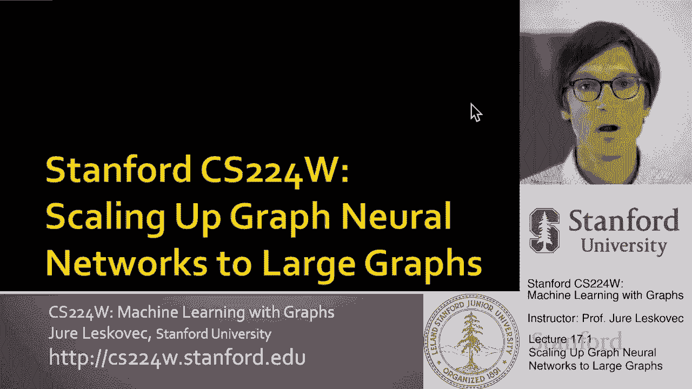
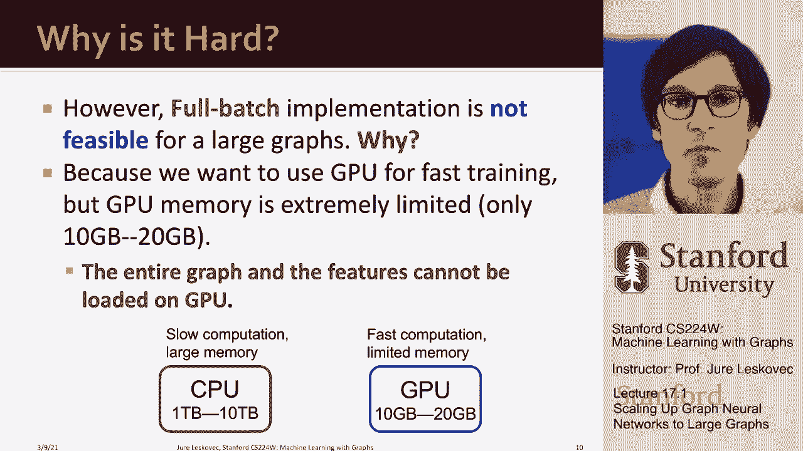

# 【双语字幕】斯坦福CS224W《图机器学习》课程(2021) by Jure Leskovec - P53：17.1 Scaling Up Graph Neural Networks to Large Graphs - 爱可可-爱生活 - BV1RZ4y1c7Co

欢迎来到今天的课程我们将讨论如何扩大，图神经网络，我们特别感兴趣的是，我们能不能，可应用于大比例尺图的图神经网络模型，我们可以用什么样的技术来做到这一点，所以呃，我们先，呃有点定义，激发问题。

所以呃，在许多现代应用中都有大图，嗯，如果你考虑推荐系统，比如说，在亚马逊向你推荐产品的系统，呃，看Pinterest帖子的别针，检查Instagram等等，嗯。

你可以把这看作是一种我们想连接用户的方式，呃到内容产品，视频呃，他们可能会对，对和呃，你可以想到这个推荐任务，嗯作为一种方式，呃，做链接预测，呃，在这个呃，大二部图，你有的地方，你知道数以亿计。

一端数十亿用户，在另一边，你有几千万，数以亿计，百亿物品，呃在另一端，你想预测什么，呃，什么呃，什么电影，什么视频，什么产品，呃是呃，有趣啊，为了什么，呃，用户，您可以将其表述为链接预测，呃。

任务另一个示例，呃，哪里呃，图神经网络可以很好地应用，在社交网络中，比如说，一个推特脸书Instagram，在那里你有用户、朋友和关注关系，你可能想问我想怎么做，在链接级别向对方推荐朋友。

我想做某种用户属性预测吗，比如说，嗯，预测不同的用户会对什么广告感兴趣，或者预测他们来自哪个国家，或者我在做某种属性归责，从某种意义上说，也许有些用户告诉我他们的性别，但我不知道其他用户的性别。

我想预测它，在这种情况下，这些网络有呃，十亿，呃，用户和数百亿到数千亿的边缘，然后呃，另一个应用程序，你知道这可以被我们今天要讨论的东西所激励，IS是异构图的一个概念，例如，你可以，你可以一个。

这样的数据集被称为微软学术图，这是一套1。2亿张纸，一亿两千万作者及其从属关系，机构等，所以呃，这意味着现在我们有一个巨大的异构，呃，知识图，例如纸张分类，这将是预测什么类别，这篇论文是关于什么主题的。

向作者推荐合作者，呃，预测呃，哪些论文应该互相引用，当你写一篇新论文时，你可以想象这是非常有用的，或者做一项新的呃研究，这些又是，呃，更广泛地说，是对的，我们可以考虑，知识图，来自维基百科的知识图。

从呃，自由基，我们又有一亿个我们想做知识图完成任务，或者我们想做，呃，知识推理任务，呃关于这个，在这些知识图表上，所有这些应用的共同点是它们都是大规模的，节点数以百万到数十亿为单位，你知道软边的数量是。

我知道十个，几千万到几亿，或者几百到几千亿，问题是对的，比如如果我们有这些类型的大比例尺图，这么大，这组大规模数据，我们想在，在我激励的所有这些情况下，我们可以做节点级的任务，还有呃，成对级别的任务。

如呃链接推荐，链接预测等等，我们如何将GNN扩展为这样的图，呃这个尺寸，对呀，什么样的系统，我们可以开发什么样的算法，呃，这种呃，海量数据，所以让我解释一下为什么这很难，或者为什么这不是微不足道的，嗯。

很快就会变得很清楚，我们需要，呃，特别方法和特别办法，当我们有一个大的呃数据集，让我们大致想想，当我们有大量的n个数据点时，呃，我们想做什么，一般情况下，2。我们的目标是尽量减少损失，平均损失，呃。

在训练数据上，所以如果我有n个训练数据点，然后你知道我走了，我有一个从0到n减去1的求和，其中对于每个数据点，我在问它的损失是什么，对呀，真实标签之间的差异是什么，真实的预测和嗯，呃呃还有那个呃。

以及模型所做的预测，我想计算一下总损失，在当前模型参数下，这样我就可以计算出损失，我可以计算损失的梯度然后更新，以使总损失最小化的方式建模参数，基本上模型参数会改变，这意味着模型预测应该改变，这样的。

使损失，真实标签与预测标签之间的差异，嗯变小了，注意这里的重点是什么，这里的重点是，我们必须在所有训练数据点上总结这些损失贡献，因为训练数据点太多了，我们接下来要做的是。

我们实际上会选择一小群M个数据点，称为迷你批，然后用较小的求和来近似这个大求和，在那里我只检查了迷你批中的点，就在那边，我不知道，我们采样了十万个数据点，然后计算它的损失，然后做一个渐变。

这意味着我们的损失，我们的梯度将是随机的，会不精确，会有点随机，因为这将取决于确切的，呃，随机点子集，我们有重算吗，重型精选，但计算速度会快得多，因为，m迷你批的大小将远小于数据总量，所以我们的模型会。

你能在图神经网络中做什么，你会简单地说，假设我在做一个节点级的预测任务，让我对一组节点进行子采样，不呃，把它们分成小批量，呃超过他们，嗯和嗯，这就是为什么，比如说，在图神经网络中不起作用，对呀。

想象一下在一小批，我只是对一些节点进行采样，这张照片试图展示的是什么，这些是我要取样的节点吗，因为小批处理比图形的总大小小得多，会发生的是是的，我要对这些节点取样。

但是图神经网络的运作方式是它们聚合来自邻居的信息，但是呃，很可能这些邻居中没有或大多数不会在我们的，嗯，在我们的迷你批，所以嗯，这意味着小批处理中的节点将倾向于被隔离，彼此的节点。

因为GNN生成节点嵌入，通过聚合来自邻居的信息，呃，在图中，呃，那些邻居不会是迷你批的一部分，所以不会有什么，呃，总计，我们在孤立节点上计算的任何梯度，不会代表整个梯度，所以这意味着随机梯度下降可以。

呃将无法有效地训练图神经网络，如果我们做这个简单的迷你批处理实现，其中我们简单地选择节点的子样本，正如我在这里说明的那样，因为迷你批处理中的节点不会相互连接，所以不会有任何消息传递，呃。

能够在邻居之间完成整个事情，呃要失败了，所以嗯，另一种方式，我们怎么能，呃，这样做是说，让我们忘记迷你配料，上的渐变，让我们做所谓的全批处理实现，全批次培训，全批量培训的问题是，以下内容，就是你能想到。

我们同时为所有节点生成嵌入，这里重要的是要注意到，我们在几层嵌入了节点，对呀，我们从零层开始，这意味着节点的嵌入只是节点的特征，然后我们通过第一层传播，我们现在得到了第一层节点的嵌入。

从第二层计算节点的嵌入，我们必须聚合第一层嵌入，计算第二层，呃，嵌入，所以这意味着你首先要把图加载到内存中，然后在GNN的每一层，您将计算所有节点的嵌入，使用上一层所有节点的嵌入，对呀。

所以现在如果我在计算K层，我需要所有节点的所有嵌入，存储为K层减1，这样每当我创建下一层时，就会嵌入给定节点，我检查它的邻居是谁，我拿上一层嵌入，然后聚合它们来创建下一层嵌入，由于这种递归结构。

我基本上创造了，嗯，我需要能够在记忆中保留整个图表，加上上一层所有节点的嵌入，以及足够的内存来创建所有节点的嵌入，呃下一层，一旦我有了，然后我可以计算损失，我可以计算，执行梯度下降，所以你可以这样想。

我从节点的初始嵌入开始，我执行消息传递，创建k层k加1的节点的嵌入，现在我把这个呃放在这里，再叫这个层k，执行消息传递以到达下一个，呃层，这就是所谓的完整批处理实现，图神经网络。

为什么全批处理实现有问题，这个问题有两个原因，一个原因是它需要超长的时间，而且有点，嗯时间明智的数据明智的低效做完整的批量培训，但想象一下你知道你有世界上所有的时间，所以你说。

我不在乎是否需要更长的时间，即便如此，仍不可能对大型企业实施全批次培训，呃，对于大图，这样做的原因是因为如果我们想让训练，嗯，规范是一种，呃，在我们今天使用的数量级上，然后我们想用GPU，我们想用。

图形卡来快速训练，但是GPU内存，Gpus有一种非常特殊的超级快，呃，记忆，但他们有很少的它，它们有大约10到20G的内存，我想你今天最多能买到30G左右，呃大的GPU卡，这被认为是最先进的技术。

没有人有那些显卡，对呀，但关键是整个图和整个特征，如果你有十亿个节点，它会大得多，如果你有十亿个节点，嗯和你刚刚花了，假设一个字节，嗯或者你有，我不知道，一百字节的特性，每个节点的uh，它就很容易。

您将需要太字节的内存，10TB主存，这是我们今天使用CPU的大型服务器所能获得的内存量，所以关键是CPU计算速度慢。

大容量内存，Gpus的内存非常小，但是超级快，关键是如果你想做整批，你需要适应所有的功能，所有嵌入和整个图形结构到GPU内存中，而10G就是就是就是什么都不是，它比你的iPhone的内存还少。

所以它太小了，我们无法扩展完整的批处理实现，超越几千个节点，呃网络，绝对不是对数百万人，而不是，呃到数十亿，所以嗯，这激发了今天的讲座，对呀，所以今天的课是，我们怎样才能改变方式，我们认为图神经网络。

我们如何实施培训，我们怎么，呃，改变架构，这样我们就可以把它们放大到，呃，数十亿节点的大图，这样我们就可以用小的，嗯，GPU内存，我们可以限制简单地实现迷你批处理的问题，呃就是不管用。

所以我要谈谈两种方法，基本上在这个讲座中，我要谈谈三种不同的方法，其中两个将基于执行消息，在每个小批处理中传递小子图，所以我们将改变我们设计迷你批的方式，嗯，这将导致快速的训练时间，一种是邻域抽样技术。

另一种是叫做集群gcn的技术，呃，我还要谈谈第三种方法，叫做呃，这将是关于简化GCN，以这样一种方式，我们简化了架构，以便呃，业务，呃，可以在CPU上有效地执行计算，因为CPU有很多内存。

