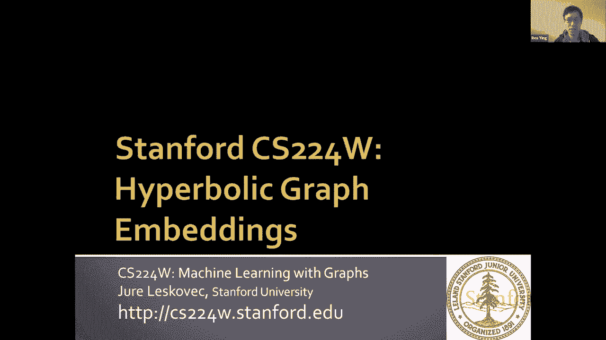
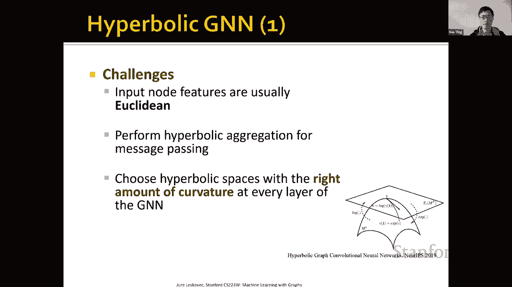
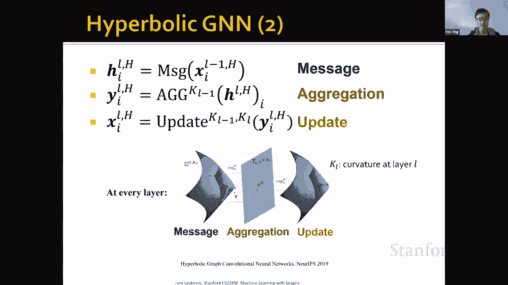
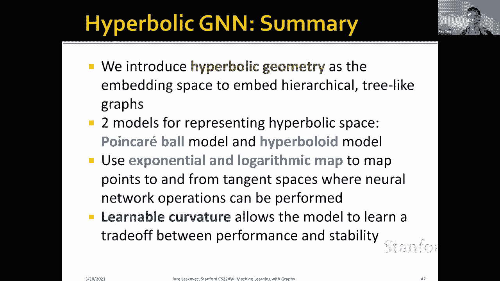

# 【双语字幕】斯坦福CS224W《图机器学习》课程(2021) by Jure Leskovec - P59：19.2 - Hyperbolic Graph Embeddings - 爱可可-爱生活 - BV1RZ4y1c7Co

在这次讲座中，我将介绍双曲线图嵌入在学习中的使用呃，显示特定层次结构和树状结构的图的表示。

所以在上一节课中，呃，我们关注欧几里得空间中的图表示学习，也就是R到N，然而，欧几里得嵌入并不总是捕获复杂的图结构，所以这里我们有一个树结构的例子，一个完整的二叉树，我们观察到的第一层有一个节点。

第二层我们有两个节点，第三层我们有四个节点，等，所以在这种树状结构中，经常在那里，呃，节点数呈指数级增长，随着树的深度增加，所以这种树很难嵌入欧几里得空间，呃，正如你所看到的。

因为滑梯本身是一个二维平面，我们可以看到，随着深度的增加，是的节点，呃，树叶越靠越近，以至于他们不能再，嵌入空间不能再代表它们之间的距离，忠实地因为他们非常，由于节点数的指数增长而非常聚集在一起。

所以这里我们关注的是，带呃的图表，这种树状结构，所以我们把这种树状图定义为，类似于树的图，比如说，如上图所示的二叉树，但它仍然可以包含很少的循环，呃，比如说，在现实生活中，呃呃。

我们可以拥有像知识这样的东西，按层次结构组织的图，因为人类的许多知识是按等级组织的，同时，在这个结构中仍然可能存在某种循环，所以它主要是一棵树，但是在图本身中有一定数量的循环。

所以我们在这里考虑这种结构，我们想注意到嵌入几何学已经非常重要了，在捕捉这种特殊的图形结构方面，嗯这里我们考虑一些，呃其他呃，有趣的图结构，比如说，如果我们有一个非常，呃，许多非常大的循环。

这类图形最好嵌入到球面几何中，因为在曲率为正的球面几何中，这些图表，我们实际上可以嵌入很多很多循环，因为球体里有很多，许多循环，嗯，而如果你如果我们有一个网格状的图，嗯，欧几里得空间是最好的。

因为正如你所看到的，笛卡尔坐标本身是一个网格状结构，所以零曲率的欧几里得空间是最好的，那么对于这种图来说，像图这样的分层树怎么样，我们正在考虑使用双曲空间，这是建模的另一种嵌入空间，树状结构树的嵌入。

超质量值空间的优势使其能够自然地建模树，我们将在后面的幻灯片中详细说明这些优点，在那里我们解释定义，然而，当我们将深度学习和双曲空间结合起来时，会有一定的挑战，主要原因是现有的深度学习工具箱只能应用。

呃，到呃，欧几里得空间，呃，而在双曲空间中，我们需要定义特殊的操作员，进行这种深度学习，呃，业务，嗯，让我们首先定义什么是双曲空间，所以双曲几何不同于欧几里得几何，欧几里得几何第五公理，这是平行公设。

所以在欧几里得几何学中，平行的可能性是在给定的平面上，给定一条线和一个不在线上的点，通过该点最多可以画一条与给定线平行的线，这在欧几里得空间中似乎很明显，如果我们有，呃，如果我们如果我们有一盏灯。

那么与自己平行的线是一种独特的，呃，如果我们只考虑，通过一点的线，嗯，然而，在呃，双曲几何，有无限多条线平行于通过该点的给定线，这可能看起来不太直观，因为我们对欧几里得空间非常熟悉。

但这里有一个双曲空间的表示，用朋克球，所以我们来解释一下这个Puncreball层，但是，它基本上是一种将双曲空间形象化的方法，在欧几里得空间，你可以看到这里的蓝线，它看起来像一个曲线。

但它实际上是一条直线，呃，呃，在双曲空间中，我们可以，我们也可以在这里定义一个红点，这是双曲几何中另一个不在线的点，声明有无限多条线平行于，这些线条实际上是在可视化中画出来的，所以这些都是弯曲的。

黑色的线条，呃，我们在这里画，在双曲几何中实际上有直线，它们也会穿过红点，同时它们也平行于蓝色曲线，对不起，双曲线空间中的蓝色直线，那是呃，主要是它与欧几里得空间的区别，所以因为这个，呃，光谱性质。

双曲空间不能在欧几里得空间中自然表示，因为它违反了第五条，呃，欧几里得空间第五公理，也就是平行公设，所以嗯，我们通常用两个几何模型来表示，或者可视化双曲空间，通过将其嵌入为欧几里得空间的子空间，然后呃。

它们也是等价的，所以我们也可以在这两个可视化双曲空间的模型之间映射，在欧几里得空间，我们要介绍的第一个模型是朋克模型，这是一个我们表示的模型，我们把双曲空间表示为一个开放的，空球，所以它的可视化是，呃。

在右边，哪里呃，我们可以看到一个球，嗯还有这个，呃，通过打开，我们的意思是，这个双曲空间中所有点的集合，并且不包括球的边界，所以外圈，呃不是球的一部分，但圈子里的一切，呃是朋克帕克舞会的一部分。

半径与k的平方根成正比，我们将介绍什么是k，k实际上是曲率的逆，然后呃，这里的重要性质是图中的每个三角形都有相同的面积，所以呃，它可能不会，呃再次，在欧几里得空间里不是很直观，正如我们所看到的。

就像中间的所有三角形都有一个更大的，似乎有更大的面积，在欧几里得度量的欧几里得定义中，但是嗯，但这里的每个三角形实际上都有相同的面积，然后呃，您可以看到为什么这个空间非常适合嵌入式，层次结构或树状结构。

你注意到在中间或中心，呃，联合国日刊，呃，呃，朋克球，这些三角形中很少有，呃，在双曲空间中，还有嗯，呃，向着圆的边缘，大家可以看到，就像有许多指数级的小三角形，尽管面积相同，嵌入到双曲空间的边缘。

或者两个朝向指针球边缘，所以就面积或体积而言，这种指数级的增长，呃，作为呃，半径或范数的增加允许我们嵌入双曲线树，所以基本上树木可以通过将根部嵌入中心来嵌入，因为他们很少。

把所有的叶子都埋在朋克球的边缘，因为在，呃，随着深度的增加，嗯，我们将引入另一个替代模型，对双曲空间进行建模，它被称为双曲模型，也被称为洛伦兹模型，嗯，这基本上是一个双曲面的上层，如下图所示。

这也是一组欧几里得空间，所以说，嗯，不像猪肉职业模式，大家可以看到，有指数级的多，嗯，呃，的边缘的三角形，嗯，这里有一个模型在数值上更稳定，这意味着你不必有极高的机器精度，来表示所有这些小三角形。

就它们向混凝土球边缘的嵌入而言，呃，这里，嗯，它基本上是在双曲面上，也没有上限，这样它就可以走了，嗯嗯，数量可以变得非常大，但是呃，它不需要非常多的，呃，表示，指向双关语边缘的点。

所以论文表明双曲模型在数值上更稳定，它还有一个优点是有一个稍微简单的公式来表示它的度量，然后呃，还有呃，在这个双曲模型中的距离，所以很多时候我们做推导，我们表示这个双曲面模型中的神经网络架构。

所以这两个是指针球和双曲模型，这两者是等价的，因为我们可以有一个映射，呃，介于朋克球和双曲面之间的，这个映射是一对一的，所以这是一个双射，嗯如此如此给予，呃，呃的简介，双曲空间，呃。

我们也想在这里定义我们的任务，所以我们的任务是典型的图形表示学习，这是我们在本堂课中所学到的，任务可以是链接预测或节点分类，还有一个例子，实现这一点的嵌入空间示例，呃，那种任务是朋克嵌入嗯由妮可，呃。

在二十八年，嗯，所以在这个可视化中，它是指针球的形式，我们可以看到实体嵌入在这个朋克球里，嗯，向它的中心是，嗯嗯，它们包含具有非常高层次结构的节点，或者知道有树根，所以说，例如实体，我们有一个物理实体。

我们有抽象或有机体，这些都是非常抽象和高级的节点，可以包含许多，许多不同的孩子和走向边缘，呃，呃，嵌入空间，有很多，许多不同的，指数级的许多实体可以嵌入那里，这些通常是位于较低层次结构中的节点。

或者朝着树叶，像图形，比如说，比如嗯，呃，到达，代谢，呃，代谢率，这些都是非常具体的和呃，非常详细，呃，嗯嗯嗯，对某些实体的描述，嗯，它们中的许多是指数级的，可以嵌入到朋克球的边缘。

这基本上是我们想要实现的嵌入，这样我们就可以执行链接预测之类的事情，这意味着我们可以预测一个实体和另一个实体，呃，在这个，呃，在这个知识图中，都是连着的，嗯，为了呃，比如说，面包和食物是否有联系。

它可以通过等级关系连接起来，也可以通过非等级关系连接，所以嗯，这是链接预测，我们还可以通过预测每个节点的标签来执行节点分类，呃，图中的节点，好的，然后嗯，在进入呃，详细的架构，呃，我们先，嗯。

也研究双曲空间是如何用数学表示的，所以双曲几何的形式定义是一个流形，嗯，这是呃，这是呃，基本上是一个高维曲面，中的二维曲面，但在高维度，嗯，罗马尼亚流形是一种特殊流形，它配备了两个东西，一个是内积。

所以两点之间的内积必须定义，它将定义一个度量空间，或者像在剩下的流形中如何计算距离一样，另一个保持流形的必要条件是切空间，它是一个欧几里得空间，近似流形，但只是局部的。

所以你可以想象它是曲面在某一点的切线，在某一点接触表面，两个函数都必须保持在流形状态，它是内积，张力空间必须平稳地变化，或称为在流形上可微，还需要其他概念，所以这里我们也考虑测地线，呃。

测地线定义为流形中的最短路径，它类似于RN中的直线，所以如果你还记得我们有平行公设的情节，嗯，在双曲空间中，所有这些曲线实际上都是测地线，所以它们是最短的路径，在流形中放置两个点。

这就是为什么我们可以说，有无限多的直线通过这个点，然后与给定直线的平行线，双曲空间是一个具有常负曲率的罗马尼亚流形，这里我们把它表示为负1/k，其中k必须大于零，所以你可以看到当k变得非常非常大时，嗯。

呃，双曲空间曲率变得非常非常接近于零，零只是表示一个平坦的空间，因此，随着英国的增长，它将变得越来越欧几里得，但是呃，曲率越负，所以当k很小的时候，空间就会越弯曲，这里我们看一点，曲率如何影响。

呃影响嵌入空间，所以我们用我们的负片，呃，1/k表示曲率，然后呃，呃，根k也是点曲线球的半径，这就是为什么嗯，呃，半径与曲率有关，所以嗯嗯，是啊，是啊，呃，如果我们看双曲线模型，公式其实很简单。

这是内积的定义，也叫闵可夫斯基内积，呃，在双曲空间中，所以如果我们有一个d维双曲空间，双曲模型将有一个d加一维，内积是由这两件事定义的，所以嗯，有内积的负部分，还有内积的积极部分。

它的行为与欧几里得分量几乎相同，但我们也有消极的部分，就是嗯，它有一个负号，呃，在这个内积里，基于这个内积定义，两个双曲点之间的距离可以这样计算，给定双曲空间中的两点x和y。

我们可以计算乘积中的闵可夫斯基除以K，这与曲率有关，arash表示双曲余弦函数的逆，所以我们用这个函数来计算两点之间的距离，另一个重要的概念叫做切空间，所以正如我们提到的，切空间基本上是欧几里得空间。

流形局部点上的欧几里得近似，所以流形的局部邻域，我们可以有一个与流形相切的欧几里得空间，但只接触歧管，呃，在这一点上，所以说，比如说，在这个可视化中，我们又有了一个表示双曲空间的超倍体模型，切线空间。

呃，在北极，也就是双曲面的底部，呃，画在这里，嗯，我们可以，呃，在这里定义某些映射，所以这个，嗯，这条线，这其实是一条直线，当然它看起来像双曲空间中的一条曲线，但如果我们也把它映射到切线空间。

这就变成了一条直线，因为切空间是欧几里得空间，微小的空间通过Minkowski的内积再次定义，如果我们在V和X之间做内积，它是零，所以这就是定义，所有点v的集合，使得v和x之间的内积等于零。

定义点x处的整个切空间，最后我们讨论一点测地线距离，测地线距离，正如我们提到的，类似于欧几里得空间中的最短路径，这也是双曲空间中直线的概念，曲率越负，呃，测地线就越向中心向内弯曲。

两点之间的距离也会增加，这里有一个示例图，我们计算呃之间的距离，具有相同坐标的两点x和y，所以嗯，呃，呃，说，呃，就像，假设x是零点五，零点六，y是零点二，零点三，它们之间的距离实际上增加了。

如果曲率增加，对不起，如果曲率变得更负，所以嗯，向更消极的部分，的，它们之间的距离实际上增加得更多，所以在这个图中可以更直观，我们这里有这两个点，x和y，在这里的双曲空间中，我们只是在派克球中表示它。

然后这里，呃，零是原点根，k是半径，也与空间的曲率成反比，暗酿曲线意味着双曲空间的边界，曲率更负的地方，对呀，曲率越负，半径就越小，所以呃，可以看到测地线也画在这里，所以嗯，如果呃，在深蓝色中。

所以在更高的曲率空间中，的，测地线更加向中心弯曲，向着呃，高压氧空间的中心，呃，然而呃，为了清淡的酿造，um版本，或者曲率更大的浅蓝色空间，测地线向内弯曲较小，在极端情况下，um x y，呃，呃。

空间是欧几里得的，意味着朋克球是无限大的，那么测地线呢，呃，一点都不弯曲，它恢复了我们的欧几里得最短路径概念，这里基本上是一条直线，和另一个重要的概念，基于所有这些定义的是指数和对数映射。

所以这是一个映射，我们可以从切线空间映射到流形，反之亦然，所以指数映射映射切空间中的任意点，到欧几里得，从帐篷空间到欧几里得，呃，对不起，从欧几里得切空间到双曲曲线流形，还有很多算术地图。

流形并返回欧几里得切空间，所以这里，呃，它是一种可视化，我们用范数来表示两点之间的内积，呃，用这个，呃，特别，呃，呃，闵可夫斯基，在产品定义中，这样我们就可以，呃，在概念上，um，把它形象化，因为嗯。

你知道的，我们在x的切空间中有一个v，如果我们把它映射回双曲空间，它变成了双曲空间上的y点，相反，我们可以使用对数映射来映射，为什么蓝点回到红点，在欧几里得空间中的v，是欧几里得，x的切空间中的坐标。

所以在这里我们用x作为，触碰的点，呃，所以x的切空间，是我们要映射到和从的欧几里得空间，k是曲率，呃，所以它是呃，这个嗯，我们有的曲率的逆，呃定义，请注意，我们必须使用这个警告和同步函数，这些是呃。

就是双曲三角学，这里，公式真的很复杂，嗯嗯，但是嗯，如果高层的概念是存在，你只需要知道在切空间之间存在这样的映射，还有流形，然后嗯，呃，我们可以用这样的映射在欧几里得空间中执行运算。

并将其映射回双曲线空间，所以考虑到所有这些初步情况，我们现在可以引入双曲GNN，所以我们在这里关注的主要挑战是，输入特征通常是欧几里得的，嗯，但我们想把它映射到双曲空间，计算双曲空间上的节点嵌入。

第二个挑战是我们需要在双曲空间中执行聚合，呃，这样我们就可以执行消息传递，然后呃，第三个挑战是一个超，呃，我们不知道双曲空间的曲率是多少，可以完美地嵌入图形。

所以呃，这也是我们需要同时学习的东西。

所以如果你还记得，嗯嗯，呃GNN配方大多非常相似，这是GNN架构的轮廓，我们首先计算所有邻居之间的消息，以及中心节点，然后我们聚合你所有的邻居，呃，留言呃，来计算，呃，计算表示，聚合后的隐藏表示。

最后呃，我们就会，呃，进行更新，代表权的um，嗯所以那是呃，下一级代表将嗯，将捕获上一层表示的信息，这是典型的信息定位和更新功能，但在双曲空间中，注意这里我们写了一些上标，比如说，就像K l减1。

所以这表明曲率，或者L层的曲率反比，这里是kl减去1kl，这意味着更新函数需要将点从呃，上一层的双曲空间，所以在层l减去1到层l的双曲空间中，和高水平的概念，呃也是在这里的图中可视化的。

所以我们有一堆点，它们是图在前一个双曲空间中的前一层嵌入，我们对这些执行消息计算，嗯，呃，呃，在这些点和这里的中心点之间，嗯，在我们执行这些消息之后，我们需要聚合所有这些消息。

我们在双曲空间的切空间中执行这个聚合，因为在双曲空间中没有神经网络操作的自然定义，但是如果我们把它们映射到切线空间，然后我们可以在这个切线空间里做一个重心，在x点，所以我们在切空间中执行这个聚合。

在聚合之后，我们在这里有一个绿点，然后映射回另一个不同曲率的双曲空间，注意到这里是l层减去1，对不起，第一层加一层，在上一层，呃，你会是L层，所以这是一个完全不同的双曲空间，曲率不同，但是我们可以用。

指数和对数映射，将聚合结果映射回，新嵌入空间中的双曲线点，在不同曲率的新逆空间中，所有这些计算的公式都非常复杂，理解它们需要一整堂微分几何课，所以我就不多说细节了，但有一些高水平，你可以从。

得到得到从这里得到，例如，在留言比赛中，因为双曲空间没有可以在这里定义的自然神经网络操作，我们可以用这个线性层，基本上是偏置项的线性和加法，在双曲空间的切空间里，所以在这里我们用这个嗯圆和乘法。

呃代表这个，就像乘以所有的线性线性运算，然后这个圆，和它里面的加号来表示加法，所以莫比乌斯加法，这些都是非常嗯，正如你所看到的，这些是通过这里的指数对数映射定义的，所以我们首先用对数映射来映射点。

双曲点指向该点上的欧几里得切空间，在原点上，所以这里这都意味着起源，所以我们先把它映射到原来的，原点的注意空间，我们表演这个呃，切空间中的矩阵乘法，因为切空间是欧几里得的，此操作定义良好。

在我们执行这个线性操作之后，然后我们可以把它映射回，通过这个指数映射到双曲空间，所以嗯，与欧几里得运算相比，基本上它有这个指数和对数映射可以转换为，并从切线空间执行此操作，加法也是如此。

但是在这里我们需要一个特殊的操作员叫做平行运输运输，哪个嗯，它告诉你如何在空间中移动矢量，所以这可能看起来不太直观，因为在欧几里得空间中，矢量可以在不影响其长度的情况下绕欧几里得空间移动。

但实际上在双曲空间，你不能自由移动越好，因为，正如你在可视化中看到的，如果我们把，如果我们移动一个向量，嗯，向它的边缘走去，它看起来会更小，对呀，坐标会，向量的范数必须改变，所以这里也有平行运输，嗯。

而且那个，表示双曲空间中加法运算的类比，所有这些都注意到所有这些功能，虽然它们非常复杂，是可微的，所以我们也可以用Pytorch，和任何不同的自动差异化软件来执行这些操作，嗯和在聚合中。

这基本上与我们所学到的图形注意力网络非常相似，所以我们这里有这个注意力砝码，我们还绘制了它的地图，将点映射到切线空间，用注意力的方式把它们聚合在一起，然后再次将其映射回双曲空间，和更新功能中。

它又遵循同样的，呃，同样的规则，我们把它映射到肌腱空间，我们执行非线性，但请注意，这里我们将它映射回不同的曲率，因为下一层有不同的曲率和不同的空间定义，所以最后只是为了展示一点结果。

这里我们可以看到一个树状结构的gnn嵌入，正如你所看到的，因为空间中有指数级的许多点，几何形状保存得不是很好，因为在这里我们可视化节点，就像浅蓝色的节点代表树叶一样，深蓝色的节点表示A根。

你可以看到其中一些叶子实际上非常嵌入，非常接近根部，它不尊重树结构，而在双曲几何中使用双曲gcn，我们能够很好地恢复这棵树状的结构，所有的点都嵌入到各自的层次结构中，我们还发现曲率是非常重要的。

有一个甜蜜的地方，我们可以在低失真的A树，但也很稳定，呃，数值上非常稳定，最后，我们还在一堆其他标准数据集中评估了它，呃，图数据集，我们基本上用这个双曲线来测量，双曲GNN有多好。

uh将在给定的数据集中执行，所以这个度量可以在这个夸张的论文领域找到，基本上是较低的双曲性，图形变得更像树，所以这里，比如说，△等于零，这意味着图表是一棵完美的树，而这里如果Delta是11。

那么这个图不是很分层的，或者不是很像树，所以我们可以看到，双曲GNN将倾向于表现得非常好或非常好，当超策略较低时，所以这意味着图表是呃，很像树，然而，如果图表呃看起来不像一棵树，然后性能就会下降。

所以说，这就是为什么双曲线特别适合分层和树，像图形，这里总结一下，我们引入双曲几何，我们有呃，两种型号，庞克球与双曲面模型模型，在欧几里得中可视化和表示双曲空间，作为欧几里得空间的一个子空间。

我们可以用指数对数映射来映射点，从欧几里得切空间到欧几里得切空间，在那里可以执行神经网络操作，最后我们展示了我们，呃，我们可以在GNN的每一层使用关于曲率的学习，这样我们就可以权衡性能和稳定性，嗯。

谢谢你，那是嗯。

