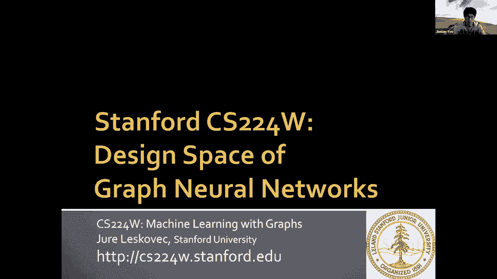
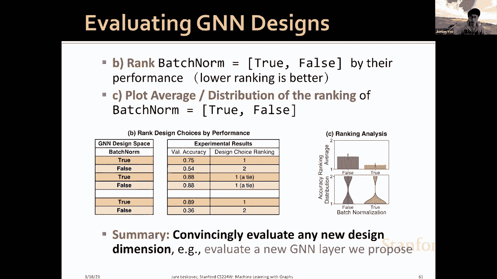
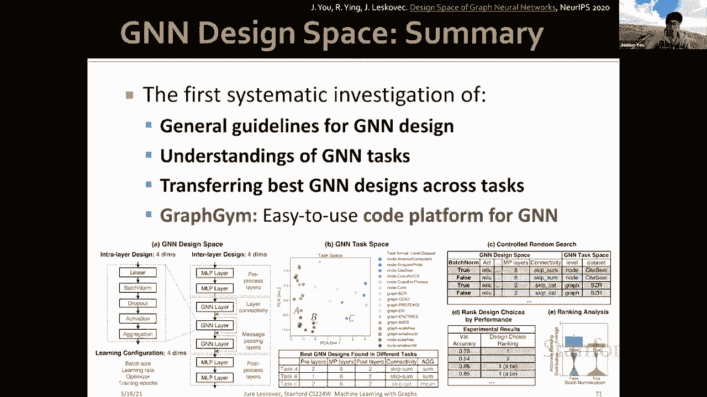

# 【双语字幕】斯坦福CS224W《图机器学习》课程(2021) by Jure Leskovec - P60：19.3 - Design Space of Graph Neural Networks - 爱可可-爱生活 - BV1RZ4y1c7Co

啊大家好，我叫阿莎，我是这门课的高层，和你们一起工作真的是一次奇妙的经历，我希望你从课程中学到很多，呃今天，我很高兴向大家介绍我最近的，图神经网络的研究设计空间。

因此，在本讲座中，我们将讨论GNN设计的一些关键问题，呃，具体来说，我们想回答如何为特定的GNN任务找到一个好的基因设计，这个问题很重要，但也很有挑战性，呃。

因为领域专家希望在他们的特定任务中使用我们的GNN状态，然而，有几十种可能的体系结构，呃，比如说，在这节课中，我们讨论了gcn，图，鼠尾草，gg，等，呃，这里的问题是。

一个任务中最好的设计可能会在另一个任务中表现不佳，我们确实有一个参数网格搜索每个新任务是不可行的，我相信你在最后的项目中一定有一些实际的经验，你知道，改变基因的超参数并不总是很难的，在这次讲座中。

我们在这项工作中的主要贡献是第一次对基因的系统研究，设计空间和任务空间，此外，我们还发布了代码平台图形健身房，呃，这是一个探索不同基因设计和任务的强大平台，开始，我们首先介绍了我们在本课中使用的术语。

所以设计意味着一个具体的模型实例化，比如说，一个四层图鼠尾草是一个特定的设计，设计尺寸表征设计，比如说，设计维度可以是层L的数量，它可以在四个层之间取值，呃，两个，四，六，八。

设计选择是设计尺寸中的实际选择值，比如说，l等于的层数，设计空间由所有设计维度的笛卡尔乘积组成，真的列举了空间内所有可能的设计，任务是感兴趣的特定任务，这可能是，比如说，呃。

Quora数据集上的节点分类，酶数据集的图形分类，任务空间由我们关心的所有任务组成，在本文中，我们引入了GNN设计空间的概念，实际上你有，在上一节课中讲得很详细，所以在这里我们只做一个快速的回顾。

所以在这个GNN设计空间中，我们首先考虑，呃，这个内层，我们已经介绍了GNN层可以理解为两个部分，转换函数和聚合函数，这里我们提出一个一般的实例化，这个视角如此具体，它包含四个设计维度，嗯，所以我们有。

呃是否要添加批处理规范，呃是否要加上退学，激活函数的精确选择和聚合函数的选择，接下来我们要设计层间连接，在讲座中，我们还介绍了组织GNN层的不同方法，在这个呃，在这部作品中，呃，我们考虑加一些呃。

前处理层和后处理层，呃，除了GNN层，它可以，呃，共同，呃，形成完整的图神经网络，所以添加渐进式层的直觉是，这可能非常重要，当需要表达节点特征编码器时，例如，当我们的节点从图像或文本中提取时。

将考虑使用一些表达，比如卷积神经网络或变压器来编码这些节点特征，然后我们也可以添加一些后期处理层，应用图神经网络计算后，当我们要说，节点嵌入的原因或转换，和一些例子，呃，说是做图形分类。

或者围绕知识图和核心的一些应用程序，呃，图神经网络的核心是，gnn层，在那里，我们考虑不同的策略来添加跳过连接，我们发现这真的有助于提高深度GNS的性能，呃，最后，我们将讨论G的不同学习配置。

而实际上这一点经常被忽视，呃，在当前文献中，呃，但在实践中，我们发现这些学习配置对通用汽车的性能有很大影响，所以具体来说，我们考虑批量大小，学习率，梯度更新优化器，然后呃。

我们训练我们的模型有多少个时代，所以总而言之，我们提出了一个由层内设计组成的通用基因设计空间，室内设计与学习配置，如果你来，呃，考虑所有可能的组合，这真的导致了一个巨大的空间，所以它包含了。

三十一万五千种可能的通用汽车设计，澄清我们在这里的目的是我们不想，我们不能涵盖所有可能的GNN设计，因为呃，比如说，你甚至可以添加更多，呃，设计维度说是否加关注，要用多少注意力，等。

所以这个空间真的是一个，非常，非常巨大，所以我们试图做的是提出一个心态转变，所以我们想证明研究一个设计空间比研究单个基因设计更有效，比如呃，呃，只考虑图形，GT那些单独的设计。

所以在介绍了GNN设计空间之后，然后我们引入gnn任务空间，我们将对GNN任务进行分类，呃变成不同的呃，因此通常的做法是将任务分类为节点分类，预测和图级预测任务。

我们在以前的课程中已经讨论过如何做到这一点，虽然这个，呃，这个技术是合理的，它不精确，所以说，比如说，如果我们考虑节点预测，我们可以说预测节点引起系数，另一个任务可能是，呃。

我们将预测引文网络中的节点主题区域，所以虽然这些任务都不是分类的，呃，它们在语义上完全不同，然而，创建gnn任务的精确分类是非常困难的，因为首先，呃，这真的很主观，如何对不同的任务进行分类，第二次。

呃是正常的，GNN任务总是可以合并，你不能，呃，呃，预测呃的未来，未知的呃，gnn任务，所以我们在这里的创新是提出一个定量的任务相似性度量，我们在这里的目的是理解基因任务，然后呃，结果。

我们可以在不同的任务中转移最好的GNN模型，所以这里有一个具体的我们的创新，其中我们提出了一个定量的任务相似性度量，所以要做到这一点，我们将首先选择一个叫做锚模型的概念，所以这里有一个具体的例子。

假设我们要测量任务A之间的相似性，b和c，然后锚模型是N个1到N个5，第二步是，我们将通过对锚模型的性能进行排名来描述一个任务，所以这里说任务A有排名，说一二三四五，任务B有排名，呃，这是不同的。

这是呃，一三，两个，四，任务C在锚模型中的表现也有另一个排名，我们的争论，这里的关键见解是，相似度相似度排名的任务是相似的，排名被认为是类似的，例如，嗯，在这里我们可以看到排名之间的相似之处，呃。

任务A和任务B都很高，任务A和C之间的相似性很低，这样我们就可以在不同的GNN任务之间给出一个定量的度量，下一个问题是我们如何选择锚模型，所以更具体的说，选择锚模型的三个步骤，首先。

我们将选择一个易于处理的小数据集，其次，我们将从我们的设计空间中随机抽取n个模型，我们在数据集上运行它们，例如，我们可以示例一个手写模型，呃，从我们整个设计空间，第三步是。

我们将根据这些模型的性能对它们进行排序，然后我们均匀地选择n个模型作为锚模型，他们的表现从最差到最好，所以说，例如，我们选择了随机性100个模型，我们将为他们提供更好的性能。

然后说将选择顶级模型作为第一个锚设置锚模型，说百分之十的模型作为第二个锚模型，然后到一百个模型中最差的模型，我们在这里的目标是想出各种各样的模型，我们的直觉是，一个任务中的坏模型，可能对另一项任务很好。

我们已经通过这种方式验证了，实验结果，具体而言，我们可以收集三个两个任务，一个节点和图分类任务，我们有六个现实世界的节点构建任务，十二个合成而不是文本，包括呃，预测节点系数和节点寻呼台。

然后我们还有六个真实世界的图分类任务和八个合成图分类任务，包括呃，预测图平均路径长度，我们将讨论的最后一个主题是定义了基因设计空间和任务空间，我们如何评估基因设计，比如说，我们想回答这样一个问题。

是图是批处理规范，通常对GNS有用，嗯这里，通常的做法是选择一个模型，比如说，一个五层六十四维的gcn，并比较两个模型，有没有批号，呃，我们在这里的方法是呃更严格，呃，也就是，呃。

我们已经定义了30万个模型和32个任务，这真的导致了大约一千万个模型任务组合，我们要做的是首先从1000万个可能的模型中取样，任务组合，我们将用批处理规范等于真或假对模型进行排序，下一个问题是。

我们如何使它具有可扩展性和说服力，更具体地说，我将提出一个叫做受控随机搜索的方法，因此，第一步是从整个设计空间中采样随机模型任务配置，我们扰动批处理范数等于真或假，例如，我们有不同基因设计的不同模型。

比如Relu激活，预激活，和不同的层数，不同层连通性，它们被应用于不同的基因任务，我们要做什么，我们将修复其余的设计和测试尺寸，但只将其批处理规范维度扰动为真或假，同时我们会控制老款的竞争预算。

所以这个比较是非常严格的，然后我们将根据它们在这里的性能对批处理规范等于真或假进行排名，排名越低越好，例如，我们可以看到，好的，呃，在一个应用程序中，批范数等于真，具有零点七五的验证精度。

但一个假的只有呃，零点五四，这意味着批处理范数等于true更好，所以它的排名比较低，有时可能会有平局，因为就它们的性能而言，它们的痕迹非常接近，最后一步是绘制平均值，或分配排序的批次范数等于真或假。

例如，在这里我们看到的批次规范的平均排名是真的更低，这意味着呃，在一般批处理规范中，等于true往往形成更好的形式，所以总结一下，嗯，这里，我们真的提出了令人信服地评估任何新设计维度的方法，例如。

我们可以用同样的策略来评估我们提出的新基因层。

以下是关键结果，首先，我们将演示基因设计的一般指南，因此，我们表明某些设计选择显示出明显的优势，所以我们先来看看这些图层内的设计，呃第一个呃，结论是呃，批处理范数等于true通常更好。

我们的解释是GNN很难优化，因此，批处理规范化确实有助于梯度更新，然后我们发现辍学等于零，这意味着没有辍学往往更好，因为我们发现G实际上比过度拟合更经常地经历和拟合，所以批量规范，呃，呃，对不起。

所以呃，退学不代表，呃，这没什么帮助，然后呃，我们发现呃，实际P值激活，呃，真的很突出，这是我们在这篇论文中的新发现，然后呃，与仅使用值激活的常见做法相比，最后我们发现一些聚合总是更好，因为呃。

我们已经解释了一些是最具表现力的聚合器，我们本可以，然后我们要看看中间层的设计，首先，我们发现最优的层数真的很难决定，你可以看到他们的排名很漂亮，呃，我们认为这在很大程度上取决于我们的任务。

我们还发现短剧连接真的可以标记分层节点表示，因此是一个非常渴望的，最后，我们将研究学习配置，我们发现最优的批量大小和学习速率也很难决定，因此高度依赖于任务，我们发现添加一个优化器。

训练更多的时代通常更好，第二个关键结果是对gnn任务的理解，呃首先，我们发现GNN在不同任务中的设计差异显著，所以研究任务库的动机真的很重要，所以如果你看看不同任务中的设计权衡，比如BCR。

蛋白质与小世界，有时最大聚合更好，有时意味着更好，有时有些更好，层数也是如此，有时说八层更好，有时两层更好，呃，等，所以这个，呃，认为我们的gnn任务空间非常有帮助，所以说，我们要做的是计算成对相似性。

在OG和任务之间，所以回想一下我们是如何计算任务的，我们将根据锚点模型的性能来度量相似性，然后争论是我们的任务相似性计算真的很便宜，我们发现使用十二个锚模型已经是一个很好的近似，我们的关键结果是。

拟议的任务空间提供了相当多的信息，所以我们确定了两组呃，gnn任务组a依赖于呃特性信息，这些是一些节点呃，或图形分类任务，其中输入图形具有高维特征，在B组，我们的任务依赖于结构信息。

其中节点具有较少的特征，但是预测高度依赖于图的结构，然后我们做pca，做降维，呃，在两个D空间中可视化这一点，事实上，我们验证了类似的任务可以有相似的最佳建筑设计，最后。

我们将把我们的方法转移到崇高的任务上，所以这里我们进行一个案例研究，那就是生成最好的模型来看不见一个OGB任务，并辩称OB呃的观察，分子预测任务与其他任务不同，所以它大了20倍，高度不平衡。

需要分布外的泛化，所以这真的是一个正常的任务与他们所看到的相比，这里是将我们的方法应用于新星测试的具体步骤，所以第一步是测量12个锚模型在一项新任务中的表现，然后呢。

我们将计算新任务和现有任务之间的相似性，最后从现有任务中推荐相似性最高的最佳设计，所以以下是具体的结果，所以我们将使用我们的任务模因选择两个模型，所以任务a与ob非常相似，任务b与ob不相似。

我们的发现是，从任务中转移最佳模型A真正实现我们在OGB上的性能状态，然而，呃，从任务B中转移最佳模型在RGB上表现不佳，所以这个真的，呃说明了提议的任务每一个指标都很有帮助。

我们的任务库可以引导最佳模型转移到节点任务，对…进行总结，在本文中，我们提出了第一个基因设计通用指南的系统调查，以及他们的GNN任务排名，以及在任务中转移最佳基因设计，此外。

我们还发布了Graphg作为一个易于使用的GNS平台。

呃。

