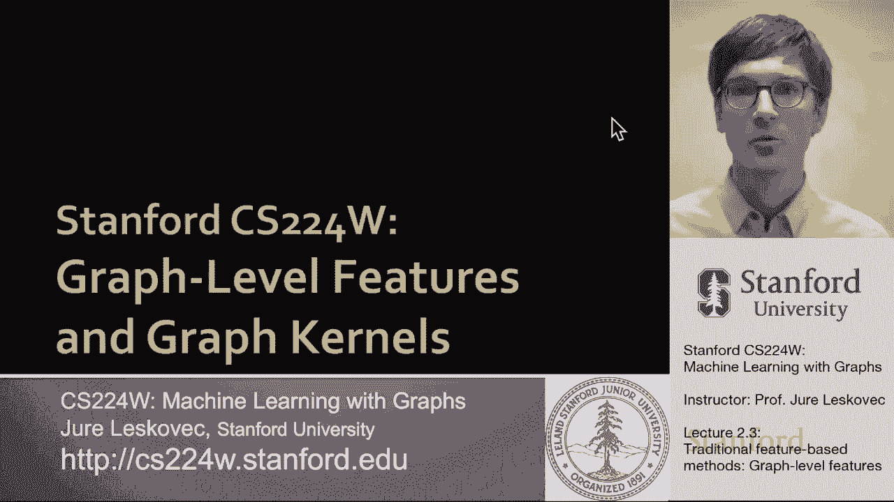
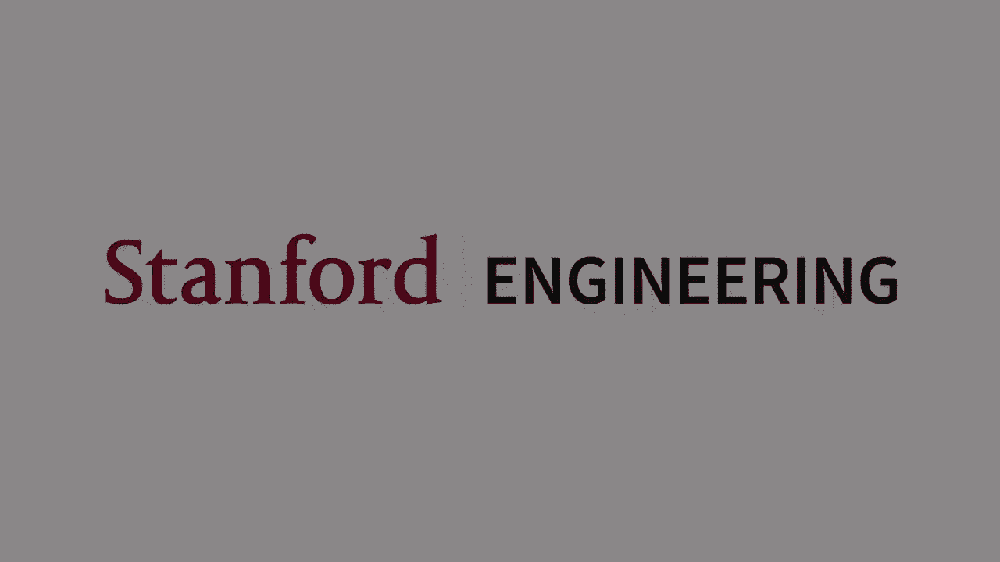

# 【双语字幕】斯坦福CS224W《图机器学习》课程(2021) by Jure Leskovec - P6：2.3 - Traditional Feature-based Methods- Graph - 爱可可-爱生活 - BV1RZ4y1c7Co

到目前为止，我们讨论了节点和边缘级别的特征，呃，用于图形预测，现在我们将讨论图级特性，和图核，这将使我们能够对整个图表做出预测。

所以我们的目标是我们想要表征整个图结构的特征，例如，如果你有一个像我这里一样的图表，我们可以考虑，只是用语言表达，我们如何描述这个图的结构，它似乎有两个松散连接的部分，有相当多的边缘，呃。

在每个部分的节点之间，在这两个不同的部分之间只有一条边，所以问题是我们如何创建一个特征描述符，描述符，它将允许我们描述，呃，像我这样的结构，呃解释说，我们要做的方法是，我们将使用内核方法。

内核方法被广泛用于传统的机器学习，呃，图级预测，这个想法是设计一个内核而不是一个特征向量，所以让我告诉你什么是内核，并给你一个简短的介绍，所以图g和g素数之间的核返回一个实值。

并测量这两个图之间的相似性，或一般测量不同数据点之间的相似性，核矩阵就是矩阵，其中简单地测量所有数据点对或所有图对之间的相似性，内核是有效的内核，这个核矩阵必须是正半正定的，这意味着它必须有正特征值。

比如说，因此，它必须是，呃，对称是对称的，呃，矩阵um，然后呢，内核的另一个重要特性是存在一个特征表示phi，使得两个图之间的核只是一个特征表示，呃，呃，第一个图的，与第二个图右的特征表示的点积。

所以g的phi是一个向量，g的phi是a是另一个向量，核的值只是这个向量表示的点积，呃，在两个呃图中，核仁里有时好吃的是什么，这个特性表示phi甚至不需要显式创建，让我们能够计算出，呃，内核的。

一旦定义了内核，然后下架机器学习模型，例如内核支持向量机，呃可以用来做呃预测，所以在讲座的这一部分，我们将讨论不同的图核，这将允许我们测量两个图之间的相似性，我们将特别讨论石墨内核，以及魏斯菲勒雷曼。

呃，内核，文献中也提出了其他内核，呃，但这超出了讲座的范围，比如说，随机游动核，最短路径核，呃，和许多其他人，通常，这些内核在图形级别的任务中提供了非常有竞争力的性能，那么内核背后的关键思想是什么呢。

内核目标中的关键思想，定义给定图g的特征向量phi，和，我们的想法是，我们将考虑这个特征向量phi，作为一个单词袋图形的类型表示，那么什么是一袋话，当我们有文本文档时。

我们表示文本文档的一种方法是简单地表示它，作为一袋文字，基本上我们会说每一个字，我们统计这个词在文档中出现的频率，所以我们可以想到，让我们说，按字母顺序排列的单词。

然后你知道在这个单词代表的袋子的位置I，我们会有频率，单词的出现次数，文件中的i，所以嗯，在我们的以同样的方式，将这一思想简单地扩展到图，就是把节点看作单词，嗯，然而，问题是。

因为两者--因为图可以有非常不同的结构，但是相同数量的节点，我们会得到相同的特征向量，或两个相同的表示，非常不同的图形，所以如果我们把节点看作单词，那么这个图有四个节点，这些图有四个节点。

所以他们的代表性是一样的，所以我们需要一个不同的候选人，对于这种单词表示袋中的单词来说，比如说，更有表现力一点，我们可以有我们可以称之为学位核的东西，我们可以说我们将如何表示一个图。

我们要把它表示为一袋节点，右度，所以我们说，啊哈，我们有一个一级节点，我们有两个，呃，度的三个节点，呃，呃二和呃，我们有，呃，零节点，学位，呃三个同样的方式，比如说，呃，这里我们可以问有多少节点，呃。

我们这里有不同程度的，我们有零度节点，嗯一个，我们有两个节点，二级和二级节点的，学位，嗯三，所以嗯，这意味着现在我们将为这些获得不同的特征表示，呃不同，呃图表，这将使我们能够区分这些不同的图表。

现在石墨内核和Weisfeiler，雷曼内核使用了一个图形表示的袋子的想法，星星在哪里，这个东西比节点度更复杂，所以让我们呃，首先谈谈石墨内核，这个想法是对的，我们想表示这个图。

作为图中不同图形数量的计数，我想提出一个重要的观点，对于石墨内核来说，石墨的定义有点不同，那么图的定义，让um进入节点级功能，和，有两个重要的区别，节点级特性中的图形不需要连接，嗯，嗯，他们不是，呃。

呃，有根的，所以在这个图形内核中的图形不是根的，也不必连接，给大家举个例子，让我呃，给大家看一下，呃，下一张幻灯片，例如，如果我们有一个我们对小G感兴趣的图形列表，一个到小，呃G N潜艇K。

假设这些是大小为k的图形，那么对于k等于三，有四种不同的图形，对呀，有四种不同的，呃，三个无向节点上的图，完全连接，两条边，一条边和无边，这是图形内核中Graphlet的定义，比如说，对于k等于4。

有十一种不同的图形，完全连通图一直到四个节点上没有任何连接的图，现在呃，给定一个图，我们可以简单地将其表示为结构数的计数，嗯，呃，出现的不同图形，呃在图表中，例如，给定一个图形和图形图形列表。

我们将图形计数向量f简单地定义为给定图的实例数，让它出现，在我们感兴趣的图表中，比如说，如果这些G是我们感兴趣的图，那么在这个图中有一个三角形，呃，有居住呃，三个不同的呃，长度为2的路径。

它们以一个孤立的节点驻留在六个不同的边上，也不存在，呃，三胞胎，呃，节点数，呃，都是，呃，没有连接的，呃，在这个图中，所以这里的图形特征向量只有一个，三个，六，呃和零，现在给出两个图。

我们可以简单地将图形内核定义为图形之间的点积，呃，第一个图次数的计数向量，呃，第二个图的图计数向量，嗯，这是个好主意，但实际上有一个小问题，问题是图G1和G2可能有不同的大小，所以排数会非常呃，不同的。

呃，不同图形中的图形，所以人们应用的一个常见解决方案是规范化这个特征向量表示，呃，对于图形，所以这意味着呃，这个图形，呃，给定图的向量表示简单地说，单个图形的计数，除以图形中出现的图形总数。

所以如果这基本上归一化了底层图的大小和密度，然后图形核被定义为这些之间的点积，图的um特征向量表示，呃，呃，h捕获，呃，给定图的频率或比例，让嗯，在图表中，该图有一个重要的局限性，让图核。

限制是计数图是非常昂贵的，昂贵的，在有n个节点的图中计算k个大小的图，呃，通过枚举将时间顺序n提升到k的次方，所以嗯，这意味着计数大小为k的图，是图中节点数的多项式，但在石墨片大小上是指数级的。

在最坏的情况下，这是不可避免的，因为子图同构判断一个呃，子图是，呃，同构于另一个，呃，图形是呃，NP硬，嗯和嗯，有更快的算法，如果呃，图节点，呃，节点度以d为界，那么就有一个更快的算法，呃。

计算大小为k的图形，然而，问题仍然存在，在图中计算这些离散结构是非常耗时的，消费，嗯，非常昂贵，所以我们只能把图形数到，你知道的，一小撮节点，然后这个，然后指数复杂度接管了，我们不能，呃，伯爵呃，石墨。

呃，比那个大，嗯，所以问题是我们如何设计一个更有效的图内核，um和Weisfeiler雷曼图内核，呃实现这个目标，这里的目标是设计一个有效的G的图特征描述符phi，我们的想法是使用邻域结构，迭代丰富呃。

结点呃词汇表，我们推广节点度的一个版本，因为节点度是一个热的，一跳邻域信息到多跳邻域信息，实现这一点的算法是呃，称为设备过滤器雷曼图同构测试，或者也称为颜色细化，所以呃，听我解释，呃，下一个。

所以我们的想法是给我们一个图g和一组节点v，我们要分配一个初始颜色，c um上标零，所以这是每个节点的初始颜色，然后我们将迭代聚合或散列颜色，从邻居那里发明新的颜色，所以想这个的方法，呃。

给定节点的新颜色，V将是哈希值，它自己颜色的价值，嗯，从上一个时间步，来自邻居的颜色串联，节点的u，利息v，哈希基本上是哈希，将不同的输入映射成不同的呃颜色的函数，然后在这个颜色细化的k步之后。

嗯嗯C呃的大写V，V的大写K总结了结构，图表的呃在呃的水平上，K跳呃社区，所以让我给你举个例子，呃，解释一下，比如说，这里我有两个结构非常相似的图，但只是稍微，呃不同，区别是呃，这个呃边，这里呃呃。

对角线的边缘，三角形的闭合边，嗯嗯是呃不同的，所以首先我们要给节点分配初始颜色，所以每个节点都得到相同的颜色，每个节点得到一个颜色，现在我们要聚合相邻的颜色，比如说，这个特定的节点聚合颜色，嗯，嗯。

把它添加到它自己，而这里的这个特殊节点聚合了邻居的颜色，一加一，它在这里，同样的过程，呃发生在这一秒钟，呃图形图形以及，现在，嗯，我们已经收集了颜色，呃，我们去，把它们捣碎。

所以我们应用一个哈希哈希函数，它采用节点自己的颜色，加上邻居的颜色，产生新的颜色，假设第一个组合的哈希函数返回一个，然后两个，然后三个，呃，四和五，所以现在我们根据这些新的精炼颜色给图表上色。

所以这是第一个图的着色，这是第二个图的着色，基于第一步中聚合颜色的哈希值，现在我们取这两张图，并再次应用相同的颜色聚合方案，例如，这个有四种颜色的节点聚合了来自其邻居的颜色，所以把三四五加起来。

所以我们这里有三个四个和五个，例如，这里的颜色节点来自它的邻居的两个聚集体，呃，那是五色，所以它得到两个逗号五，对于这个图，同样的过程现在又发生了，我们拿着，嗯，呃，这些呃聚合的颜色，嗯，我们粉碎他们。

和，假设我们的哈希函数分配不同的，新颜色，呃对这些，从之前的时间步长合成的颜色，所以现在我们可以把这个原始的聚合彩图，根据哈希值重新标记颜色，所以四个逗号三，四，五个，各种各样的呃。

三四三四五嗯是嗯层散列成颜色十，所以我们换了一个十色，我们可以继续迭代，我们会上来，呃，和呃，越来越多，呃，精炼，呃的呃，图形的颜色，所以现在我们已经运行了这个颜色，对固定步数的细化，假设K次迭代。

魏斯菲勒雷曼，呃，核计数具有给定颜色的节点数，所以在我们的例子中，我们运行了三次，所以我们有十三种不同的颜色，现在给定图的特征描述只是计数，给定颜色的节点数，就在第一次迭代中，所有的节点都上了色。

所有六个节点都以同样的方式着色，嗯，所以有六个例子的颜色一，然后在我们用鸡蛋聚合颜色并提炼它们之后，你知道有两个颜色的节点，颜色三的一个节点，颜色四的两个节点，嗯等等，下面是颜色计数方面的特征描述。

呃为了呃为了呃，第一个图的不同颜色和不同的颜色，呃对于第二个图，所以现在我们有了特性描述，Weisfeiler雷曼图内核只需将这两者之间的点积，呃，uh特性描述符并返回值，所以说，比如说。

在我们的案例中，魏斯菲勒雷曼，呃内核，两个图之间的相似性，是特征描述符之间的点积，呃这里，这是两个特征描述符，我们计算点积，我们会得到呃的值，四十九，所以WL内核非常受欢迎，非常强大，呃表现强劲。

而且它的计算效率也很高，因为这个颜色的时间复杂度，每一步的细化在图的大小上是线性的，它的边数是线性的，因为每个节点要做的就是从它的，相邻节点，生成并应用一个简单的哈希函数来产生一个新的。

呃用一种新的呃颜色，在计算核值时，很多颜色，呃出现在两个图表中需要跟踪，所以颜色的数量最多，节点数，呃在网络上，所以这个也不会太大，再次计算颜色需要线性时间，因为它只是对节点的扫描，所以总的复杂性。

计算魏泽雷曼图内核之间的一对，图在两个图中的边数上是简单的线性，所以这意味着这是极其，呃很快，实际上有效，练习得很好，所以总结一下我们讨论过的图级特性，首先，我们说过，呃，图核的概念。

基本上图形被表示为一袋石墨或者一袋，颜色嗯，当我们把图表示为图时，呃就像一袋石墨，这是极端的，是非常昂贵的表示，因为计算图形，让我们，呃，把时间指数在图的大小，同时，魏斯菲勒雷曼，呃。

核基于该K步颜色细化算法，它丰富并产生新的节点颜色，从节点近邻的颜色聚合而来，当多轮这种颜色细化运行时，节点从更远的地方收集颜色信息，呃，网络的部分，所以这里我们把图形表示为一袋颜色。

这在计算上是有效的，时间在图的大小上是线性的，它也与我们将要研究的图神经网络密切相关，呃，在本课程的后面，所以嗯，weisfeiler lehmann是衡量相似性的一个很好的方法，嗯，图之间。

在许多情况下是，呃，很难打败，今天的课到此结束，um，三个不同的，呃，传统方法，呃，图，呃，职等um，机器学习，我们说过，嗯，根据节点度进行节点级预测的手工特性，中心性，聚类系数与图。

我们谈到了基于距离的链接级或边缘级特征，以及本地和全球邻居的重叠，最后我们谈到了，我们如何表征整个图的结构，我们讨论了图核，尤其是关于石墨内核和WL，意思是魏斯菲勒，雷曼图核，因此。

我们对传统机器学习方法的讨论到此结束，呃，到图形，以及如何从节点创建特征向量，链接，嗯，和图表。

嗯，以一种可扩展和有趣的方式，呃。

