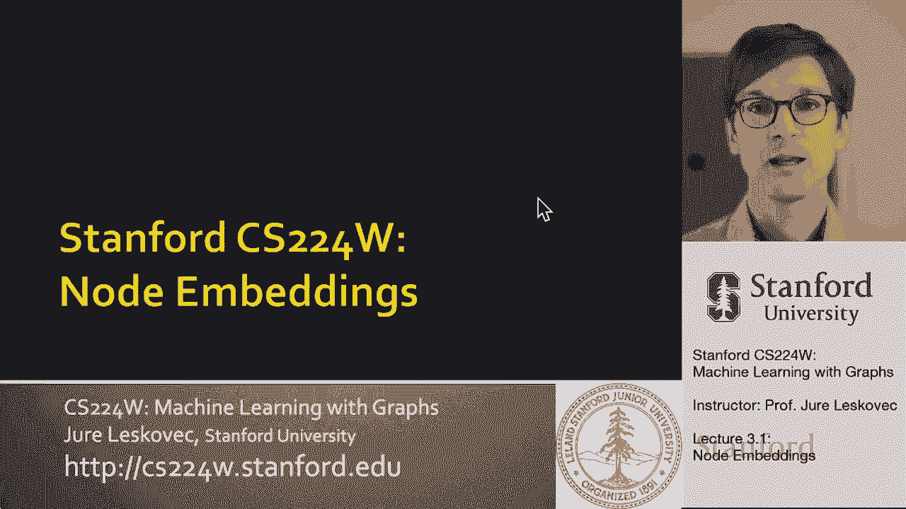
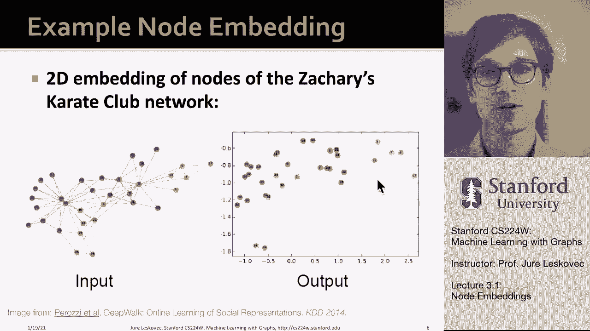
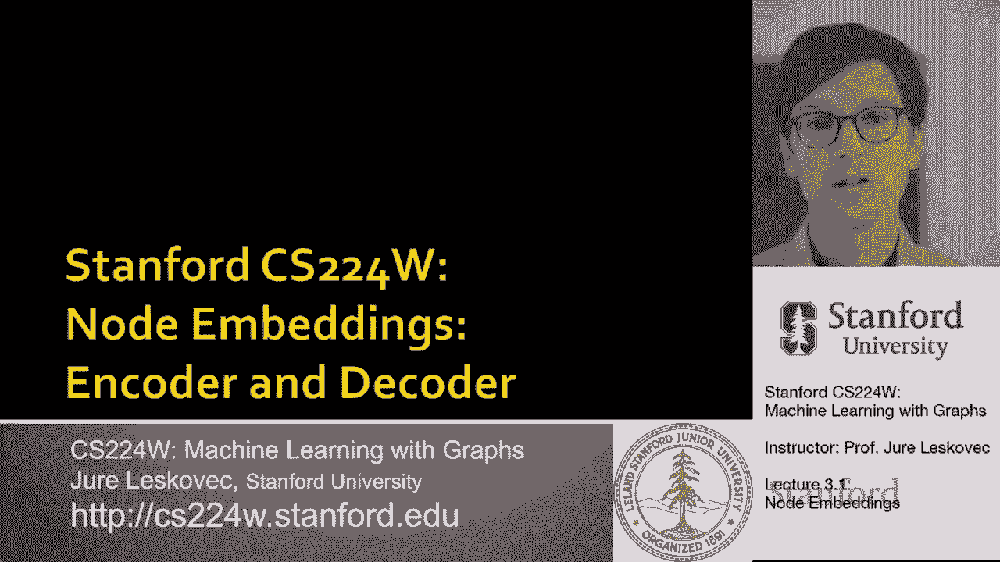
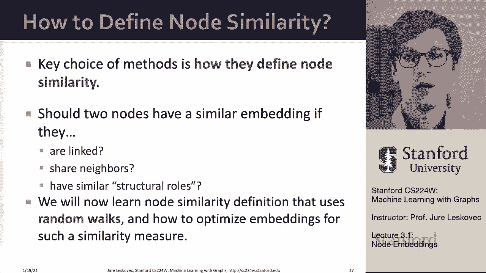

# 【双语字幕】斯坦福CS224W《图机器学习》课程(2021) by Jure Leskovec - P7：3.1 - Node Embeddings - 爱可可-爱生活 - BV1RZ4y1c7Co

这是我们课的第三讲我们今天要讲的是，节点嵌入。

所以我们对此的看法如下，嗯，我们谈过的，嗯，其中的想法是给定一个输入图，我们要提取一些节点，基本上描述拓扑结构的链接或图级特征，呃，网络的节点周围，围绕特定链接，或者整个图，然后我们可以获取拓扑信息。

比较呃，把它和，像支持向量机或逻辑回归，呃能够让呃，预测，所以嗯，从这个意义上说，我们的想法是给我们一个输入图，我们到了，创建结构，结构特征或结构特征，这个图的呃，一般来说。

大部分的努力都集中在特征工程上，呃，在你知道的地方，我们作为工程师，人类科学家，我们正试图找出如何最好地描述这个特殊的网络，所以呃，这将是最有用的，呃为了呃，下游预测任务，嗯和嗯，问题就变成了，呃。

我们能自动做到这一点吗，我们能不能远离，特征工程，这需要做手工功能工程每一次，每次都是为了，每一个不同的任务，网络结构，嗯，因为我们感兴趣的是，所以没有手动，呃，特征工程是，呃必要，呃不再，嗯。

这个想法是，比如说，如果我们在单个节点的级别上这样做，对于每个节点，呃，并将其表示为D数的向量，我们将这个d数向量称为特征表示，或者我们称之为嵌入，目标是，映射嗯，这是自动发生的。

这个矢量捕捉到了底层网络的结构，我们是，呃有兴趣，呃，分析或预测，你为什么要这么做，为什么要创建这些嵌入，对呀，任务是将节点映射到嵌入空间中，这个想法是相似性呃，节点之间的嵌入表示它们在网络中的相似性。

呃，比如说，你知道网络中的两个节点是否彼此靠近，也许它们应该紧密地嵌入在嵌入空间中，这样做的目的是自动为网络编码，呃，结构信息，嗯，然后你知道它可以用于许多不同的下游预测任务，例如。

您可以进行任何类型的节点分类，链路预测图分类，你可以做异常检测，你可以把很多不同的东西聚集在一起，所以给大家举个例子，呃，这是一篇论文中的一个情节，提出了这个想法，回到2014年，两千一十五。

这种方法被称为深度行走，嗯，他们拿着这个，呃，你在这里看到的一个小网络，然后他们展示了节点的嵌入在二维中是什么样子的，这里节点用不同的颜色着色，他们有不同的数字，在这个例子中，呃，你也可以看到嗯。

如何将不同的节点映射到嵌入空间的不同部分，比如说，所有这些浅蓝色的节点都在这里结束，紫色的结节，呃，从网络的这一部分到这里，你知道，绿色节点在这里，这里底部的两个节点得到了某种设置，呃，呃。

在不同的地方在不同的地方，基本上你看到的是，在某种意义上，网络的可视化和底层嵌入彼此对应得很好，在二维空间中，当然，这是一个小网络，这是一个小型的玩具网络，但你可以知道，呃，这在里面会是什么样子，呃。

呃，在更有趣的，呃大一点，呃，在更大的维度上。

所以这基本上是，呃，这基本上是呃的想法，所以我现在想告诉你的是，我们如何看待它，呃，编码器，解码器，呃，视图或定义，有什么实用的方法可以让我们，呃做这个。

所以我们要做的是，我们要表示一个图，作为a作为a与邻接矩阵，嗯，我们会想到这个，嗯，根据它的邻接矩阵，我们不会假设任何特征，呃呃，重构或属性，呃在节点上，网络的，所以我们要把它看作是一组，作为邻接矩阵。

我们想要我们想要分析，嗯，我们要有一个图表，就像我在这里展示的那样，和相应的邻接矩阵a，为简单起见，我们将把它看作是无向图，所以目标是对节点进行编码，使嵌入空间中的相似性，嵌入空间中的相似性。

你可以把它看作是距离，或者作为点积，作为两个节点坐标的内积，近似图空间中的相似性，对呀，所以这个想法将是在原始网络中，我想拿节点，我想把它们映射到嵌入空间，我要用字母z来表示坐标，呃，给定节点的嵌入。

嗯，这个想法是你知道，这里有一些相似的概念，对应于嵌入空间中的某种相似性概念，作为一套，呃，节点嵌入，所以目标是定义原始网络中的相似性，并将节点映射到嵌入空间中的坐标中，这样呃。

它们嵌入的相似性对应于它们在网络中的相似性，呃，作为嵌入空间中的相似性度量，呃，人们通常，呃，选择um，点积和点积是两个向量之间的夹角，对呀，所以当你做点积的时候，它是角的余弦。

所以如果两点离原点很近或者方向相同，他们有，嗯高，呃，点积，如果它们是正交的，所以有一个90度角，呃，然后它们就尽可能的不一样，因为点积会是，呃，零，所以这就是我的想法。

所以现在我们需要定义的是我们需要定义这个概念，原网络的相似性，我们需要定义，然后一个目标函数将相似性与呃嵌入联系起来，这就是我们要做的，呃，在这次讲座中，所以总结一下，编码器映射节点，呃，到嵌入。

我们需要定义一个节点相似度函数，原始网络中相似性的度量，然后解码器对，从嵌入到相似性得分的映射，然后我们可以优化参数，呃，这样，解码后的相似性尽可能紧密地对应于网络的底层定义，相似度。

这里我们使用一个非常简单的解码器，正如我所说，只是点积，所以嗯编码器会把节点映射成低维向量，所以给定节点的编码器将只是坐标，或者那个节点的嵌入，嗯，我们讨论了如何，我们要定义嵌入空间中的相似性。

就解码器而言，就点积而言，嗯，就像我说的，嵌入将在某个D维空间中，你可以想到，你知道在，比如说六十四到一千，这通常是如何呃，人们选择了多少维度，但当然这有点取决于网络的大小，呃和其他因素。

然后就像我说的，相似度函数指定向量空间映射中的关系如何，中的关系，呃原创，呃，在原来的网络中，这就是我想做的，举一个例子，所以说，最简单的编码方法是，编码器只是一个嵌入查找，我这么说是什么意思。

即给定节点的编码器编码，只是数的向量，这只是在一些大矩阵中的一个查找，我的意思是我们的目标是了解这个矩阵，维数为d的嵌入维数的z，节点数，呃在网络上，所以这意味着对于每个节点。

我们将保留一个列来存储嵌入，呃，对于该节点，这就是我们要学的，这就是我们要估计的，然后在这种表示法中，你可以把v简单地看作是一个指示向量，它有所有的零，列中的值为1除外，指示该节点V的ID。

这将在图片上起到什么作用，基本上你可以把z看作是一个矩阵，每个节点有一列，嗯，列存储给定列存储该给定节点的嵌入，所以这个矩阵的大小将是节点数，乘以嵌入维度，现在的人，比如说。

思考大图可能已经有了一个问题，你知道的，这不是有很多参数要估计吗，因为这个模型中的参数数基本上是条目数，呃，这个矩阵的，这个矩阵变得非常大，因为它，矩阵的大小取决于节点数，在网络中。

所以如果你想做一个网络，我不知道十亿个节点，那么这个矩阵的维数将是十亿倍，让我们说，千人，呃，嵌入尺寸，那是那是呃，那是很多参数，所以这些方法不一定是最可伸缩的，你可以缩放它们。

假设高达数百万或一百万个节点，或者呃，类似的东西，如果你，如果你真的尝试，但他们会很慢，因为对于每个节点，我们基本上必须估计参数，基本上对于每个节点，我们必须估计它的嵌入嵌入向量，用D数描述，d参数。

我们必须估计的D坐标，所以嗯，但这意味着一旦我们估计了这个嵌入，得到它们很容易，只是在这个矩阵中查找，一切都呃，储存，所以呃，这意味着，正如我所说，每个节点被分配一个唯一的嵌入向量。

我们方法的目标将是直接优化，或者呃，这意味着呃，有很多方法可以让我们做到这一点，特别是，我们将研究两种方法，一种叫做深度漫步，另一个叫节点，我来总结一下，在这个视图中，我们讨论了一个编码器，呃解码器。

呃框架，我们有一个所谓的浅编码器，因为它只是一个嵌入查找，优化的参数很简单，它只是这个嵌入矩阵，呃z嗯和呃，对于我们要标识嵌入的每个节点，我们在以后的课上要讲的是。

我们将讨论像图神经网络这样的深度编码器，这是一种非常不同的计算方法，呃节点嵌入，就解码器而言，对我们来说，解码器将是非常相似的东西，简单，就会很简单，简单地基于节点相似性，基于点积。

根据我们的节点相似度函数相似的节点对，那么问题是，我们如何定义相似权，我一直在谈论这件事，但我从来没有真正定义过它，而且真的，这就是这些方法之间的不同之处，他们如何定义节点相似性概念。

你可以问很多不同的方法如何正确地做到这一点，你可以说，两个节点是否具有相似的嵌入，如果它们可能是由一条边连接在一起的，也许他们有许多共同的邻居，呃，也许他们还有其他共同点，或者他们在网络的相似部分。

或者他们周围的网络结构，呃，看起来很相似，我们将根据随机游动定义节点的相似性，我们要去，UM优化节点嵌入，呃这个随机游走相似度测量。

所以呃，让我解释一下我的意思，所以嗯，重要的是要知道这种方法在，我们没有使用任何节点标签，嗯基本上只是想，呃，这样他们就捕捉到了网络相似性的一些概念，但它们不需要捕获节点标签的概念，我们也不是不是，呃。

利用任何节点特性或节点属性，从某种意义上说，如果节点是人类，也许你知道他们的兴趣，地点，性别，年龄将附加到节点，所以我们没有使用任何数据，附加到每个节点或附加到每个链接的任何信息。

这里的目标是直接估计节点的一组坐标，所以网络结构的某些方面，嗯是嗯，被保存了下来，嗯，从这个意义上说，因为他们没有接受过给定预测任务的训练，um给定特定，你知道，节点的标记，或链接的给定特定子集。

它是经过训练的。

