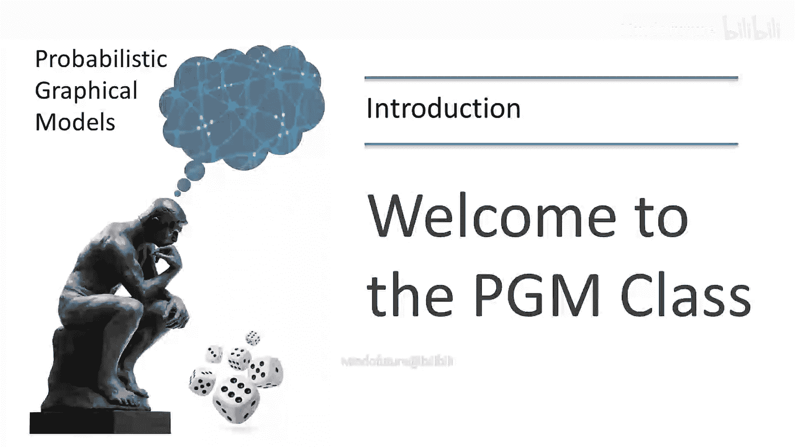
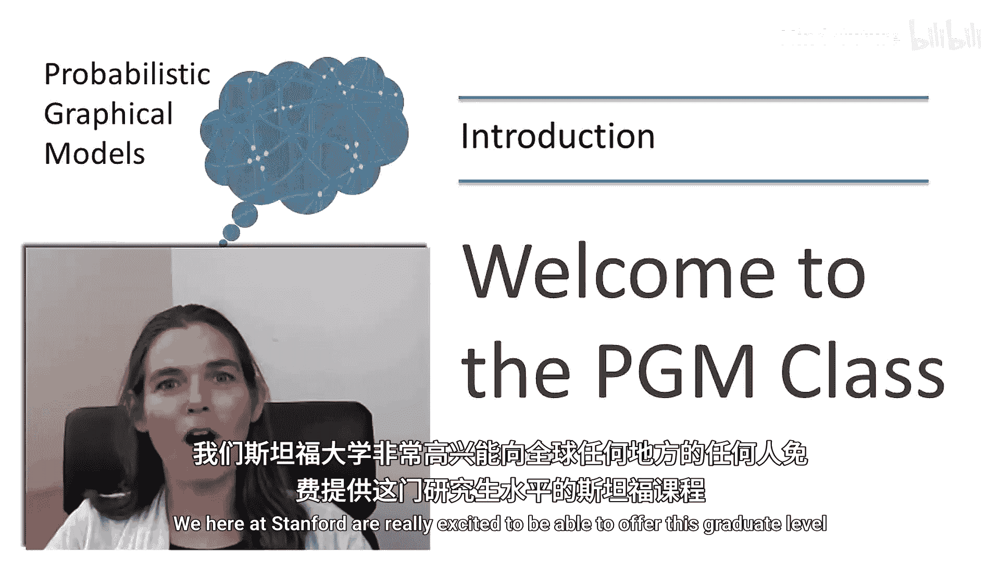
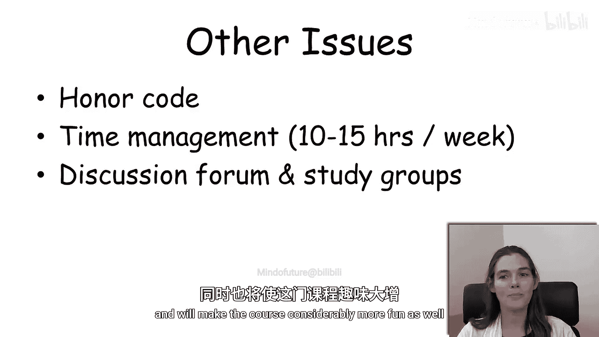
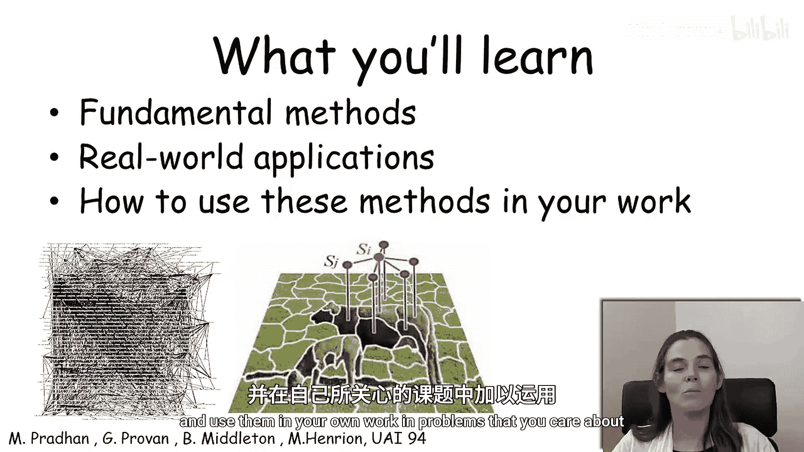

# 概率图模型：1.1：课程介绍与预备知识

大家好，欢迎来到概率图模型课程。我是Daphne Koller，斯坦福大学的教授。我们斯坦福大学非常高兴能够向全世界任何地方的人免费提供这门研究生级别的课程。

在本节课中，我们将介绍课程的基本信息、学习所需背景以及一些重要的课程规定。概率图模型是一个融合了概率论与图论的强大框架，用于表示和推理复杂系统中的不确定性。我们将在后续视频和整个课程中详细探讨其内涵。

## 📚 预备知识要求

为了顺利完成本课程，你需要具备一些基础知识。以下是具体要求：

**以下是核心知识要求：**

*   **概率论基础**：课程学习离不开对基础概率论的理解。这不需要非常高级的知识，但你需要了解诸如独立性、贝叶斯规则以及离散分布的基本概念。课程也提供了一些入门模块来帮助你复习这些概念。
*   **编程经验**：编程作业要求你具备一定的编程经验。这不是一门编程课，我们不会教授如何编程。
*   **算法与数据结构**：由于本课程融合了概率论和计算机科学的思想，具备一些算法和数据结构的背景知识非常重要。

**以下是推荐但非必需的知识：**

我们不强求以下背景，并且会在课程进行中提供必要的介绍。

*   **机器学习经验**：可能有一些机器学习经验会有所帮助。
*   **简单优化知识**：例如梯度下降，不需要非常复杂的知识。
*   **MATLAB/Octave编程**：有一些MATLAB或Octave的编程经验会很有帮助。如果你以前没有接触过，我们也提供了一些入门模块来帮助你学习这门编程语言。

## ⚖️ 课程规定与建议

了解并遵守课程规定是保证学习体验的重要一环。

**以下是学术诚信规定：**

本课程设有荣誉准则，这也是斯坦福本地学生上课的规范。荣誉准则规定，你可以与同学讨论课程材料，事实上我们鼓励这样做。你甚至可以就编程作业的问题进行澄清性提问。但你提交的作业必须是自己的独立成果。此外，我们要求你不要将编程作业或其解决方案发布到网络上的任何地方，以便未来的学生也能独立完成这些习题集。

**以下是时间管理建议：**

这是一门斯坦福研究生级别的课程，即使在斯坦福也被认为是一门有难度的课程。一名典型的斯坦福学生每周很容易在这门课上花费10到15个小时。因此，我们建议你为自己的学习至少预算出相同的时间，以免在提交截止日期临近时时间不够用。我们在提交截止日期中设置了一定的缓冲期，如果你未能在原始截止日期前提交，你有一周的宽限期，但这显然会开始影响下一周的作业。因此，我们建议你不要在整个课程期间积压作业，否则最终会带来麻烦。

**以下是互动学习建议：**

本课程体验的一部分是与同学互动。为此，我们设有讨论论坛，这在其他课程中已被证明是与同学互动、提问和更深入理解材料的宝贵资源。我们也鼓励你们组建学习小组，可以是与同一地理区域的人组成的线下小组，也可以是在线学习小组，彼此讨论材料。我们相信这样做会让你更好地理解材料，也会让课程变得更有趣。

## 🎯 课程目标总结

总而言之，通过所有这些不同的内容和练习环节，我们认为你将学习到概率图模型领域的基本方法。你还将看到并尝试一系列已应用这些方法的现实世界应用案例。希望你在完成本课程后，能够理解如何将这些思想应用到你关心的问题和你自己的工作中。我们期待在课程中见到你。

