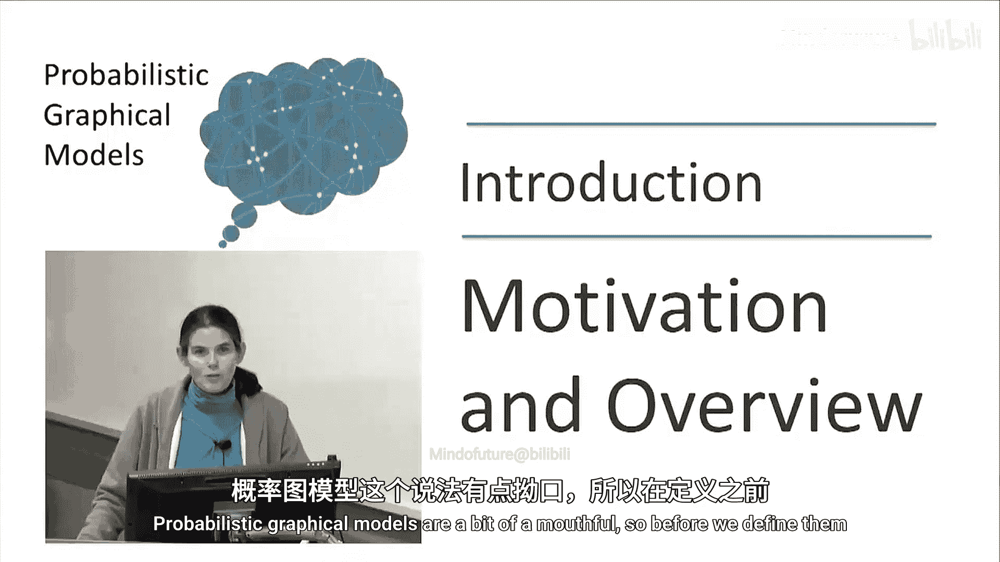
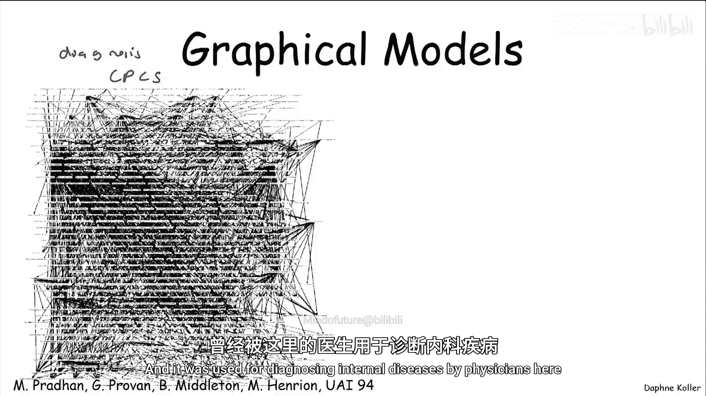
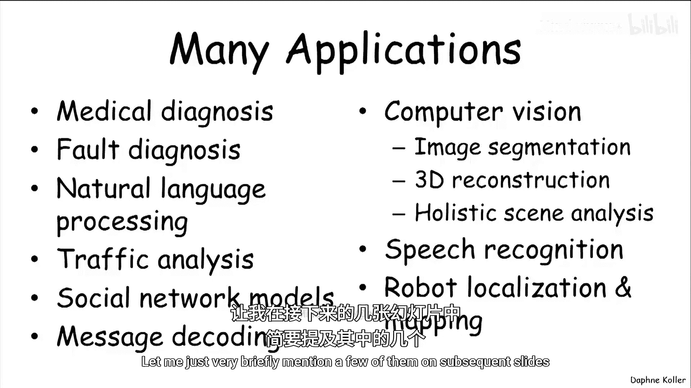
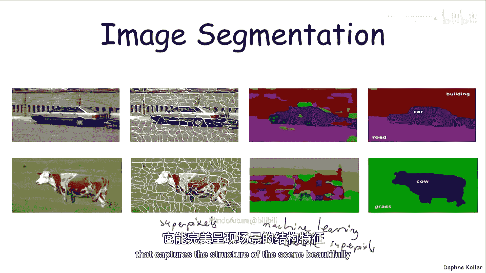
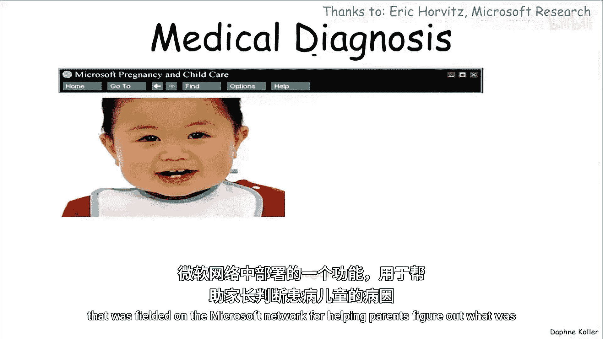
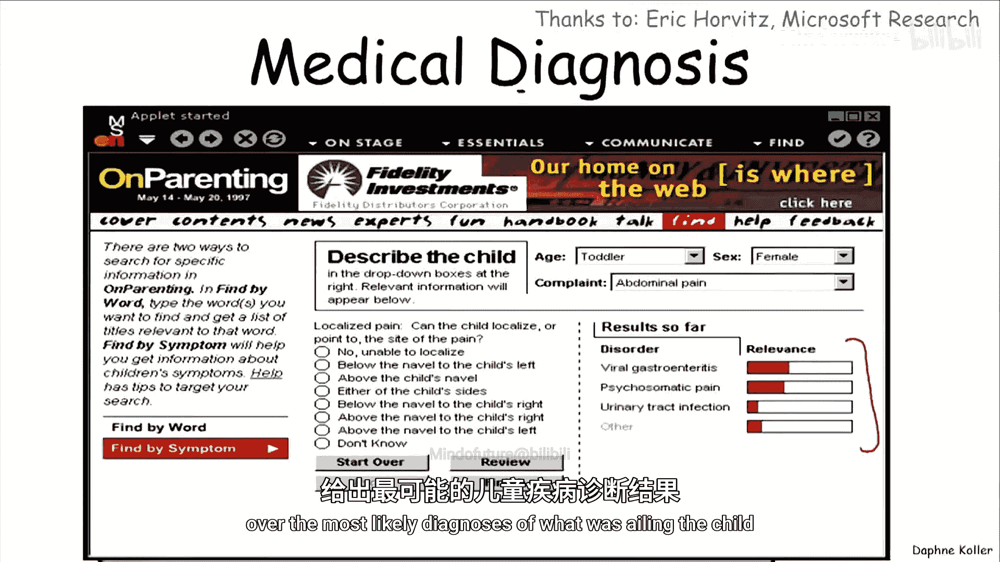
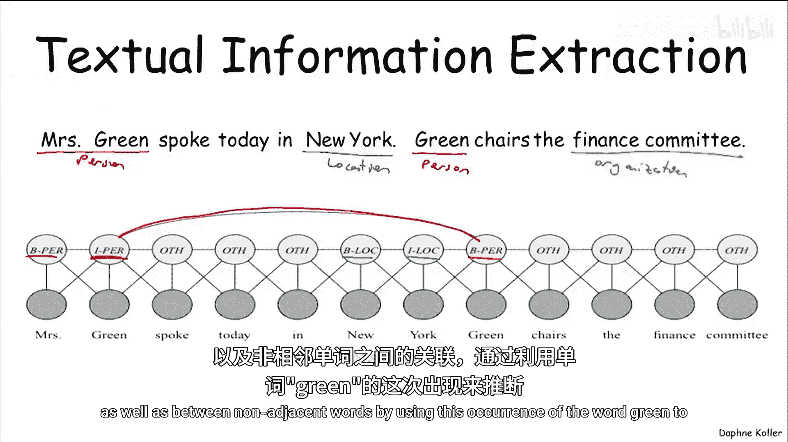
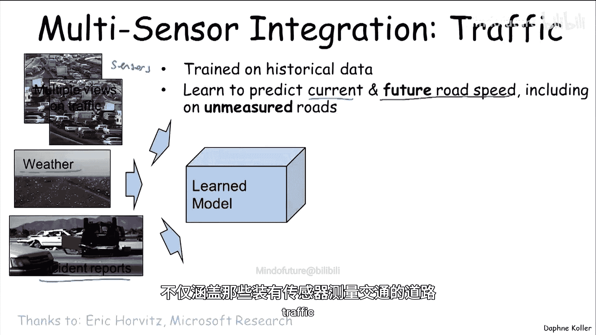
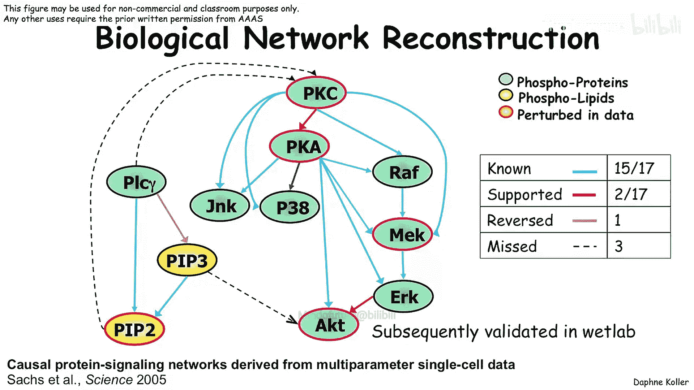
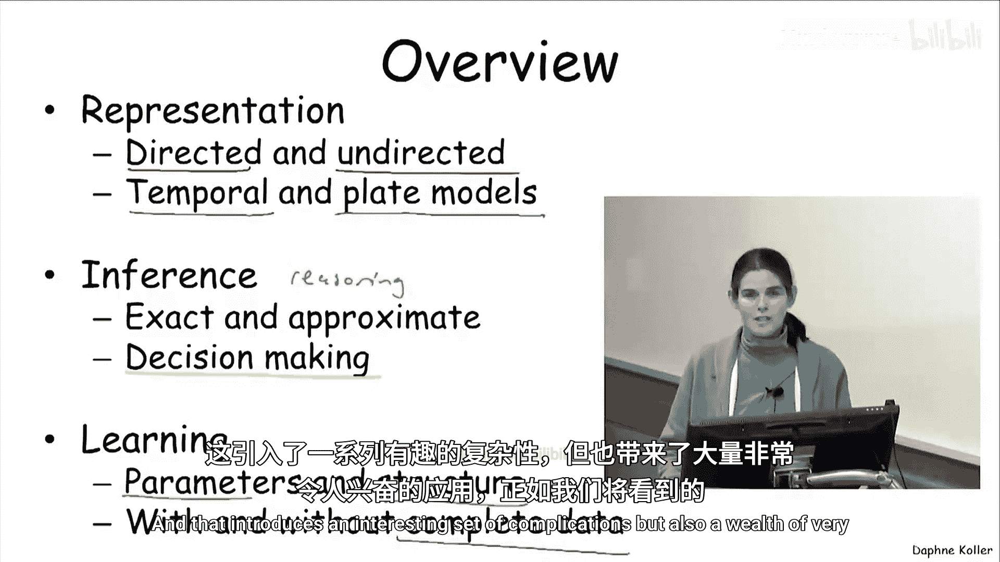

# 002：概述与动机

在本节课中，我们将要学习概率图模型的基本概念、其核心组成部分以及它们被设计用来解决何种问题。我们将通过具体的应用实例来理解这个框架的动机和强大之处。

---

## 什么是概率图模型？🤔

概率图模型这个名称有些拗口。在定义它之前，让我们先了解一下它可能用于解决什么问题。

概率图模型首次进入计算机科学和人工智能领域的一个典型应用是**医疗诊断**。设想一位医生面对一位病人。医生在观察病人时掌握着大量信息：易感因素、症状、各种检查结果。她需要根据这些信息推断病人可能患有哪些疾病，以及对不同治疗方案的可能反应。

另一个截然不同但同样应用了概率图模型的领域是**图像分割**。我们可能有一张包含成千上万甚至数十万个像素的图像，我们的目标是判断每个像素对应什么物体。例如，将图像分割成较大的区域（超像素）后，我们需要判断哪些区域对应草地、天空、牛或马。

这两个问题有一些共同点。首先，它们都涉及大量需要推理的**变量**。在医疗诊断中，变量是所有易感因素、检查结果、可能的疾病等。在图像分割中，变量是每个像素或超像素的标签。其次，这些应用本质上都存在显著的**不确定性**。无论我们设计的算法多么巧妙，都无法完全确定正确答案。

概率图模型正是为处理这类应用而设计的框架。

---

## 理解框架的组成部分 🔍

上一节我们看到了概率图模型的应用场景，本节中我们来仔细看看这个框架名称中每个词的含义。

### 模型

首先，什么是“模型”？模型是我们对世界理解的**声明式表示**。它是计算机内部的一种表示，捕捉了我们对这些变量是什么以及它们如何相互作用的认知。声明式意味着这种表示是独立存在的，我们可以独立于任何算法去审视和理解它。

这很重要，因为同一个模型可以被用于不同的算法，以回答不同类型的问题，或者以更高效的方式回答相同的问题，或在精度和计算成本之间做出不同的权衡。拥有独立的模型还允许我们将模型的构建与用于推理的算法分离开来。我们可以开发方法从人类专家那里获取模型，或者使用统计机器学习技术从历史数据中学习模型，或者结合两者。模型、算法和学习之间的分离使我们能够分别处理每个问题。

### 概率

“概率”一词的存在，是因为这些模型旨在帮助我们处理大量的**不确定性**。

不确定性有多种形式和来源：
1.  **部分知识**：我们对世界状态的了解不完整。例如，医生无法测量每一个症状或检查结果，她当然不确定病人患有何种疾病。
2.  **噪声观测**：即使我们能观察到某些事物（如血压），这些观察也常常受到显著噪声的影响。
3.  **建模局限**：我们的模型无法涵盖所有现象。例如，可能存在各种罕见的疾病导致相同的症状集。我们不可能写出一个详尽到包含所有可能意外情况和因素的模型。
4.  **内在随机性**：有些人认为世界本质上是随机的。至少在量子层面这是真的，即使在更高层面，复杂系统的建模局限也使得人们不妨将世界视为本质随机的。

概率论为我们提供了一种原则性的框架来处理不确定性，并带来了重要且有价值的工具。概率模型提供了**声明式表示**，具有清晰的语义，能表示我们对世界可能处于不同状态的不确定性。它还提供了一个工具箱，包含强大的推理模式，例如基于新证据进行条件推断或在不确定性下进行决策。此外，由于概率论与统计学的紧密联系，我们可以运用一系列强大的统计学习方法，有效地从历史数据中学习这些模型，避免了需要人工指定模型每个方面的麻烦。

### 图

“图”这个词来自计算机科学的视角。概率图模型是概率论、统计学与计算机科学思想的综合。其核心思想是利用计算机科学的技术，特别是**图论**，来表示涉及大量变量的复杂系统。我们已经在医疗诊断和图像分割的例子中看到了这些大量的变量。

为了捕捉涉及如此多因素的庞大空间上的概率分布，我们需要处理所谓的**随机变量**。本课程的重点是将世界表示为一组随机变量 `X1, X2, ..., XN`，每个变量代表世界的某个方面（例如，一个症状是否存在，一个具有连续可能值的检查结果，或一个具有多个可能标签的像素）。我们的目标是通过一个**概率分布**（或称**联合分布**）来捕捉我们对世界可能状态的不确定性，该分布描述了这组随机变量所有可能取值的概率。

需要认识到的重要一点是，即使在最简单的情况下（例如每个变量都是二值的），这也是一个在 `2^N` 个可能世界状态上的分布（每个状态对应一种可能的赋值组合）。因此，我们必须处理本质上呈指数级庞大的对象。我们唯一的办法是利用数据结构，在这种情况下，利用计算机科学的思想来**利用分布中的结构**，并以有效的方式表示和操作它。

---

## 图模型示例 📊

那么，什么是图模型？让我们看几个简单的例子。

这是一个玩具**贝叶斯网络**，它将伴随我们学习本课程的第一大部分。贝叶斯网络是概率图模型的两大主要类别之一，它使用**有向图**作为其内在表示。

在这里，随机变量 `X1, ..., XN` 由图中的**节点**表示。以这个简单的例子（我们稍后会再次讨论）为例：一名学生选修一门课程并获得成绩（这是一个随机变量）。还有其他相关的随机变量，例如学生的智力、课程的难度，以及其他可能感兴趣的变量，例如学生在这门课程中获得的推荐信质量（这可能取决于学生的成绩和SAT分数）。这是一个在这五个随机变量上的概率分布表示，图中的边以一种非常形式化的方式（我们稍后会定义）代表了这些随机变量之间的概率联系。

概率图模型的另一主要类别是**马尔可夫网络**，它使用**无向图**。在这种情况下，我们有一个在四个随机变量 A, B, C, D 上的无向图，我们稍后可能会给出这类网络的例子。

以上是玩具示例。以下是一些真实框架的例子：
*   **真实贝叶斯网络**：例如名为“CPCS”的网络，这是斯坦福大学设计用于内科疾病诊断的真实医疗诊断网络，包含约480个节点和900多条边。
*   **真实马尔可夫网络**：例如用于之前讨论的图像分割任务的网络。这里的随机变量代表像素或超像素的标签（每个超像素一个），边则代表相邻像素标签之间的概率关系（因为它们很可能相互关联）。

总而言之，**图表示**为我们提供了一种直观且紧凑的数据结构，用于捕捉这些高维概率分布。同时，正如我们将在课程后面看到的，它为我们提供了一套利用图结构进行高效推理的通用方法。由于图结构编码了概率分布的参数化方式，我们可以用非常少的参数有效地表示这些高维概率分布，这使得无论是从专家那里手动获取，还是从数据中自动学习，都变得可行。在这两种情况下，参数数量的减少都非常有价值。

---

## 广泛的应用领域 🌍

这个框架非常通用，已应用于非常广泛的领域。以下简要列举几个：

1.  **图像分割**：通过构建捕捉场景全局结构及超像素间概率关系的概率图模型，可以获得比单独分类每个超像素更连贯、更准确的分割结果。
2.  **医疗诊断**：例如，微软网络曾部署一个系统，帮助父母判断生病的孩子可能患有何种疾病。父母输入主要症状后，系统通过一系列问题，提供一个最可能诊断的概率分布。
3.  **文本信息抽取**：从非结构化的文本（如新闻文章）中提取结构化信息（如人名、地点、组织及关系）。当前最先进的方法是将此任务构建为概率图模型，为每个单词设置一个变量来编码其标签，并捕捉相邻及非相邻单词之间的相关性。
4.  **多传感器数据融合**：例如，整合来自道路传感器、天气信息、事故报告等多种来源的交通数据，使用从数据中学习的模型来预测当前和未来的道路速度，甚至包括那些没有安装传感器的道路。
5.  **生物网络重建**：生物学家在不同条件和扰动下测量多种蛋白质的水平，从中学习蛋白质之间的关系，发现蛋白质之间的相互作用（包括以前未知的），从而获得新的知识。

---

## 课程内容概览 📚

让我们以对本课程学习内容的概述来结束本次介绍。

我们将涵盖与概率图模型相关的三个主要部分：

1.  **表示**：包括有向和无向表示。我们还将讨论更高级的结构，以编码更复杂的场景，包括涉及时间结构的场景，以及涉及重复或关系结构的场景（特别是称为“盘模型”的类别）。
2.  **推理**：使用这些模型进行推理。涵盖输出精确概率的精确推理方法，以及在精度和计算之间提供不同权衡的近似方法。我们还将讨论如何利用这类模型在不确定性下进行决策。
3.  **学习**：如何从历史统计数据中学习这些模型。我们将讨论如何自动学习模型的参数和结构，并处理两种场景：相对简单的**完全数据**场景（所有变量总是被观测到），以及更困难的**不完全数据**场景（有些变量可能并非总是被观测到，或完全未被观测到），后者引入了一系列有趣的复杂性，但也带来了大量非常激动人心的应用。

---

本节课中，我们一起学习了概率图模型的基本动机、核心概念（模型、概率、图）以及其广泛的应用领域。我们了解到，概率图模型是一个强大的框架，它结合了概率论与图论，能够紧凑地表示高维不确定性，并支持高效的推理与学习。在接下来的课程中，我们将深入探讨其具体的表示方法。