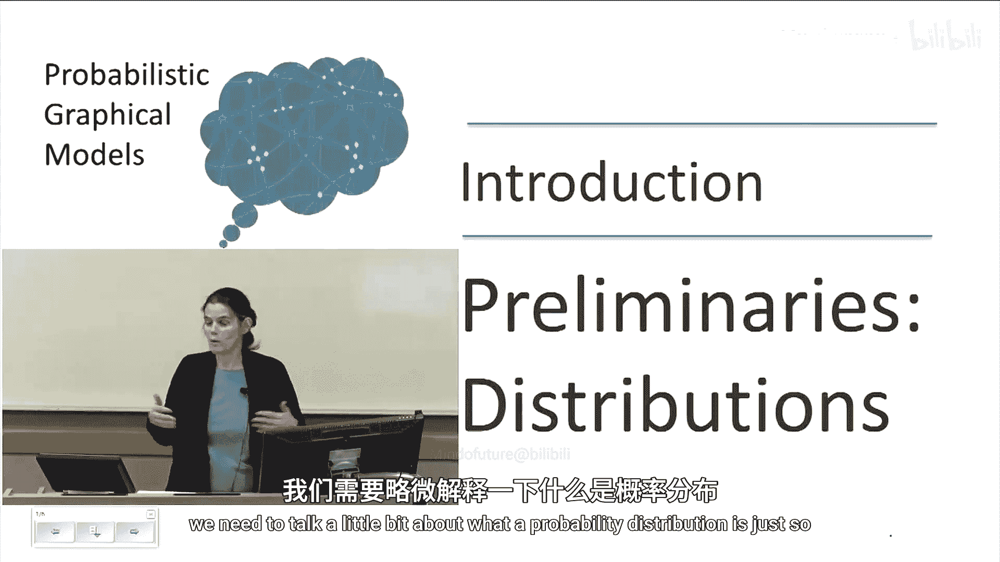
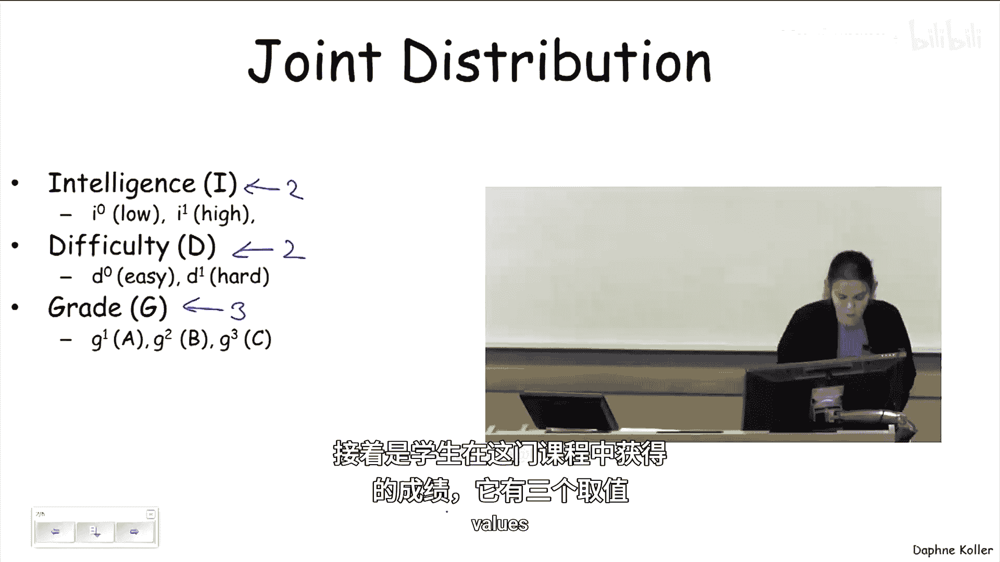
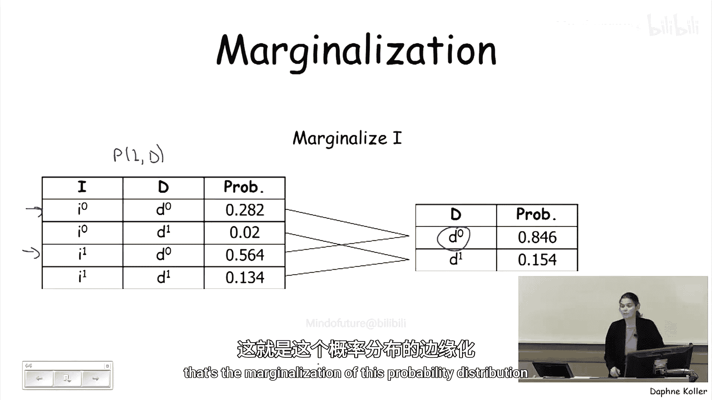

# 概率图模型：P03：分布

## 概述
在本节课中，我们将要学习概率分布的基础概念。理解概率分布是学习概率图模型的前提。我们将通过一个简单的“学生”例子，介绍联合分布、条件化、归一化和边缘化等核心操作。

---

## 联合分布与参数

在深入概率图模型的细节之前，我们需要先讨论一下什么是概率分布，以确保我们使用共同的术语。

让我们从一个非常简单的联合分布例子开始。这个例子将在课程后续部分被扩展。我们从一个仅涉及三个随机变量的例子开始，我称之为“学生”例子。

一个学生可以用一个代表其智力的变量来描述，其值可以是高或低。学生正在上一门课，这门课可能难也可能不难，这是随机变量D。智力变量I有两个值，难度变量D也有两个值。然后还有学生在这门课中获得的成绩，这是随机变量G，在这个例子中，我们假设它有A、B、C三个值。

现在，这是一个定义在这三个随机变量集合上的联合分布示例。这是 **P(I, D, G)** 的一个例子，它是一个联合分布。让我们思考一下这样一个联合分布中有多少个条目。因为我们有三个变量，我们需要表示这三个变量每个值组合的概率。所以我们有 **2 × 2 × 3** 种可能的组合，总共需要为 **12** 个可能的值分配概率。

因此，这个概率中有12个总参数。我将引入独立参数的概念，我们稍后会详细讨论。独立参数是其值不完全由其他参数的值决定的参数。在这个例子中，因为这是一个概率分布，我们知道右边所有这些数字的总和必须为1。因此，如果你告诉我12个中的11个，我就知道第12个是什么。所以独立参数的数量是 **11**。我们稍后会看到，当我们开始评估不同概率分布的相对表达能力时，这是一个有用的概念。

---

## 条件化与归一化

我们可以用概率分布做什么呢？一件重要的事情是，我们可以根据特定的观察结果对概率分布进行条件化。

例如，假设我们观察到学生得了A。因此，我们现在有了变量G的一个赋值，即 **G=G1**。这立即消除了所有与我的观察不一致的可能赋值。所以，除了 **G=G1** 的情况，其他所有情况都被排除了。

这给了我一个缩减的概率分布。这个操作被称为**缩减**。我取概率分布，缩减掉了与我所观察到的不一致的部分。但这本身并没有给我一个概率分布，因为请注意，这些数字的总和不再为1。在我丢弃一堆东西之前，它们的总和是1。

为了得到一个概率分布，我需要做的是**归一化**这个度量。“度量”这个词表明它是一种分布形式，但“未归一化”意味着它的总和不为1。这是一个未归一化的度量。如果我们想把它变成一个概率分布，显然要做的事情就是归一化它。

所以我们要做的是，取所有这些条目，把它们加起来，这将给我们一个数字，在这个例子中是 **0.447**。然后我们可以将每个条目除以0.447，这将给我们一个归一化的分布，在这个例子中对应于 **P(I, D | G=G1)**。这是一种将未归一化的度量转化为归一化概率分布的方法。我们将看到，这个操作是我们在整个课程中使用的最重要的操作之一。

---

## 边缘化

关于概率分布，我要讨论的最后一个操作是**边缘化**操作。这是一个对更大变量子集的概率分布进行操作，并产生一个关于这些变量子集的概率分布的过程。

在这个例子中，我们有一个关于I和D的概率分布。假设我们想要边缘化I，这意味着我们基本上要对I求和，我们将丢弃I，并将注意力限制在D上。

例如，如果我想计算 **P(D=0)**，我将把与 **D=0** 相关的两个条目加起来，即对应于 **I=0** 的条目和对应于 **I=1** 的条目。这就是这个概率分布的边缘化。

---

## 总结
本节课中，我们一起学习了概率分布的基础知识。我们通过“学生”的例子，理解了联合分布及其参数数量（特别是独立参数）的概念。我们探讨了条件化操作，即根据观察结果缩减分布，并通过归一化得到条件概率分布。最后，我们介绍了边缘化操作，它用于从联合分布中获取关于部分变量的分布。这些操作是构建和理解更复杂概率图模型的基础。