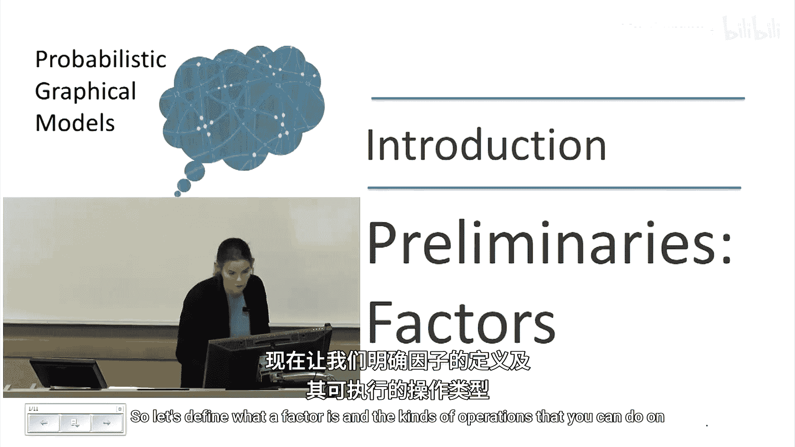
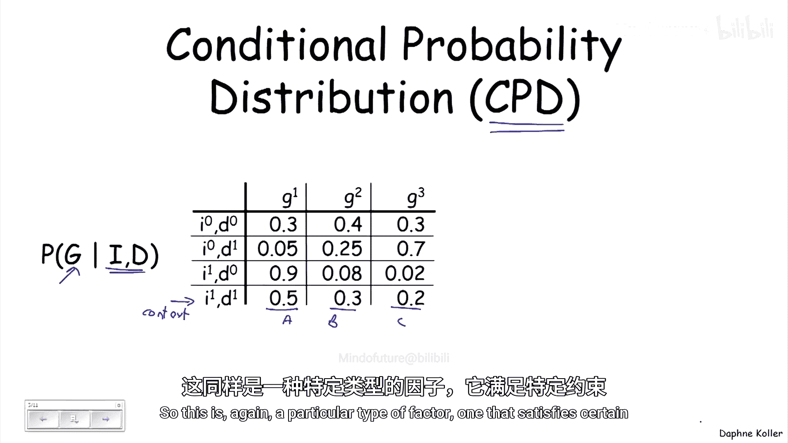
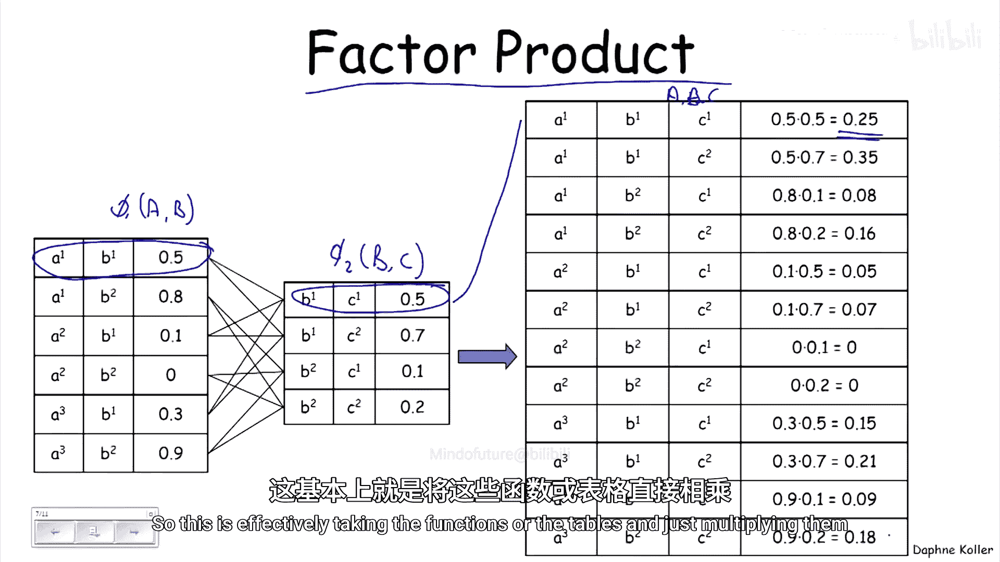
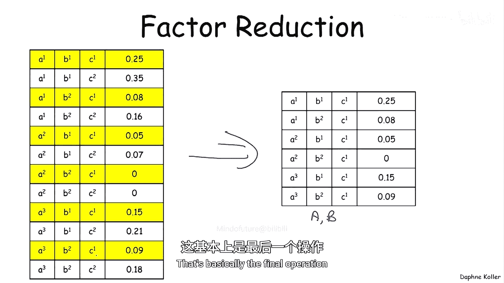
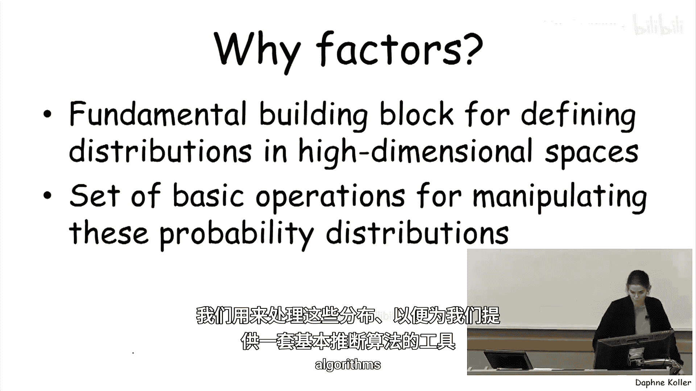

# 概率图模型：P04：因子

在本节课中，我们将要学习概率图模型中的一个核心概念——**因子**。因子是定义概率分布以及进行推理操作的基础构件。我们将了解因子的定义、常见类型以及三种基本操作：乘积、边缘化和约简。

---

## 什么是因子？🔍

因子本质上是一个函数或一个表格。它接收一组随机变量作为参数，例如 `X1, X2, ..., Xk`。对于这些变量的每一种可能赋值组合，因子都会给出一个实数值。这组变量被称为该因子的**作用域**。

用公式表示，一个因子可以写作：
`φ(scope) = φ(X1, X2, ..., Xk) → ℝ`

---

## 因子的类型 📊

以下是几种常见的因子类型：

*   **联合概率分布**：我们已经见过的一种因子。它为所有变量的每一种组合（例如 `I, D, G`）分配一个数值（概率）。这些数值之和为1。
*   **未归一化度量**：这也是一种因子。例如，概率 `P(I, D, G=‘A’)`。它的作用域是 `I` 和 `D`，因为变量 `G` 被固定为常数 ‘A’。
*   **条件概率分布**：这是一种我们将频繁使用的因子，通常缩写为 **CPD**。它给出了在给定某些变量条件下，另一个变量的概率分布。例如，`P(G | I, D)`。在CPD表中，每一行（对应一个特定的条件上下文）的概率值之和为1。

---

## 因子的基本操作 ⚙️

上一节我们介绍了因子的定义和类型，本节中我们来看看对因子可以进行的三种基本操作。这些操作是构建和操作高维概率分布的基础。

以下是三种核心操作：

1.  **因子乘积**
    该操作将两个因子相乘，生成一个作用域为原因子作用域并集的新因子。新因子中每个条目的值，是原两个因子中对应条目值的乘积。
    *公式：若 `φ1(A, B)` 和 `φ2(B, C)`，则 `φ3(A, B, C) = φ1(A, B) * φ2(B, C)`。*

2.  **因子边缘化**
    该操作通过对某个变量求和，将其从因子的作用域中“消除”，从而得到一个作用域更小的新因子。这与概率分布中的边缘化概念完全相同。
    *公式：若 `φ(A, B, C)`，则 `φ'(A, C) = Σ_{b ∈ Val(B)} φ(A, b, C)`。*

3.  **因子约简**
    该操作通过将某个变量固定为一个特定值，来“缩减”因子的作用域。新因子只包含原因子中满足该变量取特定值的那些行。
    *公式：若 `φ(A, B, C)`，则 `φ''(A, B) = φ(A, B, C=c1)`，其中 `c1` 是 `C` 的一个特定取值。*

---

## 为什么因子如此重要？💡

因子之所以是概率图模型的基石，主要有两个原因：
1.  **构建高维分布**：我们通过将许多小的因子（局部函数）相乘，来定义指数级庞大的高维联合概率分布。这避免了直接列举所有可能组合。
2.  **执行推理算法**：我们在高维空间中对概率分布进行操纵（如计算边缘概率、条件概率）时，所依赖的基本运算正是上述的因子乘积、边缘化和约简操作。

---

## 总结 📝

本节课中我们一起学习了**因子**这一核心概念。我们明确了因子是一个为变量赋值返回实数值的函数，其作用域是它所依赖的变量集合。我们认识了联合分布、条件概率分布等不同类型的因子。最重要的是，我们掌握了因子的三种基本操作：**乘积**、**边缘化**和**约简**。理解并熟练运用这些操作，是后续学习如何用概率图模型表示复杂分布以及进行有效推理的关键。