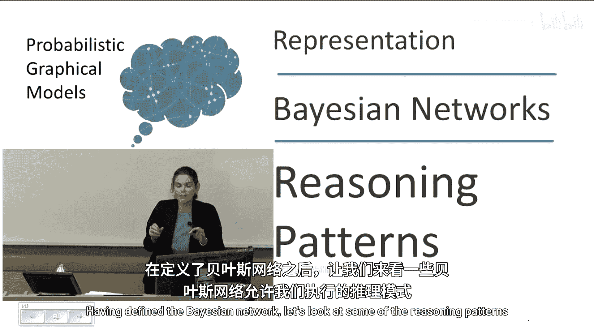
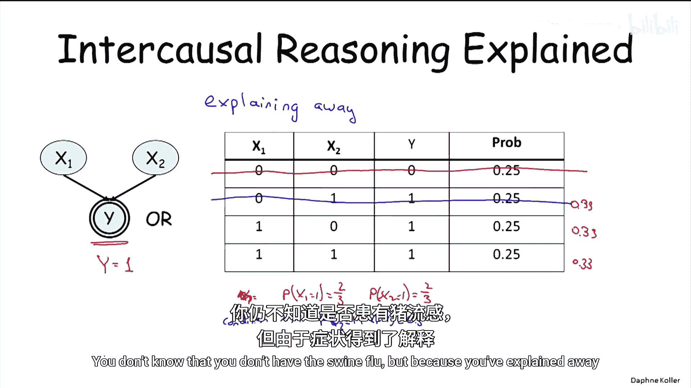
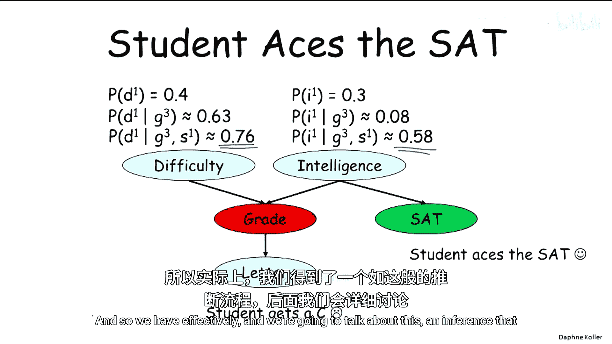

# 概率图模型：1.6：推理模式

在本节课中，我们将学习贝叶斯网络支持的几种核心推理模式。我们将通过学生网络的例子，探讨因果推理、证据推理和因果间推理等概念，并理解信息如何在网络节点间流动。

---

定义了贝叶斯网络后，我们来看看它允许我们执行的一些推理模式。

让我们回到我们熟悉的学生网络，它包含以下条件概率分布（CPDs），这些我们已经见过了，因此不再赘述。我们来看看，如果你使用贝叶斯网络的链式法则生成联合分布，然后计算不同的边缘概率，会得到哪些概率值。

例如，我们现在要问：获得一封强推荐信的概率是多少？我们不会进行详细计算，因为将所有数字相加会很繁琐。我可以直接告诉你，`P(L=1)` 的概率是 0.5。

但我们可以进行更有趣的查询。我们可以对某个变量进行条件化，还记得我们讨论过条件概率分布，并询问这会如何改变概率。

例如，如果我们以“低智力”为条件，我们将用红色表示假值，结果概率不出所料地下降了，降至 0.39。因为如果智力下降，获得好成绩的概率就会下降，获得强推荐信的概率也会随之下降。

这是一个因果推理的例子，因为直观上，推理是沿着因果方向进行的，即从上到下。

我们还可以让事情变得更有趣。我们可以问，如果我们让课程难度变低（`D=0`）会发生什么。在这种情况下，我们有概率 `P(L=1 | I=0, D=0)`。你期望概率会如何变化？如果课程简单，人们会期望成绩上升。果然，概率回升了，我们大致回到了五五开。

这是因果推理的另一个例子，在这种情况下，我们有了更多证据。

你也可以进行证据推理，证据推理是从下到上的。在这种情况下，我们可以以成绩为条件，并询问其父节点或祖先节点的概率会发生什么变化。

假设这个可怜的学生参加了课程，并且他得到了一个 C。最初，课程难度高的概率是 0.4，学生智力高的概率是 0.3。但现在有了这个额外的证据，同样不足为奇，学生智力高的概率下降了相当多。但另一个假设，即课程难度高，其概率也上升了。

然而，还有一种不那么标准但很有趣的推理类型，称为因果间推理，因为它本质上是单一结果的两个原因之间的信息流动。

记住，我们将继续之前的场景，我们可怜的学生得了 C。但现在我要告诉你，等等，这门课真的很难，所以我要以 `D=1` 为条件。注意，学生智力高的概率上升了，从 0.08 上升到 0.11。这不是一个巨大的增长，正如你在使用贝叶斯网络时会发现的那样，概率的变化通常有些微妙。

原因是，即使在一门困难的课程中，如果你回头看看 CPD，根据这个模型，得 C 其实有点难。学生更可能得 B。所以现在我们看到，高智力的概率仍然下降了，从 0.3 下降到 0.175。但如果我告诉你这门课很难，概率就会上升，实际上，它甚至升得比这更高。这说明因果间推理实际上可以对概率产生相当显著的影响。

因果间推理有点难以理解，它似乎有点神秘。毕竟，看看难度和智力，它们之间没有边，一个原因怎么会影响另一个呢？让我们深入一个具体场景来真正理解其机制，这是最纯粹的因果间推理形式。

这里我们有两个随机变量 `X1` 和 `X2`，我们假设它们均匀分布，所以每个变量取值为 1 的概率是 50%，取值为 0 的概率是 50%。我们有一个共同的结果 `Y`，它简单地是其两个父节点的确定性“或”运算。通常，当我们有一个确定性变量时，我们用双线表示。

在这种情况下，只有四种赋值具有非零概率，因为 `Y` 的值完全由 `X1` 和 `X2` 的值决定。所以我们这里有这四种分布。现在我要以证据 `Y=1` 为条件。

让我们看看在我以这个证据为条件之前发生了什么。`X1` 和 `X2` 是相互独立的。当我以 `Y=1` 为条件时会发生什么？我们讨论过条件化，这一行消失了。我们得到 1/3， 1/3， 1/3。

在这个概率分布中，`X1` 和 `X2` 不再相互独立。为什么？因为如果我现在以 `X1=0` 为条件，那么……实际上，在我们这样做之前，在这个概率分布中，`P(X1=1)` 等于 2/3，`P(X2=1)` 也等于 2/3。

现在如果我以 `X1=1` 为条件，这意味着我们将移除这一行。突然间，`P(X2=1 | X1=1)` 又回到了 50%。它之前是 50%，然后上升到 2/3，然后如果我们以 `X1=1` 为条件，它又回到了 50%。

原因如下：直观地想一想，如果我知道 `Y=1`，有两种可能的情况导致 `Y=1`：要么 `X1=1`，要么 `X2=1`。如果我告诉你 `X1=1`，我就完全解释了 `Y=1` 这个证据，我给了你一个关于发生了什么事的完整解释。所以现在 `X1` 又回到了之前的状态，因为不再有任何东西表明它应该不是 50/50。

这种特定类型的因果间推理非常常见，被称为“解释消除”。它发生在一个原因解释了让我怀疑另一个原因的理由时。如果你仔细想想，这是人们在推理时经常做的事情，例如在医疗环境中：你病得很重，非常担心，不知道自己是否得了猪流感。你去看医生，医生说，哦，别担心，只是普通感冒。你并不知道自己没有得猪流感，但因为你的症状得到了解释，你就不再那么担心了。

最后，让我们回到我们的例子，看看一个涉及图中更长路径的有趣推理模式。

假设学生得了 C，但现在我们有了额外的信息：学生实际上 SAT 考了高分。让我们看看那里发生了什么。记住，当我们只有关于成绩的证据时，学生智力高的概率只有 0.08。但现在我们有了这个额外的、看似矛盾的证据，突然间概率急剧上升到 0.58。

你认为课程难度会如何变化？现在，解释消除正在以不同的方向起作用。因为如果学生得 C 不是因为他不聪明，那么原因可能是课程非常难，所以那个概率上升了。我们有效地看到了信息像那样流动。

---

在本节课中，我们一起学习了贝叶斯网络中的几种核心推理模式：因果推理、证据推理和因果间推理（特别是解释消除现象）。我们通过学生网络的实例，看到了信息如何沿着网络结构流动，以及条件证据如何改变我们对其他变量的信念。理解这些模式是进行有效概率推理的基础。