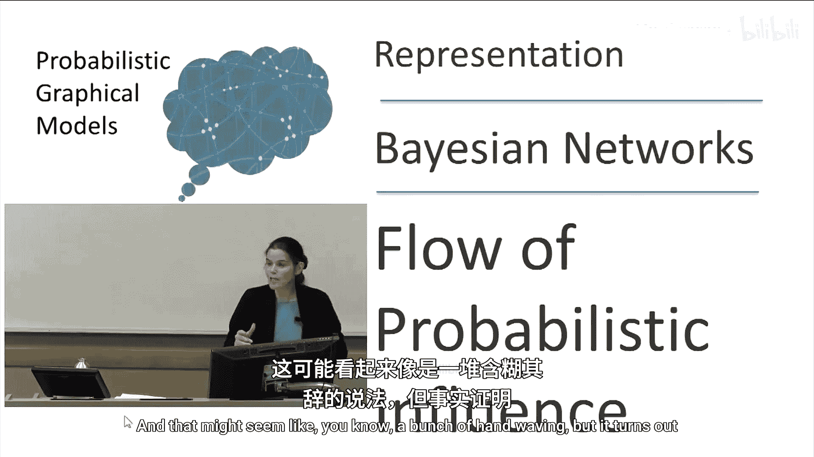
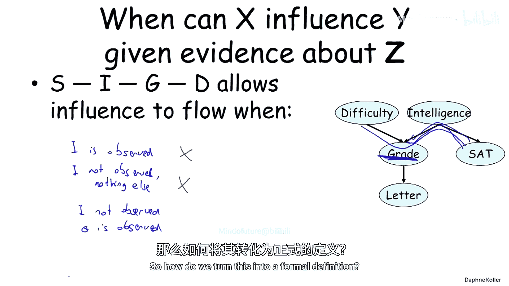
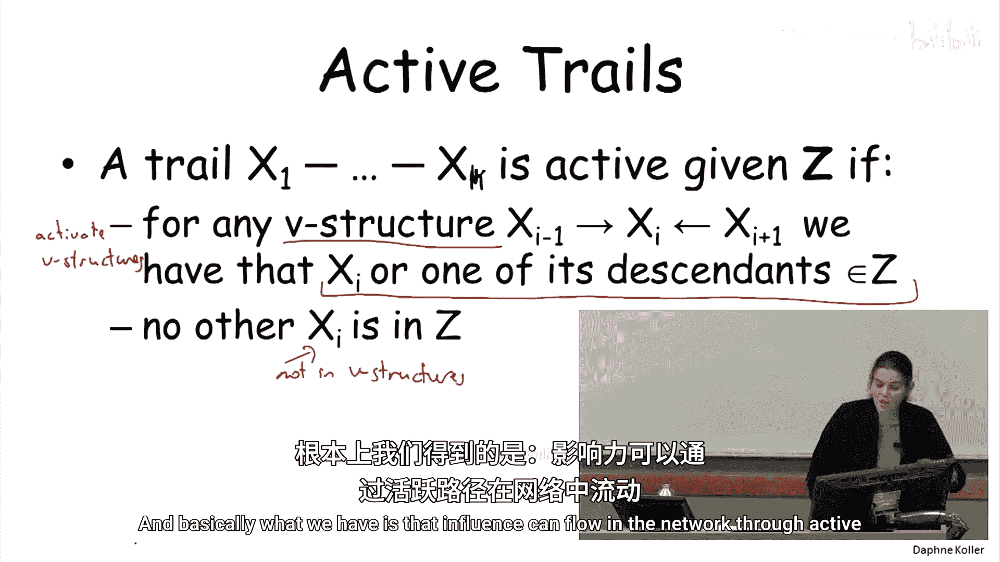

# 概率图模型：1.3：概率影响的流动

在本节课中，我们将学习贝叶斯网络中概率影响是如何流动的。我们将通过定义“活跃路径”这一核心概念，来精确地描述一个变量X何时能影响另一个变量Y。理解这一点对于后续的推理算法至关重要。

上一节我们讨论了贝叶斯网络的基本推理模式，本节中我们来看看如何更严谨地定义概率影响的流动。

## 无证据时的概率影响

首先，我们考虑在没有任何观测证据的情况下，变量X能否影响变量Y。以下是几种基本结构：

以下是直接连接的情况：
*   **直接因果**：如果X是Y的父节点，那么X可以影响Y。公式表示为：**P(Y|X) ≠ P(Y)**。
*   **直接证据**：如果Y是X的父节点（即X是Y的子节点），那么X同样可以影响Y。这体现了概率影响的对称性。

以下是间接连接的情况：
*   **因果链**：结构为 **X → W → Y**。例如，课程难度(D)影响成绩(G)，成绩(G)又影响推荐信(L)。在这种情况下，X可以通过W影响Y。
*   **共同原因**：结构为 **X ← W → Y**。例如，学生智力(I)同时影响SAT分数(S)和课程成绩(G)。观测W（智力）会影响对X和Y的信念。
*   **共同结果（V型结构）**：结构为 **X → W ← Y**。例如，课程难度(D)和学生智力(I)共同影响成绩(G)。**这是唯一一个例外**：在无证据时，X和Y相互独立，X不能影响Y。

基于以上分析，我们可以定义无证据时的“活跃路径”：一条路径是活跃的，当且仅当其中**没有未被激活的V型结构**。V型结构会阻断影响的流动。

## 有证据时的概率影响

现在，我们引入一组观测证据变量Z。问题是：在给定Z的条件下，X能否影响Y？

直接连接的情况不变。观测证据不会改变直接相连变量间的相互影响。

对于间接连接，情况变得复杂，关键在于中间变量W是否被观测。以下是当W**不在**证据集Z中时的情形：
*   **因果链 (X → W → Y)**：若W未被观测，影响可以流动。
*   **证据链 (X ← W ← Y)**：若W未被观测，影响可以流动（对称性）。
*   **共同原因 (X ← W → Y)**：若W未被观测，影响可以流动。

以下是当W**在**证据集Z中（即被观测）时的情形：
*   **因果链 (X → W → Y)**：若W被观测，影响**无法**流动。例如，已知成绩(G)，则课程难度(D)不会改变对推荐信(L)的信念。
*   **证据链 (X ← W ← Y)**：若W被观测，影响**无法**流动。
*   **共同原因 (X ← W → Y)**：若W被观测，影响**无法**流动。例如，已知学生智力(I)，则SAT分数(S)不会改变对成绩(G)的信念。

最后，我们来看最有趣的**V型结构 (X → W ← Y)**：
*   若W**被观测**，则影响**可以**流动。这就是“解释消除”或“因果间推理”。例如，已知成绩差(G)，那么得知课程难(D)会降低你认为学生笨(I)的概率，X和Y之间产生了关联。
*   若W**未被观测**，但W的**某个后代节点被观测**，同样会激活V型结构，使影响可以流动。例如，虽未知成绩(G)，但观测到推荐信(L)很差，这间接提供了关于G的信息，从而在D和I之间建立了联系。

## 活跃路径的正式定义

综合以上所有情况，我们可以给出活跃路径的正式定义。

一条从X1到Xk的路径，在给定证据集Z的条件下是**活跃的**，当且仅当满足以下两个条件：
1.  对于路径中的每一个V型结构 **Xi-1 → Xi ← Xi+1**，其汇聚节点Xi或Xi的**至少一个后代节点**包含在证据集Z中（即被“激活”）。
2.  路径中所有**不属于V型结构汇聚节点**的其他节点，都不在证据集Z中。

简而言之，影响只能通过活跃路径在网络中流动。这一定义系统地刻画了贝叶斯网络中信息传递的所有规则。

## 总结

本节课中我们一起学习了贝叶斯网络中概率影响流动的规则。我们定义了“活跃路径”这一核心概念，它精确描述了在给定某些证据的条件下，一个变量的信息何时能够影响另一个变量的信念。关键要点是：V型结构在未被激活时会阻断影响，而一旦其汇聚节点或其后代被观测，它反而会成为传递影响的通道。掌握这些规则是理解后续概率推理算法的基础。