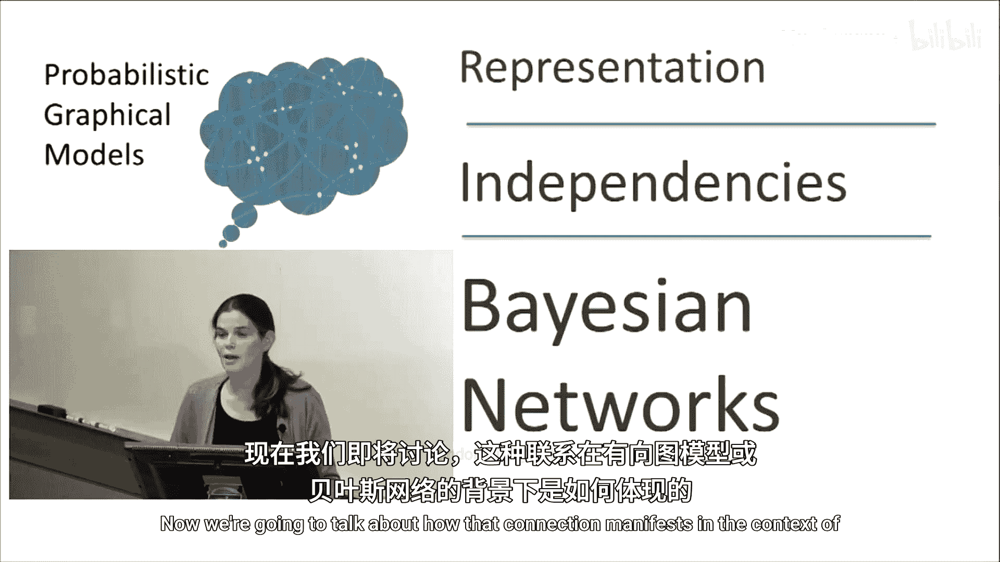
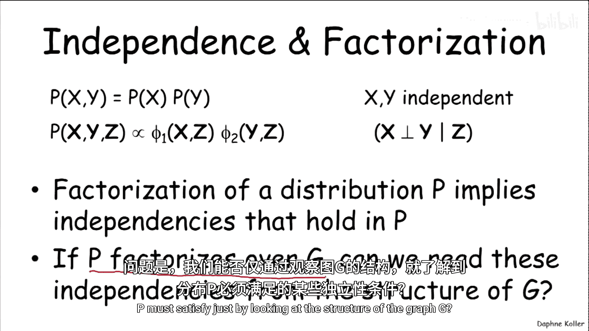
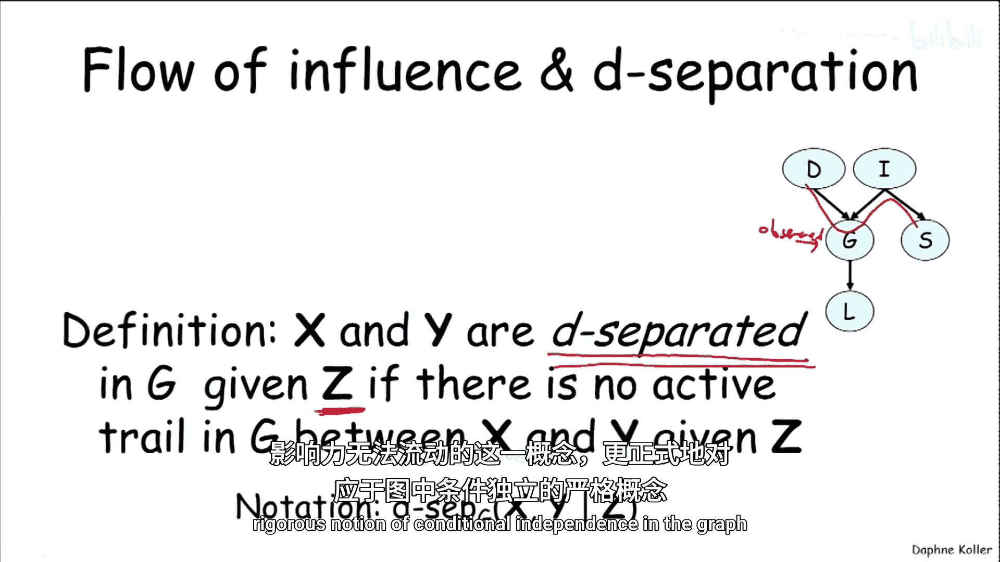
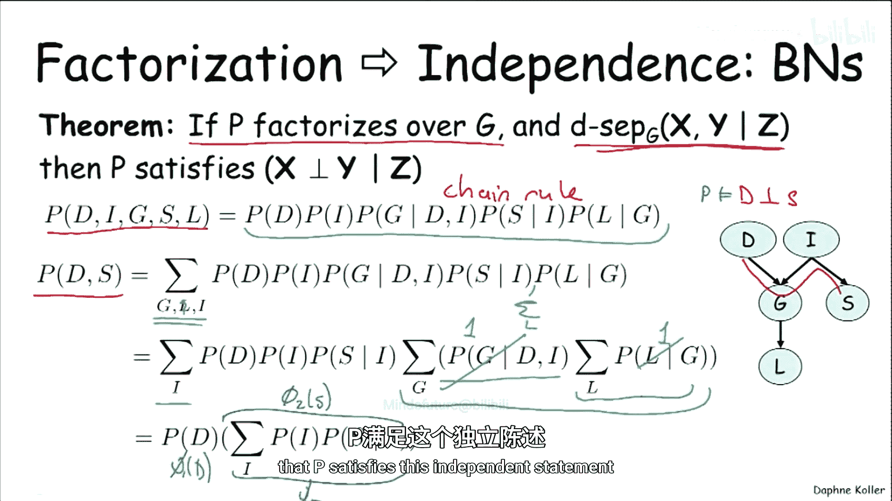
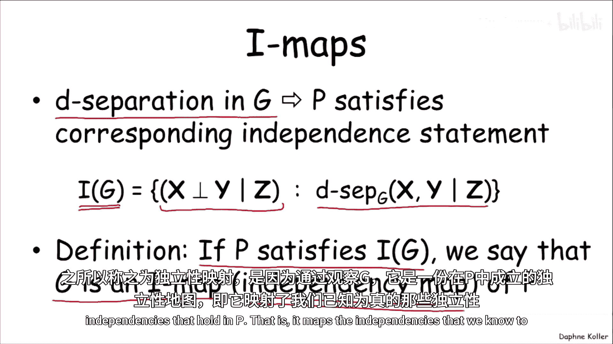
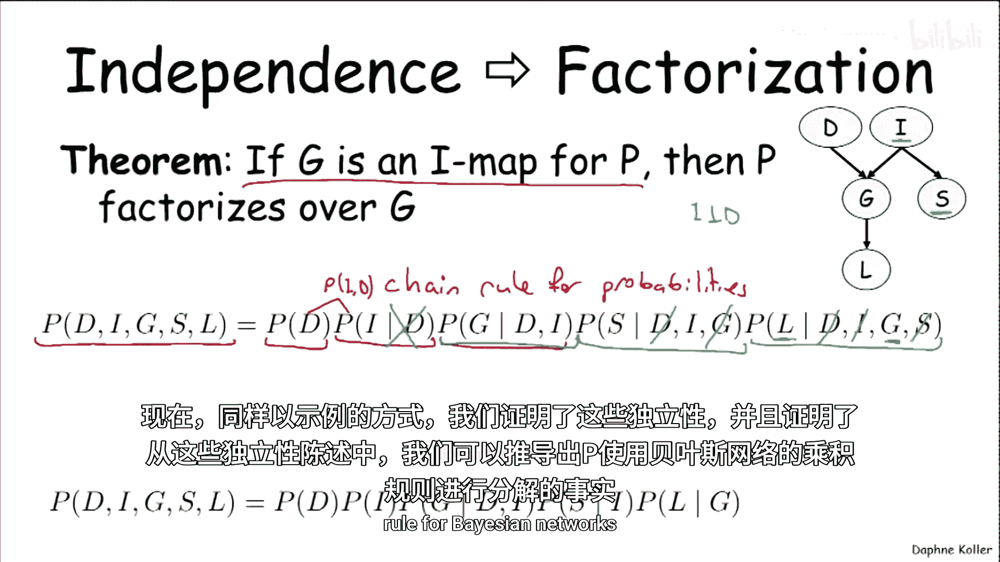
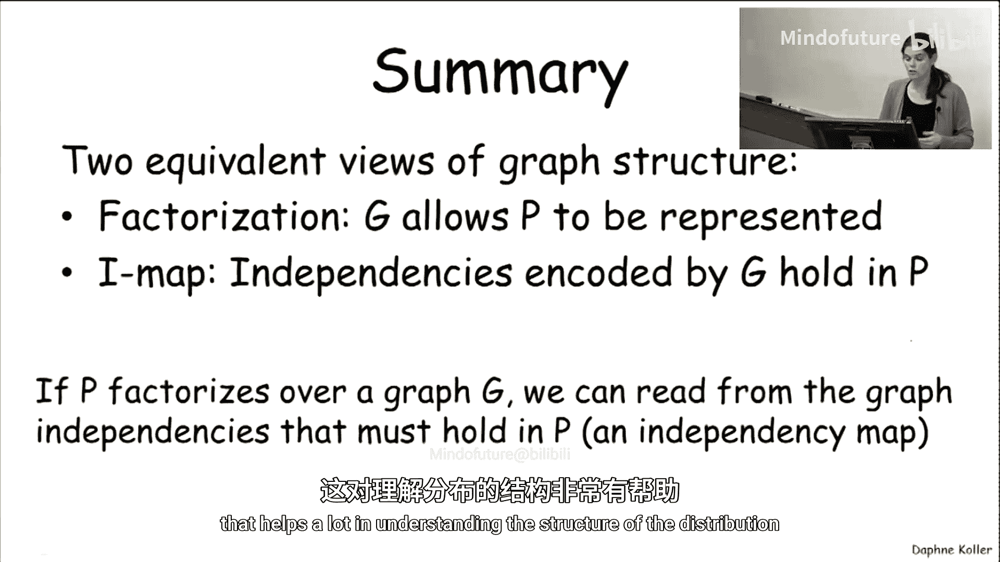

# 009：贝叶斯网络中的独立性



在本节课中，我们将要学习概率图模型中最优雅的特性之一：分布的因子分解与其必须满足的独立性属性之间的深刻联系。我们将重点探讨这种联系在有向图模型（即贝叶斯网络）中的具体表现。

## 因子分解与独立性的关联



首先，我们需要回顾为什么独立性与因子分解是相互关联的。

例如，独立性定义 `P(x, y) = P(x) * P(y)` 表明联合分布是两个因子的乘积，这本身也是一种因子分解。同样，我们给出的条件独立性定义之一——联合分布 `P(x, y, z)` 可以分解为 `f(x, z) * f(y, z)` 的形式——也直接对应着一种因子分解。

因此，我们看到分布的因子分解对应于该分布中成立的依赖关系。现在的问题是，如果我们知道一个分布 `P` 在某个图 `G` 上可以因子分解，那么我们能否仅通过观察图 `G` 的结构，就知道分布 `P` 必须满足哪些独立性？



## 影响流与 d-分离

在概率图模型中，我们讨论过“影响流”的概念，例如，一条“活跃迹”可能穿过多个节点。这为我们提供了关于概率影响如何流动的直观理解。

现在，我们可以将这个观念反过来，并提出一个问题：当图中没有活跃迹（即影响无法流动）时会发生什么？我们将使用 **d-分离** 这个概念来使其形式化。

我们说，在图 `G` 中，给定一组观测变量 `Z`，如果 `X` 和 `Y` 之间没有活跃迹，则 `X` 和 `Y` 是 **d-分离** 的。我们想要论证的是，这种“影响无法流动”的直观概念，更正式地对应于图中条件独立性的严格定义。

## d-分离蕴含独立性：一个定理

以下是我们要证明的核心定理：

**如果分布 `P` 在图 `G` 上可因子分解（即 `P` 可表示为 `G` 上的贝叶斯网络），并且图中存在 d-分离性质（即 `X` 和 `Y` 在给定 `Z` 时是 d-分离的），那么 `P` 满足条件独立性陈述：`X ⊥ Y | Z`。**

换句话说，**d-分离蕴含独立性**。



我们不进行完整的证明，而是通过一个例子来说明推导的主要思想。

假设我们有如下贝叶斯网络 `G` 及其对应的因子分解（根据贝叶斯网络的链式法则）：
```
P(D, I, G, S, L) = P(D) * P(I) * P(G | D, I) * P(S | I) * P(L | G)
```
我们想证明的 d-分离陈述是：`D` 与 `S` 在给定空集（即无观测）时是独立的（`D ⊥ S`）。首先，确认 `D` 和 `S` 之间只有一条迹 `D -> G <- I -> S`。由于 `G` 和 `I` 都未被观测，这条迹不是活跃的，因此 `D` 和 `S` 是 d-分离的。

现在，我们通过边缘化其他变量来推导 `P(D, S)`：
```
P(D, S) = Σ_{G, L, I} P(D, I, G, S, L)
        = Σ_{G, L, I} [P(D) * P(I) * P(G | D, I) * P(S | I) * P(L | G)]
```
通过将求和符号推入乘积中（只要不穿过涉及该变量的项），我们可以逐步简化。最终，表达式会化简为 `φ1(D) * φ2(S)` 的形式，这正好符合边际独立的定义，从而证明了 `P` 满足 `D ⊥ S`。

## 一个重要的通用独立性

基于 d-分离的概念，我们可以证明一个非常重要的通用性质：

**在图中的任何节点，在给定其父节点的条件下，都独立于其所有非后代节点。**

让我们以变量 `L`（Letter）为例。它的后代是 `J` 和 `H`。它的非后代（且非父节点）包括 `D`, `I`, `S`。现在，我们检查在给定其父节点 `G` 的条件下，`L` 是否与任意一个非后代（例如 `S`）d-分离。

*   从 `S` 到 `L` 的迹可能向上经过 `I`，再向下经过 `G`。但由于 `G` 是观测条件（父节点），这条迹被阻塞。
*   另一条迹可能从 `S` 向下经过 `J`，再向上到 `L`。这是一个 V 型结构 `S -> J <- L`。要使它活跃，需要 `J` 或其后代被观测。但 `J` 是 `L` 的后代，在给定 `G` 的条件下并未被观测，因此这条迹也不活跃。

因此，`L` 与 `S` 是 d-分离的。这个论证可以推广到所有非后代节点。根据之前的定理，这意味着如果 `P` 在 `G` 上可因子分解，那么任何变量在给定其父节点时，都独立于其非后代。这为贝叶斯网络的结构选择提供了形式化的语义：一个变量只直接依赖于其父节点。

## I-Map：独立性的映射

既然我们已经定义了对于任何在图上可因子分解的分布都成立的一组独立性，我们现在可以定义一个通用概念来概括这一点。



我们定义图 `G` 的 **独立性集合 I(G)**，为所有对应于图中 d-分离陈述的条件独立性陈述 `(X ⊥ Y | Z)` 的集合。这些是图 `G` 所隐含的独立性。

现在，我们给出一个名称：如果分布 `P` 满足 `I(G)` 中的所有独立性，那么我们称 **`G` 是 `P` 的一个 I-Map**。I-Map 代表“独立性映射”，因为通过观察 `G`，我们可以映射出 `P` 中确定成立的独立性。

以下是 I-Map 的一个例子：

考虑两个分布 `P1` 和 `P2`，以及两个图：
*   `G1`: `D` 和 `I` 之间没有边。
*   `G2`: `D` 和 `I` 之间有边。

*   `I(G1)` 包含 `{D ⊥ I}`。
*   `I(G2)` 是空集 `{}`（不隐含任何独立性）。

检查：
*   如果 `P1` 满足 `D ⊥ I`，则 `G1` 是 `P1` 的 I-Map。`G2` 也是 `P1` 的 I-Map，因为空集独立性总是成立。
*   如果 `P2` **不**满足 `D ⊥ I`，则 `G1` **不是** `P2` 的 I-Map。但 `G2` 仍然是 `P2` 的 I-Map。

这个例子说明，一个图是某个分布的 I-Map，只要求该分布满足图所隐含的所有独立性，并不要求分布只满足这些独立性。

## 因子分解与 I-Map 的等价性

现在，我们可以用 I-Map 的语言重新表述并扩展之前的定理：

**定理（双向）：**
1.  **因子分解 ⇒ I-Map**：如果 `P` 在 `G` 上可因子分解（即可表示为 `G` 上的贝叶斯网络），那么 `G` 是 `P` 的一个 I-Map。这意味着我们可以仅从图 `G` 的结构中，读出 `P` 必定成立的独立性，而无需了解具体参数。
2.  **I-Map ⇒ 因子分解**：如果 `G` 是 `P` 的一个 I-Map（即 `P` 满足 `I(G)` 中的所有独立性），那么 `P` 可以在 `G` 上因子分解（即可表示为 `G` 上的贝叶斯网络）。

第二个方向的证明同样可以通过例子来理解。我们从一个通用的概率链式法则开始，然后利用图 `G` 所隐含的独立性（例如，变量在给定父节点时独立于非后代），来简化链式法则中的每一项，最终将其转化为贝叶斯网络特有的因子分解形式。这证明了从独立性假设可以推导出因子分解的形式。

## 总结

本节课中，我们一起学习了关于图结构的两种等价观点：



1.  **因子分解观点**：将图视为一种数据结构，它告诉我们联合分布 `P` 如何被分解为更小的、定义在局部（节点及其父节点）上的因子（条件概率分布 CPDs）。公式表示为：
    ```
    P(X1, ..., Xn) = Π_i P(Xi | Parents_G(Xi))
    ```

2.  **I-Map 观点**：将图视为一个独立性映射。图 `G` 的结构编码了一系列必须在于任何与之兼容的分布 `P` 中的条件独立性陈述。如果 `P` 满足所有这些独立性，则 `G` 是 `P` 的 I-Map。



我们已经证明，这两种观点是等价的：一个分布能在某个图上因子分解，当且仅当该图是该分布的 I-Map。这种等价性非常强大，它意味着如果我们知道一个分布被表示为某个贝叶斯网络，我们就可以仅通过观察图的结构（无需查看参数），就知道该分布必须满足哪些独立性。独立性信息极具价值，它能告诉我们变量间的影响路径、在观察到某些信息后其他变量可能如何变化，极大地帮助我们理解分布的结构以及不同观测所带来的后果。