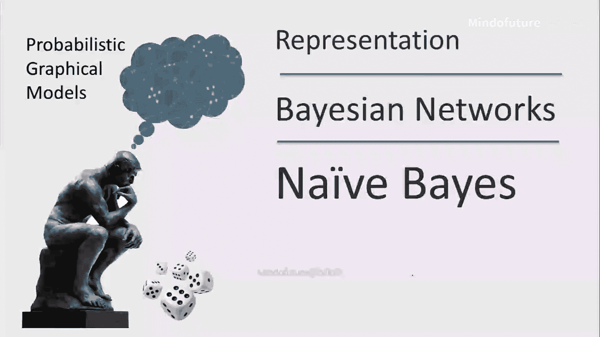
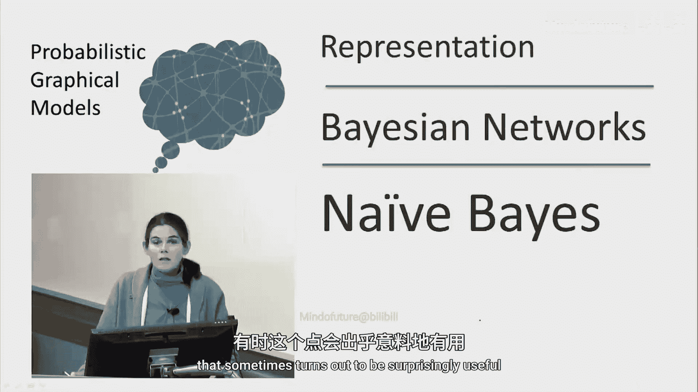
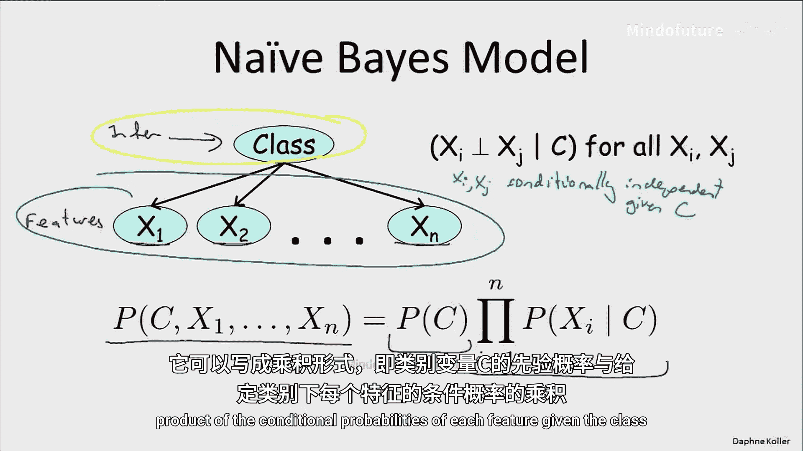
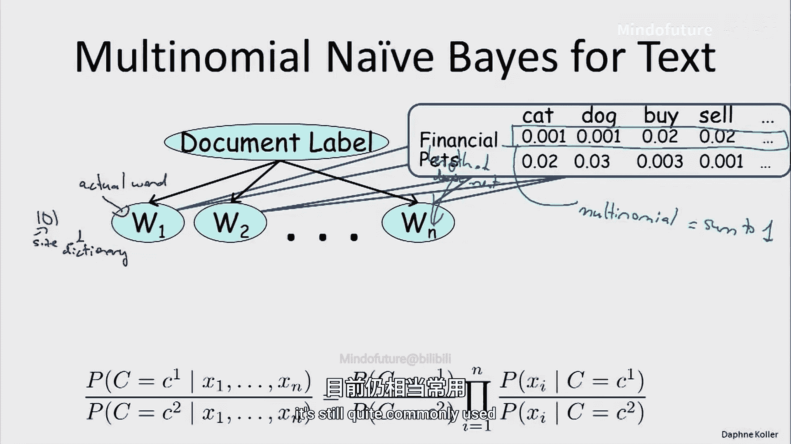
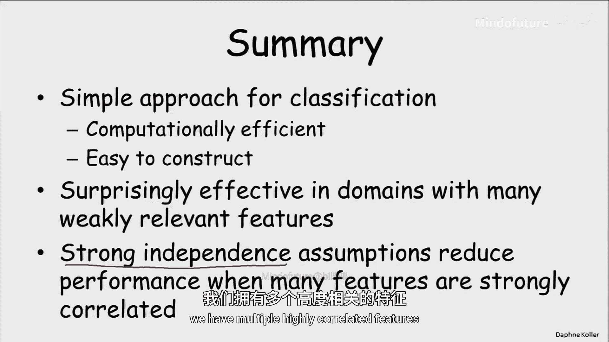

# 010：朴素贝叶斯模型





在本节课中，我们将要学习贝叶斯网络的一个子类——朴素贝叶斯模型。我们将了解其基本结构、核心假设、两种常见变体及其应用场景。

## 概述

朴素贝叶斯模型是贝叶斯网络的一个子类，因其做出了非常“朴素”且过于简化的条件独立性假设而得名。尽管假设很强，但它在模型复杂度的权衡曲线上占据了一个有趣的位置，并且在某些情况下表现出惊人的实用性。

## 模型结构与假设



上一节我们介绍了贝叶斯网络的一般形式，本节中我们来看看朴素贝叶斯模型的具体结构。

朴素贝叶斯模型通常用于分类任务。在一个实例中，我们观察到一组特征（通常是全部特征），目标是推断该实例属于有限类别集合中的哪一个类别。在模型中，特征变量是观测到的，而类别变量通常是隐藏的。

该模型的核心假设是：**在给定类别变量 C 的条件下，任意两个特征变量 Xi 和 Xj 是条件独立的**。这意味着，一旦知道了实例的类别，任何一个特征都不会提供关于其他特征的信息。

这个假设将整个模型的参数化简化为只需要编码类别变量与每个单一特征之间的成对交互。

根据贝叶斯网络的链式法则，该模型的联合分布 P(C, X1, ..., Xn) 可以写成如下乘积形式：
```
P(C, X1, ..., Xn) = P(C) * ∏ P(Xi | C)
```
其中，P(C) 是类别变量的先验概率，P(Xi | C) 是给定类别下每个特征的条件概率。

为了更好地理解模型，我们可以考察在给定一组特定观测特征值 (X1, ..., Xn) 时，两个不同类别 c1 和 c2 的概率比值：
```
P(C=c1 | X)   P(C=c1)     ∏ P(Xi | C=c1)
------------ = -------- * -----------------
P(C=c2 | X)   P(C=c2)     ∏ P(Xi | C=c2)
```
这个比值可以分解为两项的乘积：第一项（绿色部分）是两个类别的先验概率之比；第二项（蓝色部分）是一系列“优势比”的乘积，它表示在某个类别下观察到特定特征值相对于另一个类别的可能性。

## 文本分类中的应用

朴素贝叶斯模型的一个常见应用领域是文本分类。我们的目标是判断一个文档属于哪个预定义的类别（例如，宠物、金融、度假）。

以下是两种常用于文本分类的朴素贝叶斯模型变体：

### 伯努利朴素贝叶斯模型

这种模型为词典中的每一个单词定义一个二元随机变量。例如，如果词典包含约10,000个单词，我们就对应有10,000个特征变量。每个变量取值为1（表示该单词在文档中出现）或0（表示未出现）。

每个特征变量的条件概率分布（CPD）表示在给定文档类别下，该单词出现的概率。例如，在“宠物”类文档中，“猫”这个词出现的概率可能很高；而在“金融”类文档中，“买入”和“卖出”出现的概率则更高。

它被称为“伯努利”模型，因为每个特征变量都服从伯努利分布。其“朴素”性体现在它假设：在已知文档类别的前提下，任意两个单词是否出现是相互独立的。这个假设显然过于简化，但在实际性能上往往是一个不错的近似。

### 多项式朴素贝叶斯模型

这种模型的特征变量不是词典中的单词，而是文档中的单词位置。如果文档有N个单词，就有N个随机变量。每个变量的取值是该位置实际出现的单词（来自一个大小为|V|的词典）。

这看起来是一个更复杂的模型，因为我们需要为文档中的每一个位置指定一个在词典上的概率分布。为了简化，我们假设所有位置的条件概率分布是相同的。也就是说，第一个位置出现某个单词的概率与第二个、第三个位置相同。

它被称为“多项式”模型，因为每个特征变量（单词位置）服从一个多项式分布（所有单词的概率之和为1）。其“朴素”性体现在它假设：在已知文档类别的前提下，文档中任意两个位置的单词是相互独立的。这个假设同样很强，忽略了常见的词组搭配，但在许多实际应用（包括文档分类）中仍然是有效的近似方法。

## 总结



本节课中我们一起学习了朴素贝叶斯模型。

朴素贝叶斯为分类问题提供了一个非常简单的解决方案。它计算效率高，模型易于通过手工或机器学习技术构建。在处理具有大量弱相关特征的领域（如文本）时，它常常表现出令人惊讶的效果。



另一方面，我们所讨论的强独立性假设——即给定类别下各特征条件独立——也限制了模型的性能，尤其是在存在多个高度相关特征的情况下。