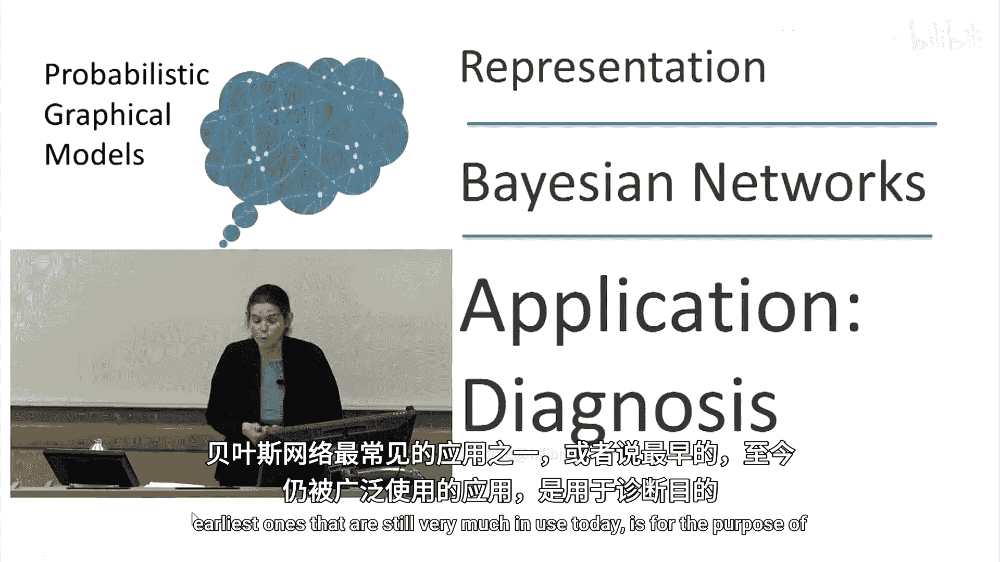
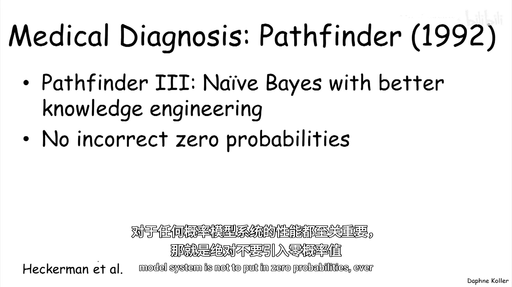
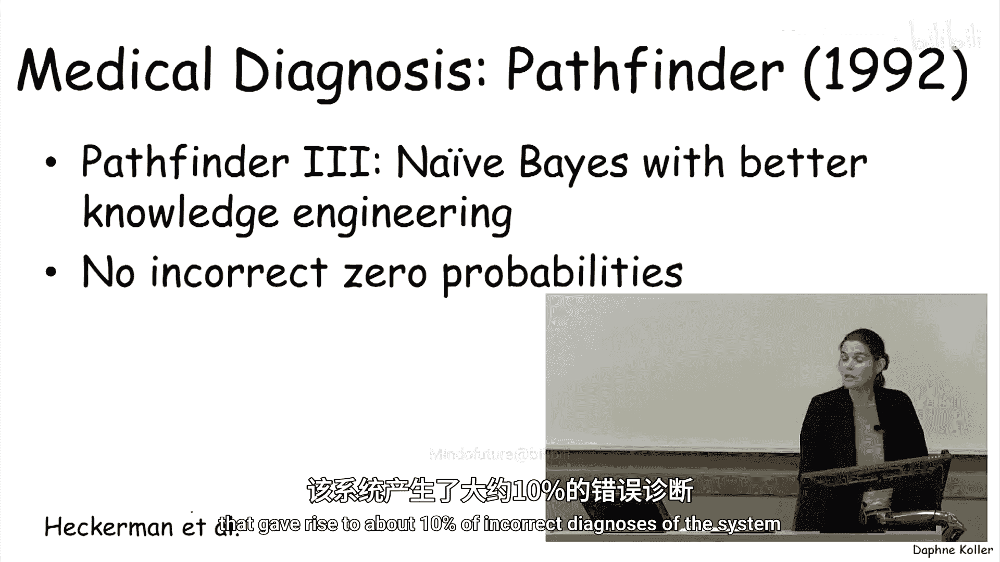
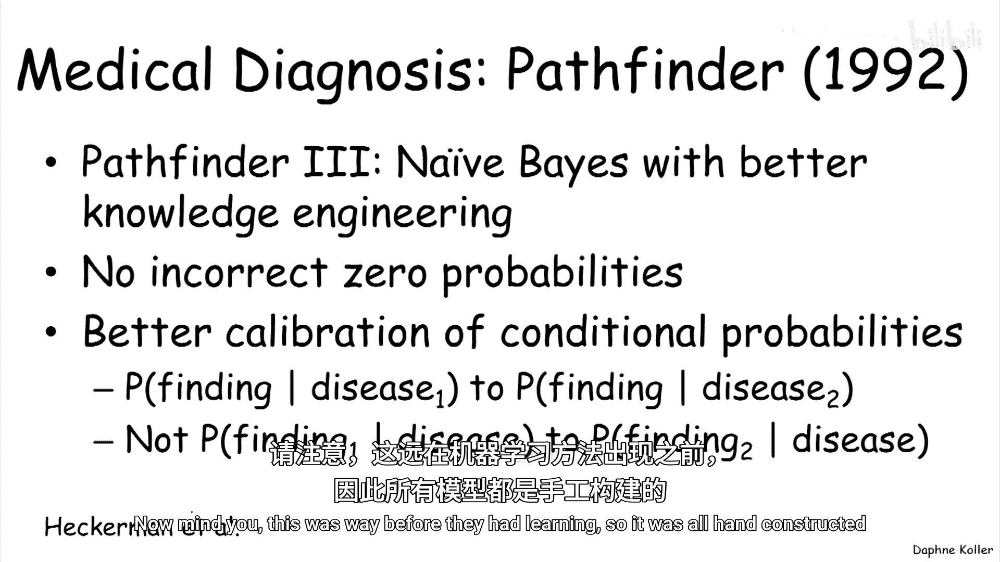
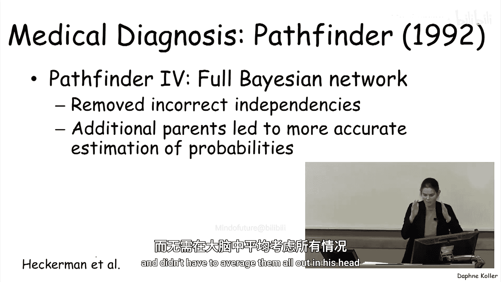
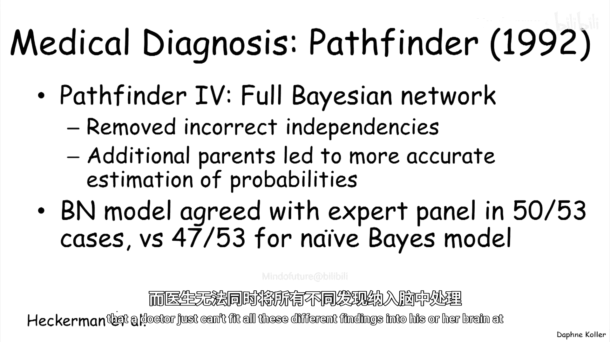
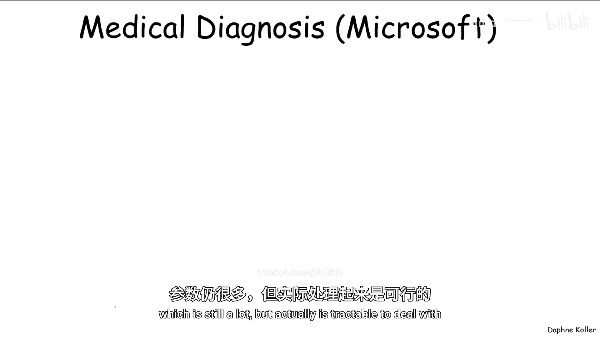
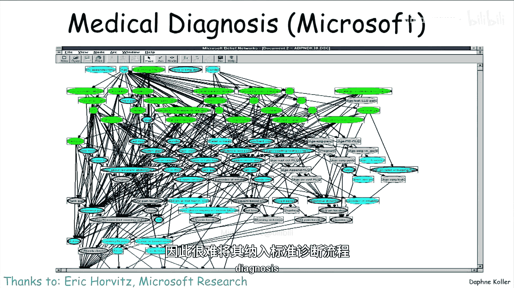
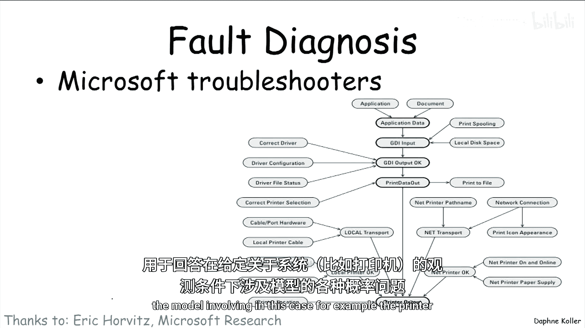
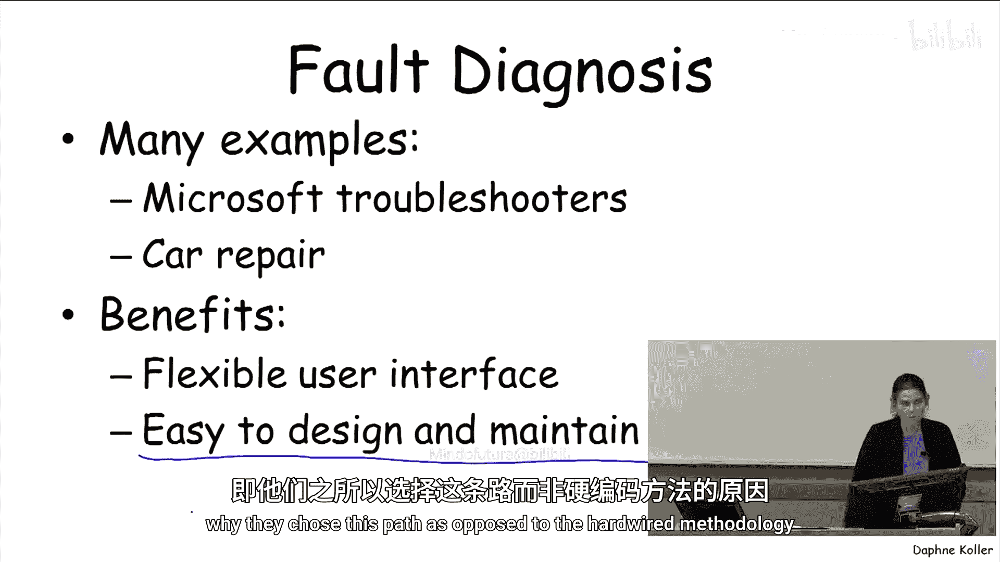

# 概率图形模型：P11：应用-医学诊断

在本节课中，我们将学习贝叶斯网络在诊断领域，特别是医学诊断和故障诊断中的经典应用。我们将回顾一个名为Pathfinder的里程碑式系统的发展历程，并探讨贝叶斯网络相较于其他方法（如基于规则的系统）的优势。

## 贝叶斯网络在诊断中的应用概述

贝叶斯网络最早且至今仍被广泛应用的领域之一是诊断，这包括医学诊断和故障诊断。这一应用可追溯到20世纪90年代初，以Heckerman等人的博士论文和Pathfinder系统为代表。

## Pathfinder系统的演进

Pathfinder系统旨在整合多种证据，帮助医生诊断一系列疾病，最初专注于淋巴结病理学。它涉及60种不同的疾病和多种症状，并尝试了多种方法来解决诊断问题。

### 基于规则系统的尝试

在贝叶斯网络普及之前，研究团队首先尝试了基于规则的系统。这种方法效果并不理想。

### 朴素贝叶斯模型的引入

Pathfinder的第二版采用了**朴素贝叶斯模型**。该模型假设在给定疾病的情况下，所有症状都是相互独立的。即便如此简单的模型，其性能也优于最初尝试的基于规则的系统。

### 知识工程的改进

Pathfinder 3仍然使用朴素贝叶斯模型，但通过改进知识工程提升了性能。研究团队深入理解了影响此类系统性能的关键因素并进行了修正。

以下是知识工程中的关键改进点：

*   **避免零概率**：对于任何概率模型系统，性能的一个根本性要求是不要输入零概率（定义性情况除外）。因为一旦概率为零，无论出现多少相反证据，该概率值都无法被更新（任何数乘以0仍是0）。在Pathfinder 2中，他们为一些可能性极低但并非不可能的事件设置了不正确的零概率，这导致了系统约10%的错误诊断。
*   **改进条件概率校准**：条件概率的校准对于贝叶斯网络的知识工程至关重要。例如，让医生比较**同一证据在不同疾病下的概率**，比比较**同一疾病下不同证据的概率**要容易得多。当医生以这种方式进行校准时，他们能得到更准确的概率估计。需要指出的是，当时还没有自动学习技术，所有概率都是手工构建的。

### 完整贝叶斯网络的应用

Pathfinder 4采用了完整的贝叶斯网络，不再对给定疾病下不同症状间的独立性做出错误假设。这使模型更加正确，并带来了一个意想不到的副作用：允许一个症状变量拥有多个父节点（而不仅仅是单个疾病变量），实际上使得概率估计更加准确，因为医生可以考虑不同的具体情况，而不必在脑海中将所有情况平均化。

完整贝叶斯网络的表现非常出色。在一个由医生组成的专家小组评估的53个疑难病例中，贝叶斯网络模型与专家意见在50个病例上达成一致。相比之下，朴素贝叶斯模型在47个病例上与专家一致，而基于规则的系统则少得多。

一个有趣且重要的方面是，贝叶斯网络的表现甚至超过了构建该模型的医生本人。虽然它没有超越整个专家小组，但优于构建它的医生，因为它能更好地整合所有数据，而医生无法同时将所有不同的发现纳入大脑进行综合处理。

## 大规模网络的参数挑战

我们以CPCS网络为例，这是一个包含约500个变量的大型网络，每个变量平均有4个取值。

如果为这个网络指定一个完整的联合分布，参数数量将是 `4^500`（约等于 `2^1000`），这是一个天文数字，显然无法实现。

即使为每个变量构建条件概率分布（CPD），参数数量也高达约1.33亿，虽然比 `2^1000` 好得多，但仍然过于庞大。

因此，研究团队采用了额外的简化假设（我们将在后续课程中讨论），使他们能够避免使用完整的CPD表格表示，转而采用更紧凑的表示方式，最终将参数数量减少到约8000个。这个数量虽然仍然很大，但已经是可处理的了。

## 诊断系统的现状与优势

医学诊断系统已经从研究走向应用，微软等公司都构建过此类系统。然而，它们在医疗领域的普及相对缓慢，因为不太符合医生传统的工作流程。随着电子健康记录的普及，未来这些系统可能会更常见。

相比之下，故障诊断是这些系统更直接的应用领域。例如，在Windows操作系统中，有成千上万个内置的“故障排除器”，用于诊断打印机、Excel、电子邮件等问题，每个排除器内部都有一个小型贝叶斯网络，根据用户观察到的现象计算各种问题的概率。

此外，也存在大型网站利用贝叶斯网络进行汽车维修诊断。用户输入汽车的品牌、型号、年份以及主要问题，系统会推断出最可能的原因并告知用户需要检查什么。

人们选择使用贝叶斯网络进行故障诊断，不仅仅是因为它“酷”，更是因为它提供了非常灵活的用户界面和易于维护的设计。

*   **对用户灵活**：用户可以在贝叶斯网络中随时输入证据（观察结果）并获取概率。如果暂时不想回答某个问题，可以稍后再答，系统会将其视为尚未获得观察值的变量。
*   **对设计者易维护**：如果系统结构发生微小变化（例如打印机结构更新），在基于规则或硬编码的菜单系统中，可能需要重建整个决策树。而在贝叶斯网络中，可能只需要修改一个概率或增加一条边，所有推断结果都会自动、直接地随之更新，这使得系统更加模块化，更易于维护。这也是使用者选择贝叶斯网络而非硬编码方法的主要原因。

## 总结

本节课我们一起学习了贝叶斯网络在诊断领域的经典应用。我们回顾了Pathfinder系统从基于规则方法、朴素贝叶斯模型到完整贝叶斯网络的演进过程，看到了完整模型在准确性上的显著优势。我们还探讨了处理大规模网络时的参数挑战，以及贝叶斯网络在故障诊断等实际应用中因其灵活性和易维护性而备受青睐的原因。