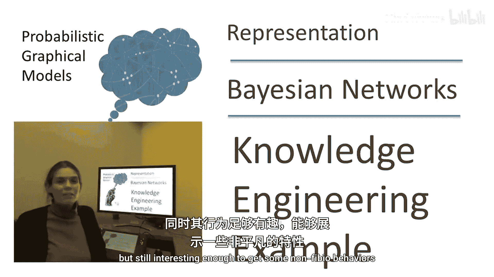
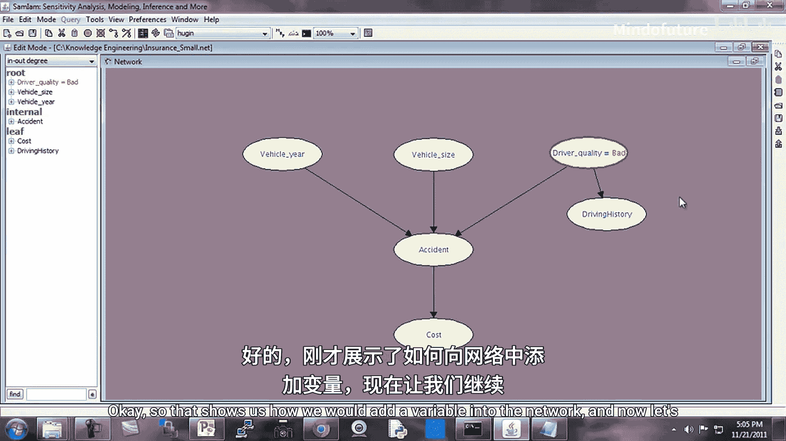
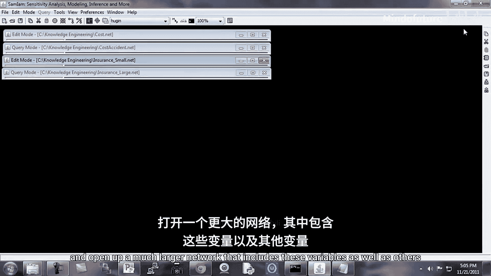
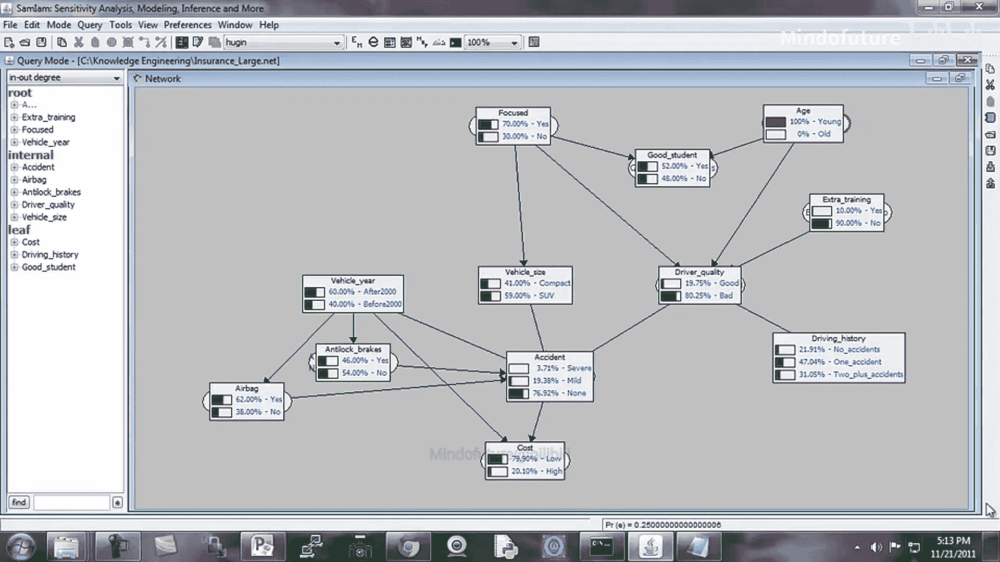

# 概率图形模型：P12：知识工程示例-SAMIAM

在本节课中，我们将通过一个具体的网络示例，学习如何构建和理解贝叶斯网络。我们将使用SAMIAM工具，以一个简化的保险风险评估模型为例，探讨条件概率分布（CPD）的设定、网络的扩展以及如何进行因果推理。

## 网络结构与核心变量

首先，我们来看一个基础网络。核心变量是**Cost**，它代表保险公司每年需要为投保人支付的费用。为了简化，我们将其定义为只有两个取值的离散变量：`low`（低）和`high`（高）。

**公式表示：**
`Cost ∈ {low, high}`

## 扩展对话：添加父节点

根据“扩展对话”的技术，我们需要找出影响`Cost`的主要因素。一个关键因素是**Accident**（事故），它有三个取值：`none`（无）、`mild`（轻微）和`severe`（严重）。

以下是`Accident`变量的概率分布：
*   `none`: 0.85
*   `mild`: 0.10
*   `severe`: 0.05

现在，我们来看`Cost`在给定`Accident`情况下的条件概率表（CPD）。请注意，在SAMIAM中，条件变量（`Accident`）通常显示为列。

**代码/表格表示：**
| Cost \ Accident | none | mild | severe |
| :--- | :---: | :---: | :---: |
| **low** | 0.99 | 0.70 | 0.10 |
| **high** | 0.01 | 0.30 | 0.90 |

从表中可以看出，若无事故，成本极有可能是低的；若发生严重事故，成本有90%的概率是高的。

## 进一步扩展网络

上一节我们介绍了事故对成本的影响，本节中我们来看看事故本身又受哪些因素影响。我们为`Accident`添加了三个父节点：
1.  **DriverQuality**（驾驶员质量）：`good`（好）或`bad`（差）。
2.  **VehicleSize**（车辆尺寸）：`SUV`（运动型多用途车）或`compact`（紧凑型车）。
3.  **VehicleYear**（车辆年份）：`after 2000`（2000年后）或`before 2000`（2000年前）。

现在，`Accident`的CPD变得更为复杂，因为它有3个父节点，每个有2个取值，共形成2x2x2=8种条件组合。

以下是其中一个条件组合的概率示例：
*   当 `VehicleYear = after 2000`， `VehicleSize = SUV`， `DriverQuality = good`时：
    *   `P(Accident = none) = 0.85`
    *   `P(Accident = mild) = 0.12`
    *   `P(Accident = severe) = 0.03`

如果我们将`VehicleSize`改为`compact`，而其他条件不变，概率分布会发生变化，这反映了不同车型可能带来的不同驾驶模式和风险。

## 进行因果推理

有了这个网络，我们可以进行一些简单的因果推理。例如，我们可以固定`DriverQuality`的值，观察其对`Cost`和`Accident`概率的影响。

**推理示例：**
*   当 `DriverQuality = bad` 时：
    *   `P(Cost = low) = 81%`
    *   `P(Accident = none) = 下降`， `P(Accident = mild/severe) = 上升`
*   当 `DriverQuality = good` 时：
    *   `P(Cost = low) = 87%`
    *   `P(Accident = none) = 87.5%`

需要注意的是，这些概率变化可能看起来不大，但对于拥有数十万客户的保险公司来说，几个百分点的差异会对利润产生重大影响。

## 处理不可观测变量：添加子节点

`DriverQuality`是一个难以直接观测的变量。为了获得关于它的证据，我们可以添加一个可观测的子节点，例如**DrivingHistory**（驾驶历史），其取值为`previous accident`（有事故史）或`no previous accidents`（无事故史）。

在因果结构中，`DriverQuality`是`DrivingHistory`的原因（即驾驶质量影响历史记录），因此将`DrivingHistory`作为`DriverQuality`的**子节点**更为合理。这种结构也便于未来添加其他指示变量（如交通违规记录）。

## 探索更复杂的网络

现在，让我们观察一个更完整的网络。除了上述变量，我们还添加了：
*   **车辆属性**：如是否配备防抱死刹车系统（Anti-Lock Brakes）和安全气囊（Airbag），这些会影响事故概率。
*   **驾驶员属性**：
    *   `ExtraTraining`（额外培训）：可提升`DriverQuality`。
    *   `Age`（年龄）：假设年轻人更易冒险。
    *   `Focused`（专注度）：影响`DriverQuality`。
*   **可观测的指示变量**：`GoodStudent`（是否是好学生），作为`Age`和`Focused`的子节点，用于间接推断人格类型。

以下是`GoodStudent`的一个CPD示例片段：
*   当 `Age = young`， `Focused = focused` 时，`P(GoodStudent = yes)` 很高。
*   当 `Age = old` 时，`P(GoodStudent = yes)` 很低，因为年长者很可能不是学生。

## 分析复杂的推理模式

利用完整网络进行查询，有时会得到反直觉的结果，这揭示了贝叶斯网络中推理路径的复杂性。

**示例分析：**
1.  首先，我们查询`Accident`的先验概率：`P(none) ≈ 79.5%`， `P(severe) ≈ 3%`。
2.  然后，我们**观测到** `GoodStudent = yes`。结果发现，`P(Accident = none)` 反而**下降**到了78%，`P(severe)` **上升**到了3.67%。
3.  **原因**：存在两条活跃的推理路径：
    *   **路径A（降低事故率）**：`GoodStudent -> Focused -> DriverQuality -> Accident`。观察到是好学生，可能暗示其更专注，从而提高驾驶质量，降低事故率。
    *   **路径B（提高事故率）**：`GoodStudent <- Age -> DriverQuality -> Accident`。观察到是好学生，同时提高了该人是`young`（年轻人）的概率，而年轻人本身事故风险较高。这条路径的影响压过了路径A。
4.  **验证**：如果我们**同时观测** `Age = young` 和 `GoodStudent = yes`，就阻断了路径B（因为`Age`已被固定）。此时，再观测`GoodStudent = yes`，就会通过路径A使`P(Accident = none)`从77%**上升**到78%，这与我们的直觉一致。

本节课中我们一起学习了如何从简单变量开始，逐步构建一个贝叶斯网络。我们理解了如何通过添加父节点和子节点来扩展模型，以纳入更多领域知识。更重要的是，我们通过实例看到了贝叶斯网络中的推理如何通过多条路径进行，这些路径可能相互抵消或增强，导致复杂的概率变化。在设计网络时，测试各种查询以验证其行为是否符合预期至关重要。