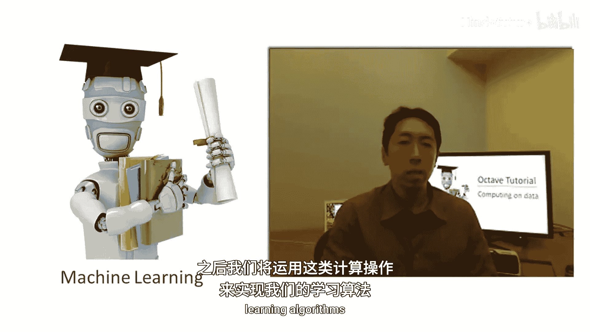
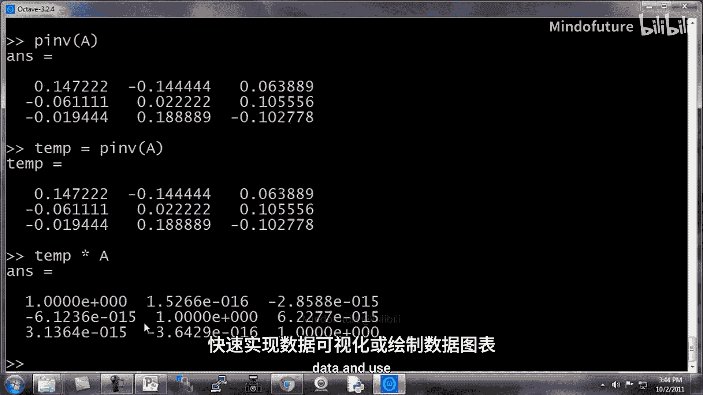

# 概率图形模型1：表示法：P15：数据运算



在本节课中，我们将学习如何在Octave中对数据进行计算操作。这些操作是后续实现机器学习算法的基础。

上一节我们介绍了如何加载、保存数据以及将数据放入矩阵。本节中我们来看看如何对这些矩阵进行各种数学运算。

## 矩阵运算

首先，我们初始化一些矩阵变量用于示例。

```octave
A = [1 2; 3 4; 5 6]; % 3x2 矩阵
B = [11 12; 13 14; 15 16]; % 3x2 矩阵
C = [1 1; 2 2]; % 2x2 矩阵
```

### 矩阵乘法
要计算两个矩阵的乘积，例如 `A * C`，可以直接使用乘号。

```octave
A * C
```
这是一个3x2矩阵乘以2x2矩阵，结果得到一个3x2矩阵。

### 元素级运算
在Octave中，点号 `.` 通常用于表示元素级操作。例如，`A .* B` 会对 `A` 和 `B` 的每个对应元素进行相乘。

```octave
A .* B
```
第一个元素计算为 `1*11=11`，第二个为 `2*12=24`，依此类推。

元素级运算也适用于其他操作。例如，对矩阵 `A` 进行元素级平方：

```octave
A .^ 2
```
结果中，`1` 的平方是 `1`，`2` 的平方是 `4`，等等。

## 向量运算

我们定义一个列向量 `V`。

```octave
V = [1; 2; 3];
```

以下是针对向量的元素级运算示例：

*   **倒数**：`1 ./ V` 计算每个元素的倒数。
*   **对数**：`log(V)` 计算每个元素的自然对数。
*   **指数**：`exp(V)` 计算每个元素的指数值（e的幂）。
*   **绝对值**：`abs([-1; 2; -3])` 返回每个元素的绝对值。
*   **取负**：`-V` 相当于 `-1 * V`。

一个实用技巧是给向量所有元素加1。一种方法是构造一个全1向量相加：

```octave
V + ones(length(V), 1)
```
更简单的方法是直接使用 `V + 1`，Octave会自动进行元素级加法。

## 更多矩阵操作

### 转置
使用单引号 `‘` 来计算矩阵的转置。

```octave
A‘
```
再次转置将返回原矩阵 `A`。

### 最大值和索引
对于向量，`max(a)` 返回最大值，`[val, ind] = max(a)` 同时返回最大值及其索引。

```octave
a = [1 15 2 0.5];
[max_val, max_index] = max(a); % max_val = 15, max_index = 2
```
对于矩阵，`max(A)` 默认返回每列的最大值。

### 比较与查找
`a < 3` 会进行元素级比较，返回一个由0（假）和1（真）组成的逻辑数组。

```octave
a < 3 % 返回 [1 0 1 1]
```
`find(a < 3)` 会返回满足条件（值小于3）的元素的索引。

```octave
find(a < 3) % 返回 [1 3 4]
```
对于矩阵，`find(A >= 7)` 返回满足条件的元素的行列索引。

```octave
A = magic(3); % 生成3x3幻方矩阵
[row, col] = find(A >= 7);
```

### 其他实用函数
以下是处理矩阵和向量的其他常用函数：

*   `sum(a)`：对所有元素求和。
*   `prod(a)`：对所有元素求积。
*   `floor(a)`：向下取整。
*   `ceil(a)`：向上取整。
*   `rand(3)`：生成3x3的随机矩阵。

对于矩阵，`max(A, [], 1)` 指定计算每列的最大值（第一维度），`max(A, [], 2)` 计算每行的最大值。

```octave
max(A, [], 1); % 列最大值
max(A, [], 2); % 行最大值
```
要找出整个矩阵的最大值，可以使用 `max(max(A))` 或将矩阵转换为向量 `max(A(:))`。

### 幻方矩阵示例
幻方矩阵的每行、每列及对角线之和相等。以9x9幻方为例：

```octave
A = magic(9);
```
*   `sum(A, 1)` 计算每列之和，验证它们是否相等。
*   `sum(A, 2)` 计算每行之和。
*   要计算主对角线之和，可以将其与单位矩阵进行元素相乘，然后求和：

```octave
sum(sum(A .* eye(9)))
```
*   计算反对角线之和可以使用 `flipud` 函数翻转单位矩阵后类似操作：

```octave
sum(sum(A .* flipud(eye(9))))
```

### 矩阵求逆
使用 `pinv(A)` 函数来计算矩阵的逆（伪逆）。

```octave
A = magic(3);
temp = pinv(A);
temp * A % 结果应近似为单位矩阵
```

本节课中我们一起学习了Octave中各种核心的数据运算操作，包括矩阵乘法、元素级运算、转置、查找、求和以及求逆等。掌握这些计算是编写机器学习算法的重要步骤。



在下一节中，我们将学习如何用一两行代码快速可视化数据，这有助于更好地理解算法的运行结果。