# 016：数据绘图 📊

在本节课中，我们将学习如何在Octave中进行数据绘图。数据可视化是开发学习算法时的重要工具，它能帮助你直观地理解算法行为、检查运行状态，并启发改进思路。

上一节我们介绍了Octave的基本操作，本节中我们来看看如何使用其强大的绘图功能。

## 基础绘图


Octave的`plot`函数是绘图的基础工具。首先，我们生成一些数据并绘制简单的图形。

```octave
T = [0:0.01:0.98];
y1 = sin(2*pi*4*T);
plot(T, y1);
```

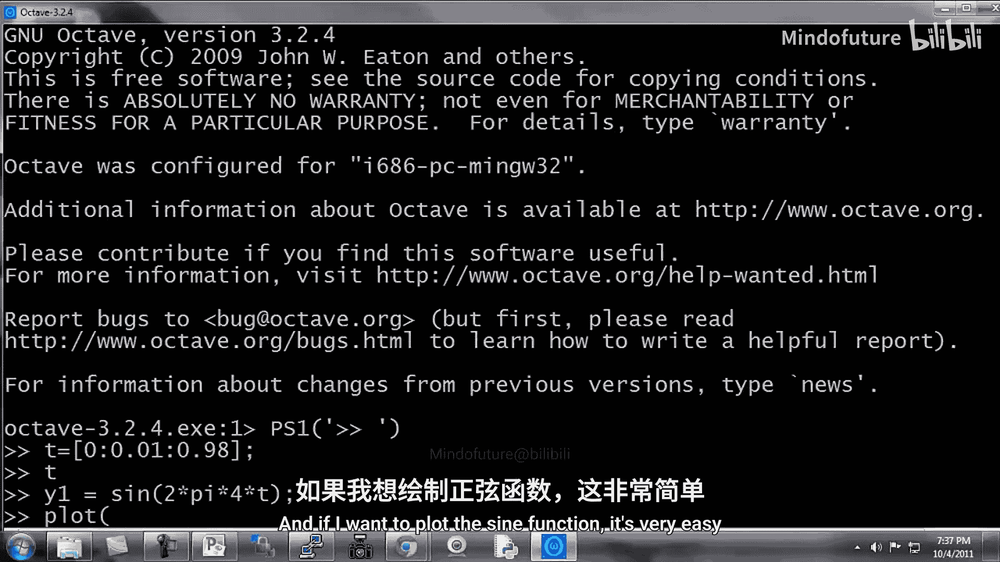

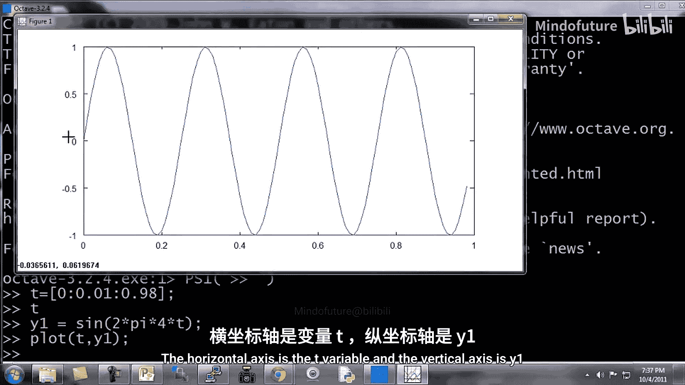

这段代码创建了一个从0到0.98的数组`T`，并计算了对应的正弦函数值`y1`。`plot(T, y1)`命令会生成一个以`T`为横轴、`y1`为纵轴的图形，显示正弦波形。

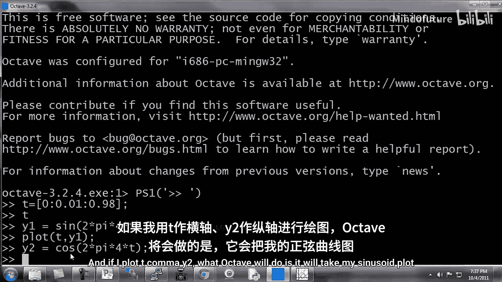

## 在同一图形上绘制多条曲线

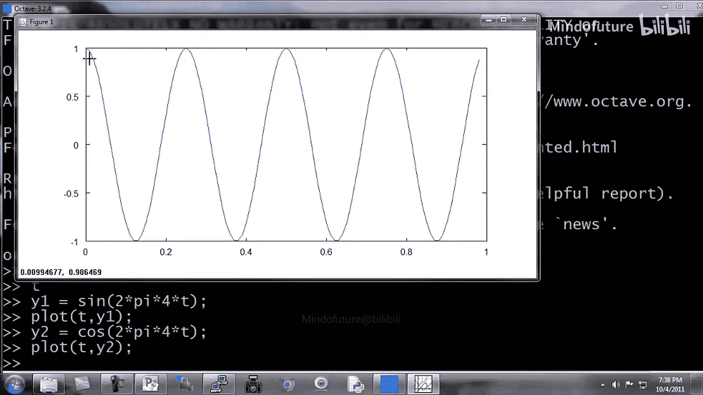

有时我们需要比较多个数据集。以下是绘制并叠加多条曲线的方法。

```octave
y2 = cos(2*pi*4*T);
plot(T, y1);
hold on;
plot(T, y2, 'r');
```

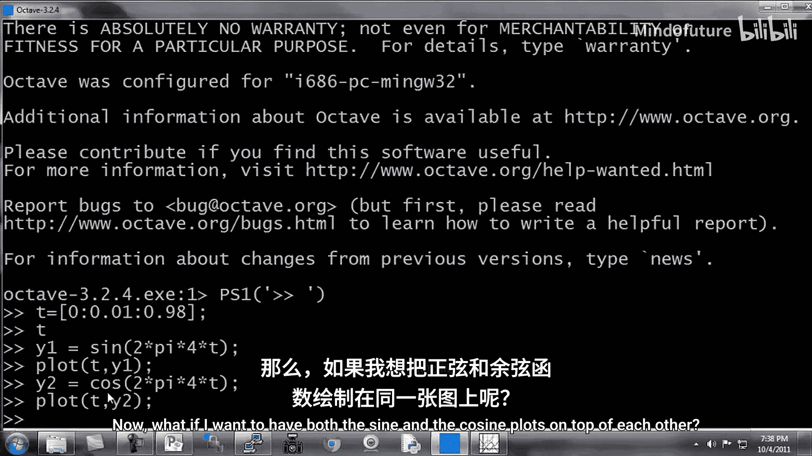

首先计算余弦函数值`y2`。`plot(T, y1)`绘制正弦曲线。`hold on`命令允许后续绘图叠加在当前图形上，而不是替换它。`plot(T, y2, 'r')`则用红色（‘r’代表red）绘制余弦曲线。

## 图形标注与美化

为了使图形更清晰易懂，我们可以添加标签、图例和标题。

以下是添加图形标注的命令：

```octave
xlabel('time');
ylabel('value');
legend('sin', 'cos');
title('My Plot');
```

*   `xlabel('time')`：为横轴添加标签“time”。
*   `ylabel('value')`：为纵轴添加标签“value”。
*   `legend('sin', 'cos')`：在图形右上角添加图例，区分正弦和余弦曲线。
*   `title('My Plot')`：为图形添加标题“My Plot”。

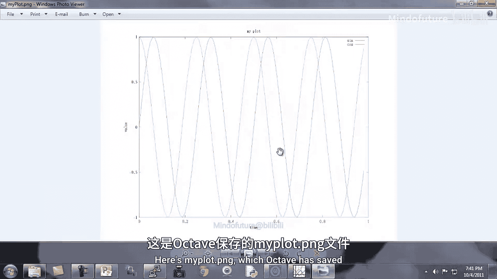

## 保存与关闭图形

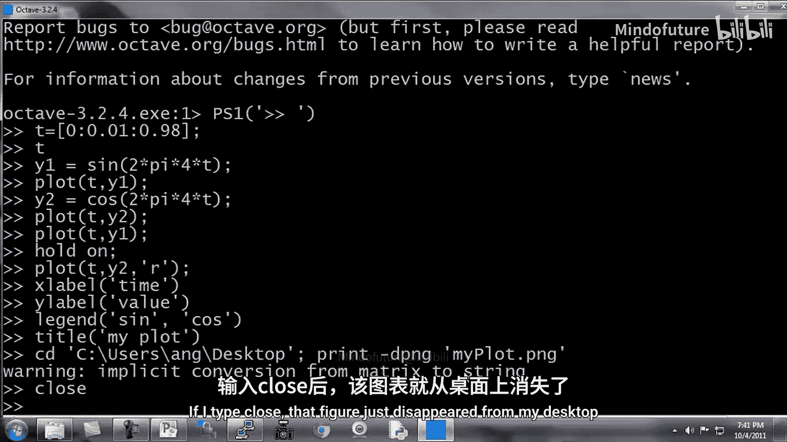

完成绘图后，你可能需要保存图形文件或关闭图形窗口。

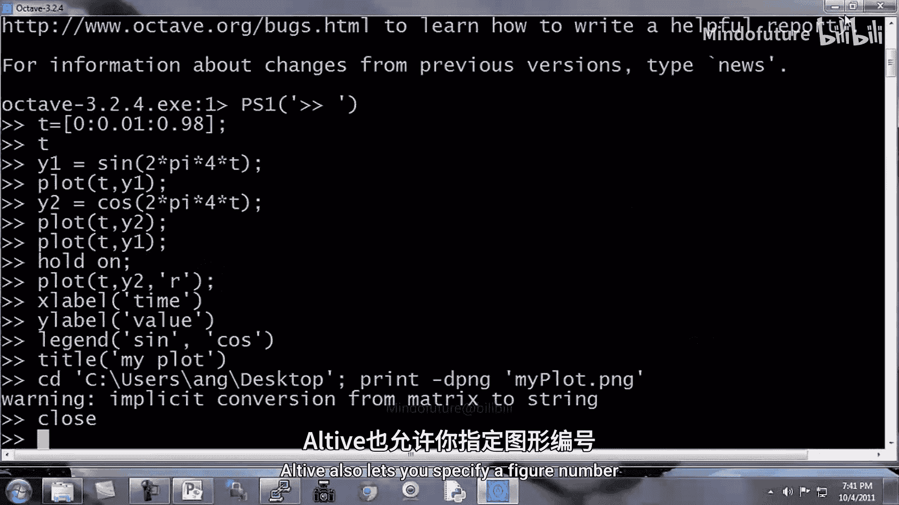

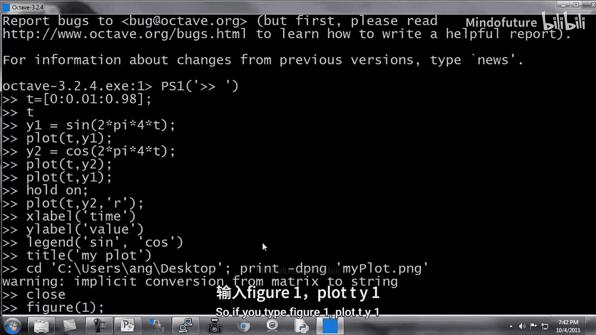

```octave
print -dpng 'myPlot.png';
close;
```

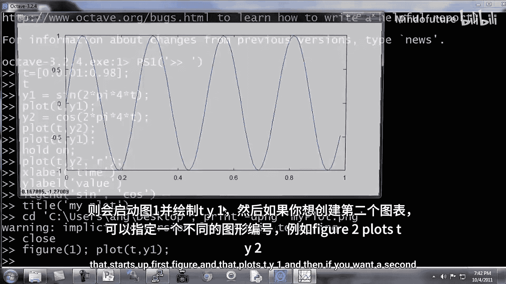

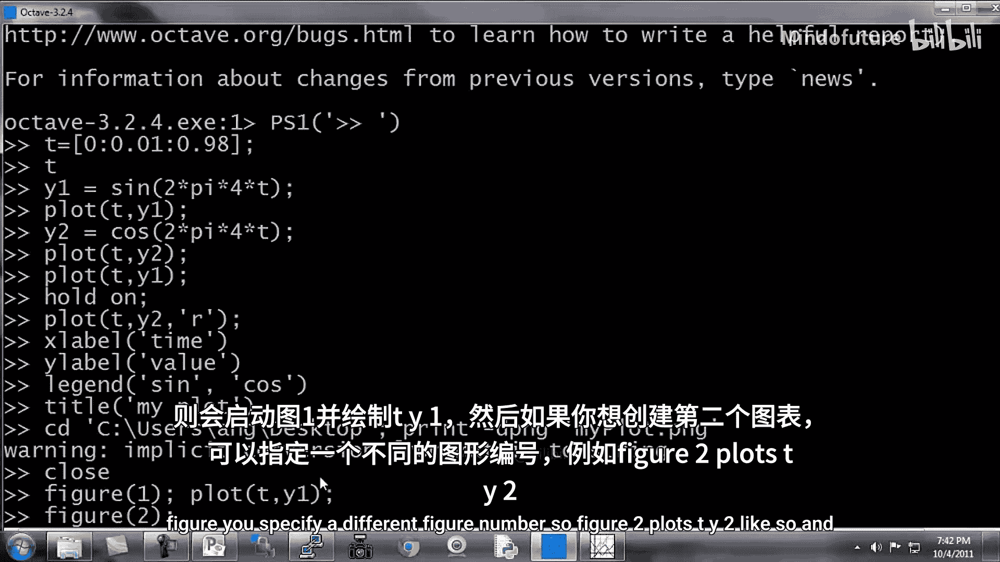

*   `print -dpng 'myPlot.png'`：将当前图形保存为PNG格式的文件，名为“myPlot.png”。Octave也支持其他格式，可通过`help plot`查看。
*   `close`：关闭当前的图形窗口。

## 管理多个图形窗口

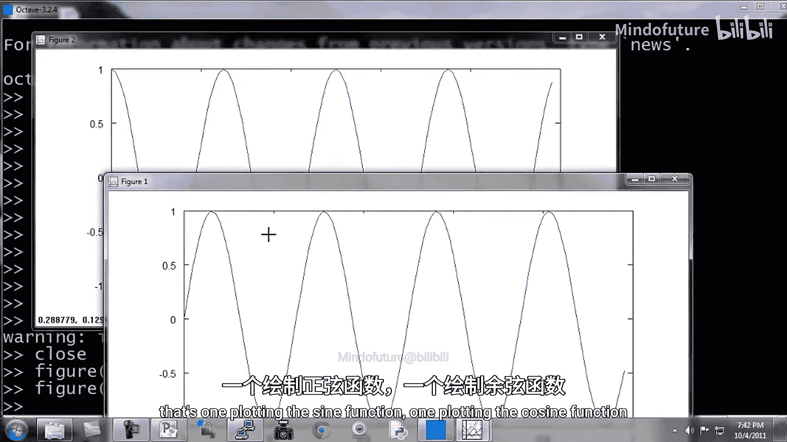

当需要同时查看多个图形时，可以使用`figure`命令创建和管理不同的图形窗口。

```octave
figure(1); plot(T, y1);
figure(2); plot(T, y2);
```

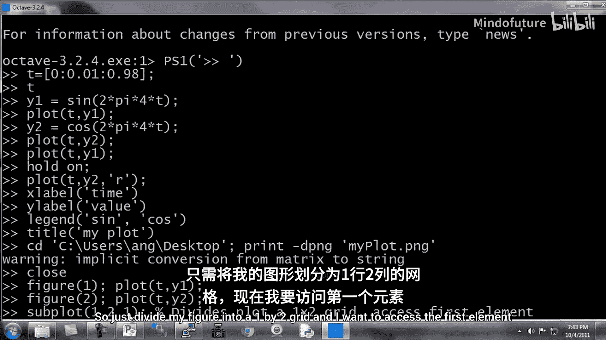

`figure(1)`创建或切换到编号为1的图形窗口并绘图。`figure(2)`则创建或切换到编号为2的新窗口进行绘图。这样，桌面上就会同时显示两个独立的图形窗口。

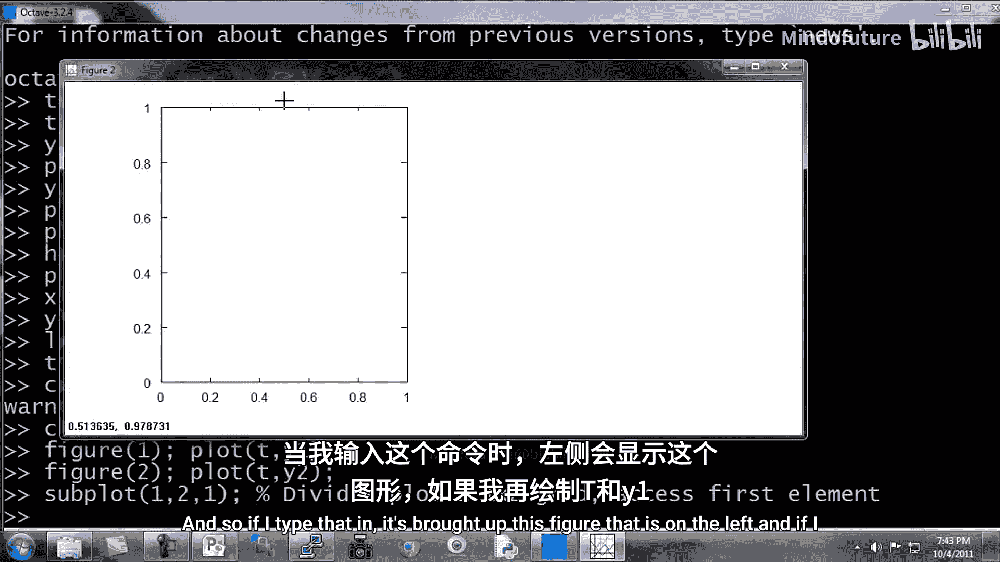

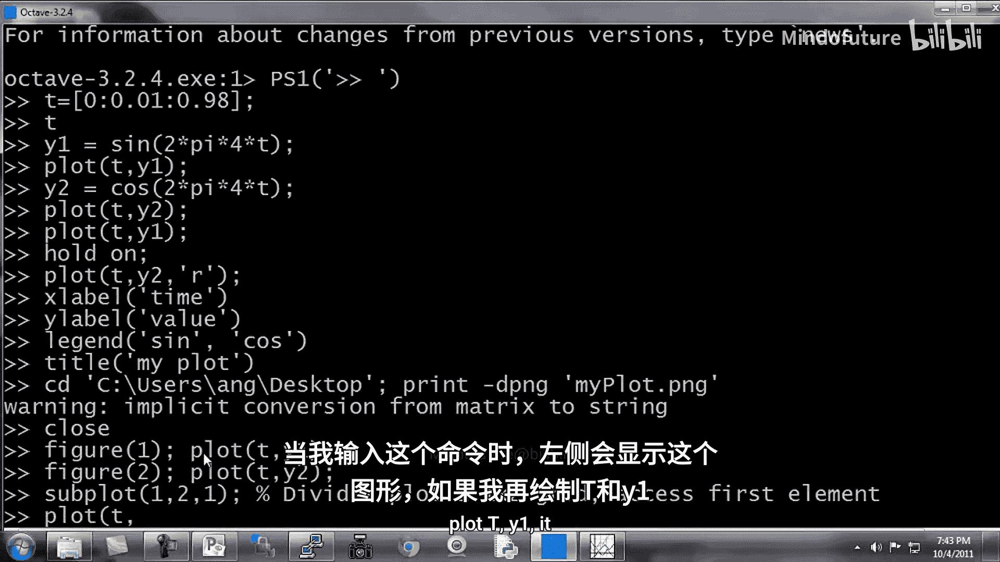

## 子图绘制

`subplot`命令允许在一个图形窗口内创建多个子图，便于对比。

```octave
subplot(1,2,1);
plot(T, y1);
subplot(1,2,2);
plot(T, y2);
axis([0.5 1 -1 1]);
```

*   `subplot(1,2,1)`：将图形区域划分为1行2列，并激活第一个子图区域。随后的`plot`命令将在该区域绘图。
*   `subplot(1,2,2)`：激活第二个子图区域。
*   `axis([0.5 1 -1 1])`：设置当前活动子图（第二个）的坐标轴范围，横轴为[0.5, 1]，纵轴为[-1, 1]。

## 可视化矩阵

除了曲线，Octave还能将矩阵可视化为颜色网格，这对于理解矩阵结构很有帮助。

```octave
A = magic(5);
imagesc(A);
colorbar;
colormap gray;
```

*   `A = magic(5)`：生成一个5x5的幻方矩阵`A`。
*   `imagesc(A)`：将矩阵`A`显示为图像，不同数值对应不同颜色。
*   `colorbar`：在图形旁添加颜色条，显示颜色与数值的对应关系。
*   `colormap gray`：将颜色映射设置为灰度色图。

你可以尝试用`magic(15)`生成更大的矩阵进行可视化。

## 命令串联技巧

在Octave中，可以使用逗号或分号在一行内串联多个命令。

```octave
a = 1, b = 2, c = 3
a = 1; b = 2; c = 3;
```

*   使用逗号`,`分隔命令时，每个命令的结果都会打印出来。
*   使用分号`;`分隔命令时，会执行命令但不打印输出。这在需要执行多个命令（如`imagesc(A), colorbar, colormap gray;`）但又不想让中间结果刷屏时非常有用。

本节课中我们一起学习了Octave中数据绘图的核心方法，包括基础绘图、图形叠加、标注美化、保存管理、多窗口与子图操作、矩阵可视化以及命令串联技巧。掌握这些可视化工具，将极大地助力你理解和改进机器学习算法。

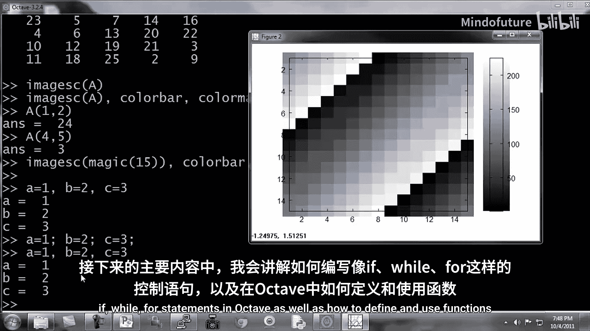

在接下来的课程中，我们将学习Octave中的控制语句（如if、while、for）以及如何定义和使用函数。