# 斯坦福概率图形模型1：表示法：P17：控制语句与函数定义 🧮


在本节课中，我们将学习如何在Octave中编写控制语句（如`for`、`while`、`if`）以及如何定义和使用函数。这些是构建复杂程序的基础。

---

## 1. `for`循环 🔄

`for`循环用于重复执行一段代码固定的次数。以下是其基本语法。

首先，我们创建一个10x1的零向量`v`：
```matlab
v = zeros(10, 1);
```

现在，我们使用`for`循环为向量`v`的每个元素赋值：
```matlab
for i = 1:10
    v(i) = 2^i;
end
```
执行后，`v`将包含2的1到10次幂。代码中的缩进是为了提高可读性，Octave并不强制要求。

另一种写法是使用索引数组：
```matlab
indices = 1:10;
for i = indices
    disp(i);
end
```
这与直接使用`1:10`的效果相同。在循环内部，你也可以使用`break`和`continue`语句。

---

## 2. `while`循环与`if`语句 ⚙️

上一节我们介绍了`for`循环，本节中我们来看看`while`循环和`if`语句。

首先，重置向量`v`并初始化索引`i`：
```matlab
v = [1; 2; 4; 8; 16; 32; 64; 128; 256; 512];
i = 1;
```

使用`while`循环修改前五个元素：
```matlab
while i <= 5
    v(i) = 100;
    i = i + 1;
end
```
循环结束后，`v`的前五个元素将变为100。

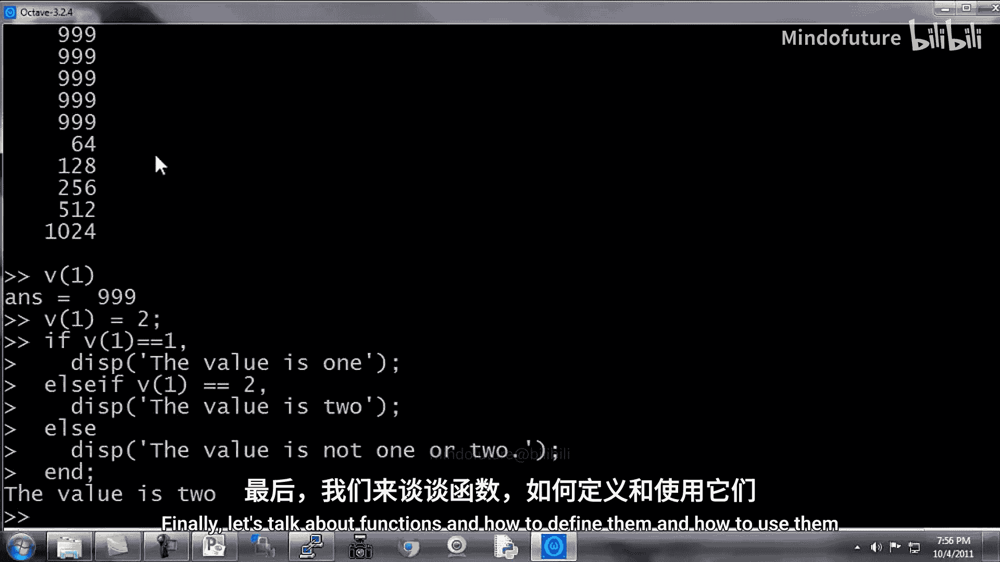

接下来是一个结合`while`、`if`和`break`的例子：
```matlab
i = 1;
while true
    v(i) = 999;
    i = i + 1;
    if i == 6
        break;
    end
end
```
这个无限循环会在`i`等于6时通过`break`语句跳出，最终将`v`的前五个元素设置为999。注意，这里有两个`end`，分别结束`if`语句和`while`语句。

---

## 3. `if-elseif-else`语句 🧭

`if`语句可以根据条件执行不同的代码块。以下是其完整语法。

假设我们有一个变量`v1`：
```matlab
v1 = 2;
```

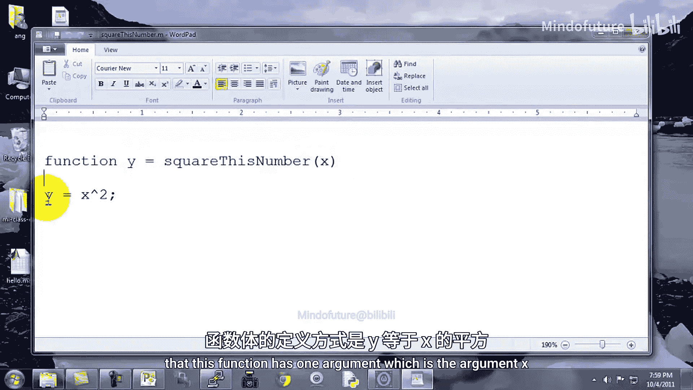

使用`if-elseif-else`结构进行判断：
```matlab
if v1 == 1
    disp(‘The value is one.’);
elseif v1 == 2
    disp(‘The value is two.’);
else
    disp(‘The value is not one or two.’);
end
```
由于`v1`等于2，程序会输出“The value is two.”。

最后，你可以使用`exit`或`quit`命令退出Octave。

---

## 4. 函数的定义与调用 📁

控制语句是程序的骨架，而函数则是可复用的功能模块。本节我们学习如何定义和调用函数。

函数在Octave中定义在以`.m`为扩展名的文件中。建议使用专业的文本编辑器（如Notepad++）来编写，以避免格式问题。

以下是一个简单的函数示例，文件名为`squareThisNumber.m`：
```matlab
function y = squareThisNumber(x)
    y = x^2;
end
```
第一行定义了函数名、返回变量`y`和输入参数`x`。函数体计算`x`的平方并赋值给`y`。

要调用此函数，需要确保Octave的当前工作目录包含该文件：
```matlab
cd ‘C:\Users\AG\Desktop’ % 切换到文件所在目录
squareThisNumber(5) % 调用函数，返回25
```
对于熟悉“搜索路径”概念的用户，可以使用`addpath`命令将目录添加到路径中，这样在任何目录下都能调用该函数。

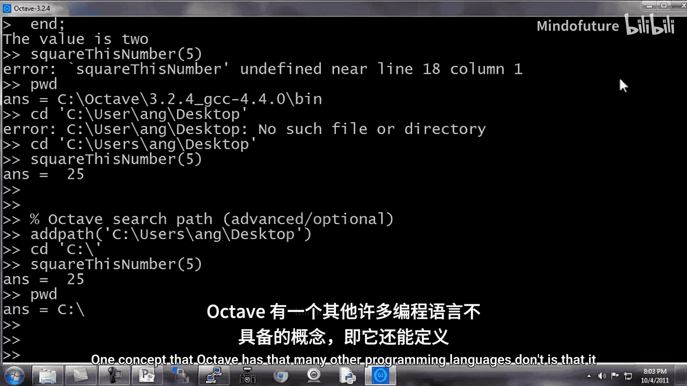

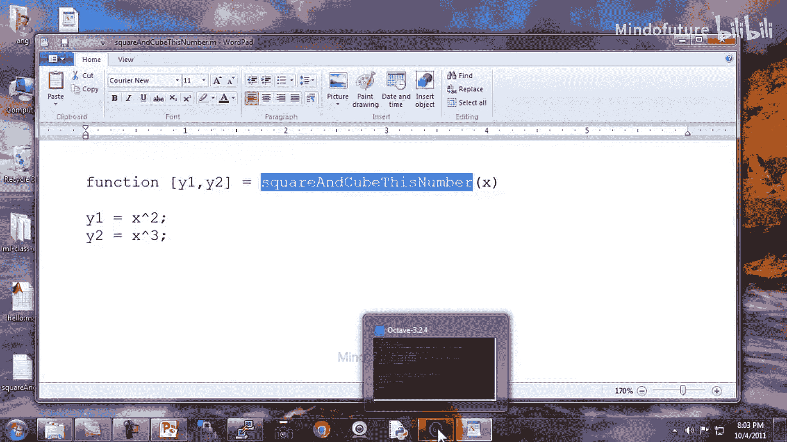

---

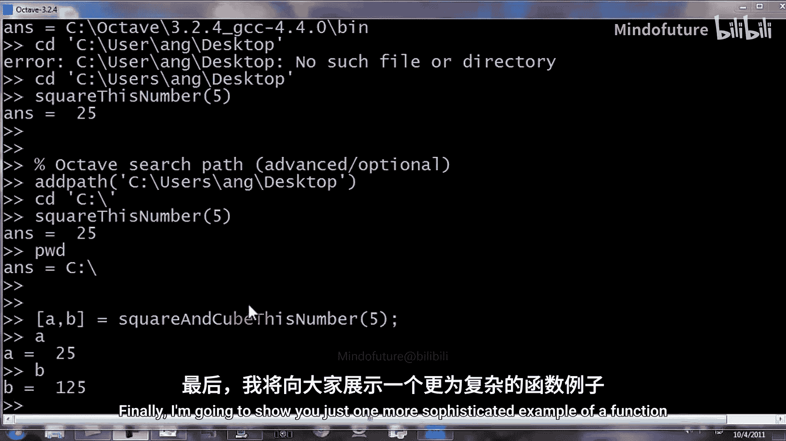

## 5. 返回多个值的函数 📤

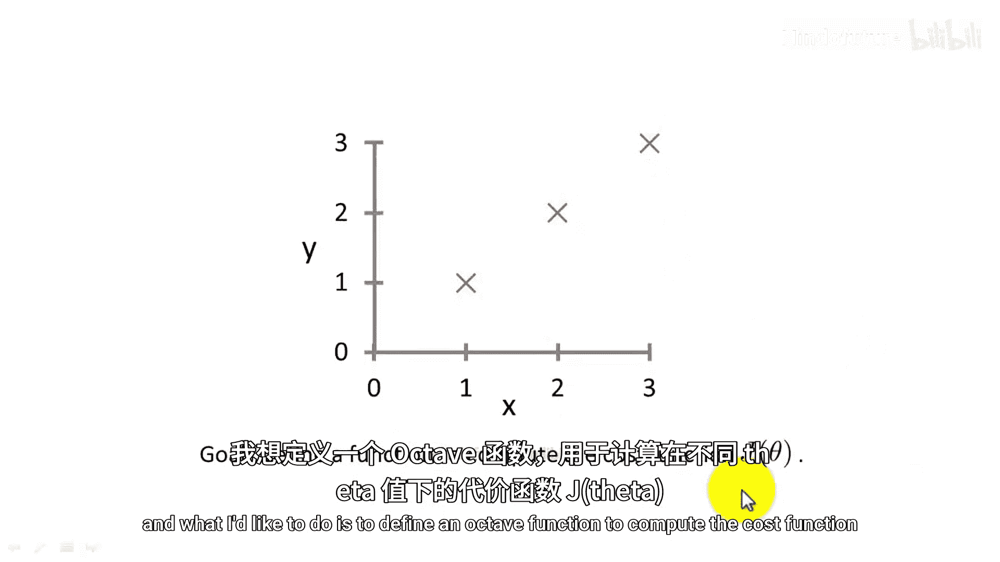

Octave的一个强大特性是允许函数返回多个值。

定义一个返回平方和立方的函数`squareAndCubeThisNumber.m`：
```matlab
function [y1, y2] = squareAndCubeThisNumber(x)
    y1 = x^2;
    y2 = x^3;
end
```
函数定义中的`[y1, y2]`表明它将返回两个值。

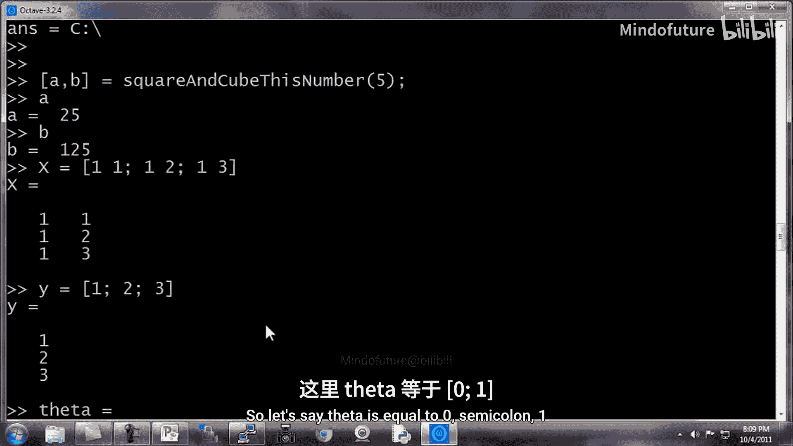

调用方法如下：
```matlab
[a, b] = squareAndCubeThisNumber(5);
```
执行后，`a`等于25，`b`等于125。

---

## 6. 实战：计算成本函数 🎯

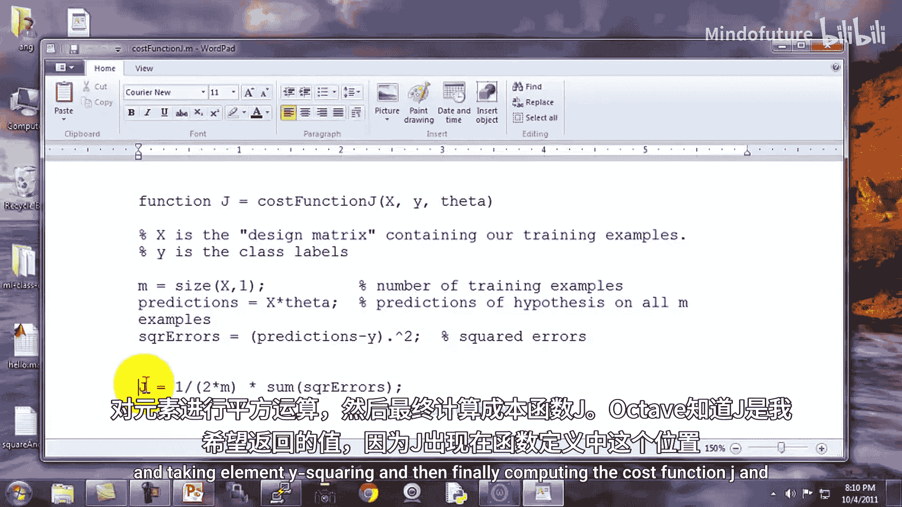

最后，我们通过一个更复杂的例子来巩固所学知识：定义一个计算线性回归成本函数的函数。

首先，准备数据。假设我们有三个训练样本`(1,1), (2,2), (3,3)`：
```matlab
X = [1 1; 1 2; 1 3]; % 设计矩阵，第一列为截距项
y = [1; 2; 3];       % 目标值
theta = [0; 1];      % 参数向量
```

函数`costFunctionJ.m`定义如下：
```matlab
function J = costFunctionJ(X, y, theta)
    % X为设计矩阵，y为目标值向量，theta为参数向量
    % 返回成本函数J的值

    m = size(X, 1);          % 训练样本数量
    predictions = X * theta; % 计算预测值
    sqrErrors = (predictions - y).^2; % 计算平方误差
    J = 1/(2*m) * sum(sqrErrors);     % 计算成本函数
end
```
函数计算了预测值与实际值之间的均方误差的一半。

现在调用它进行计算：
```matlab
J = costFunctionJ(X, y, theta); % theta=[0;1]时，完美拟合，J=0
J = costFunctionJ(X, y, [0;0]); % theta=[0;0]时，J=2.333
```
当`theta = [0;1]`时，假设函数完美拟合数据，成本`J`为0。当`theta = [0;0]`时，计算得到的`J`约为2.333，这与手动计算`(1^2+2^2+3^2)/(2*3)`的结果一致，验证了函数的正确性。

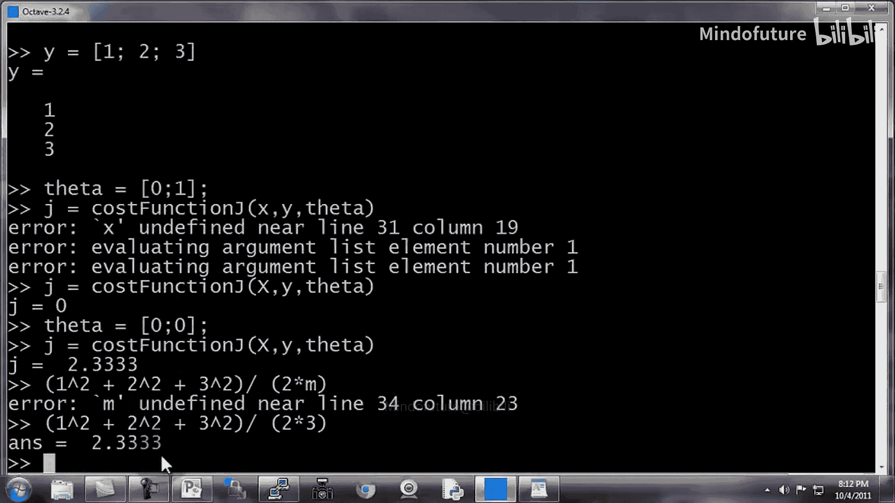

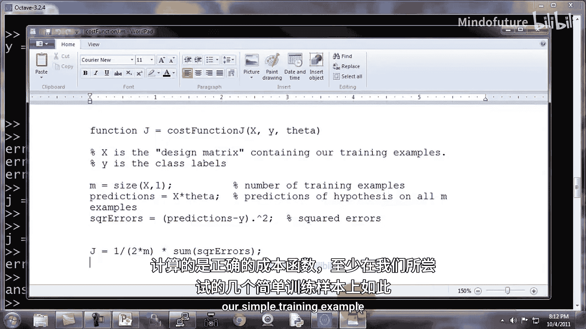

---

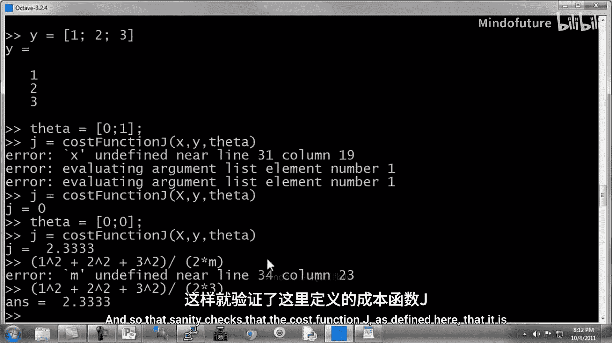

## 总结 📝

本节课中我们一起学习了Octave编程的核心控制流和函数定义：
1.  使用 **`for`循环** 进行固定次数的迭代。
2.  使用 **`while`循环** 和 **`if`语句** 实现条件判断和循环控制，并了解了`break`的用法。
3.  掌握了 **`if-elseif-else`** 多分支条件判断结构。
4.  学会了如何通过创建 **`.m`文件** 来**定义函数**，以及如何调用它们。
5.  探索了Octave函数可以**返回多个值**的特性。
6.  通过一个计算线性回归**成本函数**的实战例子，综合应用了向量化运算和函数定义。


在接下来的课程中，我们将了解如何提交作业，并学习**向量化**这一关键技巧，它能让你的Octave程序运行得更快。