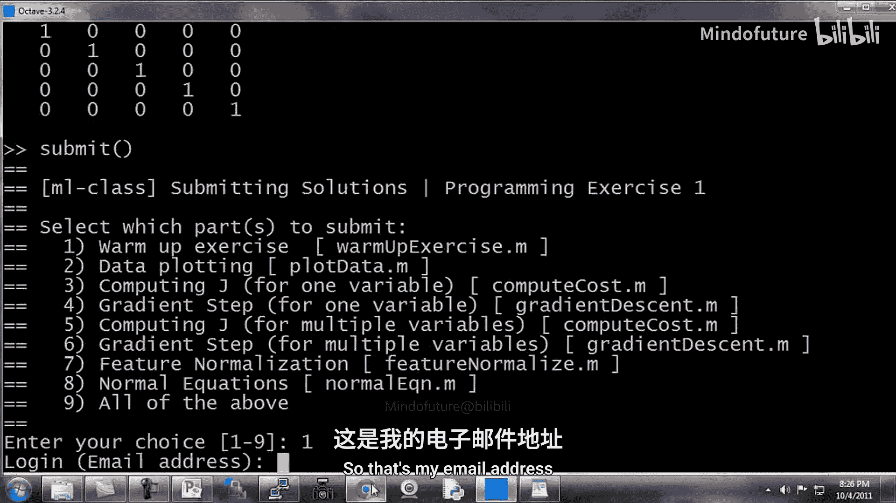
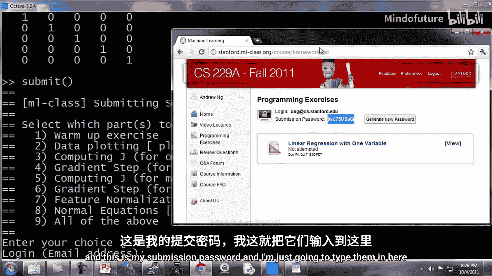
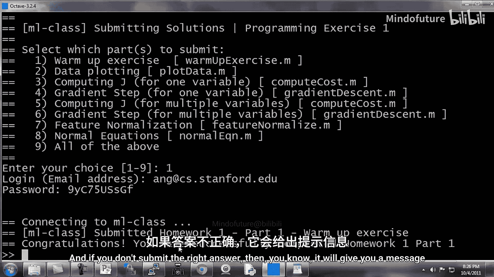
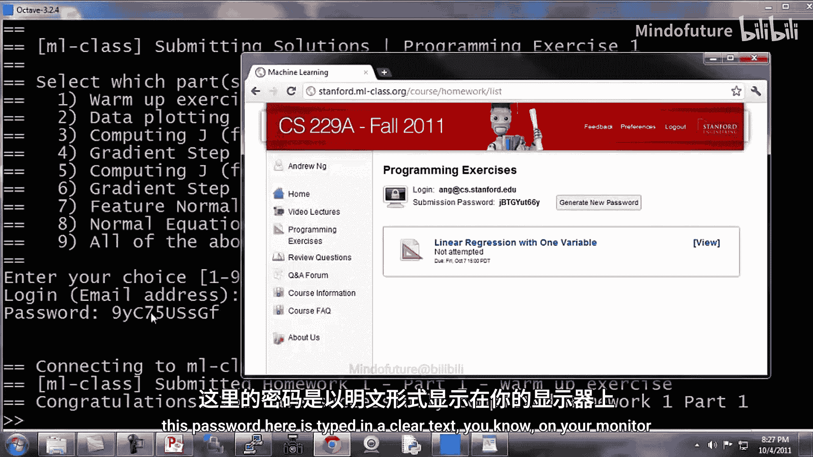

# 019：编程练习操作与提交指南 🖥️

在本节中，我们将学习如何完成课程中的编程作业，并使用提交系统来即时验证你的答案是否正确。我们将一步步演示从打开Octave环境到成功提交作业的完整流程。

## 概述


我们将首先定位到作业文件所在的目录，然后编辑指定的函数文件以完成练习。接着，我们会运行代码来测试其正确性。最后，我们将使用`submit`命令将作业提交到课程服务器，并立即获得反馈。

## 操作步骤详解

以下是完成并提交编程练习的具体步骤。

### 1. 定位作业目录

首先，我们需要在Octave窗口中导航到存放第一次练习文件的目录。例如，目录路径可能是`~/Desktop/Mlclass-Ex1/`。

```octave
cd ~/Desktop/Mlclass-Ex1/
```

### 2. 编辑作业文件

我们提供了多个文件，其中一些需要你进行编辑。首要步骤是阅读本次练习的详细PDF说明文件以了解具体要求。

第一个需要编辑的文件是`warmUpExercise.m`。这个热身练习的目的是确保你熟悉提交系统。你只需要让该函数返回一个5x5的单位矩阵。

**解决方案**是修改`warmUpExercise.m`文件中的代码，使其生成并返回一个5x5的单位矩阵。在Octave中，单位矩阵可以通过函数`eye(5)`创建。

```octave
% 在 warmUpExercise.m 文件中
function A = warmUpExercise()
A = eye(5); % 返回 5x5 单位矩阵
end
```

编辑完成后，请保存文件。

### 3. 测试代码

返回Octave命令行窗口，确保你已切换到正确的目录。然后，你可以运行刚修改的函数来测试它是否按预期工作。

```octave
% 调用函数
warmUpExercise()
```

如果代码正确，命令行将显示一个5x5的单位矩阵。





### 4. 提交作业

测试无误后，即可提交作业。在Octave命令行中，输入`submit`命令。

```octave
submit
```

系统会启动提交流程。首先，它会提示你选择要提交的部分（例如，第一部分）。

接下来，系统会要求你输入在课程网站上注册的**电子邮箱地址**和**提交密码**。



*   **电子邮箱地址**： 例如 `AG@cs.stanford.edu`。
*   **提交密码**： 这是一个专门用于提交作业的密码。你可以在课程网站的个人账户页面找到它（例如 `9YC75USGF`）。你也可以使用你的常规网站登录密码，但出于安全考虑（因为密码在Octave窗口中以明文显示），课程提供了这个专门的提交密码。

输入信息后，系统会连接到服务器并提交你的代码。

### 5. 查看提交结果

提交完成后，系统会立即给出反馈。

*   如果答案正确，你会看到类似“**Congratulations! You have successfully completed part 1.**”的祝贺信息。
*   如果答案不正确，系统会提示你尚未答对，你需要检查并修改代码后重新提交。



关于提交密码的补充说明：你可以在课程网站上生成新的提交密码。由于在Octave脚本中输入时，密码可能会根据操作系统的不同而显示或隐藏，使用这个专门的密码可以避免泄露你的主网站密码。

## 总结

本节课我们一起学习了完成和提交编程作业的标准流程。我们首先定位并编辑了作业文件，然后测试了代码功能，最后使用`submit`命令成功提交了作业并获得了即时反馈。掌握这个流程对于顺利完成后续所有编程练习至关重要。

在下一个也是最后一个Octave教程视频中，我们将介绍**向量化**，这是一种可以大幅提高你Octave代码运行效率的技术。