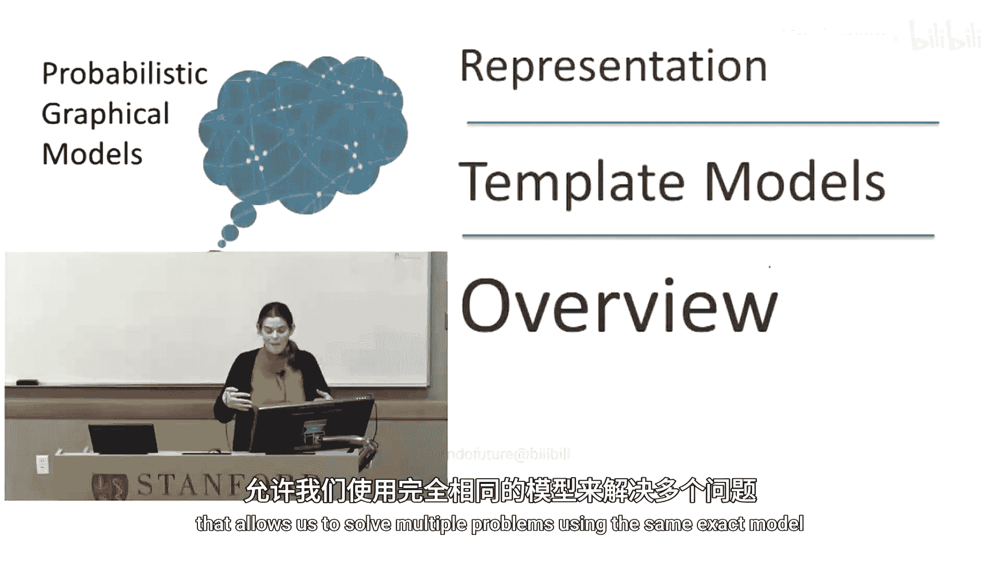
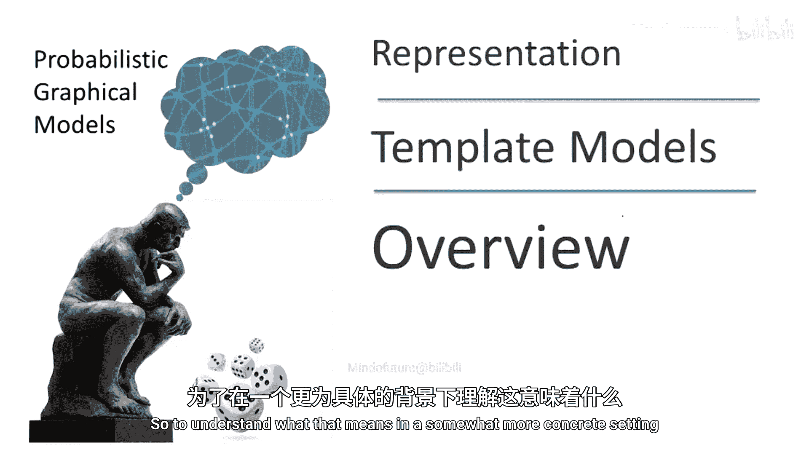
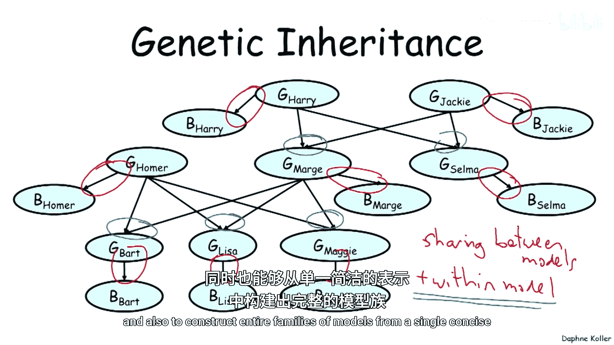
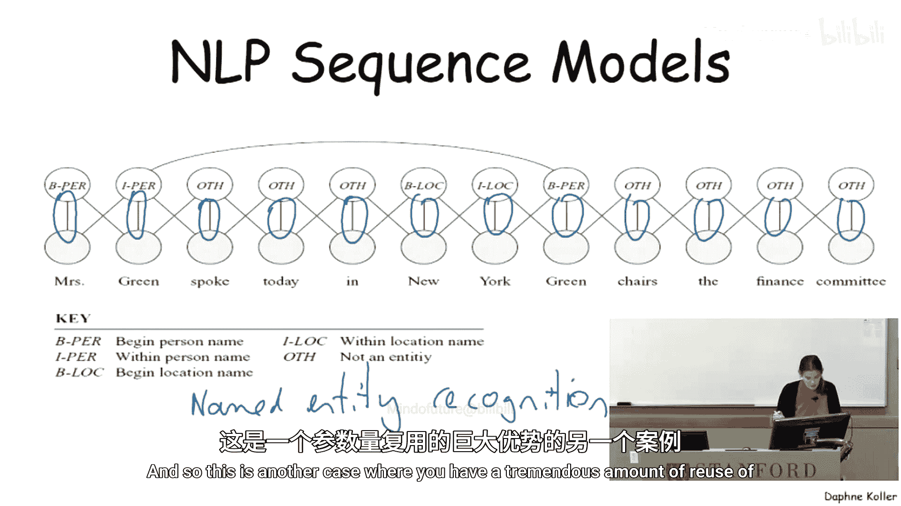
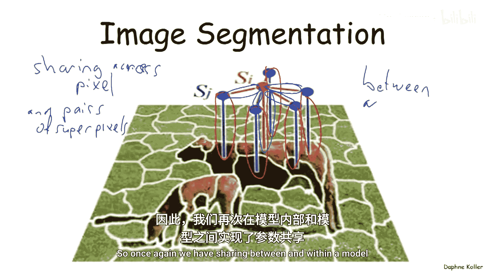
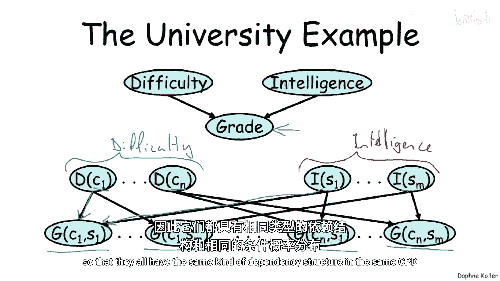
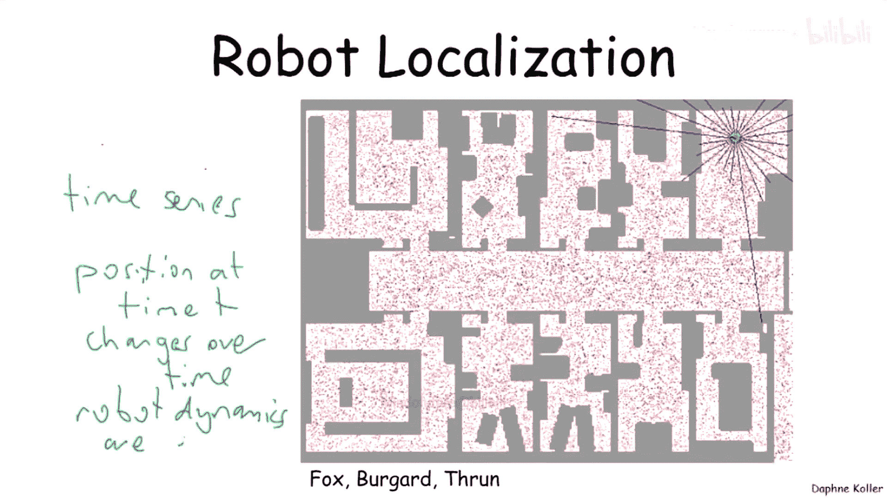
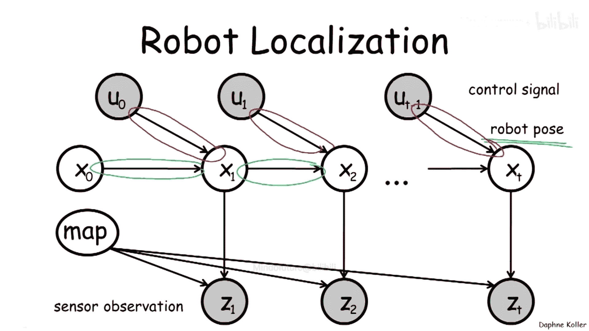
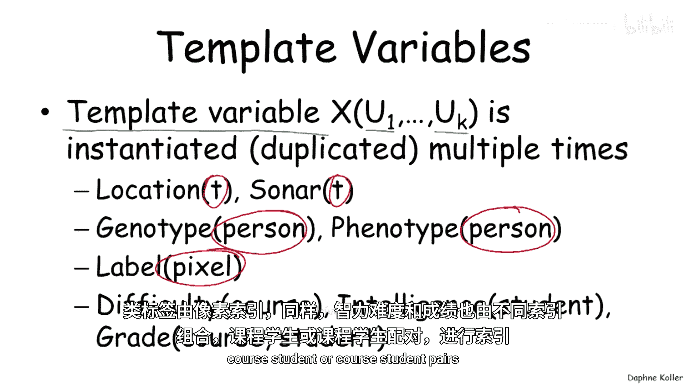
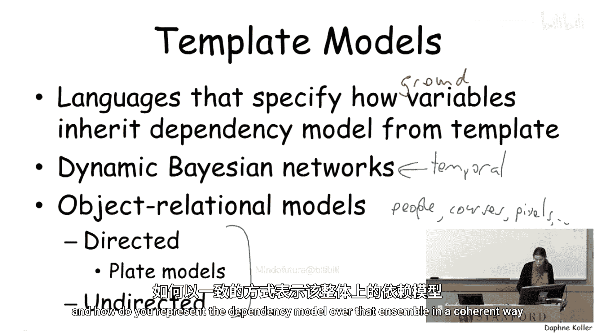

# 概率图模型：第20讲：模板模型概述

在本节课中，我们将要学习概率图模型的一个重要扩展——模板模型。这种模型旨在处理一类广泛的情况，即我们不仅希望为特定应用构建一个图模型，更希望获得一种通用表示法，以便使用同一个模型解决多个问题。

为了更具体地理解其含义，让我们回顾之前讨论过的遗传继承例子。这可以说是贝叶斯网络推理的最早例子，甚至早于贝叶斯网络本身的发明。在这个例子中，我们有一个家谱作为输入。

家谱是一个家族树，我们关注于推理某个特定性状。对于每个家谱和每个性状，我们都可以构建一个贝叶斯网络，这个网络可能看起来像这样。

然而，如果你的家谱稍有不同，例如突然多了三个表亲和一个曾祖父，或者你面对的是一个完全不同的家族，你仍然希望使用与构建第一个网络时相同的思路和组件，因为它们在结构上显然有很多共同之处。这就是模型之间的**共享**。

此外，在这个例子中，模型内部也存在相当明显的共享。例如，描述赛拉基因型如何影响其血型的条件概率分布（CPD），很可能与描述玛吉、丽莎、巴特、霍默等所有人的基因型影响其血型的过程是相同的。

因此，我们在依赖模型和参数上都存在大量的共享。同样地，你可能会发现，决定巴特基因型的遗传继承模型，同样适用于丽莎、玛吉、玛吉和赛拉等人。

所以，我们再次看到，不仅在模型之间，在模型内部也存在大量参数的共享。因此，我们希望有一种方法来构建具有这种大量共享结构的模型，这既能让我们用稀疏的参数化来构建非常大的模型，也能让我们从一个简洁的表示中构建出整个模型家族。

这并非唯一的应用场景。实际上，最常用的图模型类型就是那些具有共享结构和共享参数的模型。以下是另一个我们之前见过的例子，它用于自然语言处理，具体是一个用于命名实体识别的序列模型。

这是一个图模型常用的非常普遍的任务。这里同样有一个序列模型，并且同样存在共享的组件。例如，关联潜在变量（在这个例子中，是变量类型，比如是人名还是地名等）的参数集合，它们在序列中的位置是独立的。

这并不是因为这是一个绝对正确的模型（显然可以想象序列中的位置可能造成差异的情况），而是因为它通常是一个非常实用的简化假设。具体来说，它允许我们：A) 重用参数；B) 将同一个模型应用于不同长度的序列，而无需担心“我的15词模型”和“我的8词模型”有何不同。

因此，这是另一个存在大量参数重用的案例。

我们已经看到，图像分割的例子同样如此。显然，我们不想为图像中的每个超像素都建立一个单独的模型，因为图像中有成百上千个超像素。因此，我们需要在超像素或像素之间进行共享。

例如，将一个超像素的类别标签与其图像特征关联起来的模型通常是共享的，涉及相邻超像素的边缘势函数参数也是共享的。

同样地，我们也有模型之间的共享，因为我们会为图像A建立一个这样的模型，显然我们不想为每一张图像都构建一个单独的模型。所以，我们再次看到了模型之间和模型内部的共享。

现在，让我们更具体地看一个例子，因为它将在后续的一些分析中使用。让我们回到大学课程的示例，其中有一个学生选了一门课并获得了一个成绩，该成绩取决于课程的难度和学生的智力。

如果我们只关心单个学生，这没有问题。但现在，假设我们想考虑整个大学的情况。现在我们有了多个难度变量，这些是不同课程的难度变量，例如C1到CN代表我们大学中存在的不同课程。

反过来，在另一侧，我们有多个学生。这是一组由不同学生索引的智力变量，我们有学生1的智力，一直到学生M的智力。

请注意，这些是不同的随机变量，它们通常彼此取值不同，但它们都共享一个概率模型。这正是我们心中所想的那种共享。我们看到，学生在某门课程中的成绩（即下面的这些变量）取决于相关课程的难度和相关学生的智力。

例如，学生1在课程1中的成绩取决于课程1的难度和学生1的智力。我们再次看到，这些不同的成绩变量之间共享了结构和参数，因此它们都具有相同类型的依赖结构和相同的条件概率分布（CPD）。

另一个例子是机器人定位。这是另一个时间序列的例子。机器人随时间从一个位置移动到另一个位置，尽管时间T的位置会随时间变化，但我们期望机器人的动力学模型是固定的。

我们稍后会详细讨论这一点。这为我们提供了一个图模型，再次看起来有点像这样。这是此类图模型的一个例子，我们看到机器人的位姿（这里的X变量）取决于，例如，前一个位姿以及机器人采取的任何控制动作。我们再次假设这些参数在变量的每个实例化中都是共享的。

由此产生了一类用**模板变量**表示的模型。模板变量是我们在单个模型内以及跨模型之间反复复制的变量。这种复制是通过变量可以被视为一个带参数的函数来实现的，这些参数例如可以是时间点（如本例所示）。

这里我们有一个由时间点索引的位置变量，或者一个由时间点索引的声纳读数变量。在这个例子中，我们有一个由特定人索引的基因型变量和表型变量，一个由像素索引的类别标签，以及类似地，由不同索引组合（课程、学生或课程-学生对）索引的难度、智力和成绩变量。

**模板模型**是一种语言，它告诉我们模板变量如何成为其他模板变量的依赖模型，以及这些变量的具体实例（称为**基变量**，即那些由特定时间点或人实际索引的变量）如何继承依赖模型。

针对不同的应用，已经开发了一系列专门的此类语言。例如，**动态贝叶斯网络**旨在处理时间过程，其中存在随时间进行的复制。我们还有一系列用于**对象关系模型**的语言，包括有向模型和无向模型，其中涉及多个对象（如人、学生、马、像素等），以及如何以连贯的方式表示这个整体上的依赖模型。

---

本节课中我们一起学习了模板模型的概念。模板模型通过引入模板变量和参数共享机制，使我们能够高效地构建大型模型家族，并处理具有重复结构的问题，例如时间序列、多对象系统和遗传图谱等。核心思想是将通用的依赖模式和参数封装在模板中，然后通过索引（如时间、个体、位置）将其实例化到具体的场景中，从而实现了模型构建的模块化和可扩展性。