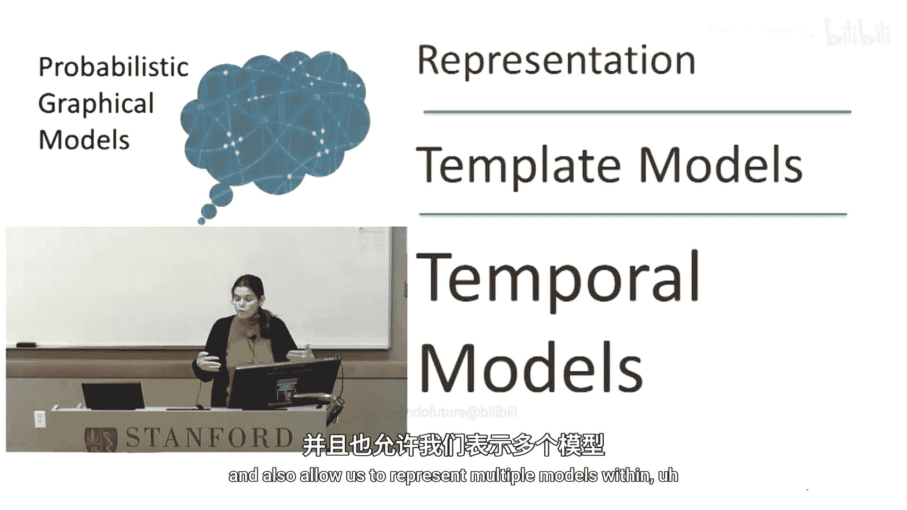
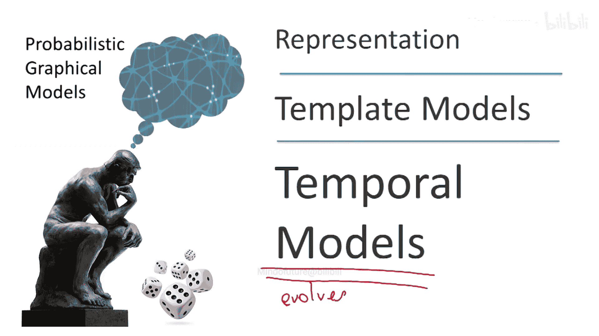
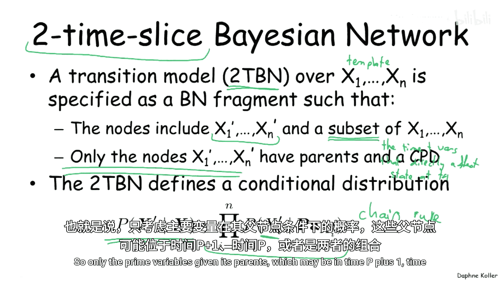
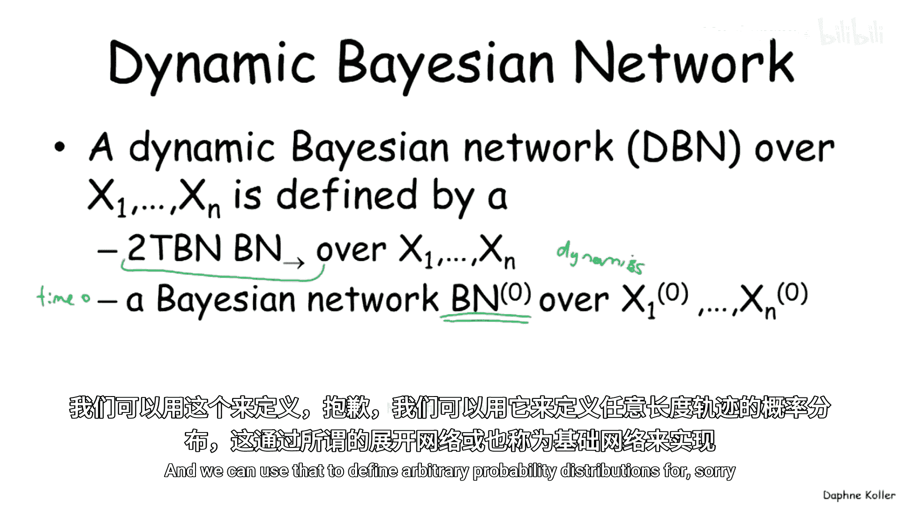
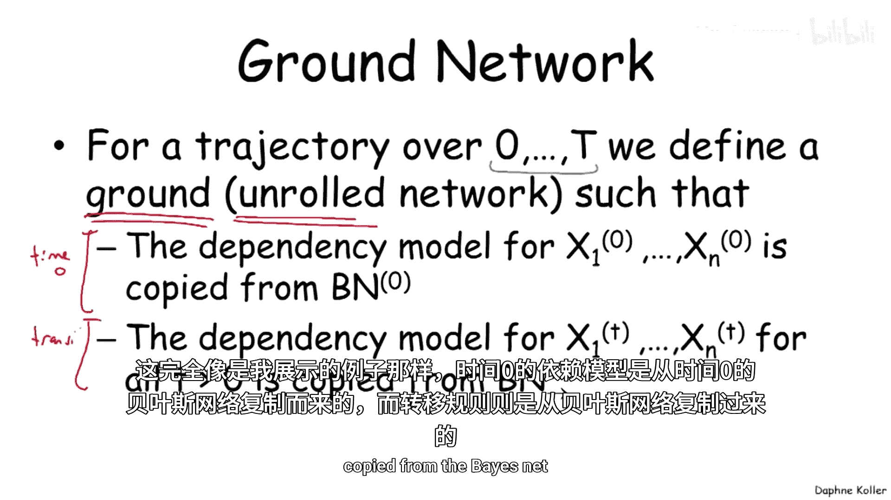
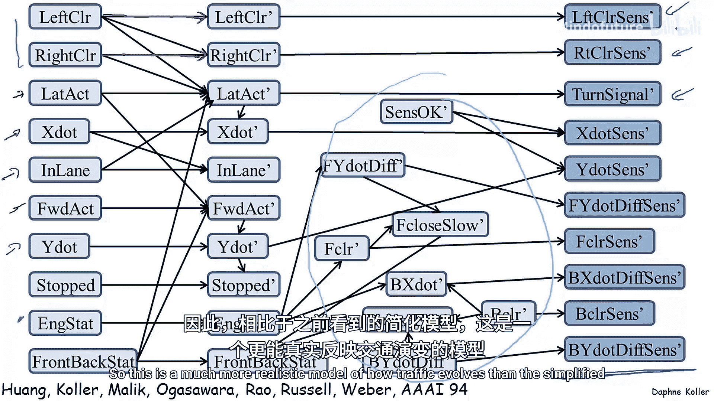
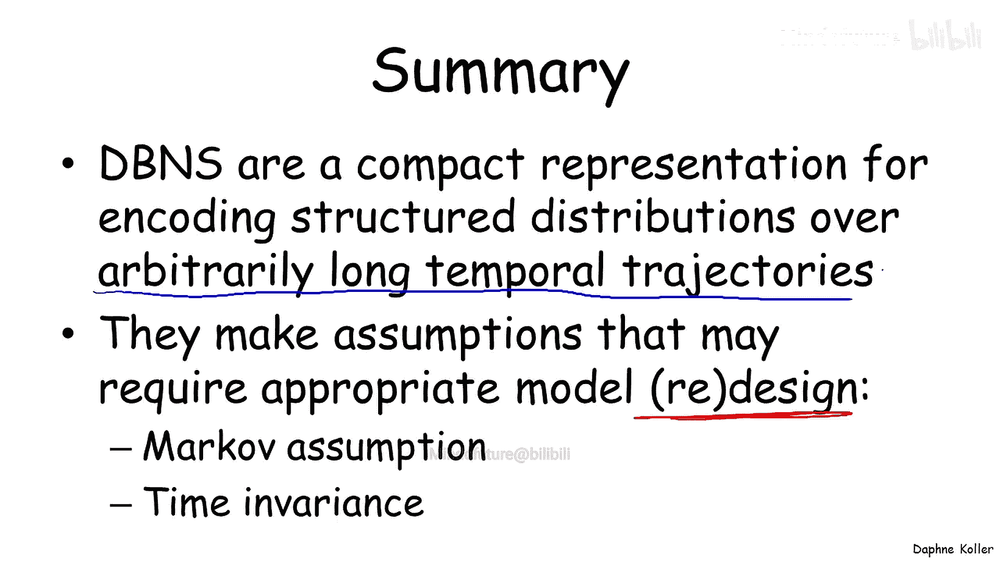

# 021：时序模型-DBNs 🕰️

在本节课中，我们将学习如何表示随时间演变的系统。我们将介绍一种强大的模型类别——动态贝叶斯网络，它允许我们使用一个简洁的模板来表示包含多个相同变量副本的复杂模型。

## 概述：从连续时间到离散化

上一节我们介绍了表示复杂模型的模板概念。本节中，我们来看看如何将其应用于随时间演变的系统。

首先，为了处理连续时间，我们通常需要将其离散化。我们选择一个特定的时间粒度 **Δ** 来测量时间。在许多情况下，这个粒度由传感器的测量频率决定（例如视频帧率或机器人采样率）。在其他情况下，我们可以自行选择。

现在，我们有一组模板随机变量。**X(t)** 表示在时间点 **tΔ** 时，特定变量 **X** 的值。这样，我们就得到了每个时间点的一个变量副本。

以下是本节将用到的一些符号：
*   **X(t)**：表示时间 **t** 的变量 **X**。
*   **X(t:t‘)**：表示从时间 **t** 到 **t‘**（包含两端）的所有随机变量集合。

我们的目标是：构建一个简洁的表示法，能够描述系统在任意时长轨迹上的概率分布。这面临两个挑战：需要表示无限多个不同时长的分布，且每个分布都涉及数量不定的随机变量。

## 核心假设：马尔可夫性与时间不变性

为了简化模型，我们需要引入两个核心假设。

### 马尔可夫假设

第一个假设是马尔可夫假设。这是一种条件独立性假设，与我们之前在通用概率图模型中使用的简化原理相同。

首先，我们使用概率链式法则将轨迹概率展开，这本身不是假设：
`P(X(0:T)) = P(X(0)) * ∏_{t=0}^{T-1} P(X(t+1) | X(0:t))`

马尔可夫假设声明：下一时刻的状态 **X(t+1)** 在给定当前状态 **X(t)** 的条件下，与过去的所有状态 **X(0:t-1)** 独立。这是一个“遗忘”假设——一旦知道当前状态，就不再关心过去。

将此假设代入链式法则，可将其简化为：
`P(X(0:T)) = P(X(0)) * ∏_{t=0}^{T-1} P(X(t+1) | X(t))`

这个假设合理吗？以机器人的位置 **L** 为例，**L(t+1)** 是否在给定 **L(t)** 的条件下独立于 **L(t-1)**？通常不合理，因为它完全忽略了速度（方向和大小）的影响。

解决方法：通过丰富状态描述来使马尔可夫假设成为更好的近似。例如，将速度 **V(t)** 甚至更多信息加入状态变量 **X(t)**。另一种策略是放宽假设，允许依赖更早的历史状态（即半马尔可夫模型），但本节不讨论。

### 时间不变性假设

第二个假设用于处理模型数量无限的问题。即使应用了马尔可夫假设，我们仍需要为每个时间点 **t** 编码 `P(X(t+1) | X(t))`。

时间不变性假设规定：存在一个通用的条件概率模型 **P(X‘ | X)**，它被复制用于每一个时间步的转移。也就是说，从时间 **t** 到 **t+1** 的动力学规律不依赖于具体的 **t**。

这同样是一个近似。例如，交通流动力学可能依赖于一天中的时间、是否周末等因素。我们可以通过引入额外的上下文变量（如“时间段”）到状态 **X(t)** 中来提高近似的准确性。

## 模型表示：2-时间片贝叶斯网络

现在，我们看看如何在概率图模型的框架内表示这个条件概率模型 **P(X‘ | X)**。

假设我们的状态由一组随机变量描述。以下是一个简单的交通系统示例，状态包含：天气 **W**、车辆位置 **L**、车辆速度 **V**、传感器故障状态 **F**。每个时间点我们还能得到一个传感器观测 **O**。

我们构建一个“网络片段”来表示 **P(X‘ | X)**，即下一时刻状态变量 **W‘, V‘, L‘, F‘, O‘** 在给定上一时刻状态 **W, V, L, F** 下的条件分布。注意，观测 **O** 不影响下一时刻状态，因此不作为右侧的父节点。

这个片段使用与标准贝叶斯网络相同的链式法则进行参数化：
`P(W‘, V‘, L‘, F‘, O‘ | W, V, L, F) = P(W‘|W) * P(V‘|W,V) * P(L‘|L,V) * P(F‘|W,F) * P(O‘|L‘,F‘)`

关于此图，有几个要点需要注意：

*   **依赖类型**：图中既有时间片间的依赖（如 **W → W‘**），也有时间片内的依赖（如 **L‘ → O‘**）。后者通常用于表示瞬时发生的依赖关系。
*   **持续边**：特别地，从一个变量到其下一时刻自身的边（如 **L → L‘**）称为“持续边”，表示变量保持其状态的倾向。
*   **参数化**：此图只定义了下一时间片变量（带‘的变量）的条件概率分布，而没有定义当前时间片变量（不带‘的变量）的分布。它仅表示转移动力学。

为了表示整个系统的概率分布，我们还需要一个描述初始状态 **X(0)** 的标准贝叶斯网络。

## 动态贝叶斯网络的定义与展开

结合以上两部分，我们给出正式定义。

一个**2-时间片贝叶斯网络**（2-TBN）定义在模板变量集 **{X1, ..., Xn}** 上。它包含：
1.  下一时间片的节点 **X1‘, ..., Xn‘**。
2.  当前时间片的部分节点 **{X1, ..., Xn}** 的一个子集，作为父节点。
3.  仅为每个 **Xi‘** 节点定义其父节点（可来自当前片或下一片）及其条件概率分布。
2-TBN 通过链式法则定义条件分布：`P(X‘ | X) = ∏_{i=1}^{n} P(Xi‘ | Pa(Xi‘))`。

一个**动态贝叶斯网络**（DBN）由一个2-TBN（定义转移模型）和一个用于初始时间片 **X(0)** 的贝叶斯网络（定义初始状态分布）共同定义。

通过“展开”或“接地”，DBN可以表示任意长度轨迹的概率分布：
1.  复制初始贝叶斯网络作为时间片0。
2.  对于每个后续时间步 **t**，复制2-TBN片段，将 **X** 实例化为 **X(t)**，将 **X‘** 实例化为 **X(t+1)**。
3.  将所有片段的CPD按照链式法则相乘，得到联合分布：`P(X(0:T)) = P_{B0}(X(0)) * ∏_{t=0}^{T-1} P_{2TBN}(X(t+1) | X(t))`。

## 实例分析：车辆跟踪DBN

在结束前，我们看一个更真实的DBN示例，用于交通场景中的车辆跟踪。

此模型包含更多变量：
*   **状态变量**：车辆绝对位置与速度（Xdot, Ydot）、语义位置（如是否在车道内）、上下文信息（左右是否空旷）、引擎状态、驾驶员操作（纵向和横向动作）。
*   **依赖关系**：包含大量的持续边，表示各种状态的持续性；也包含许多中间变量，帮助以更紧凑的方式表示概率分布。
*   **观测变量**：包含大量传感器观测，如转向灯状态、左右车道感知情况等。

这个模型比之前的简单示例更真实地刻画了交通流的演化过程。

## 总结 🎯

本节课中，我们一起学习了动态贝叶斯网络。DBN为我们提供了一种描述随时间演变的结构化分布的语言。通过做出**马尔可夫演化**和**时间不变性**这两大假设，我们可以使用一个紧凑的网络来编码任意长时间序列上的转移概率。

然而，这些假设并非天然成立。为了使其更好地逼近真实分布，我们可能需要重新设计模型，例如通过**添加变量**来丰富状态描述。DBN是处理时序数据的强大工具，其有效性取决于模型设计对这些核心假设的合理近似程度。