# 概率图模型：P22：时序模型-HMMs 🕰️

在本节课中，我们将要学习一种简单但极其有用的概率时序模型——隐马尔可夫模型。我们将了解其基本结构、核心组成部分，并探讨它在机器人定位、语音识别等领域的实际应用。

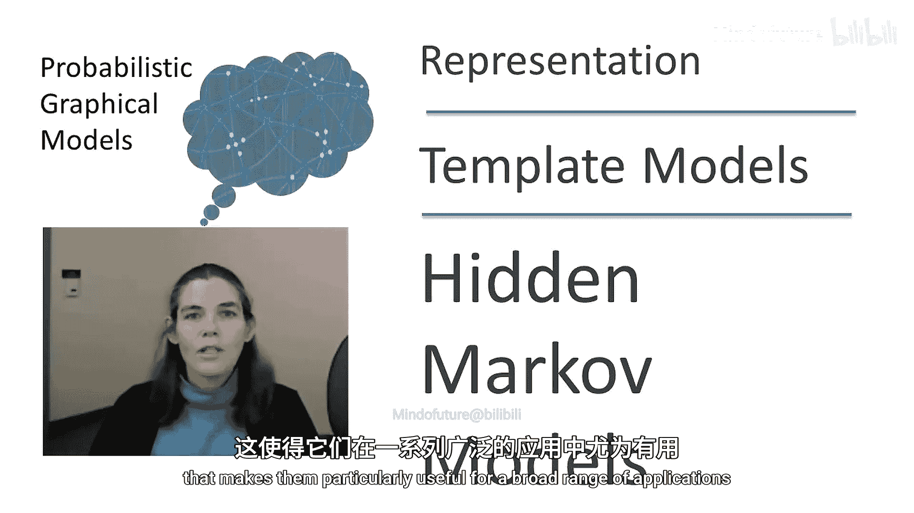

---

## 概述 📋

隐马尔可夫模型是一类强大的概率时序模型。虽然它可以被视为动态贝叶斯网络的一个子类，但其独特的内部结构使其在众多应用场景中特别有用。

---

## 基本结构 🧱

隐马尔可夫模型最简单的形式可以看作是一个包含单个状态变量 **S** 和单个观测变量 **O** 的概率模型。

该模型主要由两个概率部分组成：

*   **转移模型**：描述了状态如何随时间从一个状态转移到下一个状态。
*   **观测模型**：描述了在给定状态下，观测到不同观测值的可能性。

这个简单的2-TBN（两时间片贝叶斯网络）可以展开，形成一个具有重复结构的展开网络。该网络从时间0的状态开始，转移到时间1的状态，依此类推，并且在每个状态都会产生相应的观测。

---

## 内部结构 🔍

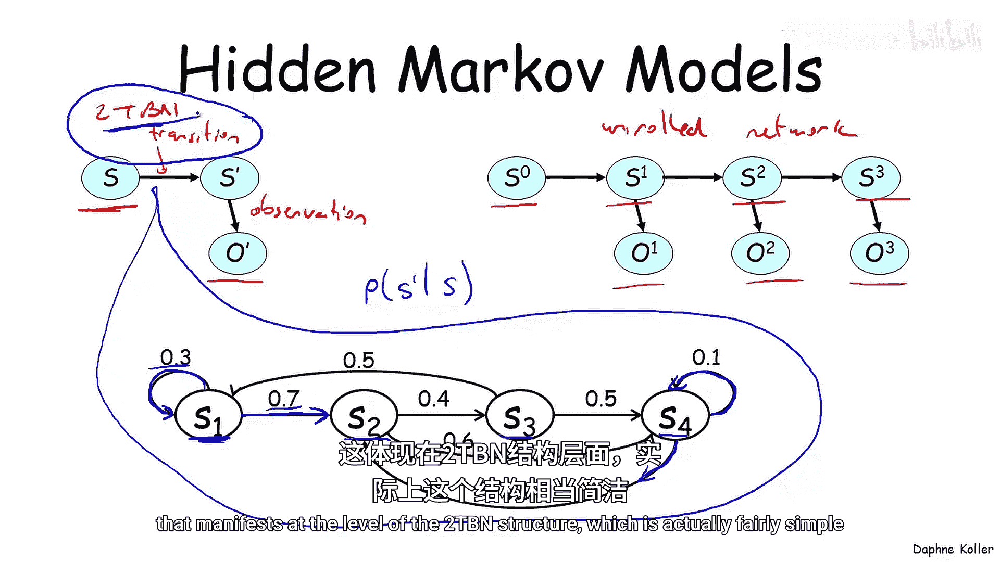

隐马尔可夫模型的有趣之处在于，它们通常具有丰富的内部结构。这种结构主要体现在转移模型中，有时也体现在观测模型中。

以下是一个结构化转移模型的示例。整个模型实际上是在窥视条件概率分布 **P(S_{t+1} | S_t)**，即给定当前状态下，下一个状态的概率。

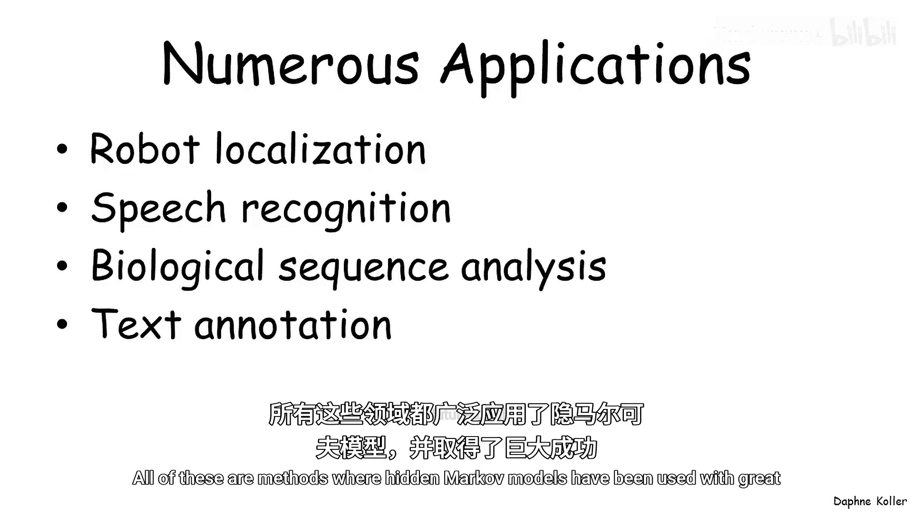

这里的每个节点并非随机变量，而是状态变量 **S** 可能取的一个特定赋值。图中展示的是转移矩阵的结构。例如，从状态 **S1** 出发，模型有0.7的概率转移到 **S2**，有0.3的概率保持在 **S1**。这两个输出概率之和必须为1，因为它是在给定当前时间点处于 **S1** 的条件下，对下一个状态的概率分布。其他状态也有类似的结构。

因此，这里的结构实际上是转移模型中的**稀疏性**，而不是在2-TBN结构层面上的体现（2-TBN结构本身相当简单）。

---

## 应用领域 🌐

事实证明，这种模型结构在广泛的应用中都非常有用。

以下是隐马尔可夫模型取得巨大成功的几个领域：

*   **机器人定位**：确定机器人在环境中的位置和朝向。
*   **语音识别**：HMM是所有当前主流语音识别系统的核心方法。
*   **生物序列分析**：例如，标注DNA序列中功能重要的区域。
*   **文本标注**：例如，标注句子中单词的词性角色。

---

## 应用实例详解 🔬

上一节我们介绍了HMM的通用应用领域，本节中我们来看看它在具体问题中是如何建模的。

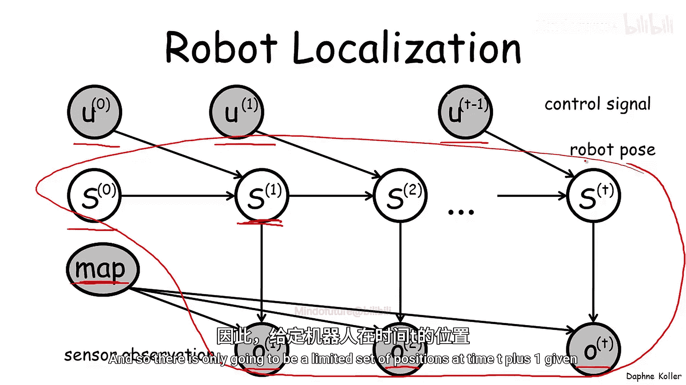

### 机器人定位 🤖

机器人定位的HMM模型可能初看起来不完全像标准的HMM，因为它包含一些额外的变量。

以下是各个变量的含义：

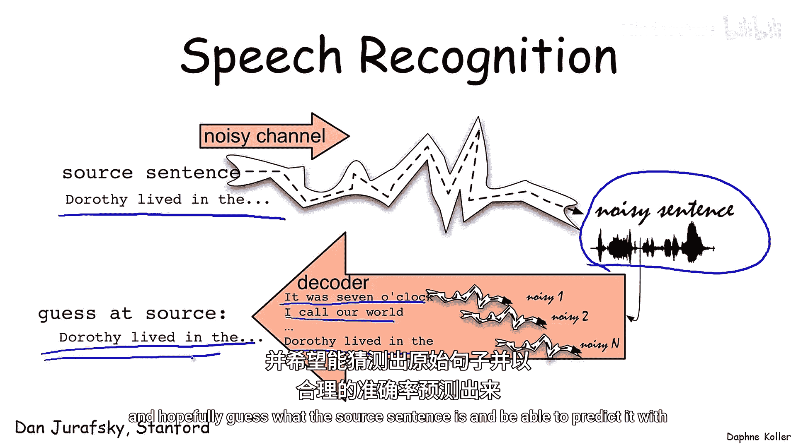

*   **状态变量 S**：表示机器人的位姿，即机器人在地图中每个时间点的位置和朝向。
*   **外部控制信号 U**：指示机器人移动的指令（如左转、右转）。由于这些变量是观测到且外部施加的，它们并非真正的随机变量，可以视为系统的输入。
*   **观测变量 O**：表示机器人在每个时间点观测到的信息，这取决于其位置和地图本身。

在许多应用中，地图是已知的（图中已置灰），因此我们可以将推理的基本结构视为仅由状态变量 **S** 和观测变量 **O** 组成的集合。这使得该模型成为标准HMM的一个轻微扩展。这里，转移模型同样具有稀疏性，因为机器人在单个时间步内只能从一个位置移动到有限的几个相邻位置。

### 语音识别 🗣️

语音识别是HMM最典型的成功案例。其核心问题是：给定一段代表语音的、嘈杂的声学信号，通过解码器评估不同可能句子，以合理的准确率预测出原始句子。

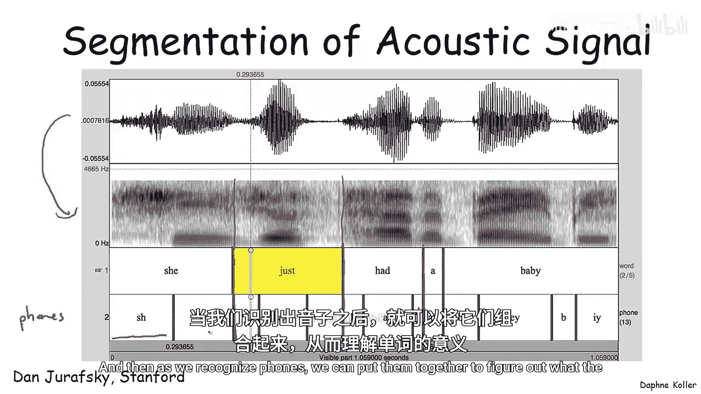

#### 工作原理

一段声学信号在时域上表现为不同频率的强度。通过傅里叶变换可以将其转换为频谱。

我们的目标是将这个连续信号分割成对应于单词的片段，并识别每个片段对应的单词。这是一个双重问题，因为在连续语音中，我们需要同时识别单词边界和单词本身。

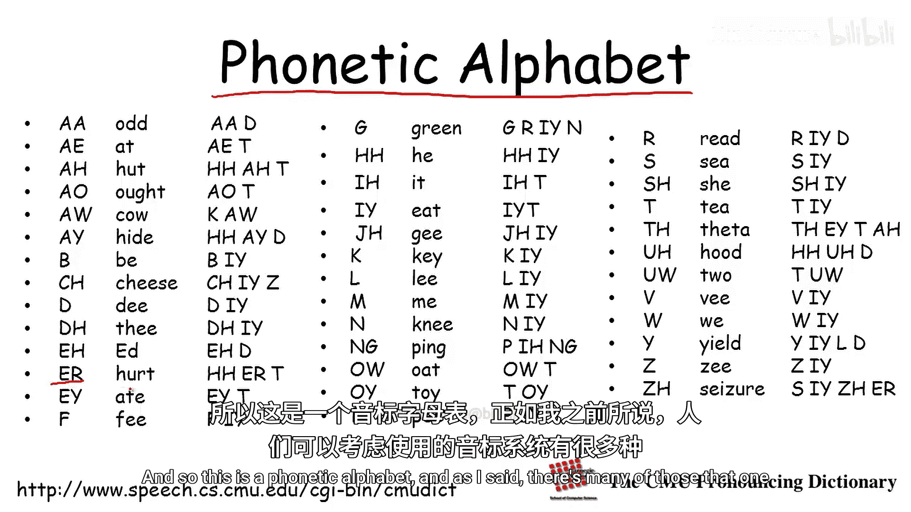

解决方法不是将单词作为基本单元，而是使用更小的单元——**音素**。音素是构成单词的基本发音单位。通过识别音素，再将它们组合起来以确定单词。

#### 音素与HMM结构

音素表定义了单词如何分解为音素。同一个字母可能有不同发音（对应不同音素），反之，不同字母也可能发相同的音。

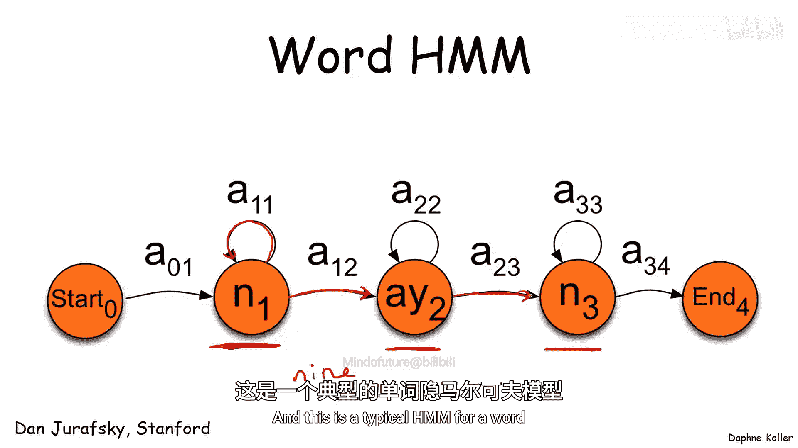

一旦有了音素表，我们就可以为单词构建HMM。例如，单词“nine”可以分解为音素序列。其HMM结构表示在时间进程中，你处于哪个音素中。自转移循环允许在一个音素内停留多个时间单位，然后最终转移到下一个音素。

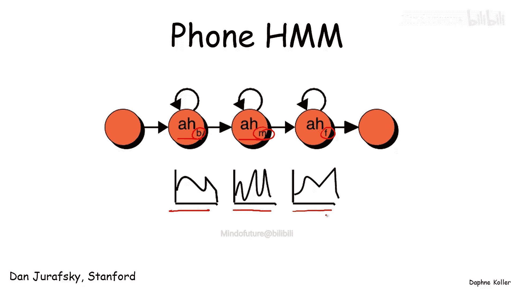

#### 音素内部的HMM

一个音素本身也持续一段时间。因此，在一个给定的音素（例如音素“ay”）内部，也存在一个转移模型。通常，一个音素HMM包含三个状态：开始(B)、中间(M)、结束(E)。每个状态通常对应于在该音素阶段观测到的声学信号的不同概率分布。

#### 完整的语音识别HMM

将所有这些部分组合起来，就构成了一个完整的语音识别HMM（此处以孤立词识别为例）。

模型从一个起始状态开始。从起始状态的转移模型（即语言模型）告诉我们当前状态下进入某个单词的可能性。假设模型转移到了单词“one”，我们会看到模型随时间从音素“w”转移到“ah”，最后到“n”。单词结束后，过程循环回到起始状态，这使我们能够进行连续语音识别。

这是一个**生成式模型**，它描述了语音如何由单词、单词内的音素以及音素内的小片段构成。当你输入观测到的声学信号证据，并在此模型上运行概率推理时，你得到的就是最有可能产生该观测语音信号的单词序列。

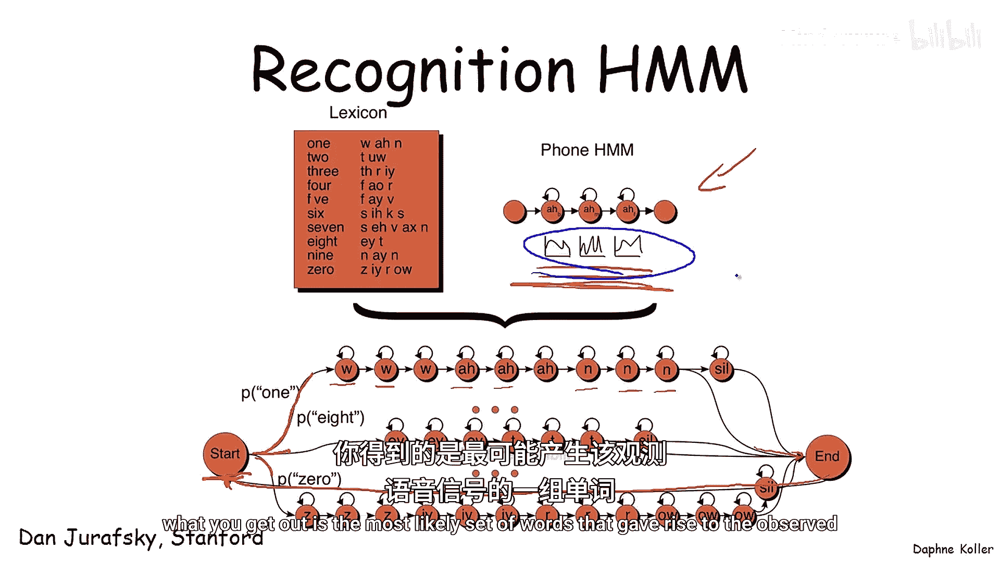

---

## 总结 🎯

本节课中我们一起学习了隐马尔可夫模型。

总结来说，HMM在某种简化视角下可以被视为动态贝叶斯网络框架的一个子类。虽然在随机变量层面上观察时，它们似乎结构简单，但其丰富的结构体现在条件概率分布的**稀疏性**上，也体现在**结构的重复使用**上（如同一个音素模型可以在多个单词中复用）。

我们看到，HMM被广泛用于各种序列建模任务，它可能是目前最常用的概率图模型形式之一。

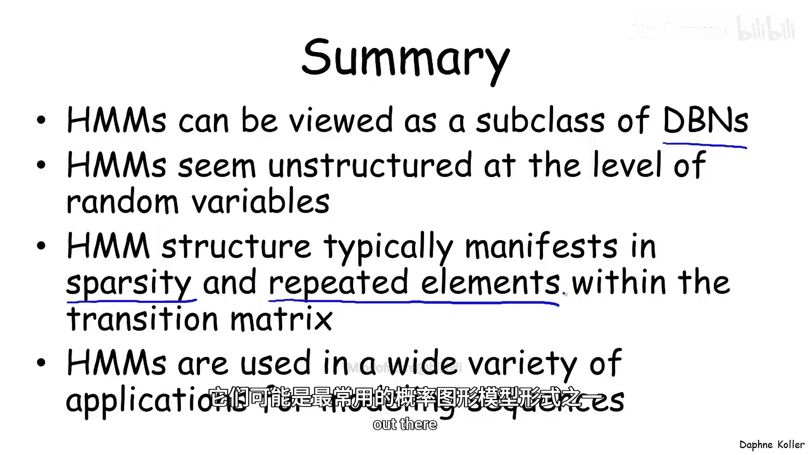

