# 023：板模型 🧩

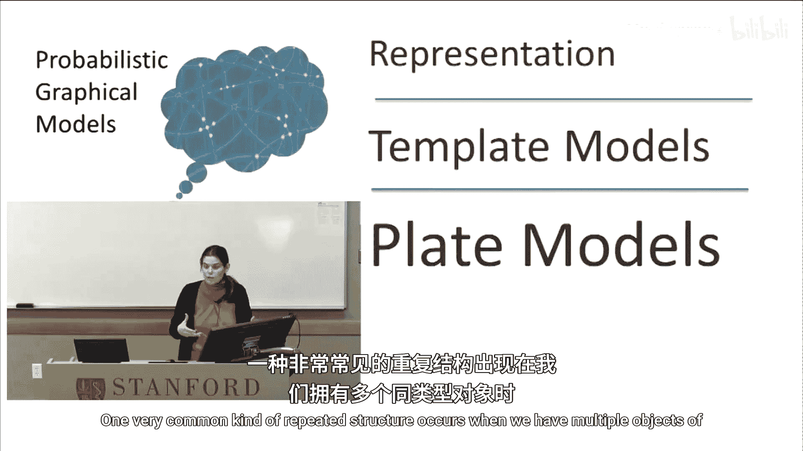

在本节课中，我们将要学习一种用于表示重复结构的强大工具——板模型。板模型允许我们以一种简洁的方式，为同一类型的多个对象定义共享的概率模型，从而构建出复杂但结构清晰的图模型。

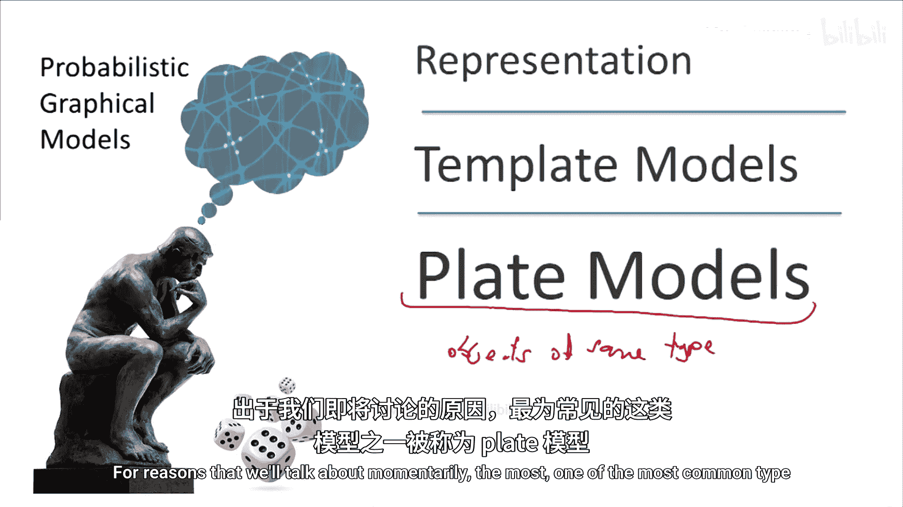

---

## 重复结构的建模

上一节我们介绍了图模型的基本表示法，本节中我们来看看如何处理现实世界中常见的重复结构。当我们拥有多个相同类型的对象时，就会出现一种非常常见的重复结构。我们希望对所有这些不同的对象副本（更准确地说，是同一类型的所有对象）使用相似甚至完全相同的概率模型。

出于我们稍后会讨论的原因，这类模型中最常见的一种被称为**板模型**。

让我们从建模重复开始。在这个例子中，想象我们反复抛掷同一枚硬币。我们有一个结果变量，我们想要建模的是多次抛掷的重复。因此，我们将用一个**小方框**把这个结果变量框起来。这个被称为**板**的方框，是一种表示结果变量被**索引**的方式。

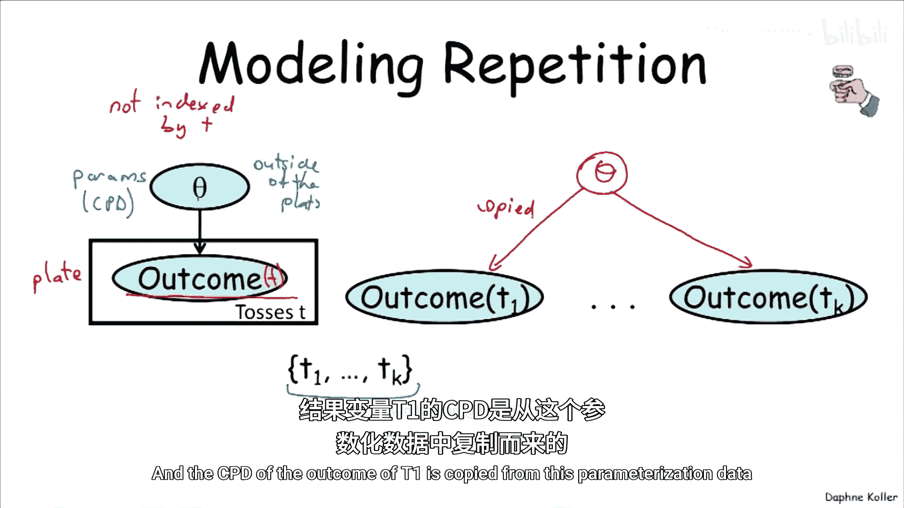

我们通常不显式地表示索引，但这里用不同的抛掷次数 `t` 来索引。之所以称之为“板”，是因为直觉上这就像一叠相同的盘子，这也是板模型名称的由来。

这个模型表示的是：如果我们有一组抛掷 `T1` 到 `TK`，那么我们就有一组随机变量：`Outcome(T1)` 到 `Outcome(TK)`。我们只是将结果变量复制了多份。

现在，这具体对应什么呢？我将做一件在本课程后面讨论学习时会经常做的事情：我将把条件概率分布的参数显式地放入模型中。这个随机变量 `Theta` 就是具体的CPD参数化，我把它显式地放进去是为了展示不同变量如何依赖于它。

如果我们把参数放在这里，可以看到 `Theta` 在板**之外**。这意味着它不像 `t` 那样被索引，也就是说它对所有 `t` 值都是相同的。这意味着我们有一个参数 `Theta`，所有这些结果都依赖于完全相同的参数化，`Outcome(T1)` 的CPD是从这个参数化 `Theta` 复制而来的。

---

## 更复杂的例子：学生与课程

让我们看一个稍微复杂一点的例子。回到我们有多名学生的大学，现在我们有一个双变量模型，包含智力 `I` 和成绩 `G`。我们用不同的学生 `S` 来索引，这再次表明我们复制了这个模板模型。在这个例子中，我只做了两个副本，一个给学生1，另一个给学生2。

同样，如果我们想编码对参数的依赖，我们可能有代表 `I` 的CPD的参数 `theta_I`，以及代表 `G` 的CPD的参数 `theta_G`。`theta_I` 会影响两个 `I` 变量，`theta_G` 会影响两个 `G` 变量，并且它们都在板之外。在许多模型中，我们有时会显式地将这些参数包含在模型内，但通常当一个参数在所有板之外时，我们不会显式地表示它，就像我在标注之前的原始图表中所做的那样，直接省略它。

仅仅重复完全相同的模型多次并不特别有趣，所以现在让我们讨论如何让不同的板重叠，或者换句话说，思考模型中不同类型的对象如何相互关联。

在这种情况下，我们的论域中有两种对象：**课程**和**学生**。课程我们用小写 `c` 表示，学生用小写 `s` 表示。现在让我们思考如何复制对应于课程属性的变量和对应于学生属性的变量。

难度变量 `D` 属于课程板，因为它是课程的属性，所以它是 `Difficulty(c)`。现在考虑如何放入学生。一种可能性是，我们将**学生板嵌套在课程板内部**。

这意味着这里的每个变量（`I` 和 `G`）都被 `s` 和 `c` 共同索引，因为当一个变量嵌套在一个板中时，意味着它具有它所在的所有板的索引。所以如果智力变量 `I` 既在学生板 `S` 中又在课程板 `C` 中，它将被两者索引。

让我们构建这个模型，看看当我们展开课程和学生时是什么样子。它会看起来像这样：假设我们有一个两门课程和两名学生的模型，我们有课程1的难度和课程2的难度。现在我们有一个嵌套板中的变量 `I` 和 `G`，我们可以看到它们都被学生和课程参数化了。

让我们思考这个模型的含义。含义是：智力现在是一个**学生**在**课程**中的属性，并且学生在特定课程中的智力会影响他在该课程中的成绩。你可以通过这里的依赖模型看到这一点。

但这意味着什么？这意味着对于每个学生在每门课程中，都有一个**课程特定的智力**。这可能不是我们想要的。如果你正在学习完全不同的课程，一门是艺术课，一门是数学课，你可能会说有一种艺术智力（代表艺术技能）和一种数学智力。那么你可能真的想要两种不同的智力，而不假设它们必然是同一个东西。

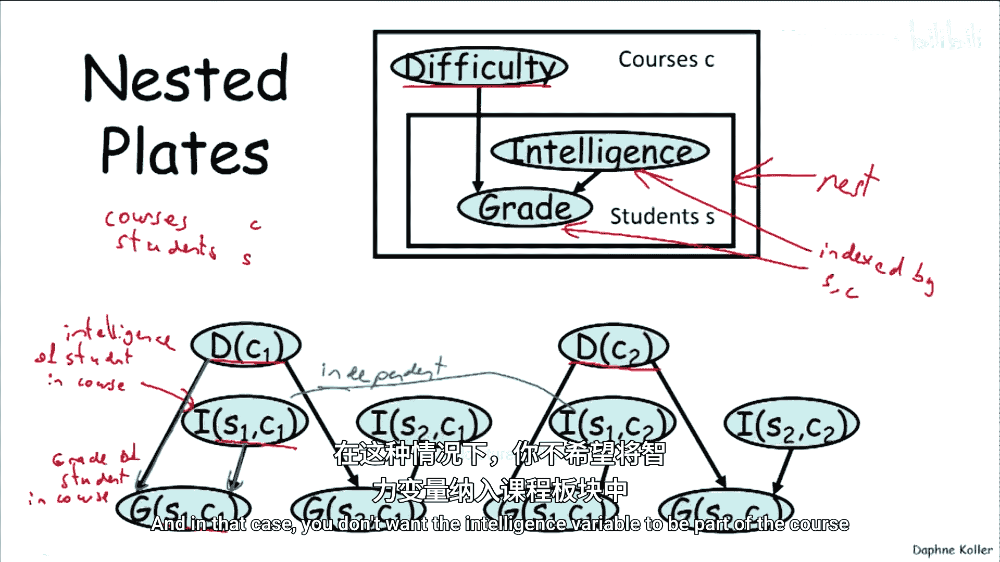

当然，这会使模型复杂化。如果你有一堆在某些方面相似、需要相似技能组合的课程，你可能不希望有一堆独立的随机变量。在这种情况下，你**不**希望智力变量成为课程板的一部分。

---

## 重叠板模型

这给了我们另一种表示方法，即所谓的**重叠板模型**。在这种情况下，我们有课程板（这里的这个板）和学生板（这里的这个板）。假设是：难度 `D` 只是课程的属性，智力 `I` 只是学生的属性，而只有成绩 `G` 是依赖于两者的属性。

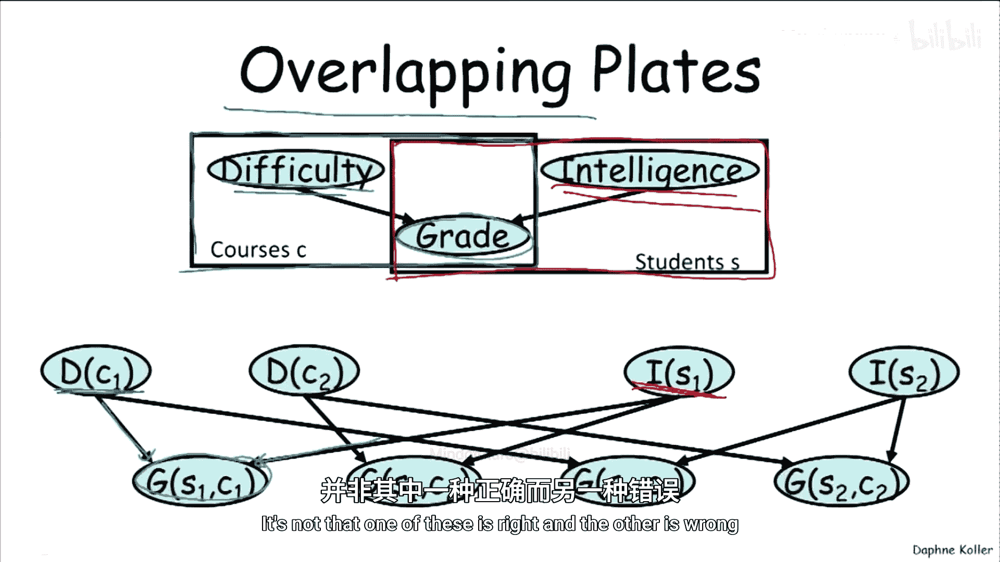

当我们展开这个模型时，我们最终得到这样一个模型：在这个例子中，我们只有一个课程的难度和一个学生的智力。让我们用绿色表示交集部分：学生在课程中的成绩依赖于课程的难度和学生的智力。

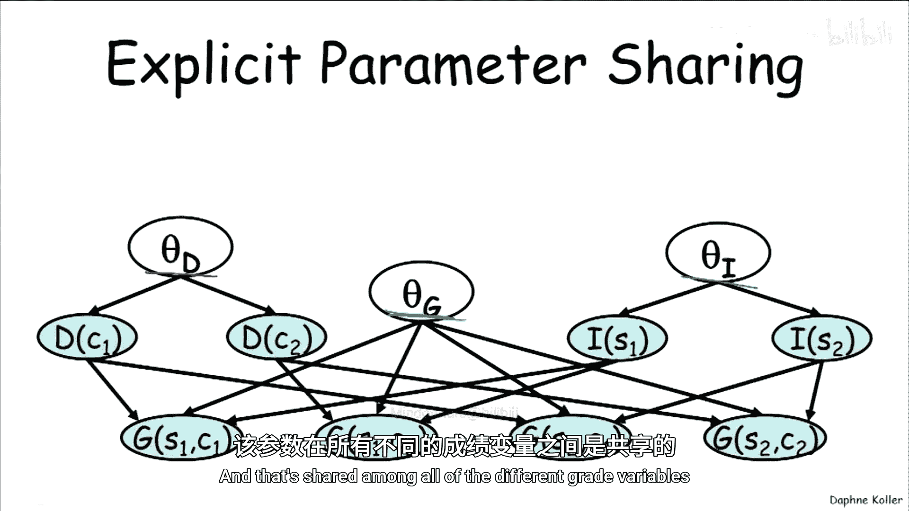

因此，现在我们每个学生只有一个智力。这是一种替代的建模方式，并不是说一个对另一个错，它们只是不同。

再次，为了演示参数共享，我想再次强调，参数共享的概念也适用于这样的模型。这里我们有一个参数 `theta_D`，一个参数 `theta_I`，以及一个影响成绩CPD的参数 `theta_G`，这是一个共享模型，影响所有不同的成绩变量。

---

## 集体推理的力量

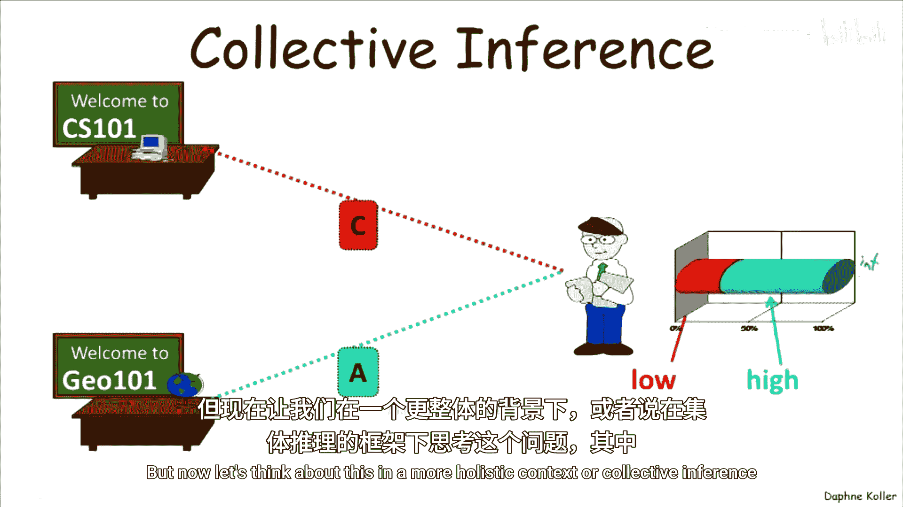

那么，为什么这类板模型有用呢？让我们看一个例子来说服自己，通过构建这些涉及多个实体的丰富结构模型，你实际上可以得到更有趣的结论。

看这里的这个例子：想象我们大学来了一个第一学期的新生，我们想弄清楚我们能了解他什么。假设在这所特定的大学里，先验地，我们相信大多数学生智力高，所以智力分布是80%高智力。

这个我们将称为乔治的学生，选了两门课：他选了地质学101并得了A。所以他智力高的概率上升了。他选了CS101但表现不佳，得了C。概率下降了，但没有降到非常低的数字，这是因为我们从之前见过的成绩CPD中知道，学生在一门课上表现不佳可能有多种原因，例如这门课非常难，所以可能每个人都考得不好，因此你不应该太当真。

如果乔治只选了这两门课，我们的推断就到此为止了。但现在让我们在一个更全面的背景或**集体推理**中思考这个问题，我们将考虑许多学生选修许多课程。想象一下，我们拥有所有这些学生的成绩。这里绿色代表A，黄色代表B，红色代表C。你在这里看到的是一堆已观测成绩变量的简写。

现在，让我们思考从这个网络中我们可以得出什么结论。即使粗略地看，我们也能看到一堆人选修了CS101，除了我们的朋友乔治，他们都得了A。此外，即使你看这里的这个学生，他在其他所有课上都得C，他仍然在CS101上得了A。

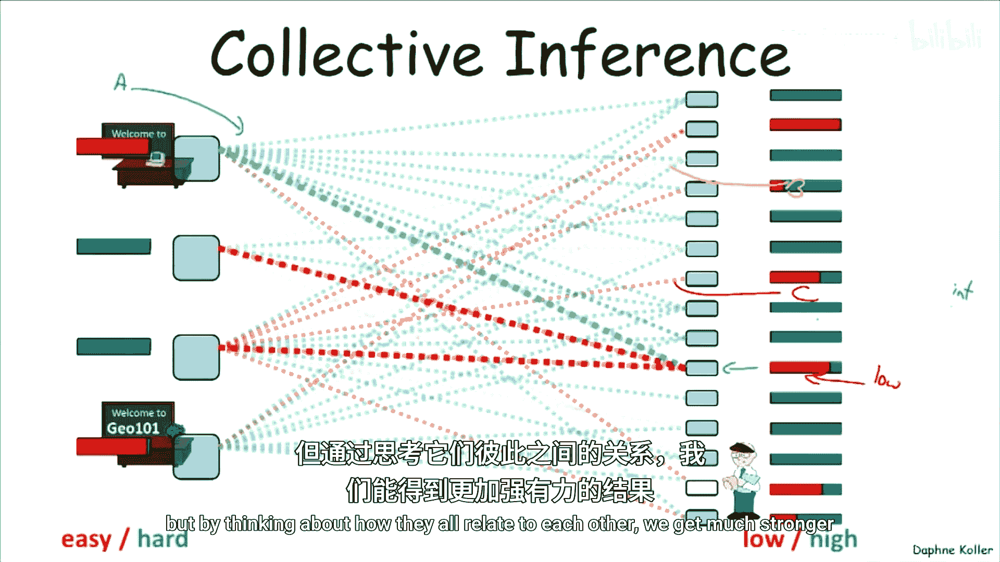

因此，如果我们对这个整体模型进行概率推断，我们将得到：我们相当确定CS101是一门简单的课。如果我们对此相当确定，那么在这种情况下，我们也相当确定乔治的智力较低。

因此，在这种设置下，我们可以得出比孤立地推理个体更明智的结论。这是一个简单的例子，但稍后我们会看到集体推理的例子，其中有多个相互关联的实体，可能是图像中相关的像素，也可能是网站中相互链接的网页。如果我们试图孤立地标记每个实体，我们得不到非常明智的结论，但通过思考它们如何相互关联，我们得到了更强大、更明智的结果。

---

## 板依赖模型的形式化总结

现在，让我们总结一下板依赖模型。板依赖模型具有以下特征：

它为一组对象类型（例如学生、课程等）索引的模板变量定义了一个依赖模型。对于每个模板变量，我们有一组模板父节点。

其内在要求是，每个父节点的索引集必须是子节点索引集的**子集**。这意味着什么？例如，对于模板变量 `G(s, c)`，`G` 对应变量，`s` 和 `c` 对应这里的索引 `U1` 和 `U2`。我们有两个模板父节点：`I(s)` 和 `D(c)`。规定 `UI`（父节点索引集）是子节点索引集 `{U1, ..., UK}` 的子集，这告诉我们，例如，我们不能在父节点中出现子节点中没有的索引。

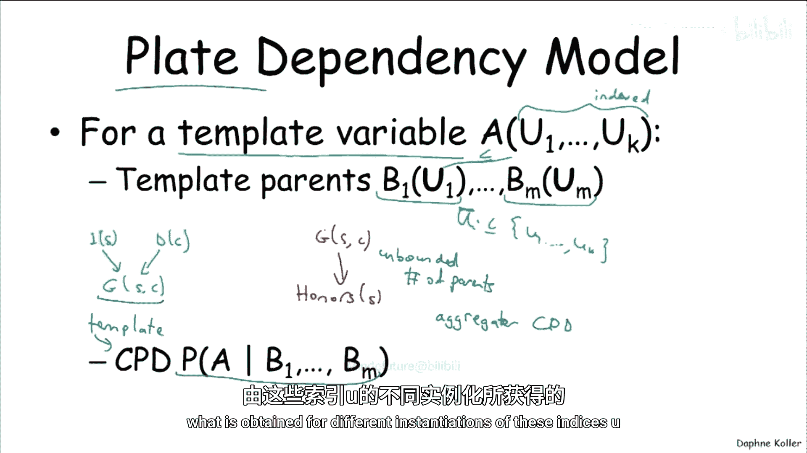

所以，举例来说，在这个模型中，我们不能有（由于我稍后会描述的原因）诸如“学生 `s` 的荣誉 `H` 依赖于该学生在多门课程中的成绩”这样的依赖。原因是，这不是一个标准的CPD。荣誉变量依赖于**潜在无限多个**父节点（即学生参与的所有课程的成绩）。这并不是说不能定义这样的依赖模型，事实上，有比板模型更丰富的语言，人们定义了**聚合器CPD**的概念。但这不属于传统上称为板模型的标准范式。

通过防止这种情况，我们现在有效地拥有了一个传统模型，其中随机变量具有有限且固定的父节点集。因此，我们可以定义一个**模板CPD**，然后对于该模板变量的任何副本（通过索引 `U` 的不同实例化获得），我们都可以在模型中重用这个模板CPD。

具体来说，如果我们有这个模型，有这个变量 `A(U1, ..., UK)`，那么对于索引的任何具体实例化 `u1, ..., uk`，我们将拥有以下模型：变量 `A(u1, ..., uk)` 依赖于其父节点的具体实例化。这听起来可能有点令人困惑，但具体想想例子就明白了：这恰恰说明了一个特定学生在特定课程中的成绩依赖于该课程的难度和该学生的智力。它只是用一种通用的方式表达了这一点。

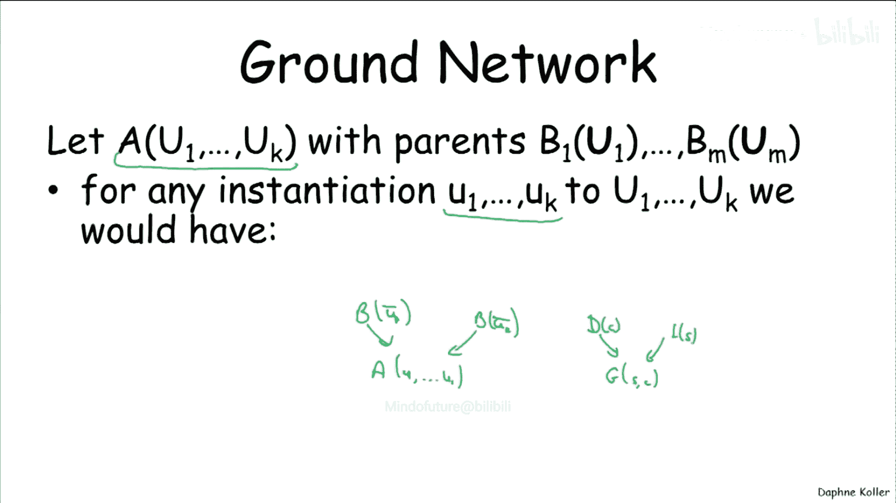

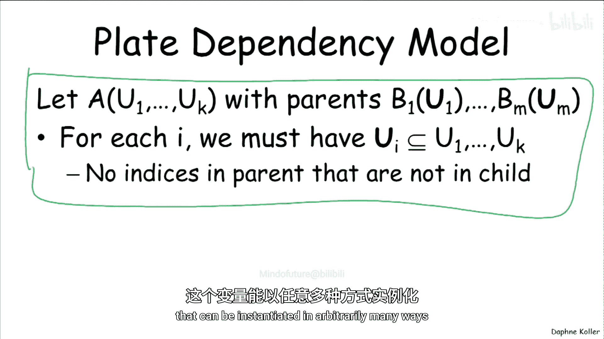

这只是我早先陈述的形式化版本，它要求父节点不能有未在子节点中显式实例化的变量，这样我们就不会有一个可以任意多种方式实例化的自由浮动变量。

---

## 课程总结 🎯

本节课中我们一起学习了板模型。总结如下：

*   **板模型**是一种语言，允许我们为**无限集合的贝叶斯网络**定义一个模板。之所以是无限的，是因为你可以有3个学生、1个学生、100个学生、一百万个学生，即任意数量的学生。我们可以用这种语言编码无限多的贝叶斯网络，每个网络都由我们论域中对象（例如学生和课程）的不同组合所诱导产生。
*   参数和结构在**单个贝叶斯网络内部**以及**不同的贝叶斯网络之间**都被重用。例如，在我们的大学例子中，我们重用相同的参数；如果我们有另一所拥有不同学生和课程组合的大学，我们仍然会使用相同的参数。
*   这些模型通过允许我们表示复杂的依赖网络，使我们能够以简洁的方式捕捉非常丰富的相关结构，从而实现**集体推理**，这可能是得出明智结论的一个非常强大的来源。

我介绍了板模型，它可能是最早也是最简单的这类语言之一，允许我们表示模板结构。这是一个简单的例子，例如，它对父节点有限制（不能有子节点中未实例化的变量）。因此，举例来说，你无法在这里表示时序模型，因为 `X(t-1)` 没有在变量 `X(t)` 中实例化，所以你不能让 `X(t-1)` 作为 `X(t)` 的父节点——至少在板模型中不行。显然，我们有能做到这一点的语言，但不是这个。同样，你也不能让父亲的基因型影响孩子的基因型，因为同样，孩子并没有实例化母亲和父亲，这些是单独的索引。

因此，板模型是一种有限的语言，但有许多其他语言以不同的方式扩展了它。它们在表达什么容易、什么不容易方面各有不同的权衡。关于这方面有大量的文献，我们不会深入探讨，但它提供了许多非常有用的语言来表示这类结构丰富的模型。

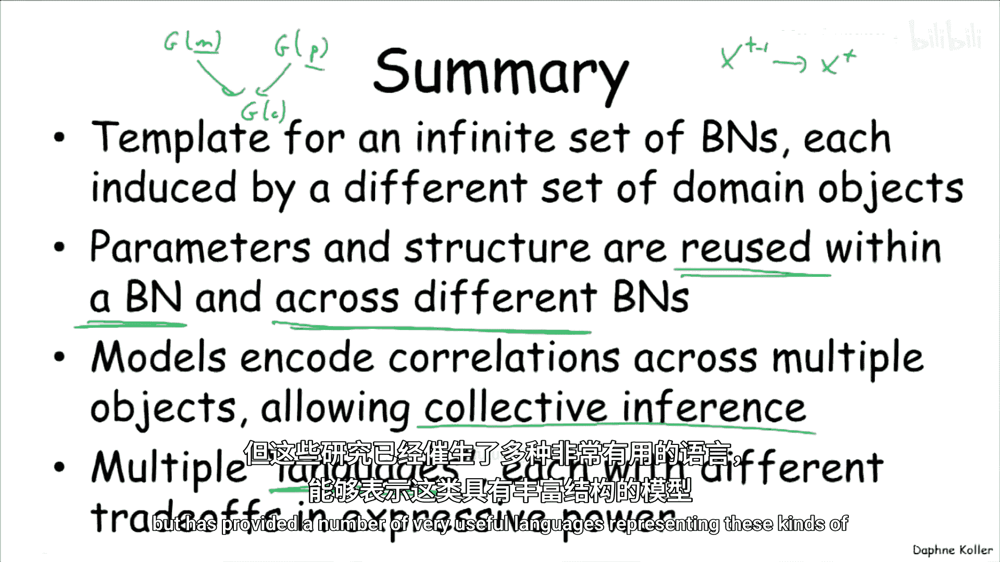

